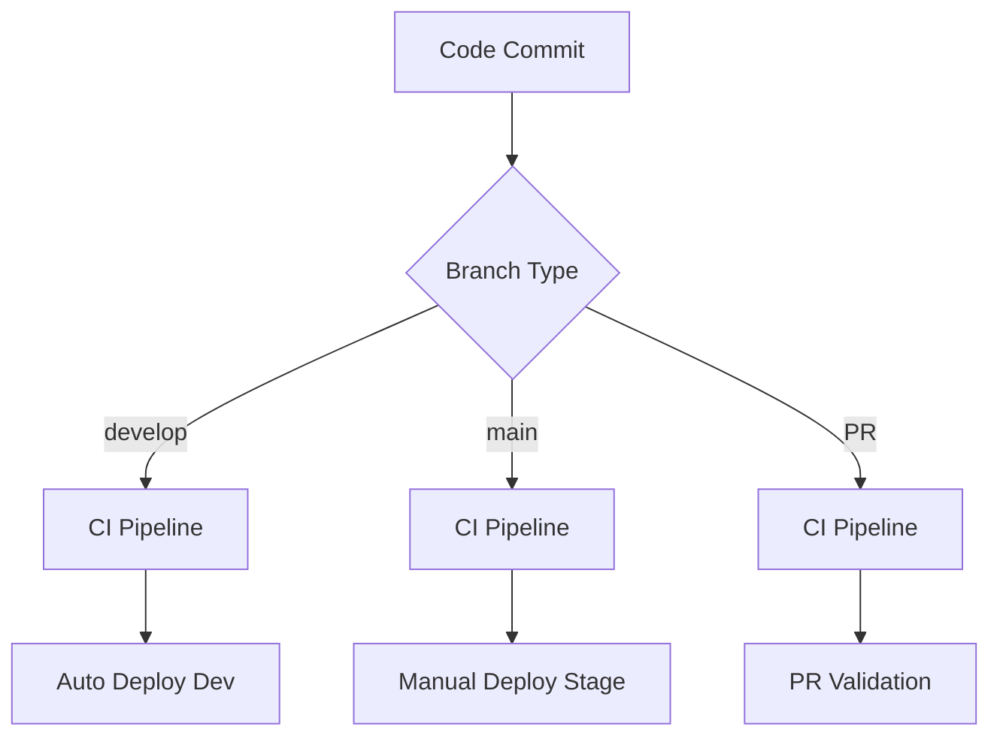
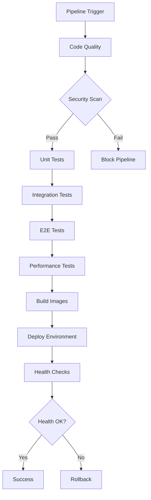
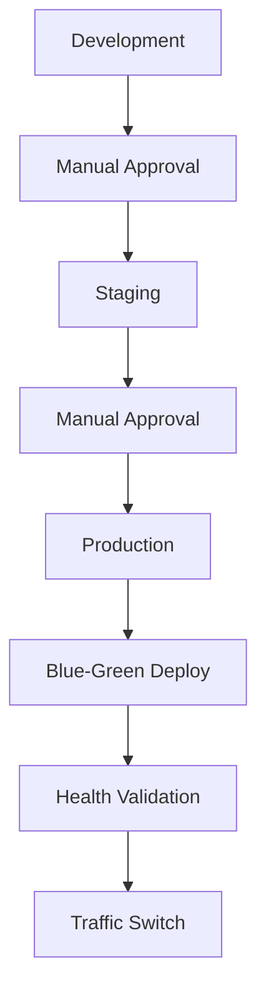

# 🏗️ CI/CD Pipeline Architecture

## 📋 Table of Contents

1. [System Overview](#system-overview)
2. [Pipeline Flow](#pipeline-flow)
3. [Component Architecture](#component-architecture)
4. [Data Flow](#data-flow)
5. [Integration Points](#integration-points)
6. [Scalability Considerations](#scalability-considerations)
7. [Security Architecture](#security-architecture)
8. [Monitoring Architecture](#monitoring-architecture)

---

## 🎯 System Overview

The CI/CD pipeline is built on GitHub Actions and integrates with the existing Personal Assistant TDAH infrastructure to provide automated testing, security scanning, and deployment capabilities.

### High-Level Architecture

```
┌─────────────────────────────────────────────────────────────────┐
│                    CI/CD Pipeline System                        │
├─────────────────────────────────────────────────────────────────┤
│  GitHub Actions  │  Docker Registry  │  Monitoring Stack      │
│  ┌─────────────┐ │  ┌─────────────┐  │  ┌─────────────────┐   │
│  │ CI Pipeline │ │  │ Image Store │  │  │ Prometheus      │   │
│  │ Test Pipeline│ │  │ Multi-Env  │  │  │ Grafana         │   │
│  │ Security    │ │  │ Versions   │  │  │ Loki            │   │
│  │ Deploy      │ │  └─────────────┘  │  └─────────────────┘   │
│  └─────────────┘ │                   │                        │
├─────────────────────────────────────────────────────────────────┤
│                    Application Infrastructure                    │
│  ┌─────────────┐  ┌─────────────┐  ┌─────────────────┐        │
│  │ Development │  │   Staging   │  │   Production    │        │
│  │ Environment │  │ Environment │  │  Environment    │        │
│  └─────────────┘  └─────────────┘  └─────────────────┘        │
└─────────────────────────────────────────────────────────────────┘
```

---

## 🔄 Pipeline Flow

### 1. Trigger Events



### 2. Pipeline Execution Flow



### 3. Environment Promotion Flow



---

## 🧩 Component Architecture

### 1. GitHub Actions Workflows

#### CI Pipeline (ci.yml)

```
┌─────────────────────────────────────────────────────────────┐
│                    CI Pipeline                              │
├─────────────────────────────────────────────────────────────┤
│  ┌─────────────┐  ┌─────────────┐  ┌─────────────────┐     │
│  │ Code Quality│  │ Unit Tests  │  │ Integration     │     │
│  │ • Linting   │  │ • Fast      │  │ • Components    │     │
│  │ • Format    │  │ • Isolated  │  │ • Services      │     │
│  │ • Types     │  │ • Coverage  │  │ • Database      │     │
│  └─────────────┘  └─────────────┘  └─────────────────┘     │
│  ┌─────────────┐  ┌─────────────┐  ┌─────────────────┐     │
│  │ E2E Tests   │  │ Performance │  │ Docker Build    │     │
│  │ • Workflows │  │ • Load      │  │ • Multi-Env     │     │
│  │ • User      │  │ • Benchmarks│  │ • Registry      │     │
│  │ • Critical  │  │ • Metrics   │  │ • Caching       │     │
│  └─────────────┘  └─────────────┘  └─────────────────┘     │
└─────────────────────────────────────────────────────────────┘
```

#### Test Pipeline (test.yml)

```
┌─────────────────────────────────────────────────────────────┐
│                    Test Pipeline                            │
├─────────────────────────────────────────────────────────────┤
│  ┌─────────────┐  ┌─────────────┐  ┌─────────────────┐     │
│  │ Test Matrix │  │ Parallel    │  │ Result          │     │
│  │ • Unit      │  │ Execution   │  │ Analysis        │     │
│  │ • Integration│  │ • Caching  │  │ • Coverage      │     │
│  │ • E2E       │  │ • Timeout   │  │ • Performance   │     │
│  │ • Performance│  │ • Retry    │  │ • Reporting     │     │
│  └─────────────┘  └─────────────┘  └─────────────────┘     │
└─────────────────────────────────────────────────────────────┘
```

#### Security Pipeline (security.yml)

```
┌─────────────────────────────────────────────────────────────┐
│                    Security Pipeline                        │
├─────────────────────────────────────────────────────────────┤
│  ┌─────────────┐  ┌─────────────┐  ┌─────────────────┐     │
│  │ Dependencies│  │ Code Scan   │  │ Container       │     │
│  │ • Safety    │  │ • Bandit    │  │ • Trivy         │     │
│  │ • pip-audit │  │ • Semgrep   │  │ • Vulnerabilities│    │
│  │ • Vulnerabilities│ • SAST    │  │ • Base Images   │     │
│  └─────────────┘  └─────────────┘  └─────────────────┘     │
│  ┌─────────────┐  ┌─────────────┐  ┌─────────────────┐     │
│  │ Secrets     │  │ Licenses    │  │ Policy          │     │
│  │ • TruffleHog│  │ • Compliance│  │ • Validation    │     │
│  │ • GitLeaks  │  │ • Tracking  │  │ • Requirements  │     │
│  │ • Detection │  │ • Reporting │  │ • Enforcement   │     │
│  └─────────────┘  └─────────────┘  └─────────────────┘     │
└─────────────────────────────────────────────────────────────┘
```

### 2. Deployment Architecture

#### Development Deployment

```
┌─────────────────────────────────────────────────────────────┐
│                Development Deployment                       │
├─────────────────────────────────────────────────────────────┤
│  ┌─────────────┐  ┌─────────────┐  ┌─────────────────┐     │
│  │ Build       │  │ Deploy      │  │ Validate        │     │
│  │ • Docker    │  │ • Direct    │  │ • Health        │     │
│  │ • Registry  │  │ • Auto      │  │ • Smoke         │     │
│  │ • Tag       │  │ • No Gate   │  │ • Logs          │     │
│  └─────────────┘  └─────────────┘  └─────────────────┘     │
└─────────────────────────────────────────────────────────────┘
```

#### Staging Deployment

```
┌─────────────────────────────────────────────────────────────┐
│                Staging Deployment                          │
├─────────────────────────────────────────────────────────────┤
│  ┌─────────────┐  ┌─────────────┐  ┌─────────────────┐     │
│  │ Build       │  │ Approve     │  │ Deploy          │     │
│  │ • Docker    │  │ • Manual    │  │ • Environment   │     │
│  │ • Registry  │  │ • Gate      │  │ • Health        │     │
│  │ • Tag       │  │ • Required  │  │ • Integration   │     │
│  └─────────────┘  └─────────────┘  └─────────────────┘     │
│  ┌─────────────┐  ┌─────────────┐  ┌─────────────────┐     │
│  │ Test        │  │ Monitor     │  │ Rollback        │     │
│  │ • Integration│  │ • Performance│  │ • Auto         │     │
│  │ • Performance│  │ • Metrics  │  │ • On Failure    │     │
│  │ • E2E       │  │ • Alerts   │  │ • Previous      │     │
│  └─────────────┘  └─────────────┘  └─────────────────┘     │
└─────────────────────────────────────────────────────────────┘
```

#### Production Deployment

```
┌─────────────────────────────────────────────────────────────┐
│                Production Deployment                        │
├─────────────────────────────────────────────────────────────┤
│  ┌─────────────┐  ┌─────────────┐  ┌─────────────────┐     │
│  │ Build       │  │ Approve     │  │ Blue-Green      │     │
│  │ • Docker    │  │ • Manual    │  │ • Zero Downtime │     │
│  │ • Registry  │  │ • Gate      │  │ • Switch        │     │
│  │ • Tag       │  │ • Required  │  │ • Traffic       │     │
│  └─────────────┘  └─────────────┘  └─────────────────┘     │
│  ┌─────────────┐  ┌─────────────┐  ┌─────────────────┐     │
│  │ Deploy      │  │ Validate    │  │ Monitor         │     │
│  │ • New Env   │  │ • Health    │  │ • Performance   │     │
│  │ • Parallel  │  │ • Critical  │  │ • Metrics       │     │
│  │ • Isolated  │  │ • Path      │  │ • Alerts        │     │
│  └─────────────┘  └─────────────┘  └─────────────────┘     │
│  ┌─────────────┐  ┌─────────────┐  ┌─────────────────┐     │
│  │ Switch      │  │ Cleanup     │  │ Rollback        │     │
│  │ • Load Bal  │  │ • Old Env   │  │ • Auto          │     │
│  │ • Traffic   │  │ • Resources │  │ • On Failure    │     │
│  │ • DNS       │  │ • Images    │  │ • Previous      │     │
│  └─────────────┘  └─────────────┘  └─────────────────┘     │
└─────────────────────────────────────────────────────────────┘
```

---

## 📊 Data Flow

### 1. Code to Deployment Flow

```
┌─────────────┐    ┌─────────────┐    ┌─────────────┐    ┌─────────────┐
│   Code      │    │   CI/CD     │    │   Docker    │    │  Deployment │
│ Repository  │───▶│  Pipeline   │───▶│  Registry   │───▶│ Environment │
│             │    │             │    │             │    │             │
│ • Source    │    │ • Tests     │    │ • Images    │    │ • Services  │
│ • Config    │    │ • Security  │    │ • Tags      │    │ • Health    │
│ • Tests     │    │ • Build     │    │ • Versions  │    │ • Monitoring│
└─────────────┘    └─────────────┘    └─────────────┘    └─────────────┘
```

### 2. Monitoring Data Flow

```
┌─────────────┐    ┌─────────────┐    ┌─────────────┐    ┌─────────────┐
│ Application │    │ Prometheus  │    │   Grafana   │    │   Alerts    │
│             │───▶│             │───▶│             │───▶│             │
│ • Metrics   │    │ • Collect   │    │ • Visualize │    │ • Notify    │
│ • Logs      │    │ • Store     │    │ • Dashboard │    │ • Action    │
│ • Health    │    │ • Query     │    │ • Analysis  │    │ • Response  │
└─────────────┘    └─────────────┘    └─────────────┘    └─────────────┘
```

### 3. Security Data Flow

```
┌─────────────┐    ┌─────────────┐    ┌─────────────┐    ┌─────────────┐
│   Code      │    │  Security   │    │   Reports   │    │   Actions   │
│ Repository  │───▶│  Scanners   │───▶│             │───▶│             │
│             │    │             │    │             │    │             │
│ • Dependencies│   │ • Static    │    │ • Vulnerabilities│ • Block    │
│ • Source    │    │ • Dynamic   │    │ • Issues    │    │ • Approve   │
│ • Config    │    │ • Container │    │ • Compliance│    │ • Notify    │
└─────────────┘    └─────────────┘    └─────────────┘    └─────────────┘
```

---

## 🔗 Integration Points

### 1. GitHub Actions Integration

```
┌─────────────────────────────────────────────────────────────┐
│                GitHub Actions Integration                   │
├─────────────────────────────────────────────────────────────┤
│  ┌─────────────┐  ┌─────────────┐  ┌─────────────────┐     │
│  │ Repository  │  │   Secrets   │  │   Environments  │     │
│  │ • Code      │  │ • Docker    │  │ • Development   │     │
│  │ • Config    │  │ • SSH Keys  │  │ • Staging       │     │
│  │ • Workflows │  │ • API Keys  │  │ • Production    │     │
│  └─────────────┘  └─────────────┘  └─────────────────┘     │
│  ┌─────────────┐  ┌─────────────┐  ┌─────────────────┐     │
│  │   Triggers  │  │   Artifacts │  │   Notifications │     │
│  │ • Push      │  │ • Logs      │  │ • Slack         │     │
│  │ • PR        │  │ • Reports   │  │ • Email         │     │
│  │ • Schedule  │  │ • Images    │  │ • Teams         │     │
│  └─────────────┘  └─────────────┘  └─────────────────┘     │
└─────────────────────────────────────────────────────────────┘
```

### 2. Docker Integration

```
┌─────────────────────────────────────────────────────────────┐
│                    Docker Integration                       │
├─────────────────────────────────────────────────────────────┤
│  ┌─────────────┐  ┌─────────────┐  ┌─────────────────┐     │
│  │   Build     │  │   Registry  │  │   Deployment    │     │
│  │ • Multi-Env │  │ • Hub       │  │ • Compose       │     │
│  │ • Caching   │  │ • Tags      │  │ • Services      │     │
│  │ • Security  │  │ • Versions  │  │ • Health        │     │
│  └─────────────┘  └─────────────┘  └─────────────────┘     │
└─────────────────────────────────────────────────────────────┘
```

### 3. Monitoring Integration

```
┌─────────────────────────────────────────────────────────────┐
│                Monitoring Integration                       │
├─────────────────────────────────────────────────────────────┤
│  ┌─────────────┐  ┌─────────────┐  ┌─────────────────┐     │
│  │ Prometheus  │  │   Grafana   │  │     Loki        │     │
│  │ • Metrics   │  │ • Dashboards│  │ • Logs          │     │
│  │ • Scraping  │  │ • Alerts    │  │ • Aggregation   │     │
│  │ • Storage   │  │ • Analysis  │  │ • Query         │     │
│  └─────────────┘  └─────────────┘  └─────────────────┘     │
└─────────────────────────────────────────────────────────────┘
```

---

## 📈 Scalability Considerations

### 1. Horizontal Scaling

```
┌─────────────────────────────────────────────────────────────┐
│                Horizontal Scaling                           │
├─────────────────────────────────────────────────────────────┤
│  ┌─────────────┐  ┌─────────────┐  ┌─────────────────┐     │
│  │   Workers   │  │   Load      │  │   Database      │     │
│  │ • Multiple  │  │   Balancer  │  │ • Read Replicas │     │
│  │ • Auto      │  │ • Traffic   │  │ • Sharding      │     │
│  │ • Scale     │  │ • Health    │  │ • Clustering    │     │
│  └─────────────┘  └─────────────┘  └─────────────────┘     │
└─────────────────────────────────────────────────────────────┘
```

### 2. Vertical Scaling

```
┌─────────────────────────────────────────────────────────────┐
│                Vertical Scaling                             │
├─────────────────────────────────────────────────────────────┤
│  ┌─────────────┐  ┌─────────────┐  ┌─────────────────┐     │
│  │   CPU       │  │   Memory    │  │   Storage       │     │
│  │ • Cores     │  │ • RAM       │  │ • Disk          │     │
│  │ • Speed     │  │ • Cache     │  │ • IOPS          │     │
│  │ • Threads   │  │ • Buffers   │  │ • Throughput    │     │
│  └─────────────┘  └─────────────┘  └─────────────────┘     │
└─────────────────────────────────────────────────────────────┘
```

### 3. Pipeline Scaling

```
┌─────────────────────────────────────────────────────────────┐
│                Pipeline Scaling                             │
├─────────────────────────────────────────────────────────────┤
│  ┌─────────────┐  ┌─────────────┐  ┌─────────────────┐     │
│  │   Parallel  │  │   Caching   │  │   Optimization  │     │
│  │ • Jobs      │  │ • Dependencies│  │ • Build        │     │
│  │ • Tests     │  │ • Results    │  │ • Deploy        │     │
│  │ • Deploy    │  │ • Images     │  │ • Resources     │     │
│  └─────────────┘  └─────────────┘  └─────────────────┘     │
└─────────────────────────────────────────────────────────────┘
```

---

## 🛡️ Security Architecture

### 1. Security Layers

```
┌─────────────────────────────────────────────────────────────┐
│                Security Architecture                        │
├─────────────────────────────────────────────────────────────┤
│  ┌─────────────┐  ┌─────────────┐  ┌─────────────────┐     │
│  │   Code      │  │   Build     │  │   Runtime       │     │
│  │ • Scanning  │  │ • Security  │  │ • Monitoring    │     │
│  │ • Secrets   │  │ • Images    │  │ • Logging       │     │
│  │ • Dependencies│ • Registry  │  │ • Alerts        │     │
│  └─────────────┘  └─────────────┘  └─────────────────┘     │
│  ┌─────────────┐  ┌─────────────┐  ┌─────────────────┐     │
│  │   Network   │  │   Access    │  │   Compliance    │     │
│  │ • Firewall  │  │ • RBAC      │  │ • Policies      │     │
│  │ • TLS       │  │ • MFA       │  │ • Auditing      │     │
│  │ • VPN       │  │ • Secrets   │  │ • Reporting     │     │
│  └─────────────┘  └─────────────┘  └─────────────────┘     │
└─────────────────────────────────────────────────────────────┘
```

### 2. Security Controls

```
┌─────────────────────────────────────────────────────────────┐
│                Security Controls                            │
├─────────────────────────────────────────────────────────────┤
│  ┌─────────────┐  ┌─────────────┐  ┌─────────────────┐     │
│  │   Prevent   │  │   Detect    │  │   Respond       │     │
│  │ • Gates     │  │ • Scanning  │  │ • Rollback      │     │
│  │ • Validation│  │ • Monitoring│  │ • Alerts        │     │
│  │ • Policies  │  │ • Logging   │  │ • Recovery      │     │
│  └─────────────┘  └─────────────┘  └─────────────────┘     │
└─────────────────────────────────────────────────────────────┘
```

---

## 📊 Monitoring Architecture

### 1. Monitoring Stack

```
┌─────────────────────────────────────────────────────────────┐
│                Monitoring Stack                             │
├─────────────────────────────────────────────────────────────┤
│  ┌─────────────┐  ┌─────────────┐  ┌─────────────────┐     │
│  │ Prometheus  │  │   Grafana   │  │     Loki        │     │
│  │ • Metrics   │  │ • Dashboards│  │ • Logs          │     │
│  │ • Scraping  │  │ • Alerts    │  │ • Aggregation   │     │
│  │ • Storage   │  │ • Analysis  │  │ • Query         │     │
│  └─────────────┘  └─────────────┘  └─────────────────┘     │
│  ┌─────────────┐  ┌─────────────┐  ┌─────────────────┐     │
│  │   Jaeger    │  │   Alert     │  │   Notification  │     │
│  │ • Tracing   │  │ • Manager   │  │ • Slack         │     │
│  │ • Analysis  │  │ • Rules     │  │ • Email         │     │
│  │ • Debugging │  │ • Actions   │  │ • Teams         │     │
│  └─────────────┘  └─────────────┘  └─────────────────┘     │
└─────────────────────────────────────────────────────────────┘
```

### 2. Observability

```
┌─────────────────────────────────────────────────────────────┐
│                Observability                                │
├─────────────────────────────────────────────────────────────┤
│  ┌─────────────┐  ┌─────────────┐  ┌─────────────────┐     │
│  │   Metrics   │  │    Logs     │  │    Traces       │     │
│  │ • Performance│  │ • Events    │  │ • Requests      │     │
│  │ • Business  │  │ • Errors    │  │ • Dependencies  │     │
│  │ • System    │  │ • Security  │  │ • Performance   │     │
│  └─────────────┘  └─────────────┘  └─────────────────┘     │
└─────────────────────────────────────────────────────────────┘
```

---

## 🎯 Architecture Benefits

### 1. **Scalability**

- Horizontal scaling with multiple workers
- Vertical scaling with resource optimization
- Pipeline scaling with parallel execution

### 2. **Reliability**

- Blue-green deployments for zero downtime
- Automatic rollback on failures
- Health checks and monitoring

### 3. **Security**

- Multi-layer security architecture
- Automated security scanning
- Compliance and policy enforcement

### 4. **Observability**

- Comprehensive monitoring stack
- Real-time metrics and alerts
- Structured logging and tracing

### 5. **Maintainability**

- Modular architecture
- Clear separation of concerns
- Automated testing and validation

---

_This architecture document provides a comprehensive overview of the CI/CD pipeline system design, components, and integration points. For implementation details, refer to the individual workflow files and configuration._
