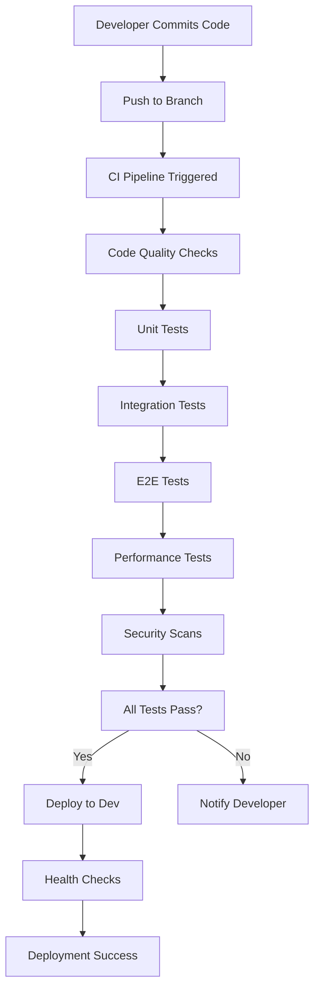
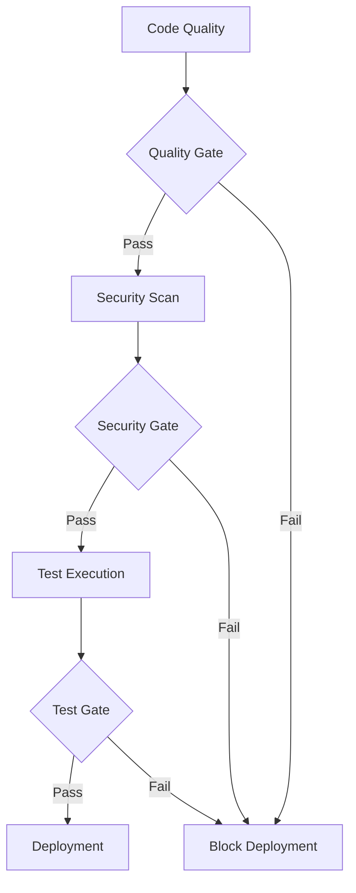
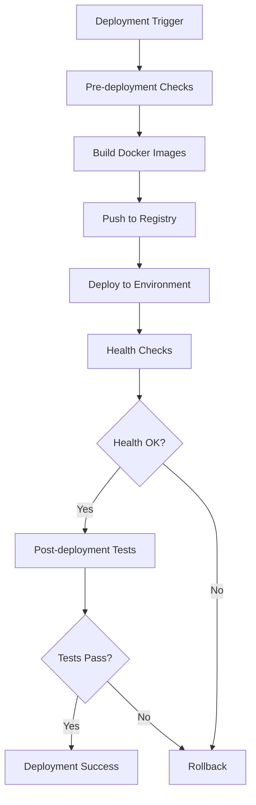

# 🚀 CI/CD Pipeline Guide - Personal Assistant TDAH

## 📋 Table of Contents

1. [Overview](#overview)
2. [Pipeline Architecture](#pipeline-architecture)
3. [Workflow Components](#workflow-components)
4. [How It Works](#how-it-works)
5. [Environment Management](#environment-management)
6. [Security & Quality Gates](#security--quality-gates)
7. [Deployment Strategies](#deployment-strategies)
8. [Monitoring & Observability](#monitoring--observability)
9. [Troubleshooting](#troubleshooting)
10. [Best Practices](#best-practices)

---

## 🎯 Overview

The Personal Assistant TDAH CI/CD pipeline is a comprehensive automation system that handles the entire software delivery lifecycle from code commit to production deployment. It ensures code quality, security, and reliability through automated testing, scanning, and deployment processes.

### Key Features

- **Automated Testing**: Unit, integration, E2E, and performance tests
- **Security Scanning**: Dependency, code, container, and secret scanning
- **Multi-Environment Deployment**: Development, staging, and production
- **Quality Gates**: Automated quality checks and approval processes
- **Rollback Capability**: Quick recovery from failed deployments
- **Monitoring Integration**: Real-time health checks and performance monitoring

---

## 🏗️ Pipeline Architecture

### High-Level Flow

```
Code Commit → CI Pipeline → Quality Gates → Deployment → Monitoring
     ↓              ↓            ↓            ↓           ↓
   Trigger      Testing      Security     Environment   Health
   Events       & Quality    Scanning     Promotion     Checks
```

### Pipeline Components

```
┌─────────────────┐    ┌─────────────────┐    ┌─────────────────┐
│   CI Pipeline   │    │  Test Pipeline  │    │ Security Pipeline│
│                 │    │                 │    │                 │
│ • Code Quality  │    │ • Unit Tests    │    │ • Dependencies  │
│ • Linting       │    │ • Integration   │    │ • Code Scanning │
│ • Type Check    │    │ • E2E Tests     │    │ • Container     │
│ • Docker Build  │    │ • Performance   │    │ • Secrets       │
└─────────────────┘    └─────────────────┘    └─────────────────┘
         │                       │                       │
         └───────────────────────┼───────────────────────┘
                                 │
                    ┌─────────────────┐
                    │ Deployment      │
                    │ Pipeline        │
                    │                 │
                    │ • Dev Deploy    │
                    │ • Stage Deploy  │
                    │ • Prod Deploy   │
                    └─────────────────┘
```

---

## 🔧 Workflow Components

### 1. Continuous Integration (ci.yml)

**Triggers:**

- Push to `main` or `develop` branches
- Pull requests to `main` or `develop` branches

**Jobs:**

1. **Code Quality** - Linting, formatting, type checking
2. **Unit Tests** - Fast feedback tests (2-3 minutes)
3. **Integration Tests** - Component integration tests (5-8 minutes)
4. **E2E Tests** - Full workflow tests (10-15 minutes)
5. **Performance Tests** - Load and benchmark tests (15-20 minutes)
6. **Docker Build** - Multi-environment image building
7. **Security Scan** - Basic security checks
8. **CI Status** - Final pipeline status check

**Total Runtime:** 25-35 minutes

### 2. Test Execution (test.yml)

**Triggers:**

- Push to `main` or `develop` branches
- Pull requests to `main` or `develop` branches
- Manual dispatch with test suite selection

**Test Matrix:**

- **Unit Tests**: Fast, isolated tests
- **Integration Tests**: Service integration tests
- **E2E Tests**: Full user workflow tests
- **Performance Tests**: Load and benchmark tests
- **Regression Tests**: Previously completed task tests

**Features:**

- Parallel test execution
- Test result caching
- Coverage analysis
- Performance benchmarking

### 3. Security Scanning (security.yml)

**Triggers:**

- Push to `main` or `develop` branches
- Pull requests to `main` or `develop` branches
- Daily scheduled scans (2 AM UTC)
- Manual dispatch

**Scan Types:**

1. **Dependency Scan** - Vulnerability detection in dependencies
2. **Code Scan** - Static analysis for security issues
3. **Container Scan** - Docker image vulnerability scanning
4. **Secret Scan** - Credential and secret detection
5. **SAST Scan** - Static Application Security Testing
6. **License Scan** - License compliance checking
7. **Policy Scan** - Security policy validation

### 4. Deployment Workflows

#### Development Deployment (deploy-dev.yml)

- **Trigger**: Push to `develop` branch
- **Strategy**: Direct deployment
- **Approval**: None required
- **Rollback**: Automatic on failure

#### Staging Deployment (deploy-stage.yml)

- **Trigger**: Manual dispatch only
- **Strategy**: Manual approval gate
- **Approval**: Required in GitHub environment
- **Rollback**: Automatic on failure

#### Production Deployment (deploy-prod.yml)

- **Trigger**: Manual dispatch only
- **Strategy**: Blue-green deployment
- **Approval**: Required in GitHub environment
- **Rollback**: Automatic with environment switching

---

## ⚙️ How It Works

### 1. Code Commit Process



### 2. Quality Gate Process



### 3. Deployment Process



---

## 🌍 Environment Management

### Environment Configuration

#### Development Environment

- **Purpose**: Active development and testing
- **Deployment**: Automatic on `develop` branch push
- **Database**: Test database with sample data
- **Monitoring**: Basic health checks
- **URL**: `http://dev.personal-assistant.com:8000`

#### Staging Environment

- **Purpose**: Pre-production testing and validation
- **Deployment**: Manual with approval gate
- **Database**: Production-like data
- **Monitoring**: Full monitoring stack
- **URL**: `http://staging.personal-assistant.com:8001`

#### Production Environment

- **Purpose**: Live production environment
- **Deployment**: Manual with approval gate and blue-green strategy
- **Database**: Production database
- **Monitoring**: Full monitoring with alerting
- **URL**: `http://personal-assistant.com`

### Environment Variables

Each environment uses specific configuration files:

- `config/development.env` - Development settings
- `config/staging.env` - Staging settings
- `config/production.env` - Production settings

### Docker Compose Files

- `docker/docker-compose.dev.yml` - Development services
- `docker/docker-compose.stage.yml` - Staging services
- `docker/docker-compose.prod.yml` - Production services

---

## 🛡️ Security & Quality Gates

### Quality Gates

#### Code Quality Gate

- **Black formatting** check
- **isort import** sorting check
- **Flake8 linting** with complexity limits
- **MyPy type** checking
- **Frontend linting** and type checking

#### Test Coverage Gate

- **Minimum coverage**: 85%
- **Unit test coverage**: >90%
- **Integration test coverage**: >80%
- **E2E test coverage**: >70%

#### Performance Gate

- **API response time**: <2 seconds
- **Database query time**: <500ms
- **Memory usage**: <512MB per container
- **CPU usage**: <80% under load

### Security Gates

#### Dependency Security

- **No critical vulnerabilities** allowed
- **High vulnerabilities** require approval
- **Medium vulnerabilities** tracked and monitored
- **License compliance** validation

#### Code Security

- **No high-severity issues** from Bandit
- **No critical findings** from Semgrep
- **No secrets** in codebase
- **Security policy** compliance

#### Container Security

- **No critical vulnerabilities** in base images
- **Non-root containers** required
- **Minimal base images** preferred
- **Regular security updates**

---

## 🚀 Deployment Strategies

### Development Deployment

```yaml
Strategy: Direct Deployment
Approval: None
Rollback: Automatic
Downtime: Minimal (30 seconds)
```

### Staging Deployment

```yaml
Strategy: Manual Approval
Approval: Required
Rollback: Automatic
Downtime: Minimal (1 minute)
```

### Production Deployment

```yaml
Strategy: Blue-Green Deployment
Approval: Required
Rollback: Automatic with environment switching
Downtime: Zero
```

### Blue-Green Deployment Process

1. **Current State**: Production running on "blue" environment
2. **Deploy**: New version to "green" environment
3. **Test**: Health checks on green environment
4. **Switch**: Load balancer points to green environment
5. **Cleanup**: Stop blue environment
6. **Rollback**: If issues occur, switch back to blue

---

## 📊 Monitoring & Observability

### Health Checks

#### API Health Endpoints

- `/health/overall` - Overall system health
- `/health/database` - Database connectivity
- `/health/database/pool` - Connection pool status
- `/metrics` - Prometheus metrics

#### Health Check Process

1. **Pre-deployment**: Validate environment configuration
2. **Post-deployment**: Check service availability
3. **Continuous**: Monitor service health
4. **Alerting**: Notify on health issues

### Metrics Collection

#### Application Metrics

- HTTP request count and duration
- Error rates and response codes
- Database query performance
- Memory and CPU usage

#### Business Metrics

- User registration and login rates
- SMS message processing
- OAuth integration status
- Task completion rates

### Logging

#### Structured Logging

- JSON format for machine readability
- Correlation IDs for request tracing
- Log levels: DEBUG, INFO, WARNING, ERROR, CRITICAL
- Centralized logging with Loki

#### Audit Logging

- OAuth security events
- User authentication events
- Administrative actions
- Security-related events

---

## 🔧 Troubleshooting

### Common Issues

#### Pipeline Failures

**Code Quality Failures**

```bash
# Check formatting
black --check src/
isort --check-only src/

# Fix formatting
black src/
isort src/
```

**Test Failures**

```bash
# Run specific test
pytest tests/unit/test_auth.py -v

# Run with debugging
pytest tests/unit/test_auth.py -v -s --pdb

# Check test coverage
pytest --cov=src --cov-report=html
```

**Security Scan Failures**

```bash
# Check dependencies
safety check

# Check code security
bandit -r src/

# Check for secrets
trufflehog --only-verified .
```

#### Deployment Issues

**Health Check Failures**

```bash
# Check service status
docker-compose ps

# Check logs
docker-compose logs -f

# Check health endpoint
curl -f http://localhost:8000/health/overall
```

**Database Issues**

```bash
# Check database connection
docker-compose exec db psql -U postgres -d personal_assistant

# Check migrations
python -m alembic current
python -m alembic history
```

### Rollback Procedures

#### Automatic Rollback

- Triggered on health check failures
- Automatic environment switching
- Previous version restoration
- Health verification

#### Manual Rollback

```bash
# Stop current deployment
docker-compose down

# Start previous version
docker-compose -f docker-compose.prod.yml -p personal-assistant-previous up -d

# Verify rollback
curl -f http://localhost:8000/health/overall
```

---

## 📚 Best Practices

### Development Workflow

#### Code Quality

- Run linting before committing
- Write tests for new features
- Keep test coverage above 85%
- Use meaningful commit messages

#### Security

- Never commit secrets or credentials
- Use environment variables for sensitive data
- Regular dependency updates
- Security scan before deployment

#### Testing

- Write unit tests for all new code
- Add integration tests for new features
- Performance test critical paths
- Test error scenarios

### Deployment Best Practices

#### Pre-deployment

- Verify all tests pass
- Check security scans
- Validate environment configuration
- Review deployment plan

#### During Deployment

- Monitor health checks
- Watch for errors in logs
- Verify critical functionality
- Be ready for rollback

#### Post-deployment

- Run smoke tests
- Monitor performance metrics
- Check error rates
- Verify user functionality

### Monitoring Best Practices

#### Health Monitoring

- Set up comprehensive health checks
- Monitor key performance indicators
- Set up alerting for critical issues
- Regular health check reviews

#### Log Monitoring

- Use structured logging
- Include correlation IDs
- Monitor error rates
- Regular log analysis

#### Performance Monitoring

- Track response times
- Monitor resource usage
- Set performance baselines
- Regular performance reviews

---

## 🎯 Success Metrics

### Pipeline Performance

- **CI Pipeline Time**: 25-35 minutes
- **Test Execution Time**: 15-25 minutes
- **Deployment Time**: 5-10 minutes
- **Rollback Time**: <5 minutes

### Quality Metrics

- **Test Coverage**: >85%
- **Code Quality Score**: >90%
- **Security Score**: >95%
- **Performance Score**: >90%

### Business Impact

- **Deployment Frequency**: Daily
- **Lead Time**: <1 hour
- **Mean Time to Recovery**: <30 minutes
- **Change Failure Rate**: <5%

---

## 📞 Support & Resources

### Documentation

- [GitHub Actions Documentation](https://docs.github.com/en/actions)
- [Docker Documentation](https://docs.docker.com/)
- [Pytest Documentation](https://docs.pytest.org/)
- [Prometheus Documentation](https://prometheus.io/docs/)

### Contact

- **Technical Issues**: Create GitHub issue
- **Security Issues**: security@personal-assistant.com
- **General Questions**: ianleblanc@personal-assistant.com

### Resources

- **Pipeline Status**: GitHub Actions tab
- **Test Results**: Codecov dashboard
- **Security Reports**: GitHub Security tab
- **Monitoring**: Grafana dashboards

---

_This guide provides comprehensive information about the CI/CD pipeline implementation. For specific technical details, refer to the individual workflow files in `.github/workflows/`._
