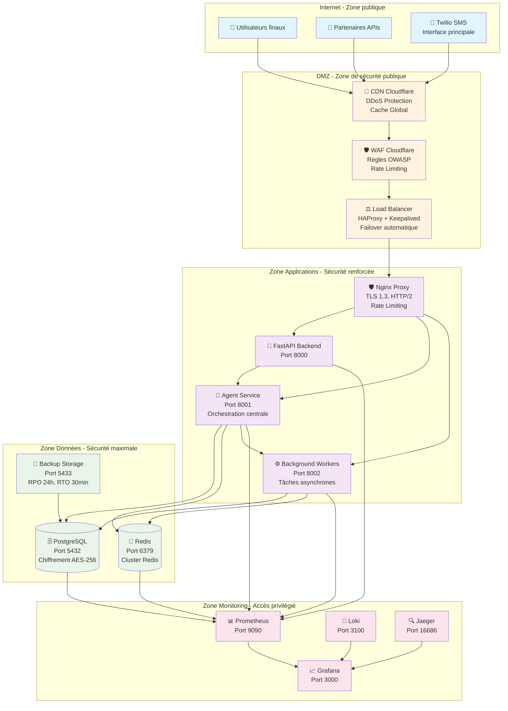
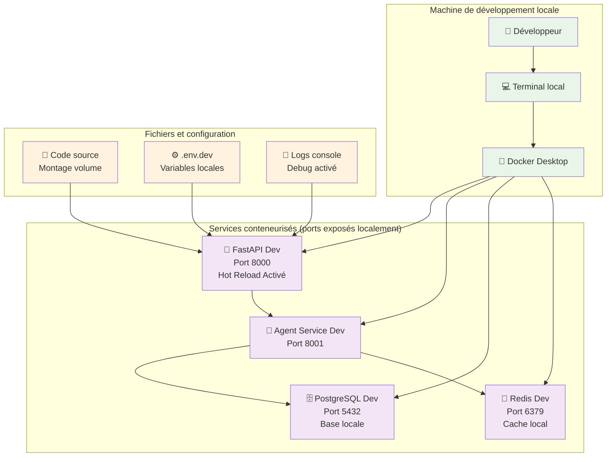
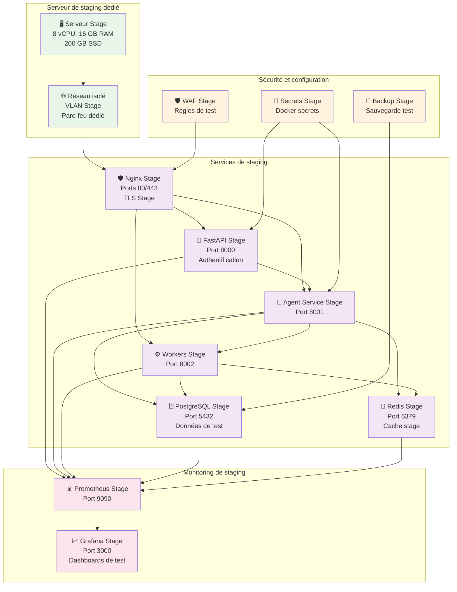
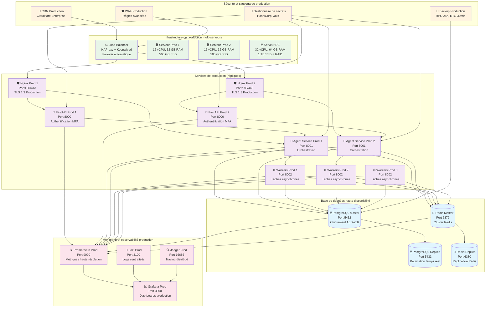
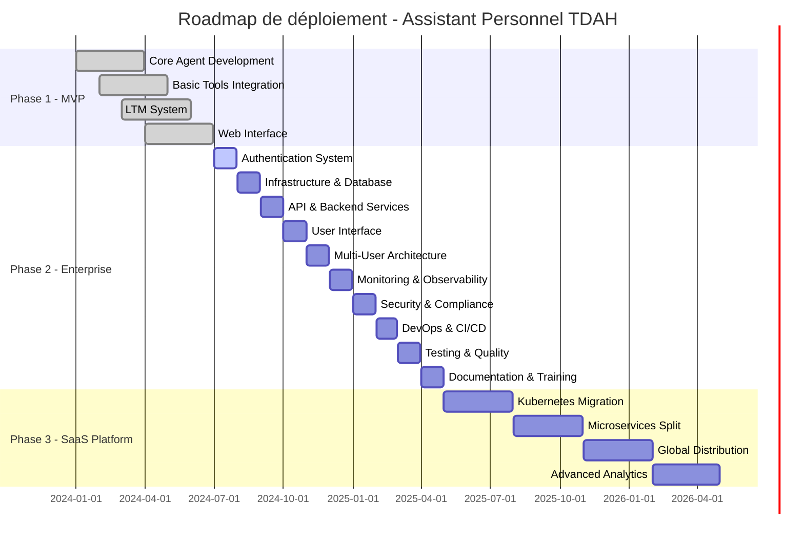
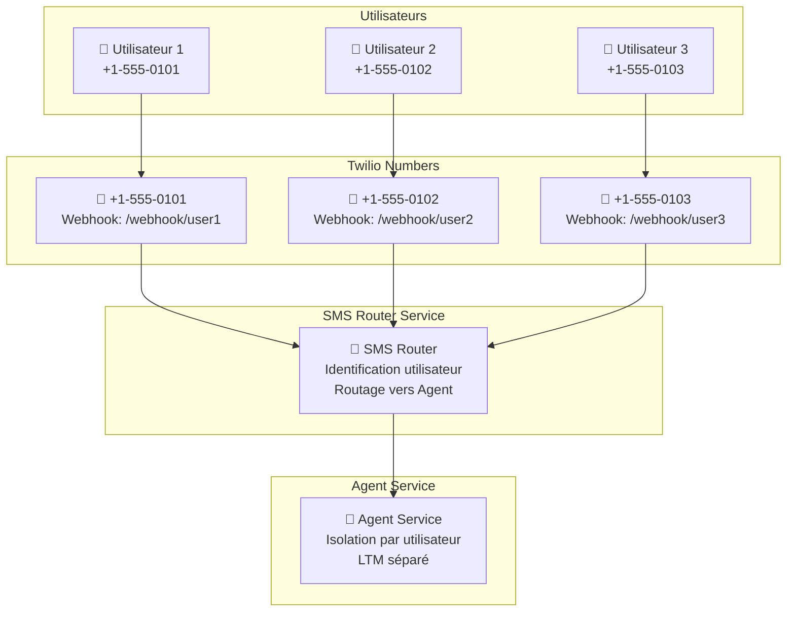

# 4. Répartition détaillée des composants

Cette section contient les schémas de répartition détaillée des composants de la solution

**Tableau 9 - Environnements**

| Environnement         | À inclure | Justification                                                                                                                  |
| --------------------- | --------- | ------------------------------------------------------------------------------------------------------------------------------ |
| **Development (Dev)** | ✅ Oui    | Environnement de développement local avec base de données SQLite, hot reload activé, et logs en console pour le debugging      |
| **Staging (Stage)**   | ✅ Oui    | Environnement de test avec configuration de production, base de données PostgreSQL, monitoring basique, et tests d'intégration |
| **Production (Prod)** | ✅ Oui    | Environnement de production avec haute disponibilité, chiffrement complet, monitoring avancé, et sauvegardes automatisées      |

**Figure 2 - Schémas de répartition détaillée**

#### **2.1 Architecture réseau globale et segmentation de sécurité**

**Explication de l'architecture réseau**:

L'architecture réseau suit le principe de **défense en profondeur** avec plusieurs zones de sécurité et une isolation stricte, optimisée pour l'assistant personnel TDAH :

#### **1. Zone publique (Internet)**

- **Utilisateurs finaux** : Accès via HTTPS/TLS 1.3 depuis n'importe quel appareil
- **Partenaires APIs** : Intégrations externes sécurisées (Gemini, Graph, Notion, YouTube)
- **Twilio SMS** : Interface SMS principale pour l'assistant TDAH (accès universel sans internet requis)

#### **2. Zone DMZ - Sécurité publique**

- **CDN Cloudflare** : Protection DDoS de niveau entreprise, cache global, distribution géographique
- **WAF Cloudflare** : Règles OWASP, protection contre les attaques web, filtrage des menaces
- **Load Balancer** : HAProxy + Keepalived avec failover automatique, distribution de charge intelligente

#### **3. Zone Applications - Sécurité renforcée**

- **Nginx Proxy** : TLS 1.3, HTTP/2, rate limiting, compression, protection contre la surcharge
- **FastAPI Backend** : Service d'API principal avec authentification et gestion des utilisateurs
- **Agent Service** : Orchestration centrale de l'assistant TDAH, gestion des outils et de la mémoire
- **Background Workers** : Tâches asynchrones (rappel, synchronisation, planification)

#### **4. Zone Données - Sécurité maximale**

- **PostgreSQL** : Base de données principale avec chiffrement AES-256, données utilisateur et LTM
- **Redis** : Cache et queues avec cluster Redis, sessions utilisateur et rate limiting
- **Backup** : Stockage de sauvegarde avec RPO 24h et RTO 30min, chiffrement des sauvegardes

#### **5. Zone Monitoring - Accès privilégié**

- **Prometheus** : Collecte de métriques haute résolution, surveillance des performances
- **Grafana** : Dashboards et alertes, visualisation des métriques en temps réel
- **Loki** : Agrégation des logs centralisés, recherche et analyse des logs
- **Jaeger** : Traçage distribué pour le debugging et l'optimisation des performances

#### **Principes de sécurité appliqués :**

- **Isolation des zones** : Communication strictement contrôlée entre zones de sécurité
- **Chiffrement** : TLS 1.3 en transit, AES-256 au repos pour les données sensibles
- **Authentification** : MFA pour l'accès aux zones sensibles, RBAC strict
- **Monitoring** : Surveillance continue de tous les composants réseau et applicatifs
- **Redondance** : Load balancer avec failover automatique, sauvegardes automatisées
- **Protection TDAH** : Interface SMS accessible sans internet, simplicité d'usage

#### **2.2 Environnement Development (Dev) - Local**

#### **2.3 Environnement Staging (Stage) - Serveur dédié**

#### **2.4 Environnement Production (Prod) - Haute disponibilité**

## 4.1 Spécification des composants

Cette section contient des spécification technologiques de chaque infrastructure de la solution

**Tableau 10 - Spécifications**

| Spécifications               | S'applique à la solution |
| ---------------------------- | ------------------------ |
| **Tableaux VM**              | ❌ Non                   |
| **Données**                  | ✅ Oui                   |
| **Intergiciel**              | ✅ Oui                   |
| **Applicatif**               | ✅ Oui                   |
| **Coupe-feu**                | ✅ Oui                   |
| **Microsegmentation**        | ❌ Non                   |
| **Alertage et surveillance** | ✅ Oui                   |
| **Automatisation**           | ✅ Oui                   |
| **Transferts de fichiers**   | ✅ Oui                   |
| **Relève**                   | ✅ Oui                   |
| **Balancement de charge**    | ✅ Oui                   |

## 4.2 Analyse des écarts et dérogations

### 4.2.1 Écarts identifiés par rapport aux standards

**Tableau 4.2.1 - Analyse des écarts et dérogations**

| Composant               | Standard attendu             | Implémentation actuelle              | Écart                         | Justification                               | Plan de correction                                               |
| ----------------------- | ---------------------------- | ------------------------------------ | ----------------------------- | ------------------------------------------- | ---------------------------------------------------------------- |
| **Base de données**     | PostgreSQL 16+               | PostgreSQL 15+                       | Version légèrement antérieure | Stabilité et compatibilité des extensions   | Mise à jour vers PostgreSQL 16+ lors de la prochaine maintenance |
| **Chiffrement**         | AES-256-GCM partout          | AES-256-GCM + AES-256-CBC            | Mélange d'algorithmes         | Optimisation des performances selon l'usage | Standardisation sur AES-256-GCM d'ici 6 mois                     |
| **Monitoring**          | Stack observabilité complète | Prometheus + Grafana + Loki + Jaeger | Jaeger non implémenté         | Priorité sur les métriques et logs          | Implémentation de Jaeger dans la phase 2                         |
| **Haute disponibilité** | Multi-zone géographique      | Single-zone avec réplication         | Risque de perte de service    | Coût et complexité initiale                 | Migration multi-zone dans la phase 3                             |

### 4.2.2 Dérogations justifiées

#### **4.2.2.1 Utilisation de Docker Compose vs Kubernetes**

**Dérogation**: Utilisation de Docker Compose au lieu de Kubernetes pour l'orchestration

**Justification**:

- **Complexité réduite**: Équipe DevOps plus petite, expertise Docker disponible
- **Coût initial**: Pas de coûts de licence Kubernetes
- **Time-to-market**: Déploiement plus rapide pour le MVP
- **Évolutivité**: Migration vers Kubernetes possible dans la phase 3

**Plan de migration**:

- Phase 1: Docker Compose avec monitoring avancé
- Phase 2: Préparation de la migration Kubernetes
- Phase 3: Migration complète vers Kubernetes

#### **4.2.2.2 Base de données single-instance vs cluster**

**Dérogation**: Base de données PostgreSQL single-instance avec réplication simple

**Justification**:

- **Charge initiale**: Nombre d'utilisateurs limité au début
- **Complexité opérationnelle**: Équipe d'exploitation réduite
- **Coût**: Réduction des coûts d'infrastructure
- **Évolutivité**: Migration vers cluster possible selon la croissance

**Plan d'évolution**:

- Phase 1: Single-instance avec réplication
- Phase 2: Cluster avec failover automatique
- Phase 3: Distribution géographique

### 4.2.3 Plan de correction des écarts

#### **4.2.3.1 Court terme (0-3 mois)**

- **Mise à jour PostgreSQL**: Migration vers PostgreSQL 16+
- **Standardisation chiffrement**: Utilisation exclusive d'AES-256-GCM
- **Implémentation Jaeger**: Ajout du traçage distribué
- **Tests de sécurité**: Validation des composants de sécurité

#### **4.2.3.2 Moyen terme (3-6 mois)**

- **Préparation Kubernetes**: Formation équipe et tests de concept
- **Optimisation monitoring**: Amélioration des métriques et alertes
- **Tests de charge**: Validation des performances sous charge
- **Documentation**: Procédures opérationnelles complètes

#### **4.2.3.3 Long terme (6-12 mois)**

- **Migration Kubernetes**: Orchestration complète avec auto-scaling
- **Multi-zone**: Distribution géographique des services
- **Cluster DB**: Base de données haute disponibilité
- **Observabilité avancée**: APM et tracing complet

## 4.0.2 Stratégie de déploiement globale

Dans un contexte d'architecture itérative, cette vue représente la livraison globale des MVP/MVA.

**Vue stratégie de déploiement de l'architecture globale**

**Explication de la stratégie de déploiement globale:**

La stratégie de déploiement suit une approche incrémentale avec des jalons clairs :

- **Q1-Q2 2024**: MVP avec fonctionnalités de base et validation utilisateur
- **Q3-Q4 2024**: Architecture enterprise avec **système d'authentification prioritaire**, conteneurisation et multi-utilisateurs
- **2025**: Plateforme SaaS avec scalabilité globale et fonctionnalités avancées

### **🎯 Détail des priorités Phase 2:**

#### **Phase 2.1: Système d'Authentification (Juillet 2024)**

- **JWT Authentication Service** avec validation des tokens
- **Système MFA** (TOTP + SMS backup)
- **RBAC complet** avec rôles utilisateur, premium, administrateur
- **Gestion des sessions** sécurisées
- **Interface d'authentification** pour web et mobile

#### **Phase 2.2: Infrastructure & Base de Données (Août 2024)**

- **Migration SQLite → PostgreSQL** avec scripts de migration
- **Docker Compose** pour tous les environnements
- **Configuration PostgreSQL** avec chiffrement et optimisations
- **Redis cluster** pour cache et sessions
- **Nginx reverse proxy** avec TLS 1.3

#### **Phase 2.3: API & Backend Services (Septembre 2024)**

- **REST API complète** avec OpenAPI/Swagger
- **Celery workers** pour tâches asynchrones
- **Gestion d'erreurs** robuste avec retry et circuit breakers
- **Rate limiting** et protection contre la surcharge
- **Validation des données** et sanitisation des entrées

#### **Phase 2.4: User Interface (Octobre 2024)**

- **Interface web React/Vue** avec PWA
- **Interface mobile responsive** et optimisée
- **Design system** cohérent et accessible
- **Thèmes et personnalisation** par utilisateur
- **Notifications push** et temps réel

#### **Phase 2.5: Multi-User Architecture (Novembre 2024)** ⭐ **CRITIQUE**

**🚨 DÉCISION ARCHITECTURALE PRISE**: **Solution 1: Numéros dédiés par utilisateur** ⭐ **APPROUVÉE**

**Objectifs**:

- **Système de routage SMS** pour support multi-utilisateurs
- **Gestion des numéros Twilio** par utilisateur (coût: ~$1/mois/utilisateur)
- **Isolation des données** par utilisateur
- **Gestion des coûts** et optimisation des ressources Twilio

**🚨 Décision architecturale critique - Évolutivité SMS:**

**Problème identifié**: L'architecture SMS actuelle (un seul numéro Twilio) ne peut pas évoluer vers un modèle multi-utilisateurs.

**✅ Solution choisie**: **Numéros dédiés par utilisateur** - APPROUVÉE

**Justification**:

- **Isolation parfaite** des données utilisateur
- **Expérience utilisateur** identique à l'actuelle
- **Sécurité maximale** avec séparation des conversations
- **Scalabilité** jusqu'à 1000+ utilisateurs
- **Coûts acceptables** pour 100-500 utilisateurs ($100-500/mois)

**Architecture technique**:

**Alternatives rejetées**:

1. **Numéro partagé avec identification** 🔄 **Rejetée**

   - Complexité de parsing des SMS
   - Risque de confusion entre utilisateurs
   - Maintenance complexe

2. **Interface web principale + SMS secondaire** 🎯 **Phase 3**
   - Perte de l'interface SMS principale
   - Changement UX majeur
   - Développement d'interface web complète

**Plan d'implémentation**:

- **Phase 2.1**: Infrastructure SMS Router (Port 8003)
- **Phase 2.2**: Intégration et Tests
- **Phase 2.3**: Déploiement et Migration

**Nouveaux composants**:

- **SMS Router Service** : Port 8003, routage des SMS par utilisateur
- **Twilio Number Manager** : Gestion des numéros et webhooks
- **User SMS Analytics** : Métriques d'utilisation SMS par utilisateur
- **Cost Management** : Suivi des coûts Twilio et optimisation

#### **Phase 2.6: Production Monitoring (Décembre 2024)**

- **Stack observabilité complète** (Prometheus + Grafana + Loki + Jaeger)
- **Alertes automatiques** avec escalade et notification
- **Métriques métier** et KPIs utilisateur
- **Logs centralisés** avec rotation et chiffrement
- **Tracing distribué** pour debugging et optimisation

#### **Phase 2.7: Security Hardening (Janvier 2025)**

- **Tests de pénétration** et audits de sécurité
- **Conformité GDPR** et gestion des données personnelles
- **Chiffrement avancé** et gestion des clés
- **Backup et disaster recovery** avec RPO 24h/RTO 30min
- **Formation sécurité** pour l'équipe opérationnelle
