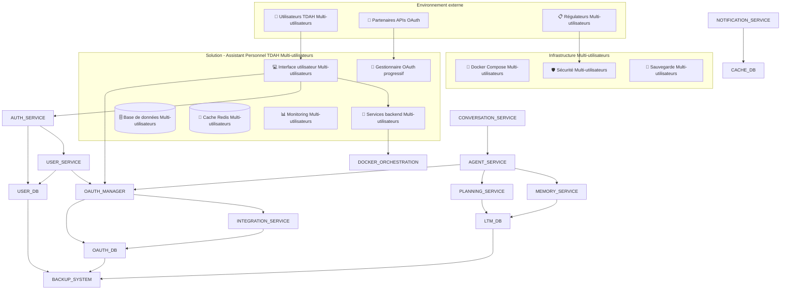
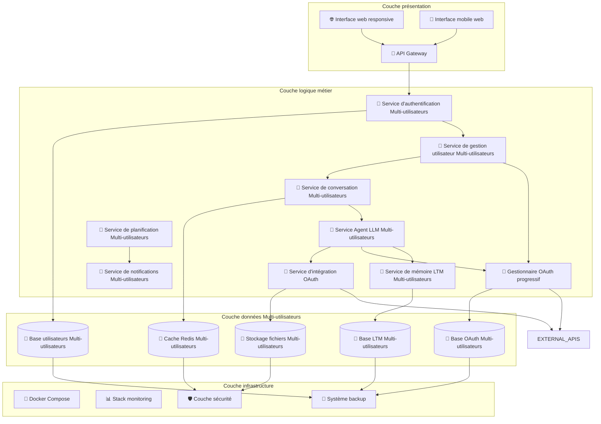
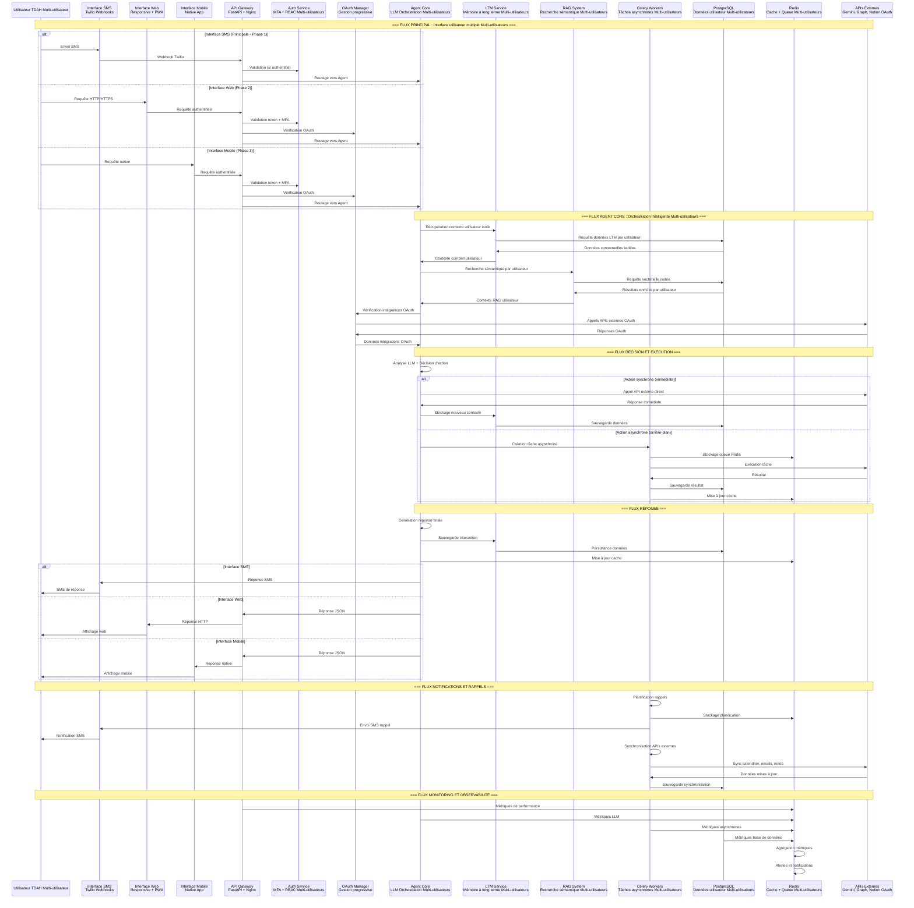

# 4.2 Modèle applicatif

## 4.2.1 Vue de contexte

Cette vue permet d'identifier le contexte global de la solution.

**Vue - Contexte**

**Explication de la solution:**

La solution est conçue comme un écosystème intégré **multi-utilisateurs** où chaque composant contribue à l'expérience utilisateur optimale, avec une **architecture modulaire permettant l'évolution et la maintenance**. Le système supporte **l'isolation stricte des données par utilisateur** et **l'intégration OAuth progressive** pour activer les fonctionnalités selon les besoins de chaque utilisateur.

**Description des impacts de la solution**

| Volets            | Impacts                                                                                                           |
| ----------------- | ----------------------------------------------------------------------------------------------------------------- |
| **Affaires**      | Amélioration de la productivité TDAH, création de valeur utilisateur, **scalabilité multi-utilisateurs**          |
| **Applicative**   | Architecture modulaire, évolutivité, maintenabilité, **isolation stricte des données par utilisateur**            |
| **Technologique** | Conteneurisation, monitoring avancé, sécurité renforcée, **gestion OAuth progressive**                            |
| **Sécurité**      | **Isolation stricte des données multi-utilisateurs**, chiffrement, authentification, **gestion des tokens OAuth** |
| **Conformité**    | Respect GDPR, audit trails, gestion des données personnelles, **isolation multi-utilisateurs**                    |
| **Données**       | Propriété utilisateur, portabilité, droit à l'oubli, **isolation stricte par utilisateur**                        |
| **Risques**       | Gestion des dépendances externes, résilience, backup, **gestion des risques multi-utilisateurs**                  |
| **Évolution**     | Architecture extensible, microservices futurs, scalabilité, **support de 1000+ utilisateurs**                     |
| **Résilience**    | Redondance, failover, dégradation gracieuse, **isolation des pannes par utilisateur**                             |

### 4.2.2 Vue applicative

Cette vue permet d'exprimer la solution de façon plus détaillée, en définissant de façon plus granulaire les composantes applicatives.

**Vue - Applicative**

**Explication de la vue applicative:**

L'architecture applicative suit le pattern en couches avec une séparation claire des responsabilités, permettant la maintenance, l'évolution et la scalabilité. **L'architecture multi-utilisateurs assure l'isolation stricte des données par utilisateur**, tandis que **le gestionnaire OAuth progressif permet l'activation granulaire des fonctionnalités** selon les services connectés par chaque utilisateur.

**Description des impacts de la vue applicative**

| Volets            | Impacts                                                                           | Catégorisation de l'impact                        |
| ----------------- | --------------------------------------------------------------------------------- | ------------------------------------------------- |
| **Affaires**      | Amélioration de la productivité TDAH, **scalabilité multi-utilisateurs**          | **Élevé** - Impact direct sur l'utilisateur final |
| **Applicative**   | Architecture modulaire et extensible, **isolation stricte des données**           | **Élevé** - Facilité de maintenance et évolution  |
| **Technologique** | Conteneurisation et monitoring, **gestion OAuth progressive**                     | **Moyen** - Infrastructure moderne et robuste     |
| **Sécurité**      | **Isolation stricte des données multi-utilisateurs**, chiffrement des données     | **Élevé** - Protection des données personnelles   |
| **Conformité**    | Traçabilité et audit, **isolation multi-utilisateurs**                            | **Moyen** - Respect des réglementations           |
| **Données**       | Propriété et portabilité utilisateur, **isolation stricte par utilisateur**       | **Élevé** - Contrôle total des données            |
| **Risques**       | Gestion des dépendances et résilience, **gestion des risques multi-utilisateurs** | **Moyen** - Réduction des risques opérationnels   |
| **Évolution**     | Scalabilité et microservices futurs, **support de 1000+ utilisateurs**            | **Élevé** - Croissance et adaptation              |
| **Résilience**    | Redondance et failover, **isolation des pannes par utilisateur**                  | **Moyen** - Continuité de service                 |

### 4.2.3 Volumétrie applicables aux différentes composantes applicatives

Cette section contient la traduction des volumétries précisées dans le registre des besoins et exigence par cas d'utilisation d'affaires, afin d'en décliner les columétries applicables aux difféerntes comopsantes utilisées dans la solution.

**Tableau 4.2.3 - Volumétrie des composantes applicatives**

| Composante applicative         | Unité de mesure         | Volumétrie                                   |
| ------------------------------ | ----------------------- | -------------------------------------------- |
| **Service d'authentification** | Requêtes/sec            | 10-50 req/s (pic: 100 req/s)                 |
| **Gestionnaire OAuth**         | Connexions OAuth/sec    | 5-20 connexions/sec (pic: 50 connexions/sec) |
| **Service de conversation**    | Sessions simultanées    | 100-500 utilisateurs (pic: 1000)             |
| **Service Agent LLM**          | Appels LLM/sec          | 5-20 appels/sec (pic: 50 appels/sec)         |
| **Service de mémoire LTM**     | Opérations DB/sec       | 50-200 op/sec (pic: 500 op/sec)              |
| **Service d'intégration**      | Appels API externes/sec | 20-100 appels/sec (pic: 200 appels/sec)      |
| **Base de données PostgreSQL** | Connexions simultanées  | 50-200 connexions (pic: 500)                 |
| **Cache Redis**                | Opérations/sec          | 1000-5000 op/sec (pic: 10000 op/sec)         |
| **Stockage de fichiers**       | Espace disque           | 100 GB - 1 TB (croissance: 50 GB/mois)       |

### 4.2.4 Tableau récapitulatif des accès

Cette section est destinée à documenter les contrôles et mécanismes d'accès applicables aux cas d'utilisation. Les cas d'utilisation sont regroupés en profils. Un profil regroupe des cas qui utilisent le même type de contrôle d'accès (par exemple, la gestion par rôle RBAC), qui portent sur les mêmes types de données, qui ont besoin de savoir analogue (DONNÉES PERSONNELLES OU NON), et qui utilisent des privilèges analogues (consultation, modification, extraction massive).

**Tableau 4.2.4 - Contrôles d'accès par profil**

| Type d'acteur               | Profil applicatif           | Contraintes d'accès                                                                  | Cas d'utilisation                                              |
| --------------------------- | --------------------------- | ------------------------------------------------------------------------------------ | -------------------------------------------------------------- |
| **Utilisateur authentifié** | Profil utilisateur standard | **RBAC individuel, accès à ses propres données uniquement, isolation stricte**       | Conversation, planification, gestion des objectifs             |
| **Utilisateur premium**     | Profil utilisateur avancé   | **RBAC étendu, accès aux fonctionnalités premium, intégrations OAuth étendues**      | Analytics avancés, intégrations étendues, **OAuth progressif** |
| **Administrateur système**  | Profil administrateur       | **RBAC administrateur, accès aux métriques et logs, isolation multi-utilisateurs**   | Monitoring, maintenance, support utilisateur                   |
| **Service système**         | Profil service technique    | **Authentification par clé API, accès limité aux ressources, isolation des données** | Intégrations, synchronisation, backup                          |

## 4.3 Information et données

### 4.3.1 Flux de données

Cette vue permet de comprendre le séquencement des flux de données et l'intégration entre les composantes.

**Vue - Flux de données**

**Explication du flux de données:**

Le flux de données suit une **architecture hybride multi-interfaces** avec orchestration intelligente par l'Agent Core :

### **🔄 Flux principal multi-interfaces :**

#### **Interface SMS (Phase 1 - Implémentée) :**

- **Entrée** : SMS utilisateur → Webhook Twilio → API Gateway
- **Traitement** : Agent Core avec contexte LTM + RAG
- **Sortie** : Réponse SMS via Twilio

#### **Interface Web (Phase 2 - Planifiée) :**

- **Entrée** : Requête HTTP/HTTPS → API Gateway → Authentification
- **Traitement** : Agent Core avec contexte enrichi
- **Sortie** : Réponse JSON → Interface web responsive

#### **Interface Mobile (Phase 3 - Planifiée) :**

- **Entrée** : Requête native → API Gateway → Authentification MFA
- **Traitement** : Agent Core avec contexte complet
- **Sortie** : Réponse JSON → Application mobile native

### **🧠 Orchestration intelligente par Agent Core :**

1. **Récupération de contexte** : LTM + RAG pour compréhension complète
2. **Analyse LLM** : Décision d'action basée sur le contexte
3. **Exécution adaptative** : Actions synchrones ou asynchrones selon la complexité
4. **Gestion de la mémoire** : Sauvegarde et optimisation continue

### **⚙️ Système de tâches asynchrones :**

- **Celery Workers** : Exécution des tâches complexes en arrière-plan
- **Redis Queue** : Gestion des files d'attente et cache
- **Synchronisation** : Mise à jour automatique des APIs externes
- **Rappels intelligents** : Notifications contextuelles et planifiées

### **🔍 Recherche et contexte enrichi :**

- **RAG System** : Recherche sémantique dans la base de connaissances
- **LTM Service** : Mémoire à long terme avec optimisation continue
- **Contexte unifié** : Fusion des informations pour une compréhension complète

### **📱 Architecture hybride évolutive :**

- **Phase 1** : SMS principal (accessible sans internet)
- **Phase 2** : Web complémentaire (gestion avancée)
- **Phase 3** : Mobile natif (expérience optimale)

Cette architecture garantit une **expérience utilisateur cohérente** sur toutes les interfaces tout en maintenant la **simplicité et l'accessibilité** de l'interface SMS comme point d'entrée principal.

### 4.3.2 Modélisation des données

Cette vue aide à comprendre les changements et impacts que la solution apporte sur les données.

**Vue - Modélisation des données**

```mermaid
erDiagram
    USERS {
        int id PK
        text email UK
        text full_name
        timestamp created_at
    }

    LTM_MEMORIES {
        int id PK
        int user_id FK
        text content
        jsonb tags
        varchar memory_type
        varchar category
        int importance_score
        float confidence_score
        float dynamic_importance
        text context
        jsonb context_data
        varchar source_type
        varchar source_id
        varchar created_by
        timestamp created_at
        timestamp last_accessed
        timestamp last_modified
        int access_count
        text last_access_context
        jsonb related_memory_ids
        int parent_memory_id
        jsonb memory_metadata
        boolean is_archived
        text archive_reason
    }

    EVENTS {
        int id PK
        int user_id FK
        text title
        text description
        timestamp start_time
        timestamp end_time
        text location
        text external_id
        varchar source
        timestamp created_at
    }

    USER_SETTINGS {
        int id PK
        int user_id FK
        text setting_key
        text setting_value
        jsonb setting_metadata
        timestamp created_at
        timestamp updated_at
    }

    USER_GOALS {
        int id PK
        int user_id FK
        text title
        text description
        varchar category
        varchar status
        varchar priority
        int importance_score
        date start_date
        date target_date
        date completed_date
        int progress_percentage
        text current_milestone
        int parent_goal_id FK
        jsonb related_memory_ids
        jsonb related_task_ids
        jsonb goal_metadata
        timestamp created_at
        timestamp updated_at
        timestamp last_reviewed
    }

    TASKS {
        int id PK
        int user_id FK
        text title
        text description
        varchar status
        varchar priority
        timestamp due_date
        timestamp created_at
        timestamp completed_at
        int goal_id FK
    }

    AI_TASKS {
        int id PK
        int user_id FK
        text task_type
        text task_description
        jsonb task_parameters
        varchar status
        jsonb result_data
        timestamp created_at
        timestamp completed_at
    }

    TASK_RESULTS {
        int id PK
        int task_id FK
        int user_id FK
        text result_type
        jsonb result_data
        timestamp created_at
    }

    GROCERY_ITEMS {
        int id PK
        int user_id FK
        text item_name
        int quantity
        varchar unit
        varchar category
        varchar priority
        decimal estimated_cost
        text store_preference
        text notes
        varchar status
        date added_date
        date target_date
        date purchased_date
        timestamp created_at
        timestamp updated_at
    }

    EXPENSES {
        int id PK
        int user_id FK
        decimal amount
        varchar category
        text description
        date expense_date
        varchar payment_method
        text location
        text receipt_image_url
        jsonb tags
        boolean recurring
        varchar budget_category
        timestamp created_at
        timestamp updated_at
    }

    EXPENSE_CATEGORIES {
        int id PK
        int user_id FK
        text name
        text description
        decimal budget_limit
        varchar color_code
        varchar icon
        boolean is_active
        timestamp created_at
    }

    NOTES {
        int id PK
        int user_id FK
        text title
        text content
        text summary
        jsonb tags
        varchar category
        varchar importance
        varchar status
        text template_id
        int parent_note_id FK
        text external_id
        varchar external_source
        timestamp created_at
        timestamp updated_at
        timestamp last_accessed
    }

    LOCATIONS {
        int id PK
        int user_id FK
        text name
        text address
        text coordinates
        varchar location_type
        varchar category
        varchar importance
        varchar visit_frequency
        timestamp last_visited
        timestamp next_visit
        text notes
        jsonb tags
        timestamp created_at
        timestamp updated_at
    }

    RECIPES {
        int id PK
        int user_id FK
        text title
        text description
        varchar category
        varchar cuisine_type
        varchar difficulty_level
        int prep_time
        int cook_time
        int total_time
        int servings
        jsonb ingredients
        text instructions
        text tips
        jsonb nutrition_info
        jsonb tags
        text image_url
        text source
        float rating
        int times_cooked
        boolean is_favorite
        boolean is_public
        timestamp created_at
        timestamp updated_at
    }

    RECIPE_INGREDIENTS {
        int id PK
        int recipe_id FK
        text ingredient_name
        decimal quantity
        varchar unit
        text notes
        boolean is_optional
        int order_index
    }

    RECIPE_INSTRUCTIONS {
        int id PK
        int recipe_id FK
        int step_number
        text instruction_text
        int estimated_time
        text tips
        text image_url
    }

    AGENT_LOGS {
        int id PK
        int user_id FK
        text log_level
        text log_message
        jsonb log_context
        timestamp created_at
    }

    USERS ||--o{ LTM_MEMORIES : "has"
    USERS ||--o{ EVENTS : "creates"
    USERS ||--o{ USER_SETTINGS : "configures"
    USERS ||--o{ USER_GOALS : "sets"
    USERS ||--o{ TASKS : "creates"
    USERS ||--o{ AI_TASKS : "triggers"
    USERS ||--o{ TASK_RESULTS : "generates"
    USERS ||--o{ GROCERY_ITEMS : "manages"
    USERS ||--o{ EXPENSES : "tracks"
    USERS ||--o{ EXPENSE_CATEGORIES : "defines"
    USERS ||--o{ NOTES : "creates"
    USERS ||--o{ LOCATIONS : "tracks"
    USERS ||--o{ RECIPES : "manages"
    USERS ||--o{ AGENT_LOGS : "generates"

    USER_GOALS ||--o{ USER_GOALS : "parent_child"
    USER_GOALS ||--o{ TASKS : "supports"

    TASKS ||--o{ TASK_RESULTS : "produces"
    AI_TASKS ||--o{ TASK_RESULTS : "produces"

    RECIPES ||--o{ RECIPE_INGREDIENTS : "contains"
    RECIPES ||--o{ RECIPE_INSTRUCTIONS : "defines"

    NOTES ||--o{ NOTES : "parent_child"

    EXPENSE_CATEGORIES ||--o{ EXPENSES : "categorizes"
```

**Description des tables principales :**

- **USERS** : Gestion des utilisateurs avec email et nom complet
- **LTM_MEMORIES** : Mémoires à long terme avec système de scoring et métadonnées avancées
- **EVENTS** : Gestion des événements calendrier avec intégration externe
- **USER_SETTINGS** : Configuration personnalisée par utilisateur
- **USER_GOALS** : Objectifs utilisateur avec suivi de progression et hiérarchie
- **TASKS** : Gestion des tâches utilisateur avec statuts et priorités
- **AI_TASKS** : Tâches automatisées par l'IA avec paramètres et résultats
- **GROCERY_ITEMS** : Gestion des listes de courses avec priorités et préférences
- **EXPENSES** : Suivi des dépenses avec catégorisation et budgétisation
- **EXPENSE_CATEGORIES** : Catégories de dépenses personnalisables
- **NOTES** : Système de notes local avec organisation hiérarchique
- **LOCATIONS** : Suivi des emplacements importants avec fréquence de visite
- **RECIPES** : Gestion des recettes avec planification de repas
- **RECIPE_INGREDIENTS** : Ingédients détaillés des recettes
- **RECIPE_INSTRUCTIONS** : Instructions étape par étape des recettes
- **AGENT_LOGS** : Journalisation des actions de l'agent IA

**Fonctionnalités TDAH intégrées :**

- **Gestion des objectifs** : Hiérarchie d'objectifs avec suivi de progression
- **Planification de repas** : Intégration recettes-courses-dépenses
- **Suivi des routines** : Emplacements fréquents et patterns de visite
- **Organisation visuelle** : Tags, catégories et priorités pour tous les éléments
- **Intégration multi-outils** : Relations entre objectifs, tâches, notes et événements
