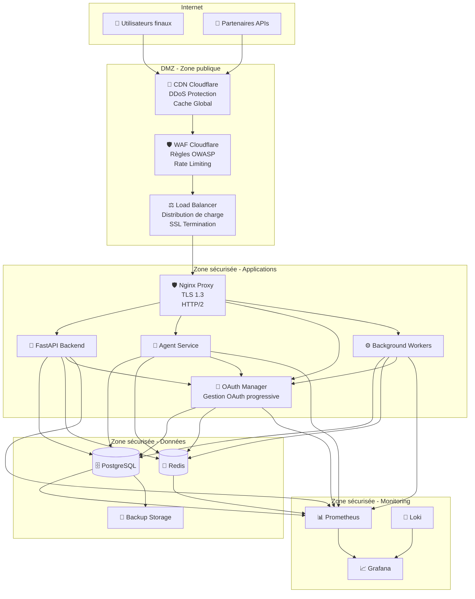

# 5. Infrastructure de transport

## 5.1 Sommaire de la solution réseau

Cette section contient les schémas globaux pour la télécommunication

### 5.1.1 Architecture réseau globale

**Vue - Architecture réseau de la solution**

**Explication de l'architecture réseau**:

L'architecture réseau suit le principe de défense en profondeur avec plusieurs zones de sécurité, **optimisée pour l'isolation multi-utilisateurs et la gestion OAuth progressive** :

1. **Zone publique (DMZ)**: CDN, WAF et load balancer exposés à Internet
2. **Zone applications**: Services applicatifs avec accès contrôlé, **incluant le gestionnaire OAuth pour l'isolation des intégrations par utilisateur**
3. **Zone données**: Base de données et stockage avec accès restreint, **isolation stricte des données par utilisateur**
4. **Zone monitoring**: Outils de surveillance avec accès privilégié, **métriques OAuth par utilisateur**

### 5.1.2 Composants de sécurité réseau

#### **5.1.2.1 Protection DDoS**

- **CDN Cloudflare**: Protection DDoS de niveau entreprise
- **Rate limiting**: Limitation des requêtes par IP et utilisateur
- **Geoblocking**: Blocage des accès depuis certaines régions
- **Bot protection**: Détection et blocage des robots malveillants

#### **5.1.2.2 WAF (Web Application Firewall)**

- **Règles OWASP**: Protection contre les vulnérabilités web courantes
- **Détection d'injection**: SQL, XSS, command injection
- **Protection CSRF**: Validation des tokens anti-CSRF
- **Filtrage des entrées**: Validation et assainissement des données

#### **5.1.2.3 Load Balancer**

- **Distribution de charge**: Répartition équitable des requêtes
- **Health checks**: Vérification continue de l'état des services
- **SSL termination**: Gestion centralisée des certificats TLS
- **Sticky sessions**: Maintien des sessions utilisateur

#### **5.1.2.4 Sécurité OAuth et Multi-utilisateurs**

- **Isolation des tokens OAuth**: Séparation stricte des tokens par utilisateur
- **Rate limiting OAuth**: Limitation des appels OAuth par utilisateur et par service
- **Validation des scopes**: Vérification des permissions OAuth pour chaque action
- **Audit des intégrations**: Traçabilité complète des connexions OAuth par utilisateur
- **Protection contre l'abus**: Détection des tentatives d'utilisation abusive des intégrations OAuth

## 5.2 Spécification Réseaux/Télécom

**Tableau 5.2.1 - Spécifications réseau et télécom**

| Spécifications         | S'applique à la solution | Détails                                                                     |
| ---------------------- | ------------------------ | --------------------------------------------------------------------------- |
| **VLAN/Subnet**        | ✅ Oui                   | Segmentation des zones de sécurité (DMZ, Applications, Données, Monitoring) |
| **VRF/Zones**          | ❌ Non                   | Pas de routage multi-VRF requis                                             |
| **DNS**                | ✅ Oui                   | Gestion DNS avec Cloudflare, résolution interne pour les services           |
| **VPN/IPVPN**          | ❌ Non                   | Accès direct via Internet sécurisé (HTTPS/TLS)                              |
| **Circuits/capacités** | ✅ Oui                   | Bande passante Internet 1Gbps+, redondance avec fournisseur secondaire      |
| **NAT**                | ✅ Oui                   | NAT sortant pour les services internes, pas de NAT entrant                  |

### 5.2.1 Configuration des VLANs et subnets

#### **5.2.1.1 Segmentation réseau**

**Zone DMZ (10.0.1.0/24)**:

- **10.0.1.1-10.0.1.10**: Load balancer et WAF
- **10.0.1.11-10.0.1.20**: CDN et services publics
- **10.0.1.21-10.0.1.30**: Services de sécurité

**Zone Applications (10.0.2.0/24)**:

- **10.0.2.1-10.0.2.20**: Services FastAPI et Agent
- **10.0.2.21-10.0.2.30**: **OAuth Manager et gestion des intégrations**
- **10.0.2.31-10.0.2.40**: Workers et services asynchrones
- **10.0.2.41-10.0.2.50**: Services d'intégration

**Zone Données (10.0.3.0/24)**:

- **10.0.3.1-10.0.3.10**: Base de données PostgreSQL
- **10.0.3.11-10.0.3.20**: Cache Redis
- **10.0.3.21-10.0.3.30**: Stockage de sauvegarde

**Zone Monitoring (10.0.4.0/24)**:

- **10.0.4.1-10.0.4.10**: Prometheus et métriques
- **10.0.4.11-10.0.4.20**: Grafana et visualisation
- **10.0.4.21-10.0.4.30**: Logs et traces

#### **5.2.1.2 Règles de routage**

- **Isolation stricte**: Pas de communication directe entre zones
- **Trafic autorisé**: Seulement via les services de proxy et d'API
- **Monitoring**: Accès en lecture seule depuis la zone monitoring
- **Backup**: Accès restreint depuis la zone données

### 5.2.2 Configuration DNS

#### **5.2.2.1 DNS externe (Cloudflare)**

**Domaines principaux**:

- **personal-assistant.com**: Domaine principal de production
- **api.personal-assistant.com**: API publique
- **oauth.personal-assistant.com**: **Gestionnaire OAuth et intégrations**
- **admin.personal-assistant.com**: Interface d'administration

**Configuration DNS**:

- **A Records**: Pointage vers les load balancers
- **CNAME**: Alias pour les sous-domaines
- **MX Records**: Configuration email (si applicable)
- **TXT Records**: Validation et sécurité (SPF, DKIM, DMARC)

#### **5.2.2.2 DNS interne**

**Résolution des services**:

- **postgres.internal**: Base de données PostgreSQL
- **redis.internal**: Cache Redis
- **oauth-manager.internal**: **Gestionnaire OAuth et intégrations**
- **prometheus.internal**: Collecte de métriques
- **grafana.internal**: Interface de monitoring

**Configuration**:

- **Forwarders**: Résolution DNS externe via Cloudflare
- **Cache**: Cache local pour améliorer les performances
- **Logs**: Journalisation des requêtes DNS

### 5.2.3 Circuits et capacités

#### **5.2.3.1 Connexion Internet principale**

- **Fournisseur**: Fournisseur Internet principal
- **Bande passante**: 1Gbps symétrique
- **SLA**: 99.9% de disponibilité
- **Support**: Support technique 24/7

#### **5.2.3.2 Connexion Internet secondaire**

- **Fournisseur**: Fournisseur Internet secondaire
- **Bande passante**: 500Mbps symétrique
- **SLA**: 99.5% de disponibilité
- **Support**: Support technique 8/5

#### **5.2.3.3 Gestion de la redondance**

- **Failover automatique**: Basculement en cas de panne
- **Load balancing**: Répartition de la charge entre les connexions
- **Monitoring**: Surveillance continue de la qualité des connexions
- **Alertes**: Notification en cas de dégradation

### 5.2.4 Configuration NAT

#### **5.2.4.1 NAT sortant**

- **Masquerading**: Traduction des adresses IP internes
- **Pool d'adresses**: Utilisation des adresses IP publiques
- **Logs**: Journalisation des connexions sortantes
- **Monitoring**: Surveillance de l'utilisation de la bande passante

#### **5.2.4.2 Pas de NAT entrant**

- **Justification**: Services accessibles directement via load balancer
- **Sécurité**: Protection par WAF et règles de pare-feu
- **Performance**: Pas de surcharge due à la traduction d'adresses
- **Monitoring**: Surveillance directe des connexions entrantes

#### **5.2.4.3 NAT pour les intégrations OAuth**

- **Connexions sortantes OAuth**: Traduction des adresses IP pour les appels vers les APIs externes
- **Isolation des connexions**: Séparation des connexions OAuth par utilisateur
- **Logs OAuth**: Journalisation spécifique des connexions OAuth sortantes
- **Monitoring OAuth**: Surveillance de la bande passante utilisée par les intégrations OAuth
- **Rate limiting OAuth**: Contrôle du nombre de connexions OAuth simultanées par utilisateur

## 5.3 Spécification Téléphonie/VoIP

**Tableau 5.3.1 - Spécifications téléphonie et VoIP**

| Spécifications         | S'applique à la solution | Détails                                    |
| ---------------------- | ------------------------ | ------------------------------------------ |
| **VLAN/Subnet**        | ❌ Non                   | Pas de téléphonie VoIP dans la solution    |
| **VRF/Zones**          | ❌ Non                   | Pas de routage téléphonique requis         |
| **DNS**                | ❌ Non                   | Pas de résolution DNS téléphonique         |
| **VPN/IPVPN**          | ❌ Non                   | Pas de réseau téléphonique privé           |
| **Circuits/capacités** | ❌ Non                   | Pas de circuits téléphoniques              |
| **NAT**                | ❌ Non                   | Pas de traduction d'adresses téléphoniques |

### 5.3.1 Justification de l'exclusion

**Pas de composants téléphoniques**:

- **Communication SMS**: Via Twilio API (pas de PBX local)
- **Notifications**: Email, push notifications, SMS via APIs
- **Support utilisateur**: Interface web et chat (pas de téléphone)
- **Intégrations**: APIs tierces pour toutes les communications

**Alternatives implémentées**:

- **Twilio SMS** : **Interface principale** - Envoi et réception de SMS via API
- **Interface CLI** : Commandes de base pour la gestion système
- **Interface Web** : **Planifiée Phase 2** - Interface complémentaire
- **Notifications push** : Notifications en temps réel via WebSocket
- **Email** : Communications importantes par email
- **Chat intégré** : Interface de conversation dans l'application
