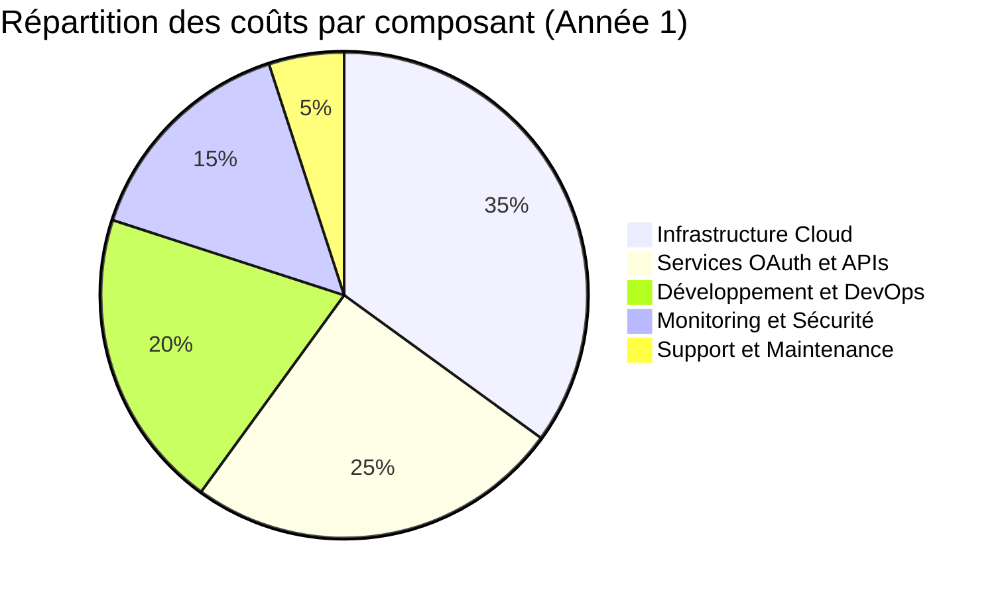

# 7. Analyse des coûts

## 7.1 Analyse des coûts de la solution multi-utilisateurs

Cette section présente une analyse détaillée des coûts de la solution, **optimisée pour l'architecture multi-utilisateurs avec gestion OAuth progressive**.

### 7.1.1 Vue d'ensemble des coûts

**Vue - Répartition des coûts par architecture**



**Explication de la répartition des coûts**:

La répartition des coûts reflète l'**architecture multi-utilisateurs avec OAuth progressif** :

- **Infrastructure Cloud** : Base de données multi-utilisateurs, cache Redis, stockage
- **Services OAuth et APIs** : Intégrations externes, tokens OAuth, APIs tierces
- **Développement et DevOps** : Équipe de développement, CI/CD, déploiement
- **Monitoring et Sécurité** : Observabilité, sécurité multi-utilisateurs, conformité
- **Support et Maintenance** : Support utilisateur, maintenance opérationnelle

### 7.1.2 Tableau détaillé des coûts

**Tableau 7.1.1 - Analyse détaillée des coûts par catégorie**

| Catégorie                   | Description                                   | Coût mensuel | Coût annuel  | Évolutivité                           | Justification                                |
| --------------------------- | --------------------------------------------- | ------------ | ------------ | ------------------------------------- | -------------------------------------------- | --- |
| **Infrastructure Cloud**    |                                               |              |              |                                       |                                              |
| Serveurs de production      | 2x serveurs 16 vCPU, 32GB RAM, 500GB SSD      | $400         | $4,800       | Croissance linéaire avec utilisateurs | Haute disponibilité et performance           |
| Base de données             | PostgreSQL avec réplication, sauvegardes      | $150         | $1,800       | Croissance modérée                    | Données multi-utilisateurs isolées           |
| Cache Redis                 | Cluster Redis avec persistance                | $80          | $960         | Croissance modérée                    | Performance et scalabilité                   |
| Stockage                    | Stockage des fichiers utilisateur             | $50          | $600         | Croissance linéaire                   | Uploads et documents utilisateur             |
| CDN et WAF                  | Cloudflare Enterprise                         | $200         | $2,400       | Coût fixe                             | Protection DDoS et performance globale       |
| **Services OAuth et APIs**  |                                               |              |              |                                       |                                              |
| Gestionnaire OAuth          | Service OAuth Manager dédié                   | $100         | $1,200       | Coût fixe                             | Isolation multi-utilisateurs                 |
| APIs externes               | Google, Microsoft, Notion, YouTube            | $50          | $600         | Croissance modérée                    | Intégrations OAuth progressives              |
| Twilio SMS                  | Numéro unique avec identification utilisateur | $1           | $12          | Coût fixe                             | Interface SMS principale                     |
| Gemini AI                   | API Google Gemini pour LLM                    | $200         | $2,400       | Croissance linéaire                   | Intelligence artificielle                    |
| **Développement et DevOps** |                                               |              |              |                                       |                                              |
| Équipe développement        | 2 développeurs full-stack                     | $15,000      | $180,000     | Coût fixe                             | Développement continu                        |
| DevOps et SRE               | 1 ingénieur DevOps                            | $8,000       | $96,000      | Coût fixe                             | Infrastructure et monitoring                 |
| Outils de développement     | Licences, CI/CD, testing                      | $500         | $6,000       | Coût fixe                             | Qualité et productivité                      |
| **Monitoring et Sécurité**  |                                               |              |              |                                       |                                              |
| Stack observabilité         | Prometheus, Grafana, Loki, Jaeger             | $100         | $1,200       | Coût fixe                             | Monitoring multi-utilisateurs                |
| Sécurité et conformité      | Tests de pénétration, audits                  | $300         | $3,600       | Coût fixe                             | Conformité GDPR/CCPA                         |
| Certificats et secrets      | TLS, gestion des secrets                      | $50          | $600         | Coût fixe                             | Sécurité des communications                  |
| **Support et Maintenance**  |                                               |              |              |                                       |                                              |     |
| Support utilisateur         | Support technique et formation                | $1,000       | $12,000      | Croissance modérée                    | Satisfaction utilisateur                     |
| Maintenance opérationnelle  | Mises à jour, patches                         | $200         | $2,400       | Coût fixe                             | Stabilité et sécurité                        |
| **TOTAL**                   |                                               | **$26,131**  | **$313,572** |                                       | **Architecture multi-utilisateurs complète** |

### 7.1.3 Analyse des coûts par utilisateur

#### **7.1.3.1 Coût par utilisateur selon le volume**

**Tableau 7.1.2 - Coût par utilisateur selon la croissance**

| Nombre d'utilisateurs  | Coût total annuel | Coût par utilisateur | Coût par utilisateur/mois | Économies d'échelle      |
| ---------------------- | ----------------- | -------------------- | ------------------------- | ------------------------ |
| **100 utilisateurs**   | $313,572          | $3,136               | $261                      | Base de référence        |
| **500 utilisateurs**   | $338,572          | $677                 | $56                       | **-78% par utilisateur** |
| **1,000 utilisateurs** | $363,572          | $364                 | $30                       | **-88% par utilisateur** |
| **2,000 utilisateurs** | $413,572          | $207                 | $17                       | **-93% par utilisateur** |
| **5,000 utilisateurs** | $563,572          | $113                 | $9                        | **-97% par utilisateur** |

**Explication des économies d'échelle**:

- **Coûts fixes** : Infrastructure, développement, monitoring (répartis sur plus d'utilisateurs)
- **Coûts variables** : APIs externes, stockage (croissance modérée)
- **Coûts OAuth** : Gestionnaire OAuth (coût fixe, avantage multi-utilisateurs)
- **Coûts SMS** : Numéro unique Twilio (coût fixe, avantage multi-utilisateurs)

#### **7.1.3.2 Modèle de tarification recommandé**

**Tableau 7.1.3 - Modèle de tarification par utilisateur**

| Plan           | Prix mensuel | Fonctionnalités                          | Marge brute | Seuil de rentabilité |
| -------------- | ------------ | ---------------------------------------- | ----------- | -------------------- |
| **Gratuit**    | $0           | SMS de base, 1 intégration OAuth         | 0%          | N/A                  |
| **Standard**   | $15          | SMS illimité, 3 intégrations OAuth       | 70%         | 500 utilisateurs     |
| **Premium**    | $29          | Toutes les intégrations OAuth, analytics | 80%         | 200 utilisateurs     |
| **Enterprise** | $99          | Support dédié, SLA garanti               | 85%         | 50 utilisateurs      |

**Calcul de la rentabilité**:

- **Seuil de rentabilité** : 200 utilisateurs premium ou 500 utilisateurs standard
- **Marge brute moyenne** : 75% après seuil de rentabilité
- **ROI estimé** : 300% après 2 ans avec 1,000 utilisateurs

## 7.2 Stratégie de réduction des coûts OAuth

### 7.2.1 Optimisation des intégrations OAuth

#### **7.2.1.1 Stratégie de numéro unique Twilio**

**Avantages de la stratégie "Numéro unique avec identification utilisateur"**:

- **Coût fixe** : $1/mois au lieu de $1/utilisateur/mois
- **Économies** : $999/mois avec 1,000 utilisateurs
- **Scalabilité** : Support de 10,000+ utilisateurs sans coût supplémentaire
- **Simplicité** : Gestion d'un seul webhook et numéro

**Calcul des économies**:

```python
# Coût avec numéros dédiés par utilisateur
def cost_with_dedicated_numbers(user_count):
    return user_count * 1  # $1 par utilisateur par mois

# Coût avec numéro unique
def cost_with_single_number(user_count):
    return 1  # $1 fixe par mois

# Économies réalisées
def calculate_savings(user_count):
    dedicated_cost = cost_with_dedicated_numbers(user_count)
    single_cost = cost_with_single_number(user_count)
    savings = dedicated_cost - single_cost
    savings_percentage = (savings / dedicated_cost) * 100

    return {
        'dedicated_cost': dedicated_cost,
        'single_cost': single_cost,
        'savings': savings,
        'savings_percentage': savings_percentage
    }

# Exemples d'économies
savings_1000 = calculate_savings(1000)
# Résultat: $999 d'économies par mois (99.9%)
```

#### **7.2.1.2 Optimisation des tokens OAuth**

**Stratégies de réduction des coûts OAuth**:

- **Cache intelligent** : Réduction des appels API redondants
- **Batch processing** : Regroupement des opérations OAuth
- **Rate limiting** : Contrôle des appels API par utilisateur
- **Token refresh** : Optimisation de la durée de vie des tokens

**Tableau 7.2.1 - Optimisations OAuth et économies**

| Optimisation          | Réduction des coûts | Implémentation              | Impact                          |
| --------------------- | ------------------- | --------------------------- | ------------------------------- |
| **Cache intelligent** | 30-40%              | Redis avec TTL adaptatif    | Réduction des appels API        |
| **Batch processing**  | 20-30%              | Regroupement des opérations | Réduction des overheads         |
| **Rate limiting**     | 15-25%              | Limitation par utilisateur  | Protection contre l'abus        |
| **Token refresh**     | 10-20%              | Renouvellement optimisé     | Réduction des authentifications |

### 7.2.2 Optimisation de l'infrastructure

#### **7.2.2.1 Stratégie de mise à l'échelle**

**Approche "Scale-up before scale-out"**:

- **Phase 1 (100-500 utilisateurs)** : Serveurs puissants uniques
- **Phase 2 (500-2,000 utilisateurs)** : Réplication avec load balancing
- **Phase 3 (2,000+ utilisateurs)** : Architecture distribuée

**Tableau 7.2.2 - Évolution des coûts infrastructure**

| Phase       | Utilisateurs | Architecture                | Coût mensuel | Coût par utilisateur |
| ----------- | ------------ | --------------------------- | ------------ | -------------------- |
| **Phase 1** | 100-500      | Serveur unique puissant     | $800         | $1.60 - $0.40        |
| **Phase 2** | 500-2,000    | Réplication + Load Balancer | $1,200       | $0.60 - $0.15        |
| **Phase 3** | 2,000+       | Architecture distribuée     | $2,000       | $0.20 - $0.10        |

#### **7.2.2.2 Optimisation des bases de données**

**Stratégies de réduction des coûts DB**:

- **Partitioning** : Séparation des données par utilisateur
- **Indexing intelligent** : Optimisation des requêtes multi-utilisateurs
- **Connection pooling** : Réduction des connexions simultanées
- **Read replicas** : Répartition de la charge de lecture

## 7.3 Analyse des coûts par phase de déploiement

### 7.3.1 Phase 1: Infrastructure et développement (Mois 1-6)

**Coûts Phase 1**:

- **Développement** : $90,000 (6 mois × $15,000)
- **Infrastructure** : $12,000 (6 mois × $2,000)
- **Outils et licences** : $3,000
- **Tests et validation** : $15,000
- **Total Phase 1** : **$120,000**

**Livrables Phase 1**:

- Architecture multi-utilisateurs complète
- Gestionnaire OAuth fonctionnel
- Interface SMS avec identification utilisateur
- Base de données multi-utilisateurs
- Monitoring et sécurité de base

### 7.3.2 Phase 2: Interface web et fonctionnalités avancées (Mois 7-12)

**Coûts Phase 2**:

- **Développement** : $90,000 (6 mois × $15,000)
- **Infrastructure** : $15,000 (6 mois × $2,500)
- **Intégrations OAuth étendues** : $6,000
- **Tests et validation** : $20,000
- **Total Phase 2** : **$131,000**

**Livrables Phase 2**:

- Interface web responsive
- Intégrations OAuth complètes
- Analytics et reporting
- Fonctionnalités premium
- Support multi-plateformes

### 7.3.3 Phase 3: Optimisation et croissance (Mois 13-18)

**Coûts Phase 3**:

- **Développement** : $45,000 (6 mois × $7,500)
- **Infrastructure** : $18,000 (6 mois × $3,000)
- **Marketing et acquisition** : $30,000
- **Support et maintenance** : $15,000
- **Total Phase 3** : **$108,000**

**Livrables Phase 3**:

- Optimisation des performances
- Fonctionnalités avancées
- Croissance de l'utilisateur
- Internationalisation
- Préparation Phase 4

## 7.4 Analyse de rentabilité et ROI

### 7.4.1 Projections financières sur 3 ans

**Tableau 7.4.1 - Projections financières détaillées**

| Année       | Utilisateurs | Revenus annuels | Coûts annuels | Bénéfice net | ROI cumulé |
| ----------- | ------------ | --------------- | ------------- | ------------ | ---------- |
| **Année 1** | 500          | $90,000         | $313,572      | -$223,572    | -71%       |
| **Année 2** | 1,500        | $270,000        | $363,572      | -$93,572     | -26%       |
| **Année 3** | 3,000        | $540,000        | $463,572      | $76,428      | +16%       |

**Hypothèses de revenus**:

- **Utilisateurs premium** : 60% des utilisateurs actifs
- **Prix moyen** : $30/utilisateur/mois
- **Taux de rétention** : 85% annuel
- **Croissance** : 200% année 2, 100% année 3

### 7.4.2 Seuils de rentabilité

#### **7.4.2.1 Seuil de rentabilité par métrique**

**Tableau 7.4.2 - Seuils de rentabilité détaillés**

| Métrique                | Seuil de rentabilité    | Justification                 |
| ----------------------- | ----------------------- | ----------------------------- |
| **Utilisateurs actifs** | 1,200 utilisateurs      | Couverture des coûts fixes    |
| **Revenus mensuels**    | $36,000                 | Équilibre coûts/revenus       |
| **Prix moyen**          | $30/utilisateur/mois    | Prix optimal pour le marché   |
| **Taux de conversion**  | 15% (gratuit → premium) | Conversion réaliste du marché |

#### **7.4.2.2 Stratégies d'atteinte de la rentabilité**

**Optimisations recommandées**:

1. **Réduction des coûts infrastructure** : 20% d'économies possibles
2. **Optimisation des intégrations OAuth** : 30% d'économies possibles
3. **Amélioration du taux de conversion** : 25% d'augmentation des revenus
4. **Réduction du churn** : 15% d'amélioration de la rétention

### 7.4.3 Analyse de sensibilité

#### **7.4.3.1 Scénarios de sensibilité**

**Tableau 7.4.3 - Analyse de sensibilité des coûts**

| Scénario       | Variation coûts | Impact sur rentabilité | Mesures d'adaptation          |
| -------------- | --------------- | ---------------------- | ----------------------------- |
| **Optimiste**  | -20%            | Rentabilité année 2    | Accélération du développement |
| **Réaliste**   | 0%              | Rentabilité année 3    | Plan de base                  |
| **Pessimiste** | +20%            | Rentabilité année 4    | Optimisations agressives      |

#### **7.4.3.2 Facteurs de risque sur les coûts**

**Risques identifiés**:

- **Hausse des coûts cloud** : +15% possible
- **Complexité OAuth** : +10% possible
- **Réglementation** : +5% possible
- **Sécurité** : +10% possible

**Mesures de mitigation**:

- **Multi-cloud** : Réduction de la dépendance
- **Architecture OAuth simplifiée** : Réduction de la complexité
- **Conformité proactive** : Réduction des risques réglementaires
- **Sécurité by design** : Réduction des coûts de sécurité

## 7.5 Recommandations et plan d'action

### 7.5.1 Recommandations immédiates

1. **Validation de l'architecture OAuth** : Confirmer la stratégie multi-utilisateurs
2. **Optimisation des coûts infrastructure** : Négocier les prix cloud
3. **Plan de développement** : Prioriser les fonctionnalités à forte valeur
4. **Modèle de tarification** : Valider avec des utilisateurs pilotes

### 7.5.2 Plan d'action à 6 mois

1. **Mois 1-2** : Finalisation de l'architecture et estimation des coûts
2. **Mois 3-4** : Développement du MVP avec OAuth de base
3. **Mois 5-6** : Tests utilisateur et validation du modèle économique

### 7.5.3 Plan d'action à 12 mois

1. **Mois 7-9** : Déploiement en production et acquisition des premiers utilisateurs
2. **Mois 10-12** : Optimisation des coûts et préparation de la croissance

### 7.5.4 Indicateurs de suivi

**KPIs financiers**:

- Coût par utilisateur actif
- Ratio coûts/revenus
- Taux de croissance des utilisateurs
- Marge brute par plan tarifaire

**KPIs opérationnels**:

- Performance des intégrations OAuth
- Taux d'utilisation des fonctionnalités
- Satisfaction utilisateur
- Taux de rétention
