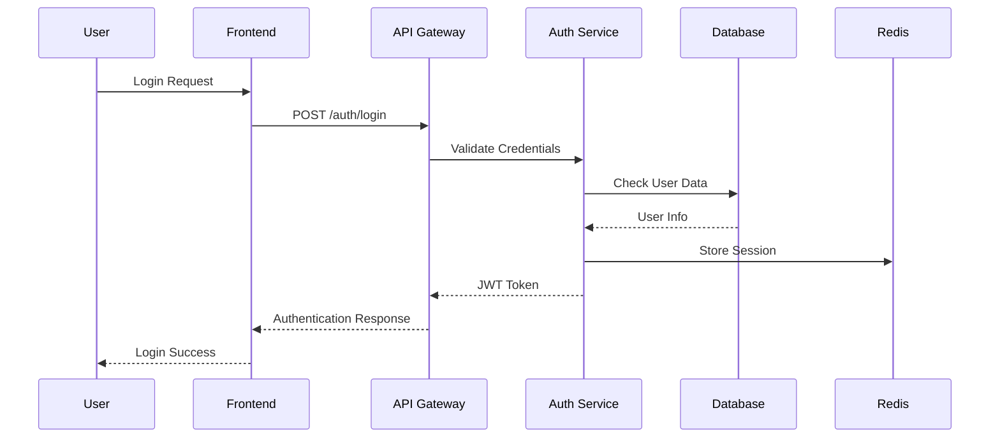
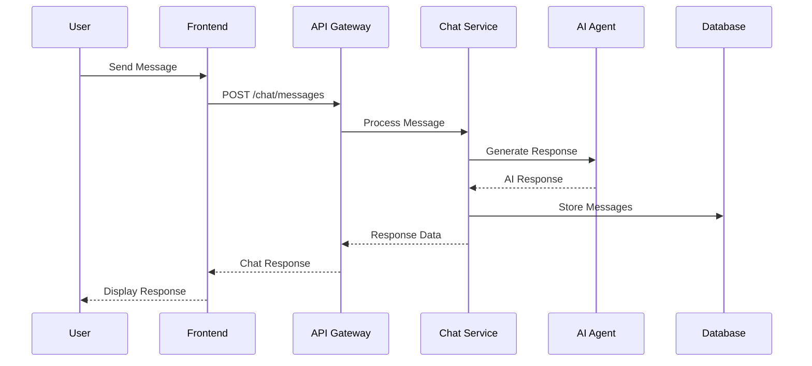
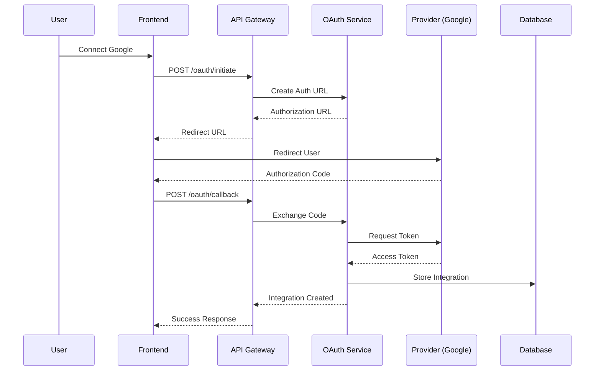

# System Architecture Overview

The Personal Assistant TDAH system is a comprehensive, multi-layered architecture designed to provide intelligent task management, productivity enhancement, and seamless integration with external services. This document provides a high-level overview of the system architecture, components, and design principles.

## Table of Contents

- [System Overview](#system-overview)
- [Architecture Principles](#architecture-principles)
- [System Components](#system-components)
- [Technology Stack](#technology-stack)
- [Data Flow](#data-flow)
- [Security Architecture](#security-architecture)
- [Scalability Considerations](#scalability-considerations)
- [Deployment Architecture](#deployment-architecture)
- [Monitoring and Observability](#monitoring-and-observability)
- [Integration Points](#integration-points)

## System Overview

The Personal Assistant TDAH system is built as a modern, cloud-native application following microservices principles. It consists of multiple interconnected components that work together to provide a seamless user experience while maintaining high performance, security, and scalability.

### Core Capabilities

- **Intelligent Task Management**: AI-powered task creation, prioritization, and execution
- **Multi-User Support**: Isolated user environments with role-based access control
- **OAuth Integration**: Seamless integration with Google, Microsoft, Notion, and YouTube
- **SMS Routing**: Multi-user SMS management with Twilio integration
- **Real-time Communication**: WebSocket-based chat with AI agent
- **Analytics and Reporting**: Comprehensive usage analytics and cost tracking
- **Security**: Multi-factor authentication, session management, and audit logging

### System Goals

- **Scalability**: Handle thousands of concurrent users
- **Reliability**: 99.9% uptime with fault tolerance
- **Security**: Enterprise-grade security with compliance
- **Performance**: Sub-second response times for most operations
- **Maintainability**: Clean, documented, and testable code

## Architecture Principles

### 1. Microservices Architecture

The system is decomposed into loosely coupled, independently deployable services:

- **API Gateway**: Single entry point for all client requests
- **Authentication Service**: User authentication and authorization
- **User Management Service**: User profiles and preferences
- **Chat Service**: AI-powered conversation management
- **OAuth Service**: External service integration
- **SMS Router Service**: Multi-user SMS management
- **Analytics Service**: Usage tracking and reporting
- **Session Service**: User session management

### 2. Domain-Driven Design

Each service is organized around business domains:

- **User Domain**: Authentication, profiles, preferences
- **Communication Domain**: Chat, SMS, notifications
- **Integration Domain**: OAuth, external APIs
- **Analytics Domain**: Metrics, reporting, insights
- **Security Domain**: RBAC, audit, compliance

### 3. Event-Driven Architecture

Services communicate through events for loose coupling:

- **User Events**: Registration, login, profile updates
- **Communication Events**: Messages, notifications, status changes
- **Integration Events**: OAuth flows, data synchronization
- **Analytics Events**: Usage tracking, performance metrics

### 4. API-First Design

All services expose well-defined REST APIs:

- **OpenAPI Specification**: Complete API documentation
- **Versioning**: Backward-compatible API evolution
- **Rate Limiting**: Protection against abuse
- **Authentication**: JWT-based security

## System Components

### Frontend Layer

#### React Application

- **Framework**: React 18 with TypeScript
- **State Management**: Zustand for global state
- **Styling**: Tailwind CSS with custom components
- **Routing**: React Router for navigation
- **Build Tool**: Vite for fast development and building

#### Key Features

- **Responsive Design**: Mobile-first approach
- **Real-time Updates**: WebSocket integration
- **Offline Support**: Service worker implementation
- **Progressive Web App**: Installable and offline-capable

### Backend Layer

#### FastAPI Application

- **Framework**: FastAPI with Python 3.11+
- **Database**: PostgreSQL with SQLAlchemy ORM
- **Caching**: Redis for session and data caching
- **Background Tasks**: Celery with Redis broker
- **Authentication**: JWT with refresh tokens

#### Core Services

**Authentication Service**

- User registration and login
- Multi-factor authentication (TOTP, SMS)
- Password reset and email verification
- Session management and security

**User Management Service**

- User profiles and preferences
- Role-based access control (RBAC)
- Phone number management
- Admin operations

**Chat Service**

- AI-powered conversation management
- Real-time WebSocket communication
- Conversation history and management
- Tool integration and execution

**OAuth Service**

- Google, Microsoft, Notion, YouTube integration
- Token management and refresh
- Data synchronization
- Integration status monitoring

**SMS Router Service**

- Multi-user SMS routing
- Twilio integration
- Phone number mapping
- Delivery status tracking

**Analytics Service**

- Usage tracking and metrics
- Cost analysis and optimization
- Performance monitoring
- Report generation

### Data Layer

#### PostgreSQL Database

- **Primary Database**: User data, conversations, integrations
- **ACID Compliance**: Transactional integrity
- **Indexing**: Optimized query performance
- **Backup**: Automated daily backups

#### Redis Cache

- **Session Storage**: User sessions and authentication
- **Data Caching**: Frequently accessed data
- **Rate Limiting**: API protection
- **Background Jobs**: Celery task queue

#### Data Models

**User Models**

- Users, roles, permissions
- MFA settings and backup codes
- Phone numbers and verification
- Security events and audit logs

**Communication Models**

- Conversations and messages
- SMS logs and routing
- OAuth integrations and tokens
- Analytics and metrics

### Infrastructure Layer

#### Containerization

- **Docker**: Application containerization
- **Docker Compose**: Multi-environment setup
- **Multi-stage Builds**: Optimized image sizes
- **Health Checks**: Container monitoring

#### Orchestration

- **Kubernetes**: Production orchestration
- **Helm Charts**: Deployment management
- **Service Mesh**: Inter-service communication
- **Auto-scaling**: Dynamic resource allocation

#### Monitoring Stack

- **Prometheus**: Metrics collection
- **Grafana**: Visualization and dashboards
- **Loki**: Log aggregation
- **AlertManager**: Incident management

## Technology Stack

### Backend Technologies

| Component           | Technology | Version | Purpose                          |
| ------------------- | ---------- | ------- | -------------------------------- |
| **API Framework**   | FastAPI    | 0.104+  | High-performance API development |
| **Language**        | Python     | 3.11+   | Core application logic           |
| **Database**        | PostgreSQL | 15+     | Primary data storage             |
| **ORM**             | SQLAlchemy | 2.0+    | Database abstraction             |
| **Cache**           | Redis      | 7+      | Session and data caching         |
| **Background Jobs** | Celery     | 5.3+    | Asynchronous task processing     |
| **Authentication**  | JWT        | -       | Token-based authentication       |
| **MFA**             | pyotp      | 2.9+    | TOTP implementation              |
| **SMS**             | Twilio     | 8+      | SMS service integration          |

### Frontend Technologies

| Component            | Technology   | Version | Purpose                       |
| -------------------- | ------------ | ------- | ----------------------------- |
| **Framework**        | React        | 18+     | User interface                |
| **Language**         | TypeScript   | 5+      | Type-safe development         |
| **State Management** | Zustand      | 4+      | Global state management       |
| **Styling**          | Tailwind CSS | 3+      | Utility-first CSS             |
| **Build Tool**       | Vite         | 5+      | Fast development and building |
| **Routing**          | React Router | 6+      | Client-side routing           |
| **HTTP Client**      | Axios        | 1+      | API communication             |
| **WebSocket**        | Socket.io    | 4+      | Real-time communication       |

### Infrastructure Technologies

| Component            | Technology     | Version | Purpose                 |
| -------------------- | -------------- | ------- | ----------------------- |
| **Containerization** | Docker         | 24+     | Application packaging   |
| **Orchestration**    | Kubernetes     | 1.28+   | Container orchestration |
| **Reverse Proxy**    | Nginx          | 1.24+   | Load balancing and SSL  |
| **Monitoring**       | Prometheus     | 2.45+   | Metrics collection      |
| **Visualization**    | Grafana        | 10+     | Metrics visualization   |
| **Logging**          | Loki           | 2.9+    | Log aggregation         |
| **CI/CD**            | GitHub Actions | -       | Automated deployment    |

## Data Flow

### User Authentication Flow

### Chat Message Flow

### OAuth Integration Flow

## Security Architecture

### Authentication and Authorization

**Multi-Factor Authentication**

- TOTP (Time-based One-Time Password)
- SMS-based verification
- Backup codes for recovery
- Biometric authentication (mobile)

**Role-Based Access Control (RBAC)**

- Hierarchical role system
- Granular permissions
- Resource-based access control
- Audit logging for all actions

**Session Management**

- JWT tokens with expiration
- Refresh token rotation
- Session invalidation
- Device tracking and management

### Data Protection

**Encryption**

- TLS 1.3 for data in transit
- AES-256 for data at rest
- Encrypted database connections
- Secure key management

**Privacy**

- User data isolation
- GDPR compliance
- Data retention policies
- Right to be forgotten

**Security Monitoring**

- Real-time threat detection
- Anomaly detection
- Security event logging
- Incident response procedures

## Scalability Considerations

### Horizontal Scaling

**Stateless Services**

- All services are stateless
- Session data stored in Redis
- Load balancer distribution
- Auto-scaling based on metrics

**Database Scaling**

- Read replicas for queries
- Connection pooling
- Query optimization
- Partitioning strategies

**Caching Strategy**

- Multi-level caching
- Redis cluster for high availability
- CDN for static assets
- Application-level caching

### Performance Optimization

**API Optimization**

- Response compression
- Pagination for large datasets
- GraphQL for flexible queries
- Rate limiting and throttling

**Database Optimization**

- Index optimization
- Query performance monitoring
- Connection pooling
- Prepared statements

**Frontend Optimization**

- Code splitting
- Lazy loading
- Image optimization
- Service worker caching

## Deployment Architecture

### Environment Strategy

**Development Environment**

- Local Docker Compose setup
- Hot reloading for development
- Mock external services
- Debug logging enabled

**Staging Environment**

- Production-like configuration
- Integration testing
- Performance testing
- Security scanning

**Production Environment**

- High availability setup
- Auto-scaling enabled
- Monitoring and alerting
- Backup and disaster recovery

### CI/CD Pipeline

**Continuous Integration**

- Automated testing
- Code quality checks
- Security scanning
- Dependency updates

**Continuous Deployment**

- Automated deployments
- Blue-green deployments
- Rollback capabilities
- Health checks

## Monitoring and Observability

### Metrics Collection

**Application Metrics**

- Request/response times
- Error rates
- Throughput
- Resource utilization

**Business Metrics**

- User engagement
- Feature usage
- Conversion rates
- Cost analysis

### Logging Strategy

**Structured Logging**

- JSON format for all logs
- Correlation IDs for tracing
- Log levels and filtering
- Centralized log aggregation

**Log Aggregation**

- Loki for log storage
- Grafana for visualization
- Alert rules for anomalies
- Log retention policies

### Alerting

**Alert Categories**

- Critical system failures
- Performance degradation
- Security incidents
- Business metrics

**Alert Channels**

- Email notifications
- Slack integration
- PagerDuty escalation
- Dashboard updates

## Integration Points

### External Services

**OAuth Providers**

- Google (Gmail, Calendar, Drive, YouTube)
- Microsoft (Outlook, OneDrive, Teams)
- Notion (Pages, Databases)
- YouTube (Channel management)

**Communication Services**

- Twilio (SMS routing)
- Email providers (SMTP)
- Push notifications (FCM, APNS)
- Webhook endpoints

**AI Services**

- OpenAI GPT models
- Custom AI agents
- Tool execution engines
- Prompt engineering

### API Integrations

**REST APIs**

- Standard HTTP methods
- JSON request/response
- Authentication headers
- Rate limiting

**WebSocket Connections**

- Real-time communication
- Event streaming
- Connection management
- Heartbeat monitoring

**Webhook Endpoints**

- External service callbacks
- Event processing
- Retry mechanisms
- Security validation

## Future Considerations

### Planned Enhancements

**AI Improvements**

- Advanced prompt engineering
- Custom model training
- Multi-modal capabilities
- Enhanced tool integration

**Integration Expansion**

- Additional OAuth providers
- CRM system integration
- Calendar synchronization
- Document management

**Performance Optimization**

- Edge computing
- Advanced caching
- Database sharding
- Microservice optimization

### Technology Evolution

**Framework Updates**

- React 19 features
- FastAPI improvements
- Database optimizations
- Container innovations

**Security Enhancements**

- Zero-trust architecture
- Advanced threat detection
- Compliance automation
- Privacy improvements

This architecture overview provides a comprehensive understanding of the Personal Assistant TDAH system. For detailed implementation information, refer to the specific component documentation and API references.
