# Component Diagrams

This document provides comprehensive architectural diagrams for the Personal Assistant TDAH system, covering all aspects from high-level system overview to detailed component relationships.

## Table of Contents

- [C4 Model Diagrams](#c4-model-diagrams)
- [MAE_MAS Style Diagrams](#mae_mas-style-diagrams)
- [Technical Diagrams](#technical-diagrams)
- [Diagram Specifications](#diagram-specifications)

## C4 Model Diagrams

### 1. Context Diagram

```mermaid
graph TB
    User[👤 Users]
    Admin[👨‍💼 Administrators]
    Mobile[📱 Mobile Apps]
    Web[🌐 Web Applications]

    User --> PA[Personal Assistant System]
    Admin --> PA
    Mobile --> PA
    Web --> PA

    PA --> Google[🔍 Google Services]
    PA --> Microsoft[🏢 Microsoft Services]
    PA --> Notion[📝 Notion]
    PA --> YouTube[📺 YouTube]
    PA --> Twilio[📱 Twilio SMS]

    Google --> PA
    Microsoft --> PA
    Notion --> PA
    YouTube --> PA
    Twilio --> PA
```



### 2. Container Diagram


### 3. Component Diagram


### 4. Code Diagram


## MAE_MAS Style Diagrams

### 5. System Architecture Diagram


### 6. Network Architecture Diagram


### 7. Multi-User Data Flow Diagram


### 8. OAuth Progressive Integration Diagram


### 9. SMS Routing Architecture Diagram


### 10. Security Architecture Diagram


## Technical Diagrams

### 11. Entity Relationship Diagram (ERD)


### 12. API Endpoint Diagram

```mermaid
graph TB
    subgraph "API Endpoints"
        subgraph "Authentication"
            POST_auth_register[POST /auth/register]
            POST_auth_login[POST /auth/login]
            POST_auth_refresh[POST /auth/refresh]
            POST_auth_logout[POST /auth/logout]
            GET_auth_me[GET /auth/me]
        end

        subgraph "User Management"
            GET_users[GET /users]
            GET_users_id[GET /users/{id}]
            PUT_users_id[PUT /users/{id}]
            GET_users_me[GET /users/me]
            PUT_users_me[PUT /users/me]
        end

        subgraph "Chat"
            POST_chat_messages[POST /chat/messages]
            GET_chat_conversations[GET /chat/conversations]
            GET_chat_conversations_id[GET /chat/conversations/{id}]
            DELETE_chat_conversations_id[DELETE /chat/conversations/{id}]
        end

        subgraph "OAuth"
            GET_oauth_providers[GET /oauth/providers]
            POST_oauth_initiate[POST /oauth/initiate]
            POST_oauth_callback[POST /oauth/callback]
            GET_oauth_integrations[GET /oauth/integrations]
        end

        subgraph "SMS Router"
            POST_sms_webhook[POST /sms-router/webhook/sms]
            POST_sms_delivery[POST /sms-router/webhook/delivery-status]
            GET_sms_status[GET /sms-router/admin/status]
        end

        subgraph "Analytics"
            GET_analytics_me[GET /analytics/me/sms-analytics]
            GET_analytics_costs[GET /analytics/me/sms-costs]
            GET_analytics_report[GET /analytics/me/sms-usage-report]
        end
    end
```

### 13. Frontend Component Hierarchy Diagram


### 14. Deployment Architecture Diagram


### 15. Monitoring and Observability Diagram


### 16. CI/CD Pipeline Diagram


### 17. Data Flow Diagram


### 18. Security Flow Diagram


## Diagram Specifications

### Visual Standards

**Colors**

- Primary: #007bff (Blue)
- Success: #28a745 (Green)
- Warning: #ffc107 (Yellow)
- Danger: #dc3545 (Red)
- Info: #17a2b8 (Cyan)
- Light: #f8f9fa (Light Gray)
- Dark: #343a40 (Dark Gray)

**Shapes**

- Rectangles: Components and services
- Circles: Data stores and external systems
- Diamonds: Decision points
- Arrows: Data flow and relationships

**Typography**

- Headers: Bold, 16px
- Labels: Regular, 12px
- Descriptions: Regular, 10px

### Technical Standards

**Mermaid Syntax**

- Use consistent node naming
- Group related components
- Include proper relationships
- Add descriptive labels

**Content Standards**

- Clear component names
- Descriptive relationships
- Proper data flow direction
- Include external dependencies

### Maintenance Guidelines

**Version Control**

- Store diagrams in version control
- Include change documentation
- Maintain diagram history
- Review changes regularly

**Updates**

- Update diagrams with code changes
- Validate diagram accuracy
- Test diagram rendering
- Document diagram purpose

This comprehensive set of diagrams provides a complete visual representation of the Personal Assistant TDAH system architecture, from high-level system overview to detailed component relationships and data flows.
