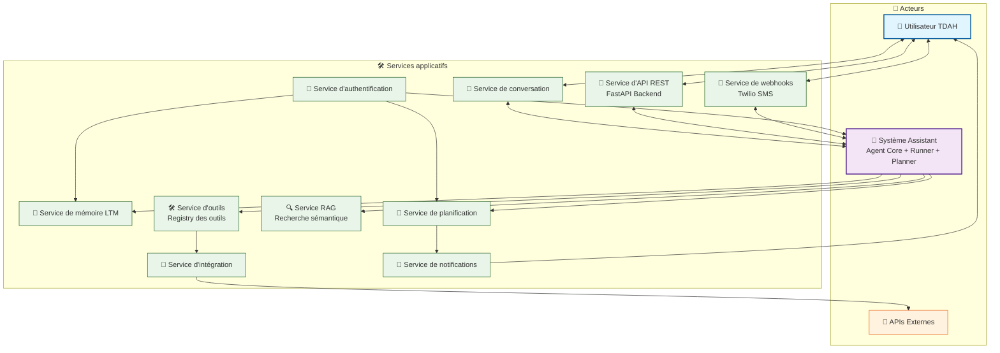
```mermaid
graph TB
    subgraph "👥 Acteurs"
        USER[👤 Utilisateur TDAH]
        SYSTEM[🤖 Système Assistant<br/>Agent Core + Runner + Planner]
        EXTERNAL_APIS[🔌 APIs Externes]
    end

    subgraph "🛠️ Services applicatifs"
        AUTH_SERVICE[🔐 Service d'authentification]
        CONVERSATION_SERVICE[💬 Service de conversation]
        MEMORY_SERVICE[🧠 Service de mémoire LTM]
        INTEGRATION_SERVICE[🔗 Service d'intégration]
        PLANNING_SERVICE[📅 Service de planification]
        NOTIFICATION_SERVICE[🔔 Service de notifications]
        RAG_SERVICE[🔍 Service RAG<br/>Recherche sémantique]
        TOOL_SERVICE[🛠️ Service d'outils<br/>Registry des outils]
        API_SERVICE[🚀 Service d'API REST<br/>FastAPI Backend]
        WEBHOOK_SERVICE[📡 Service de webhooks<br/>Twilio SMS]
    end

    %% ===== FLUX PRINCIPAL : Conversation directe =====
    USER <--> CONVERSATION_SERVICE
    CONVERSATION_SERVICE <--> SYSTEM

    %% ===== FLUX API : Interface REST =====
    USER <--> API_SERVICE
    API_SERVICE <--> SYSTEM

    %% ===== FLUX WEBHOOK : Interface SMS =====
    USER <--> WEBHOOK_SERVICE
    WEBHOOK_SERVICE <--> SYSTEM

    %% ===== SYSTÈME ASSISTANT ORCHESTRE TOUS LES SERVICES =====
    SYSTEM --> MEMORY_SERVICE
    SYSTEM --> RAG_SERVICE
    SYSTEM --> TOOL_SERVICE
    SYSTEM --> PLANNING_SERVICE

    %% ===== SERVICES COMMUNIQUENT ENTRE EUX =====
    TOOL_SERVICE --> INTEGRATION_SERVICE
    INTEGRATION_SERVICE --> EXTERNAL_APIS

    %% ===== NOTIFICATIONS RETOURNENT À L'UTILISATEUR =====
    PLANNING_SERVICE --> NOTIFICATION_SERVICE
    NOTIFICATION_SERVICE --> USER

    %% ===== AUTHENTIFICATION POUR TOUS LES SERVICES =====
    AUTH_SERVICE --> SYSTEM
    AUTH_SERVICE --> MEMORY_SERVICE
    AUTH_SERVICE --> PLANNING_SERVICE

    %% ===== STYLE ET COULEURS =====
    classDef userClass fill:#e1f5fe,stroke:#01579b,stroke-width:2px
    classDef systemClass fill:#f3e5f5,stroke:#4a148c,stroke-width:2px
    classDef serviceClass fill:#e8f5e8,stroke:#1b5e20,stroke-width:1px
    classDef flowClass fill:#fff3e0,stroke:#e65100,stroke-width:1px

    class USER userClass
    class SYSTEM systemClass
    class CONVERSATION_SERVICE,API_SERVICE,WEBHOOK_SERVICE,MEMORY_SERVICE,RAG_SERVICE,TOOL_SERVICE,PLANNING_SERVICE,NOTIFICATION_SERVICE,INTEGRATION_SERVICE,AUTH_SERVICE serviceClass
    class EXTERNAL_APIS flowClass
```

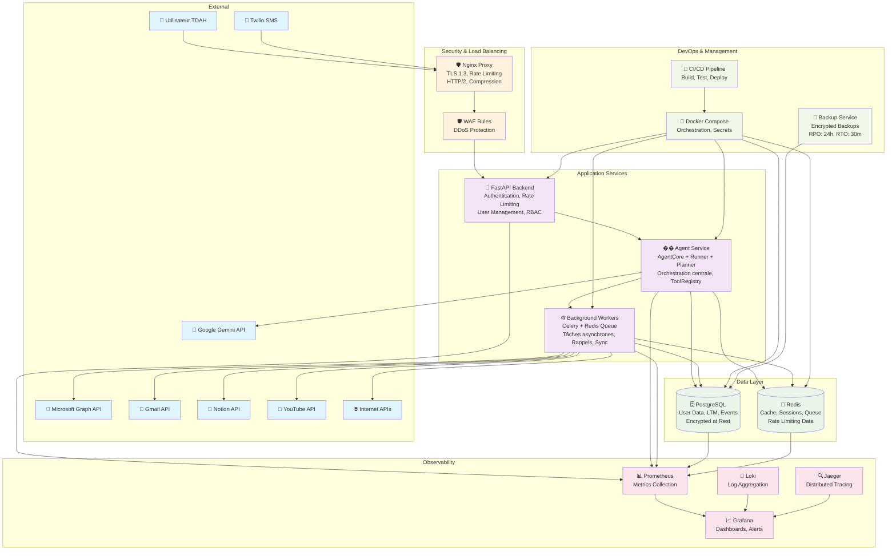
```mermaid
graph TB
    %% External Users and Services
    subgraph "External"
        USER[👤 Utilisateur TDAH]
        TWILIO[📱 Twilio SMS]
        GEMINI[🤖 Google Gemini API]
        GRAPH[📅 Microsoft Graph API]
        GMAIL[📧 Gmail API]
        NOTION[📝 Notion API]
        YOUTUBE[🎥 YouTube API]
        INTERNET[🌐 Internet APIs]
    end

    %% Load Balancer and Security Layer
    subgraph "Security & Load Balancing"
        NGINX[🛡️ Nginx Proxy<br/>TLS 1.3, Rate Limiting<br/>HTTP/2, Compression]
        WAF[🛡️ WAF Rules<br/>DDoS Protection]
    end

    %% Main Application Services
    subgraph "Application Services"
        API[🚀 FastAPI Backend<br/>Authentication, Rate Limiting<br/>User Management, RBAC]
        AGENT[�� Agent Service<br/>AgentCore + Runner + Planner<br/>Orchestration centrale, ToolRegistry]
        WORKERS[⚙️ Background Workers<br/>Celery + Redis Queue<br/>Tâches asynchrones, Rappels, Sync]
    end

    %% Data Layer
    subgraph "Data Layer"
        POSTGRES[(🗄️ PostgreSQL<br/>User Data, LTM, Events<br/>Encrypted at Rest)]
        REDIS[(🔴 Redis<br/>Cache, Sessions, Queue<br/>Rate Limiting Data)]
    end

    %% Monitoring and Observability
    subgraph "Observability"
        PROMETHEUS[📊 Prometheus<br/>Metrics Collection]
        GRAFANA[📈 Grafana<br/>Dashboards, Alerts]
        LOKI[📝 Loki<br/>Log Aggregation]
        JAEGER[🔍 Jaeger<br/>Distributed Tracing]
    end

    %% CI/CD and Management
    subgraph "DevOps & Management"
        DOCKER[🐳 Docker Compose<br/>Orchestration, Secrets]
        CI_CD[🔄 CI/CD Pipeline<br/>Build, Test, Deploy]
        BACKUP[💾 Backup Service<br/>Encrypted Backups<br/>RPO: 24h, RTO: 30m]
    end

    %% ===== FLUX PRINCIPAL : Utilisateur → API → AGENT =====
    USER --> NGINX
    TWILIO --> NGINX

    NGINX --> WAF
    WAF --> API

    %% ===== AGENT EST LE POINT CENTRAL D'ORCHESTRATION =====
    API --> AGENT

    %% ===== AGENT ORCHESTRE TOUS LES SERVICES ET OUTILS =====
    AGENT --> GEMINI
    AGENT --> POSTGRES
    AGENT --> REDIS

    %% ===== AGENT COORDONNE AVEC LES WORKERS POUR LES TÂCHES ASYNCHRONES =====
    AGENT --> WORKERS
    WORKERS --> POSTGRES
    WORKERS --> REDIS

    %% ===== WORKERS ONT ACCÈS LIMITÉ AUX OUTILS (seulement si requis) =====
    WORKERS --> GRAPH
    WORKERS --> GMAIL
    WORKERS --> NOTION
    WORKERS --> YOUTUBE
    WORKERS --> INTERNET

    %% ===== MONITORING DE TOUS LES SERVICES =====
    API --> PROMETHEUS
    AGENT --> PROMETHEUS
    WORKERS --> PROMETHEUS
    POSTGRES --> PROMETHEUS
    REDIS --> PROMETHEUS

    PROMETHEUS --> GRAFANA
    LOKI --> GRAFANA
    JAEGER --> GRAFANA

    %% ===== GESTION DOCKER ET BACKUP =====
    DOCKER --> API
    DOCKER --> AGENT
    DOCKER --> WORKERS
    DOCKER --> POSTGRES
    DOCKER --> REDIS

    CI_CD --> DOCKER
    BACKUP --> POSTGRES

    %% ===== STYLING =====
    classDef external fill:#e1f5fe
    classDef security fill:#fff3e0
    classDef app fill:#f3e5f5
    classDef data fill:#e8f5e8
    classDef monitoring fill:#fce4ec
    classDef devops fill:#f1f8e9

    class USER,TWILIO,GEMINI,GRAPH,GMAIL,NOTION,YOUTUBE,INTERNET external
    class NGINX,WAF security
    class API,AGENT,WORKERS app
    class POSTGRES,REDIS data
    class PROMETHEUS,GRAFANA,LOKI,JAEGER monitoring
    class DOCKER,CI_CD,BACKUP devops
```

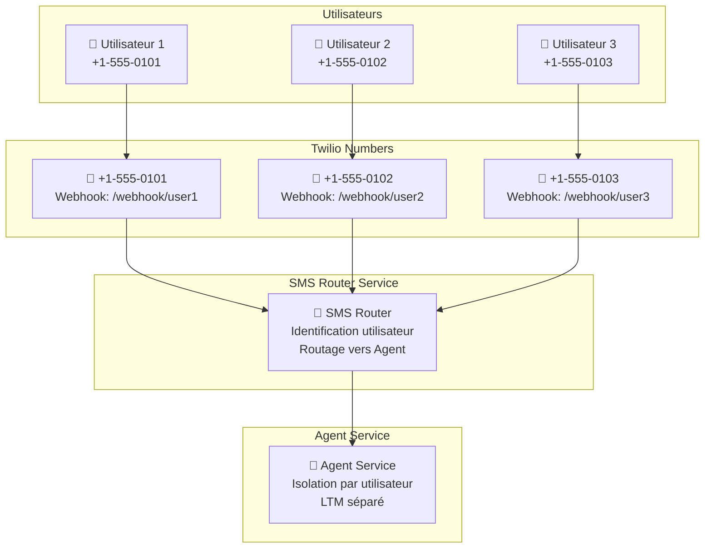
```mermaid
graph TB
    subgraph "Utilisateurs"
        USER1[👤 Utilisateur 1<br/>+1-555-0101]
        USER2[👤 Utilisateur 2<br/>+1-555-0102]
        USER3[👤 Utilisateur 3<br/>+1-555-0103]
    end

    subgraph "Twilio Numbers"
        TWILIO1[📱 +1-555-0101<br/>Webhook: /webhook/user1]
        TWILIO2[📱 +1-555-0102<br/>Webhook: /webhook/user2]
        TWILIO3[📱 +1-555-0103<br/>Webhook: /webhook/user3]
    end

    subgraph "SMS Router Service"
        ROUTER[🔄 SMS Router<br/>Identification utilisateur<br/>Routage vers Agent]
    end

    subgraph "Agent Service"
        AGENT[🧠 Agent Service<br/>Isolation par utilisateur<br/>LTM séparé]
    end

    USER1 --> TWILIO1
    USER2 --> TWILIO2
    USER3 --> TWILIO3

    TWILIO1 --> ROUTER
    TWILIO2 --> ROUTER
    TWILIO3 --> ROUTER

    ROUTER --> AGENT
```

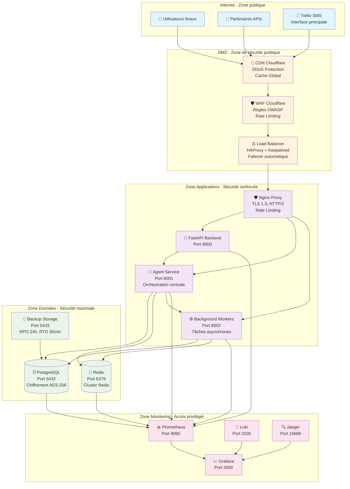
```mermaid
graph TB
    subgraph "Internet - Zone publique"
        USERS[👥 Utilisateurs finaux]
        PARTNERS[🤝 Partenaires APIs]
        TWILIO[📱 Twilio SMS<br/>Interface principale]
    end

    subgraph "DMZ - Zone de sécurité publique"
        CDN[📡 CDN Cloudflare<br/>DDoS Protection<br/>Cache Global]
        WAF[🛡️ WAF Cloudflare<br/>Règles OWASP<br/>Rate Limiting]
        LOAD_BALANCER[⚖️ Load Balancer<br/>HAProxy + Keepalived<br/>Failover automatique]
    end

    subgraph "Zone Applications - Sécurité renforcée"
        NGINX[🛡️ Nginx Proxy<br/>TLS 1.3, HTTP/2<br/>Rate Limiting]
        API[🚀 FastAPI Backend<br/>Port 8000]
        AGENT[🧠 Agent Service<br/>Port 8001<br/>Orchestration centrale]
        WORKERS[⚙️ Background Workers<br/>Port 8002<br/>Tâches asynchrones]
    end

    subgraph "Zone Données - Sécurité maximale"
        POSTGRES[(🗄️ PostgreSQL<br/>Port 5432<br/>Chiffrement AES-256)]
        REDIS[(🔴 Redis<br/>Port 6379<br/>Cluster Redis)]
        BACKUP[💾 Backup Storage<br/>Port 5433<br/>RPO 24h, RTO 30min]
    end

    subgraph "Zone Monitoring - Accès privilégié"
        PROMETHEUS[📊 Prometheus<br/>Port 9090]
        GRAFANA[📈 Grafana<br/>Port 3000]
        LOKI[📝 Loki<br/>Port 3100]
        JAEGER[🔍 Jaeger<br/>Port 16686]
    end

    %% Flux réseau principal avec sécurité
    USERS --> CDN
    PARTNERS --> CDN
    TWILIO --> CDN

    CDN --> WAF
    WAF --> LOAD_BALANCER
    LOAD_BALANCER --> NGINX

    %% Routage vers applications avec isolation
    NGINX --> API
    NGINX --> AGENT
    NGINX --> WORKERS

    %% Communication inter-services (zone applications)
    API --> AGENT
    AGENT --> POSTGRES
    AGENT --> REDIS
    AGENT --> WORKERS

    WORKERS --> POSTGRES
    WORKERS --> REDIS

    %% Monitoring de tous les services
    API --> PROMETHEUS
    AGENT --> PROMETHEUS
    WORKERS --> PROMETHEUS
    POSTGRES --> PROMETHEUS
    REDIS --> PROMETHEUS

    PROMETHEUS --> GRAFANA
    LOKI --> GRAFANA
    JAEGER --> GRAFANA

    %% Sauvegarde sécurisée
    BACKUP --> POSTGRES

    %% Styling par zones de sécurité
    classDef internet fill:#e1f5fe
    classDef dmz fill:#fff3e0
    classDef apps fill:#f3e5f5
    classDef data fill:#e8f5e8
    classDef monitoring fill:#fce4ec

    class USERS,PARTNERS,TWILIO internet
    class CDN,WAF,LOAD_BALANCER dmz
    class NGINX,API,AGENT,WORKERS apps
    class POSTGRES,REDIS,BACKUP data
    class PROMETHEUS,GRAFANA,LOKI,JAEGER monitoring
```

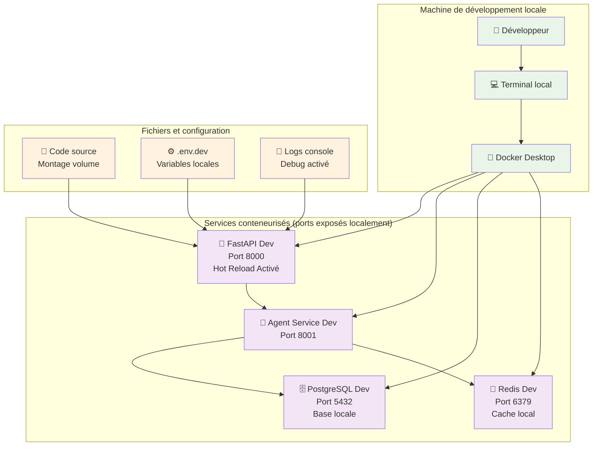
```mermaid
graph TB
    subgraph "Machine de développement locale"
        DEV_USER[👤 Développeur]
        DEV_TERMINAL[💻 Terminal local]
        DEV_DOCKER[🐳 Docker Desktop]
    end

    subgraph "Services conteneurisés (ports exposés localement)"
        DEV_API[🚀 FastAPI Dev<br/>Port 8000<br/>Hot Reload Activé]
        DEV_AGENT[🧠 Agent Service Dev<br/>Port 8001]
        DEV_POSTGRES[🗄️ PostgreSQL Dev<br/>Port 5432<br/>Base locale]
        DEV_REDIS[🔴 Redis Dev<br/>Port 6379<br/>Cache local]
    end

    subgraph "Fichiers et configuration"
        DEV_SRC[📁 Code source<br/>Montage volume]
        DEV_ENV[⚙️ .env.dev<br/>Variables locales]
        DEV_LOGS[📝 Logs console<br/>Debug activé]
    end

    %% Flux de développement
    DEV_USER --> DEV_TERMINAL
    DEV_TERMINAL --> DEV_DOCKER
    DEV_DOCKER --> DEV_API
    DEV_DOCKER --> DEV_AGENT
    DEV_DOCKER --> DEV_POSTGRES
    DEV_DOCKER --> DEV_REDIS

    DEV_API --> DEV_AGENT
    DEV_AGENT --> DEV_POSTGRES
    DEV_AGENT --> DEV_REDIS

    DEV_SRC --> DEV_API
    DEV_ENV --> DEV_API
    DEV_LOGS --> DEV_API

    %% Styling
    classDef dev fill:#e8f5e8
    classDef services fill:#f3e5f5
    classDef files fill:#fff3e0

    class DEV_USER,DEV_TERMINAL,DEV_DOCKER dev
    class DEV_API,DEV_AGENT,DEV_POSTGRES,DEV_REDIS services
    class DEV_SRC,DEV_ENV,DEV_LOGS files
```

#### **2.3 Environnement Staging (Stage) - Serveur dédié**

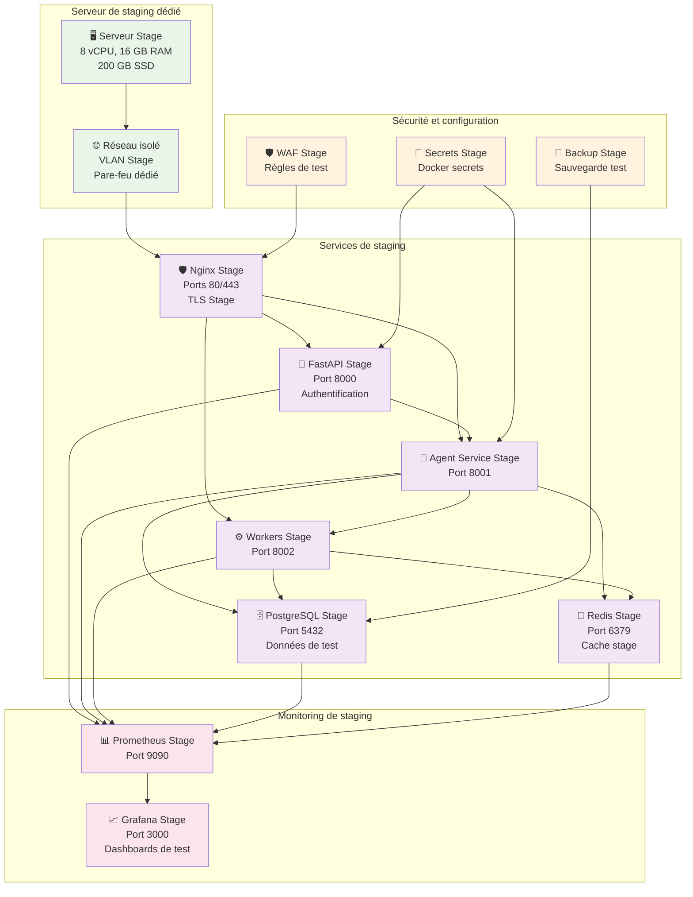
```mermaid
graph TB
    subgraph "Serveur de staging dédié"
        STAGE_SERVER[🖥️ Serveur Stage<br/>8 vCPU, 16 GB RAM<br/>200 GB SSD]
        STAGE_NETWORK[🌐 Réseau isolé<br/>VLAN Stage<br/>Pare-feu dédié]
    end

    subgraph "Services de staging"
        STAGE_NGINX[🛡️ Nginx Stage<br/>Ports 80/443<br/>TLS Stage]
        STAGE_API[🚀 FastAPI Stage<br/>Port 8000<br/>Authentification]
        STAGE_AGENT[🧠 Agent Service Stage<br/>Port 8001]
        STAGE_WORKERS[⚙️ Workers Stage<br/>Port 8002]
        STAGE_POSTGRES[🗄️ PostgreSQL Stage<br/>Port 5432<br/>Données de test]
        STAGE_REDIS[🔴 Redis Stage<br/>Port 6379<br/>Cache stage]
    end

    subgraph "Monitoring de staging"
        STAGE_PROMETHEUS[📊 Prometheus Stage<br/>Port 9090]
        STAGE_GRAFANA[📈 Grafana Stage<br/>Port 3000<br/>Dashboards de test]
    end

    subgraph "Sécurité et configuration"
        STAGE_WAF[🛡️ WAF Stage<br/>Règles de test]
        STAGE_SECRETS[🔐 Secrets Stage<br/>Docker secrets]
        STAGE_BACKUP[💾 Backup Stage<br/>Sauvegarde test]
    end

    %% Flux de staging
    STAGE_SERVER --> STAGE_NETWORK
    STAGE_NETWORK --> STAGE_NGINX
    STAGE_NGINX --> STAGE_API
    STAGE_NGINX --> STAGE_AGENT
    STAGE_NGINX --> STAGE_WORKERS

    STAGE_API --> STAGE_AGENT
    STAGE_AGENT --> STAGE_POSTGRES
    STAGE_AGENT --> STAGE_REDIS
    STAGE_AGENT --> STAGE_WORKERS

    STAGE_WORKERS --> STAGE_POSTGRES
    STAGE_WORKERS --> STAGE_REDIS

    %% Monitoring
    STAGE_API --> STAGE_PROMETHEUS
    STAGE_AGENT --> STAGE_PROMETHEUS
    STAGE_WORKERS --> STAGE_PROMETHEUS
    STAGE_POSTGRES --> STAGE_PROMETHEUS
    STAGE_REDIS --> STAGE_PROMETHEUS

    STAGE_PROMETHEUS --> STAGE_GRAFANA

    %% Sécurité
    STAGE_WAF --> STAGE_NGINX
    STAGE_SECRETS --> STAGE_API
    STAGE_SECRETS --> STAGE_AGENT
    STAGE_BACKUP --> STAGE_POSTGRES

    %% Styling
    classDef server fill:#e8f5e8
    classDef services fill:#f3e5f5
    classDef monitoring fill:#fce4ec
    classDef security fill:#fff3e0

    class STAGE_SERVER,STAGE_NETWORK server
    class STAGE_NGINX,STAGE_API,STAGE_AGENT,STAGE_WORKERS,STAGE_POSTGRES,STAGE_REDIS services
    class STAGE_PROMETHEUS,STAGE_GRAFANA monitoring
    class STAGE_WAF,STAGE_SECRETS,STAGE_BACKUP security
```

#### **2.4 Environnement Production (Prod) - Haute disponibilité**

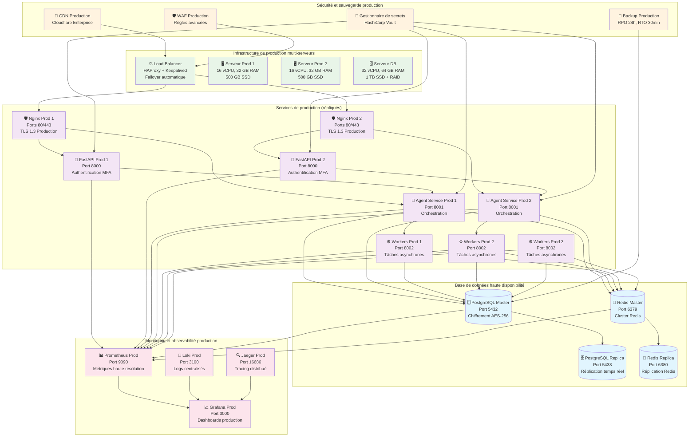
```mermaid
graph TB
    subgraph "Infrastructure de production multi-serveurs"
        PROD_LB[⚖️ Load Balancer<br/>HAProxy + Keepalived<br/>Failover automatique]
        PROD_SERVER1[🖥️ Serveur Prod 1<br/>16 vCPU, 32 GB RAM<br/>500 GB SSD]
        PROD_SERVER2[🖥️ Serveur Prod 2<br/>16 vCPU, 32 GB RAM<br/>500 GB SSD]
        PROD_DB_SERVER[🗄️ Serveur DB<br/>32 vCPU, 64 GB RAM<br/>1 TB SSD + RAID]
    end

    subgraph "Services de production (répliqués)"
        PROD_NGINX1[🛡️ Nginx Prod 1<br/>Ports 80/443<br/>TLS 1.3 Production]
        PROD_NGINX2[🛡️ Nginx Prod 2<br/>Ports 80/443<br/>TLS 1.3 Production]

        PROD_API1[🚀 FastAPI Prod 1<br/>Port 8000<br/>Authentification MFA]
        PROD_API2[🚀 FastAPI Prod 2<br/>Port 8000<br/>Authentification MFA]

        PROD_AGENT1[🧠 Agent Service Prod 1<br/>Port 8001<br/>Orchestration]
        PROD_AGENT2[🧠 Agent Service Prod 2<br/>Port 8001<br/>Orchestration]

        PROD_WORKERS1[⚙️ Workers Prod 1<br/>Port 8002<br/>Tâches asynchrones]
        PROD_WORKERS2[⚙️ Workers Prod 2<br/>Port 8002<br/>Tâches asynchrones]
        PROD_WORKERS3[⚙️ Workers Prod 3<br/>Port 8002<br/>Tâches asynchrones]
    end

    subgraph "Base de données haute disponibilité"
        PROD_POSTGRES_MASTER[(🗄️ PostgreSQL Master<br/>Port 5432<br/>Chiffrement AES-256)]
        PROD_POSTGRES_REPLICA[(🗄️ PostgreSQL Replica<br/>Port 5433<br/>Réplication temps réel)]
        PROD_REDIS_MASTER[(🔴 Redis Master<br/>Port 6379<br/>Cluster Redis)]
        PROD_REDIS_REPLICA[(🔴 Redis Replica<br/>Port 6380<br/>Réplication Redis)]
    end

    subgraph "Monitoring et observabilité production"
        PROD_PROMETHEUS[📊 Prometheus Prod<br/>Port 9090<br/>Métriques haute résolution]
        PROD_GRAFANA[📈 Grafana Prod<br/>Port 3000<br/>Dashboards production]
        PROD_LOKI[📝 Loki Prod<br/>Port 3100<br/>Logs centralisés]
        PROD_JAEGER[🔍 Jaeger Prod<br/>Port 16686<br/>Tracing distribué]
    end

    subgraph "Sécurité et sauvegarde production"
        PROD_WAF[🛡️ WAF Production<br/>Règles avancées]
        PROD_SECRETS[🔐 Gestionnaire de secrets<br/>HashiCorp Vault]
        PROD_BACKUP[💾 Backup Production<br/>RPO 24h, RTO 30min]
        PROD_CDN[📡 CDN Production<br/>Cloudflare Enterprise]
    end

    %% Flux de production avec haute disponibilité
    PROD_CDN --> PROD_LB
    PROD_LB --> PROD_NGINX1
    PROD_LB --> PROD_NGINX2

    PROD_NGINX1 --> PROD_API1
    PROD_NGINX1 --> PROD_AGENT1
    PROD_NGINX2 --> PROD_API2
    PROD_NGINX2 --> PROD_AGENT2

    PROD_API1 --> PROD_AGENT1
    PROD_API2 --> PROD_AGENT2

    PROD_AGENT1 --> PROD_POSTGRES_MASTER
    PROD_AGENT2 --> PROD_POSTGRES_MASTER
    PROD_AGENT1 --> PROD_REDIS_MASTER
    PROD_AGENT2 --> PROD_REDIS_MASTER

    PROD_AGENT1 --> PROD_WORKERS1
    PROD_AGENT2 --> PROD_WORKERS2

    PROD_WORKERS1 --> PROD_POSTGRES_MASTER
    PROD_WORKERS2 --> PROD_POSTGRES_MASTER
    PROD_WORKERS3 --> PROD_POSTGRES_MASTER

    PROD_WORKERS1 --> PROD_REDIS_MASTER
    PROD_WORKERS2 --> PROD_REDIS_MASTER
    PROD_WORKERS3 --> PROD_REDIS_MASTER

    %% Réplication base de données
    PROD_POSTGRES_MASTER --> PROD_POSTGRES_REPLICA
    PROD_REDIS_MASTER --> PROD_REDIS_REPLICA

    %% Monitoring production
    PROD_API1 --> PROD_PROMETHEUS
    PROD_API2 --> PROD_PROMETHEUS
    PROD_AGENT1 --> PROD_PROMETHEUS
    PROD_AGENT2 --> PROD_PROMETHEUS
    PROD_WORKERS1 --> PROD_PROMETHEUS
    PROD_WORKERS2 --> PROD_PROMETHEUS
    PROD_WORKERS3 --> PROD_PROMETHEUS
    PROD_POSTGRES_MASTER --> PROD_PROMETHEUS
    PROD_REDIS_MASTER --> PROD_PROMETHEUS

    PROD_PROMETHEUS --> PROD_GRAFANA
    PROD_LOKI --> PROD_GRAFANA
    PROD_JAEGER --> PROD_GRAFANA

    %% Sécurité et sauvegarde
    PROD_WAF --> PROD_LB
    PROD_SECRETS --> PROD_API1
    PROD_SECRETS --> PROD_API2
    PROD_SECRETS --> PROD_AGENT1
    PROD_SECRETS --> PROD_AGENT2
    PROD_BACKUP --> PROD_POSTGRES_MASTER

    %% Styling
    classDef infrastructure fill:#e8f5e8
    classDef services fill:#f3e5f5
    classDef database fill:#e1f5fe
    classDef monitoring fill:#fce4ec
    classDef security fill:#fff3e0

    class PROD_LB,PROD_SERVER1,PROD_SERVER2,PROD_DB_SERVER infrastructure
    class PROD_NGINX1,PROD_NGINX2,PROD_API1,PROD_API2,PROD_AGENT1,PROD_AGENT2,PROD_WORKERS1,PROD_WORKERS2,PROD_WORKERS3 services
    class PROD_POSTGRES_MASTER,PROD_POSTGRES_REPLICA,PROD_REDIS_MASTER,PROD_REDIS_REPLICA database
    class PROD_PROMETHEUS,PROD_GRAFANA,PROD_LOKI,PROD_JAEGER monitoring
    class PROD_WAF,PROD_SECRETS,PROD_BACKUP,PROD_CDN security
```

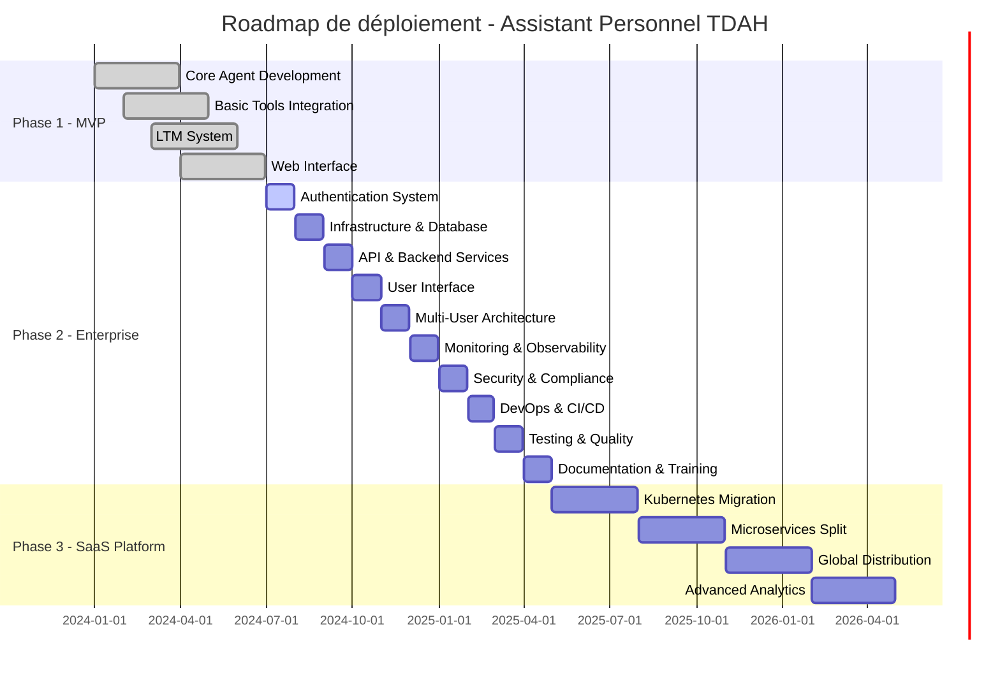
```mermaid
gantt
    title Roadmap de déploiement - Assistant Personnel TDAH
    dateFormat  YYYY-MM-DD
    section Phase 1 - MVP
    Core Agent Development     :done, mvp_core, 2024-01-01, 2024-03-31
    Basic Tools Integration    :done, mvp_tools, 2024-02-01, 2024-04-30
    LTM System                :done, mvp_ltm, 2024-03-01, 2024-05-31
    Web Interface             :done, mvp_ui, 2024-04-01, 2024-06-30
    section Phase 2 - Enterprise
    Authentication System      :active, ent_auth, 2024-07-01, 2024-07-31
    Infrastructure & Database  :ent_infra, 2024-08-01, 2024-08-31
    API & Backend Services     :ent_api, 2024-09-01, 2024-09-30
    User Interface            :ent_ui, 2024-10-01, 2024-10-31
    Multi-User Architecture   :ent_multi, 2024-11-01, 2024-11-30
    Monitoring & Observability :ent_monitor, 2024-12-01, 2024-12-31
    Security & Compliance     :ent_security, 2025-01-01, 2025-01-31
    DevOps & CI/CD            :ent_devops, 2025-02-01, 2025-02-28
    Testing & Quality         :ent_testing, 2025-03-01, 2025-03-31
    Documentation & Training  :ent_docs, 2025-04-01, 2025-04-30
    section Phase 3 - SaaS Platform
    Kubernetes Migration      :saas_k8s, 2025-05-01, 2025-07-31
    Microservices Split       :saas_micro, 2025-08-01, 2025-10-31
    Global Distribution       :saas_global, 2025-11-01, 2026-01-31
    Advanced Analytics        :saas_analytics, 2026-02-01, 2026-04-30
```

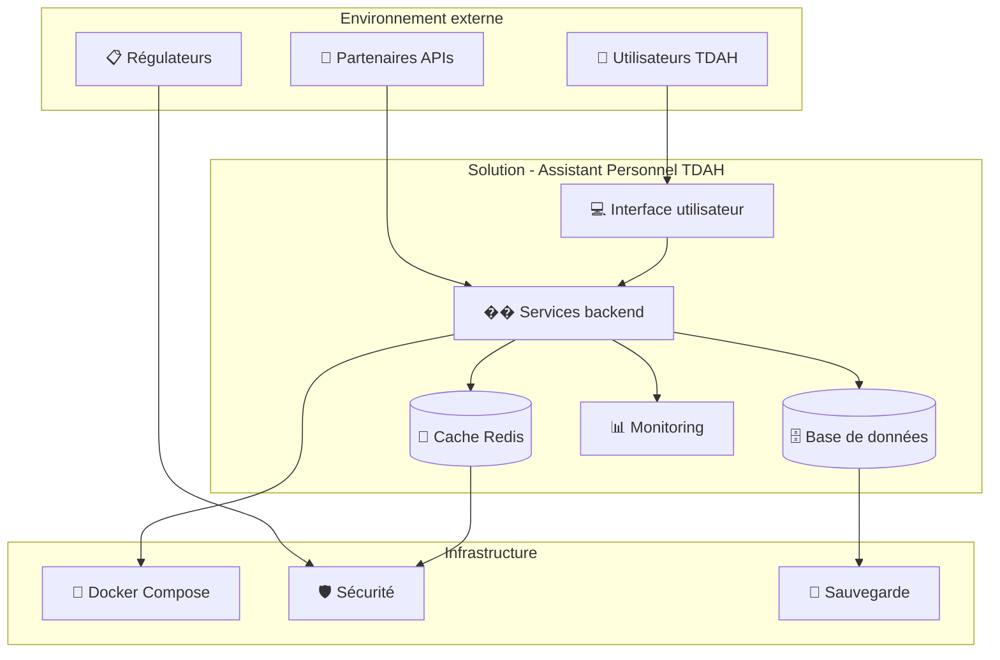
```mermaid
graph TB
    subgraph "Environnement externe"
        USERS[👥 Utilisateurs TDAH]
        PARTNERS[🤝 Partenaires APIs]
        REGULATORS[📋 Régulateurs]
    end

    subgraph "Solution - Assistant Personnel TDAH"
        FRONTEND[💻 Interface utilisateur]
        BACKEND[�� Services backend]
        DATABASE[(🗄️ Base de données)]
        CACHE[(🔴 Cache Redis)]
        MONITORING[📊 Monitoring]
    end

    subgraph "Infrastructure"
        DOCKER[🐳 Docker Compose]
        SECURITY[🛡️ Sécurité]
        BACKUP[💾 Sauvegarde]
    end

    USERS --> FRONTEND
    PARTNERS --> BACKEND
    REGULATORS --> SECURITY

    FRONTEND --> BACKEND
    BACKEND --> DATABASE
    BACKEND --> CACHE
    BACKEND --> MONITORING

    BACKEND --> DOCKER
    DATABASE --> BACKUP
    CACHE --> SECURITY
```

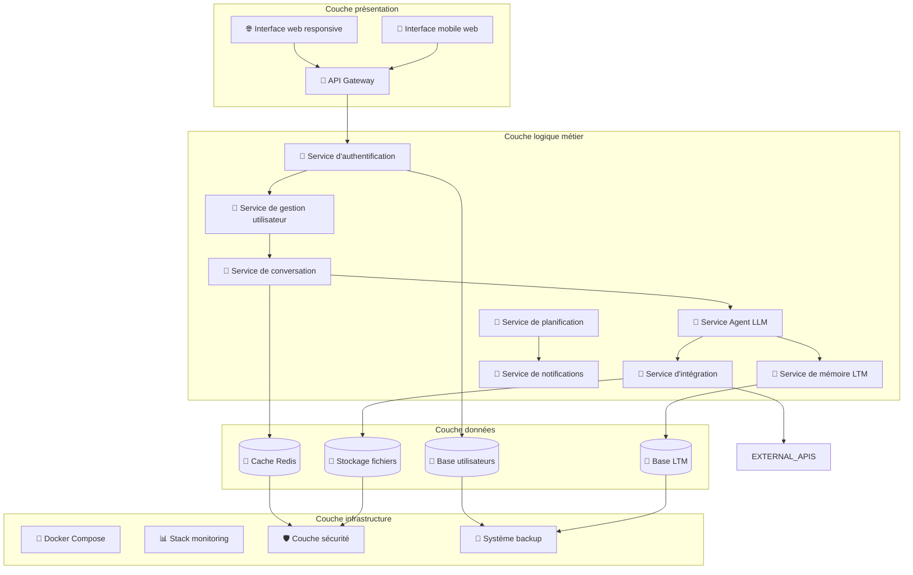
```mermaid
graph TB
    subgraph "Couche présentation"
        WEB_UI[🌐 Interface web responsive]
        MOBILE_UI[📱 Interface mobile web]
        API_GATEWAY[🚪 API Gateway]
    end

    subgraph "Couche logique métier"
        AUTH_SERVICE[🔐 Service d'authentification]
        USER_SERVICE[👤 Service de gestion utilisateur]
        CONVERSATION_SERVICE[💬 Service de conversation]
        AGENT_SERVICE[🧠 Service Agent LLM]
        MEMORY_SERVICE[🧠 Service de mémoire LTM]
        PLANNING_SERVICE[📅 Service de planification]
        INTEGRATION_SERVICE[🔗 Service d'intégration]
        NOTIFICATION_SERVICE[🔔 Service de notifications]
    end

    subgraph "Couche données"
        USER_DB[(👤 Base utilisateurs)]
        LTM_DB[(🧠 Base LTM)]
        CACHE_DB[(🔴 Cache Redis)]
        FILE_STORAGE[(📁 Stockage fichiers)]
    end

    subgraph "Couche infrastructure"
        DOCKER_ORCHESTRATION[🐳 Docker Compose]
        MONITORING_STACK[📊 Stack monitoring]
        SECURITY_LAYER[🛡️ Couche sécurité]
        BACKUP_SYSTEM[💾 Système backup]
    end

    WEB_UI --> API_GATEWAY
    MOBILE_UI --> API_GATEWAY
    API_GATEWAY --> AUTH_SERVICE

    AUTH_SERVICE --> USER_SERVICE
    USER_SERVICE --> CONVERSATION_SERVICE
    CONVERSATION_SERVICE --> AGENT_SERVICE
    AGENT_SERVICE --> MEMORY_SERVICE
    AGENT_SERVICE --> INTEGRATION_SERVICE

    PLANNING_SERVICE --> NOTIFICATION_SERVICE
    INTEGRATION_SERVICE --> EXTERNAL_APIS

    AUTH_SERVICE --> USER_DB
    MEMORY_SERVICE --> LTM_DB
    CONVERSATION_SERVICE --> CACHE_DB
    INTEGRATION_SERVICE --> FILE_STORAGE

    USER_DB --> BACKUP_SYSTEM
    LTM_DB --> BACKUP_SYSTEM
    CACHE_DB --> SECURITY_LAYER
    FILE_STORAGE --> SECURITY_LAYER
```

**Vue - Flux de données**

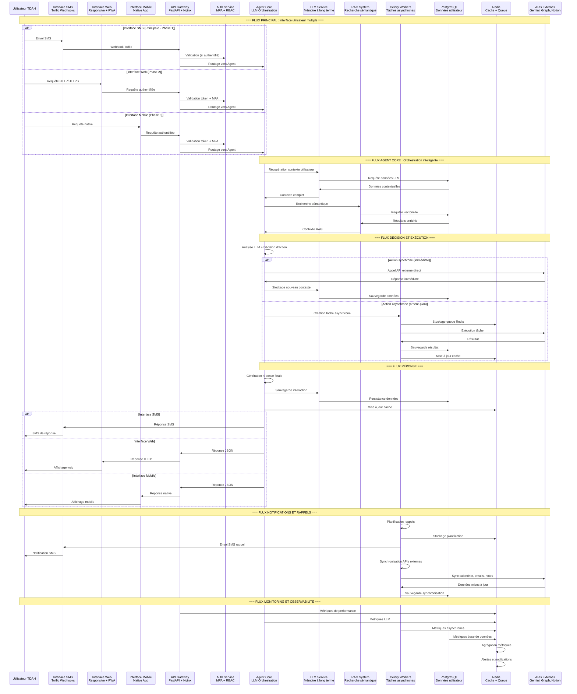
```mermaid
sequenceDiagram
    participant U as Utilisateur TDAH
    participant SMS as Interface SMS<br/>Twilio Webhooks
    participant WEB as Interface Web<br/>Responsive + PWA
    participant MOBILE as Interface Mobile<br/>Native App
    participant API as API Gateway<br/>FastAPI + Nginx
    participant AUTH as Auth Service<br/>MFA + RBAC
    participant AGENT as Agent Core<br/>LLM Orchestration
    participant LTM as LTM Service<br/>Mémoire à long terme
    participant RAG as RAG System<br/>Recherche sémantique
    participant WORKERS as Celery Workers<br/>Tâches asynchrones
    participant DB as PostgreSQL<br/>Données utilisateur
    participant CACHE as Redis<br/>Cache + Queue
    participant EXT as APIs Externes<br/>Gemini, Graph, Notion

    Note over U,EXT: === FLUX PRINCIPAL : Interface utilisateur multiple ===

    alt Interface SMS (Principale - Phase 1)
        U->>SMS: Envoi SMS
        SMS->>API: Webhook Twilio
        API->>AUTH: Validation (si authentifié)
    API->>AGENT: Routage vers Agent
    else Interface Web (Phase 2)
        U->>WEB: Requête HTTP/HTTPS
        WEB->>API: Requête authentifiée
        API->>AUTH: Validation token + MFA
        API->>AGENT: Routage vers Agent
    else Interface Mobile (Phase 3)
        U->>MOBILE: Requête native
        MOBILE->>API: Requête authentifiée
        API->>AUTH: Validation token + MFA
        API->>AGENT: Routage vers Agent
    end

    Note over AGENT,EXT: === FLUX AGENT CORE : Orchestration intelligente ===

    AGENT->>LTM: Récupération contexte utilisateur
    LTM->>DB: Requête données LTM
    DB->>LTM: Données contextuelles
    LTM->>AGENT: Contexte complet

    AGENT->>RAG: Recherche sémantique
    RAG->>DB: Requête vectorielle
    DB->>RAG: Résultats enrichis
    RAG->>AGENT: Contexte RAG

    Note over AGENT,EXT: === FLUX DÉCISION ET EXÉCUTION ===

    AGENT->>AGENT: Analyse LLM + Décision d'action

    alt Action synchrone (immédiate)
        AGENT->>EXT: Appel API externe direct
        EXT->>AGENT: Réponse immédiate
    AGENT->>LTM: Stockage nouveau contexte
    LTM->>DB: Sauvegarde données
    else Action asynchrone (arrière-plan)
        AGENT->>WORKERS: Création tâche asynchrone
        WORKERS->>CACHE: Stockage queue Redis
        WORKERS->>EXT: Exécution tâche
        EXT->>WORKERS: Résultat
        WORKERS->>DB: Sauvegarde résultat
        WORKERS->>CACHE: Mise à jour cache
    end

    Note over AGENT,EXT: === FLUX RÉPONSE ===

    AGENT->>AGENT: Génération réponse finale
    AGENT->>LTM: Sauvegarde interaction
    LTM->>DB: Persistance données
    AGENT->>CACHE: Mise à jour cache

    alt Interface SMS
        AGENT->>SMS: Réponse SMS
        SMS->>U: SMS de réponse
    else Interface Web
        AGENT->>API: Réponse JSON
        API->>WEB: Réponse HTTP
        WEB->>U: Affichage web
    else Interface Mobile
        AGENT->>API: Réponse JSON
        API->>MOBILE: Réponse native
        MOBILE->>U: Affichage mobile
    end

    Note over U,EXT: === FLUX NOTIFICATIONS ET RAPPELS ===

    WORKERS->>WORKERS: Planification rappels
    WORKERS->>CACHE: Stockage planification
    WORKERS->>SMS: Envoi SMS rappel
    SMS->>U: Notification SMS

    WORKERS->>WORKERS: Synchronisation APIs externes
    WORKERS->>EXT: Sync calendrier, emails, notes
    EXT->>WORKERS: Données mises à jour
    WORKERS->>DB: Sauvegarde synchronisation

    Note over U,EXT: === FLUX MONITORING ET OBSERVABILITÉ ===

    API->>CACHE: Métriques de performance
    AGENT->>CACHE: Métriques LLM
    WORKERS->>CACHE: Métriques asynchrones
    DB->>CACHE: Métriques base de données

    CACHE->>CACHE: Agrégation métriques
    CACHE->>CACHE: Alertes et notifications
```

```mermaid
erDiagram
    USERS {
        int id PK
        text email UK
        text full_name
        timestamp created_at
    }

    LTM_MEMORIES {
        int id PK
        int user_id FK
        text content
        jsonb tags
        varchar memory_type
        varchar category
        int importance_score
        float confidence_score
        float dynamic_importance
        text context
        jsonb context_data
        varchar source_type
        varchar source_id
        varchar created_by
        timestamp created_at
        timestamp last_accessed
        timestamp last_modified
        int access_count
        text last_access_context
        jsonb related_memory_ids
        int parent_memory_id
        jsonb memory_metadata
        boolean is_archived
        text archive_reason
    }

    EVENTS {
        int id PK
        int user_id FK
        text title
        text description
        timestamp start_time
        timestamp end_time
        text location
        text external_id
        varchar source
        timestamp created_at
    }

    USER_SETTINGS {
        int id PK
        int user_id FK
        text setting_key
        text setting_value
        jsonb setting_metadata
        timestamp created_at
        timestamp updated_at
    }

    USER_GOALS {
        int id PK
        int user_id FK
        text title
        text description
        varchar category
        varchar status
        varchar priority
        int importance_score
        date start_date
        date target_date
        date completed_date
        int progress_percentage
        text current_milestone
        int parent_goal_id FK
        jsonb related_memory_ids
        jsonb related_task_ids
        jsonb goal_metadata
        timestamp created_at
        timestamp updated_at
        timestamp last_reviewed
    }

    TASKS {
        int id PK
        int user_id FK
        text title
        text description
        varchar status
        varchar priority
        timestamp due_date
        timestamp created_at
        timestamp completed_at
        int goal_id FK
    }

    AI_TASKS {
        int id PK
        int user_id FK
        text task_type
        text task_description
        jsonb task_parameters
        varchar status
        jsonb result_data
        timestamp created_at
        timestamp completed_at
    }

    TASK_RESULTS {
        int id PK
        int task_id FK
        int user_id FK
        text result_type
        jsonb result_data
        timestamp created_at
    }

    GROCERY_ITEMS {
        int id PK
        int user_id FK
        text item_name
        int quantity
        varchar unit
        varchar category
        varchar priority
        decimal estimated_cost
        text store_preference
        text notes
        varchar status
        date added_date
        date target_date
        date purchased_date
        timestamp created_at
        timestamp updated_at
    }

    EXPENSES {
        int id PK
        int user_id FK
        decimal amount
        varchar category
        text description
        date expense_date
        varchar payment_method
        text location
        text receipt_image_url
        jsonb tags
        boolean recurring
        varchar budget_category
        timestamp created_at
        timestamp updated_at
    }

    EXPENSE_CATEGORIES {
        int id PK
        int user_id FK
        text name
        text description
        decimal budget_limit
        varchar color_code
        varchar icon
        boolean is_active
        timestamp created_at
    }

    NOTES {
        int id PK
        int user_id FK
        text title
        text content
        text summary
        jsonb tags
        varchar category
        varchar importance
        varchar status
        text template_id
        int parent_note_id FK
        text external_id
        varchar external_source
        timestamp created_at
        timestamp updated_at
        timestamp last_accessed
    }

    LOCATIONS {
        int id PK
        int user_id FK
        text name
        text address
        text coordinates
        varchar location_type
        varchar category
        varchar importance
        varchar visit_frequency
        timestamp last_visited
        timestamp next_visit
        text notes
        jsonb tags
        timestamp created_at
        timestamp updated_at
    }

    RECIPES {
        int id PK
        int user_id FK
        text title
        text description
        varchar category
        varchar cuisine_type
        varchar difficulty_level
        int prep_time
        int cook_time
        int total_time
        int servings
        jsonb ingredients
        text instructions
        text tips
        jsonb nutrition_info
        jsonb tags
        text image_url
        text source
        float rating
        int times_cooked
        boolean is_favorite
        boolean is_public
        timestamp created_at
        timestamp updated_at
    }

    RECIPE_INGREDIENTS {
        int id PK
        int recipe_id FK
        text ingredient_name
        decimal quantity
        varchar unit
        text notes
        boolean is_optional
        int order_index
    }

    RECIPE_INSTRUCTIONS {
        int id PK
        int recipe_id FK
        int step_number
        text instruction_text
        int estimated_time
        text tips
        text image_url
    }

    AGENT_LOGS {
        int id PK
        int user_id FK
        text log_level
        text log_message
        jsonb log_context
        timestamp created_at
    }

    USERS ||--o{ LTM_MEMORIES : "has"
    USERS ||--o{ EVENTS : "creates"
    USERS ||--o{ USER_SETTINGS : "configures"
    USERS ||--o{ USER_GOALS : "sets"
    USERS ||--o{ TASKS : "creates"
    USERS ||--o{ AI_TASKS : "triggers"
    USERS ||--o{ TASK_RESULTS : "generates"
    USERS ||--o{ GROCERY_ITEMS : "manages"
    USERS ||--o{ EXPENSES : "tracks"
    USERS ||--o{ EXPENSE_CATEGORIES : "defines"
    USERS ||--o{ NOTES : "creates"
    USERS ||--o{ LOCATIONS : "tracks"
    USERS ||--o{ RECIPES : "manages"
    USERS ||--o{ AGENT_LOGS : "generates"

    USER_GOALS ||--o{ USER_GOALS : "parent_child"
    USER_GOALS ||--o{ TASKS : "supports"

    TASKS ||--o{ TASK_RESULTS : "produces"
    AI_TASKS ||--o{ TASK_RESULTS : "produces"

    RECIPES ||--o{ RECIPE_INGREDIENTS : "contains"
    RECIPES ||--o{ RECIPE_INSTRUCTIONS : "defines"

    NOTES ||--o{ NOTES : "parent_child"

    EXPENSE_CATEGORIES ||--o{ EXPENSES : "categorizes"
```

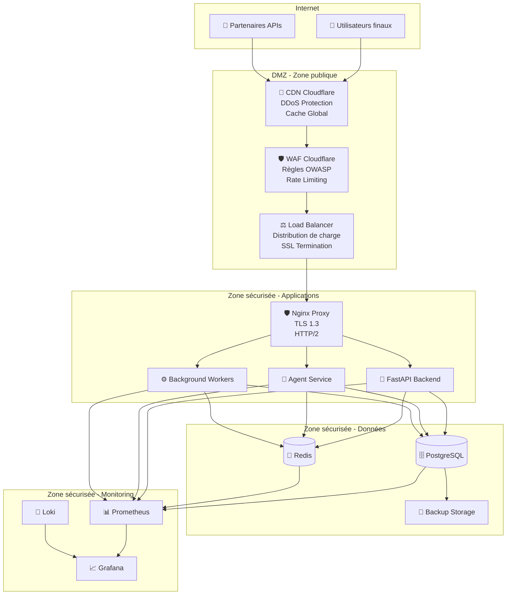
```mermaid
graph TB
    subgraph "Internet"
        USERS[👥 Utilisateurs finaux]
        PARTNERS[🤝 Partenaires APIs]
    end

    subgraph "DMZ - Zone publique"
        CDN[📡 CDN Cloudflare<br/>DDoS Protection<br/>Cache Global]
        WAF[🛡️ WAF Cloudflare<br/>Règles OWASP<br/>Rate Limiting]
        LOAD_BALANCER[⚖️ Load Balancer<br/>Distribution de charge<br/>SSL Termination]
    end

    subgraph "Zone sécurisée - Applications"
        NGINX[🛡️ Nginx Proxy<br/>TLS 1.3<br/>HTTP/2]
        API[🚀 FastAPI Backend]
        AGENT[🧠 Agent Service]
        WORKERS[⚙️ Background Workers]
    end

    subgraph "Zone sécurisée - Données"
        POSTGRES[(🗄️ PostgreSQL)]
        REDIS[(🔴 Redis)]
        BACKUP[💾 Backup Storage]
    end

    subgraph "Zone sécurisée - Monitoring"
        PROMETHEUS[📊 Prometheus]
        GRAFANA[📈 Grafana]
        LOKI[📝 Loki]
    end

    USERS --> CDN
    PARTNERS --> CDN
    CDN --> WAF
    WAF --> LOAD_BALANCER
    LOAD_BALANCER --> NGINX
    NGINX --> API
    NGINX --> AGENT
    NGINX --> WORKERS

    API --> POSTGRES
    API --> REDIS
    AGENT --> POSTGRES
    AGENT --> REDIS
    WORKERS --> POSTGRES
    WORKERS --> REDIS

    API --> PROMETHEUS
    AGENT --> PROMETHEUS
    WORKERS --> PROMETHEUS
    POSTGRES --> PROMETHEUS
    REDIS --> PROMETHEUS

    PROMETHEUS --> GRAFANA
    LOKI --> GRAFANA

    POSTGRES --> BACKUP
```

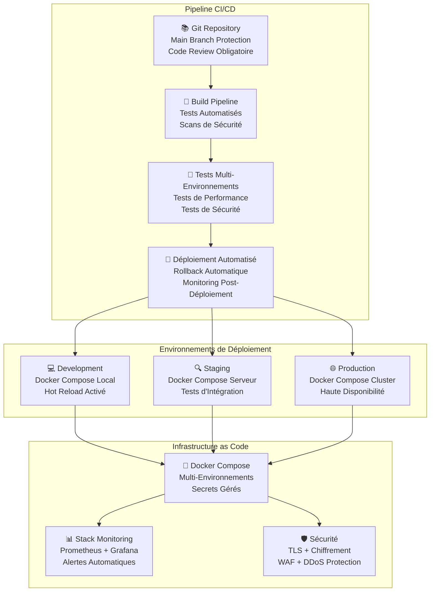
```mermaid
graph TB
    subgraph "Pipeline CI/CD"
        GIT[📚 Git Repository<br/>Main Branch Protection<br/>Code Review Obligatoire]
        BUILD[🔨 Build Pipeline<br/>Tests Automatisés<br/>Scans de Sécurité]
        TEST[🧪 Tests Multi-Environnements<br/>Tests de Performance<br/>Tests de Sécurité]
        DEPLOY[🚀 Déploiement Automatisé<br/>Rollback Automatique<br/>Monitoring Post-Déploiement]
    end

    subgraph "Environnements de Déploiement"
        DEV[💻 Development<br/>Docker Compose Local<br/>Hot Reload Activé]
        STAGE[🔍 Staging<br/>Docker Compose Serveur<br/>Tests d'Intégration]
        PROD[🌐 Production<br/>Docker Compose Cluster<br/>Haute Disponibilité]
    end

    subgraph "Infrastructure as Code"
        DOCKER[🐳 Docker Compose<br/>Multi-Environnements<br/>Secrets Gérés]
        MONITORING[📊 Stack Monitoring<br/>Prometheus + Grafana<br/>Alertes Automatiques]
        SECURITY[🛡️ Sécurité<br/>TLS + Chiffrement<br/>WAF + DDoS Protection]
    end

    GIT --> BUILD
    BUILD --> TEST
    TEST --> DEPLOY

    DEPLOY --> DEV
    DEPLOY --> STAGE
    DEPLOY --> PROD

    DEV --> DOCKER
    STAGE --> DOCKER
    PROD --> DOCKER

    DOCKER --> MONITORING
    DOCKER --> SECURITY
```
