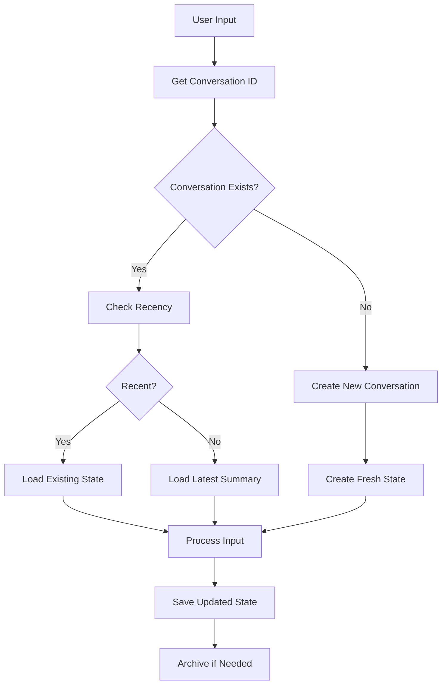
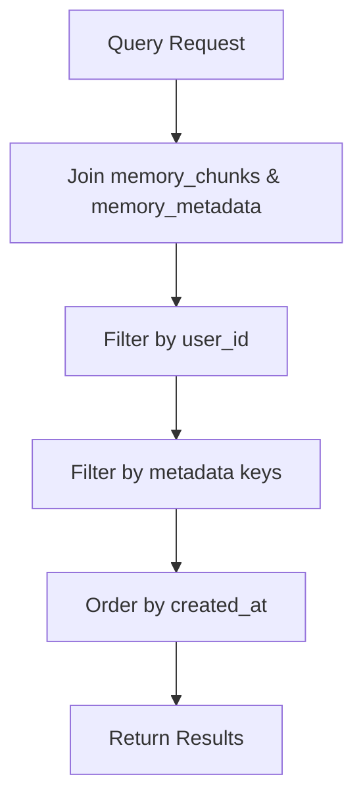

# Memory Storage System Documentation

## Overview

The Memory Storage System is a core component of the personal assistant that manages conversation state, long-term memory, and knowledge persistence. It uses a relational database structure with separate tables for data chunks and metadata.

## Architecture

### Database Schema

The system uses two main tables:

#### `memory_chunks` Table

- **id**: Primary key (Integer)
- **user_id**: Foreign key to users table (Integer)
- **content**: The actual data content (Text)
- **embedding**: Vector embeddings for semantic search (Text)
- **created_at**: Timestamp of creation (DateTime)

#### `memory_metadata` Table

- **id**: Primary key (Integer)
- **chunk_id**: Foreign key to memory_chunks (Integer)
- **key**: Metadata key (String)
- **value**: Metadata value (String)

### Relationship Model

```
memory_chunks (1) ←→ (many) memory_metadata
```

Each memory chunk can have multiple metadata entries, allowing flexible categorization and querying.

## Core Components

### 1. Memory Storage (`memory/memory_storage.py`)

#### Key Functions

##### `save_state(conversation_id: str, state: AgentState, user_id: str = None) -> None`

- Saves conversation state as JSON in memory_chunks
- Creates metadata entries for conversation_id, type, and last_updated
- Used for conversation continuity

##### `load_state(conversation_id: str) -> AgentState`

- Retrieves the latest conversation state
- Handles corrupted data gracefully
- Returns empty AgentState if no data found
- Includes comprehensive error handling and logging

##### `get_conversation_timestamp(user_id, conversation_id: str) -> Optional[datetime]`

- Retrieves the last update time for a conversation
- Used to determine if conversation should be resumed
- Returns None if no timestamp found

##### `store_summary(user_id: str, summary: str) -> None`

- Stores conversation summaries for future context
- Creates metadata with type "summary"

##### `load_latest_summary(user_id: str) -> str`

- Retrieves the most recent summary for a user
- Used when starting new conversations

##### `query_ltm(user_id: str, tags: List[str] = None) -> List[Dict]`

- Queries long-term memory with optional tag filtering
- Returns relevant memory chunks with metadata

##### `add_ltm_entry(user_id: str, entry: dict) -> None`

- Adds structured long-term memory entries
- Supports flexible metadata tagging

##### `log_agent_interaction(...) -> None`

- Logs agent interactions for debugging and analysis
- Stores user input, agent response, tool usage, etc.

### 2. Conversation Manager (`memory/conversation_manager.py`)

#### Key Functions

##### `get_conversation_id(user_id: str) -> Optional[str]`

- Retrieves the latest conversation ID for a user
- Returns None if no conversation exists

##### `create_new_conversation(user_id: str) -> str`

- Creates a new conversation with unique UUID
- Initializes memory chunk and metadata entries
- Returns the new conversation ID

##### `should_resume_conversation(last_timestamp: Optional[datetime]) -> bool`

- Determines if conversation should be resumed
- Uses 30-minute window for conversation continuity
- Returns True if conversation is recent enough

##### `archive_conversation(conversation_id: str, user_id: str) -> None`

- Archives conversations by generating summaries
- Stores summaries for future context

### 3. Summary Engine (`memory/summary_engine.py`)

#### Key Functions

##### `generate_summary(messages: list) -> str`

- Generates summaries from message lists
- Currently uses simple sentence extraction
- Can be enhanced with LLM-based summarization

##### `summarize_and_archive(conversation_id: str) -> str`

- Fetches conversation messages using proper joins
- Generates summary and stores it
- Uses new metadata structure

## Data Flow

### Conversation Lifecycle



### State Management Flow

```mermaid
graph TD
    A[AgentState Object] --> B[to_dict() Method]
    B --> C[JSON Serialization]
    C --> D[Database Storage]
    D --> E[Memory Chunk]
    E --> F[Metadata Entries]
    F --> G[conversation_id]
    F --> H[type: state]
    F --> I[last_updated]
```

### Memory Query Flow



## Error Handling

### Robust Error Handling Strategy

The system implements comprehensive error handling:

1. **Database Connection Errors**: Caught and logged, returns safe defaults
2. **JSON Parsing Errors**: Handled gracefully, returns empty state
3. **Missing Data**: Logged as info, returns empty objects
4. **Corrupted Data**: Logged as errors, returns safe defaults
5. **Type Validation**: Ensures data integrity

### Logging Levels

- **INFO**: Normal operations (no state found)
- **WARNING**: Recoverable issues (empty content)
- **ERROR**: Unrecoverable issues (JSON parsing, database errors)
- **DEBUG**: Successful operations

## Usage Examples

### Saving Conversation State

```python
from memory.memory_storage import save_state
from agent_core.types.state import AgentState

# Create state
state = AgentState(
    user_input="Hello",
    focus=["greeting"],
    conversation_history=[...]
)

# Save state
await save_state("conversation_123", state, "user_456")
```

### Loading Conversation State

```python
from memory.memory_storage import load_state

# Load state (handles errors gracefully)
state = await load_state("conversation_123")
if state.user_input:  # Check if state was loaded successfully
    # Use state
    pass
```

### Creating New Conversations

```python
from memory.conversation_manager import get_conversation_id, create_new_conversation

# Get existing or create new
conversation_id = await get_conversation_id(user_id)
if conversation_id is None:
    conversation_id = await create_new_conversation(user_id)
```

### Querying Long-term Memory

```python
from memory.memory_storage import query_ltm

# Query with tags
memories = await query_ltm(user_id, tags=["important", "work"])
for memory in memories:
    print(f"Content: {memory['content']}")
    print(f"Metadata: {memory['metadata']}")
```

## Best Practices

### 1. Error Handling

- Always check return values for None/empty objects
- Use try-catch blocks when calling storage functions
- Log errors appropriately for debugging

### 2. Performance

- Use proper indexing on frequently queried fields
- Limit query results when possible
- Consider caching for frequently accessed data

### 3. Data Integrity

- Validate data before storing
- Use transactions for multi-step operations
- Implement proper cleanup for old data

### 4. Monitoring

- Monitor database performance
- Track error rates and types
- Log important operations for debugging

## Future Enhancements

### 1. Vector Search

- Implement semantic search using embeddings
- Add similarity-based memory retrieval
- Support for multi-modal memory (text, images, etc.)

### 2. Advanced Summarization

- LLM-based conversation summarization
- Hierarchical memory organization
- Automatic memory consolidation

### 3. Memory Optimization

- Automatic cleanup of old conversations
- Compression of stored data
- Intelligent memory prioritization

### 4. Analytics

- Memory usage analytics
- Conversation pattern analysis
- Performance metrics tracking

## Troubleshooting

### Common Issues

1. **"column meta_data does not exist"**

   - Solution: Use proper joins with memory_metadata table
   - Don't use meta_data-> syntax

2. **"AgentState object has no attribute focus"**

   - Solution: Ensure load_state returns AgentState objects, not dicts
   - Check that from_dict method is properly implemented

3. **Database connection errors**

   - Check database configuration
   - Verify connection pool settings
   - Monitor database server status

4. **JSON parsing errors**
   - Check data integrity in database
   - Verify serialization/deserialization logic
   - Monitor for corrupted data

### Debugging Tips

1. **Enable debug logging** to see detailed operation logs
2. **Check database directly** to verify data integrity
3. **Use transaction rollback** for testing
4. **Monitor error logs** for pattern identification

## Conclusion

The Memory Storage System provides a robust, scalable foundation for conversation management and knowledge persistence. Its flexible metadata system allows for complex querying while maintaining data integrity through comprehensive error handling.

The system is designed to gracefully handle various failure scenarios while providing detailed logging for debugging and monitoring purposes.
