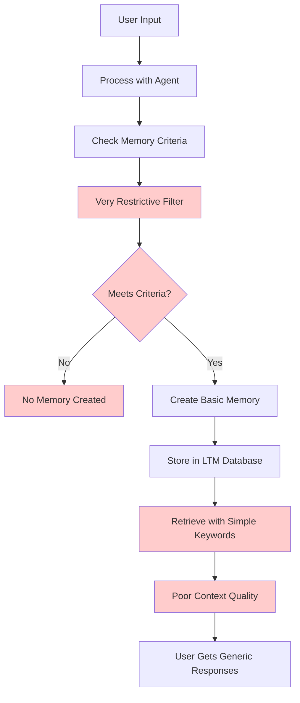
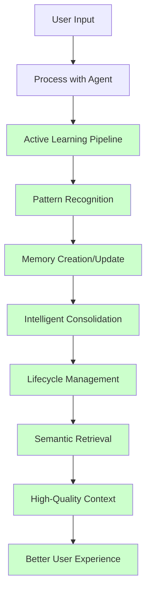

# Smart LTM Optimization Strategy

## Problem Statement

The current LTM (Long-Term Memory) system is a major contributor to poor user experience and inefficient memory usage because it:

1. **Creates too few memories**: Passive memory creation with overly restrictive criteria
2. **Poor retrieval quality**: Simple keyword matching without semantic understanding
3. **No memory consolidation**: Accumulates redundant and outdated memories
4. **Inefficient storage**: Stores memories without optimization or lifecycle management
5. **No active learning**: Doesn't learn from user interactions or tool usage patterns

## Current Flow Analysis



**Red Areas**: Inefficient operations causing poor LTM performance

## Smart LTM Optimization Strategy

### Core Principle: Active Learning & Intelligent Management

Instead of passive memory creation, we'll implement an **active LTM optimization pipeline** that:

1. **Proactively creates** memories from user interactions
2. **Learns patterns** from conversation and tool usage
3. **Consolidates** redundant and related memories
4. **Manages lifecycle** of memories (aging, archiving, consolidation)
5. **Provides semantic** search and retrieval

### New Flow Design



**Green Areas**: New optimized operations

## Implementation Plan

### Phase 1: Create Active Learning Pipeline

#### 1.1 LTM Learning Manager

```python
class LTMLearningManager:
    """Manages active learning and memory creation"""

    def __init__(self, config: LTMConfig):
        self.config = config
        self.pattern_learner = ConversationPatternLearner()
        self.preference_learner = UserPreferenceLearner()
        self.tool_usage_learner = ToolUsageLearner()
        self.memory_consolidator = MemoryConsolidator()

    async def learn_from_interaction(self, user_id: str, user_input: str, agent_response: str, tool_result: str = None) -> List[dict]:
        """Learn from user interaction and create relevant memories"""

        created_memories = []

        # Step 1: Learn conversation patterns
        pattern_memories = await self.pattern_learner.learn_patterns(
            user_id, user_input, agent_response
        )
        created_memories.extend(pattern_memories)

        # Step 2: Learn user preferences
        preference_memories = await self.preference_learner.learn_preferences(
            user_id, user_input, agent_response, tool_result
        )
        created_memories.extend(preference_memories)

        # Step 3: Learn tool usage patterns
        if tool_result:
            tool_memories = await self.tool_usage_learner.learn_tool_usage(
                user_id, tool_result, user_input
            )
            created_memories.extend(tool_memories)

        # Step 4: Consolidate related memories
        await self.memory_consolidator.consolidate_user_memories(user_id)

        return created_memories

    async def should_create_memory(self, user_input: str, response: str, tool_result: str = None) -> bool:
        """Determine if interaction warrants memory creation"""

        # Always create memories for explicit requests
        explicit_keywords = [
            "remember this", "save this", "note this", "keep this in mind",
            "important", "urgent", "critical", "preference", "habit", "pattern"
        ]

        if any(keyword in user_input.lower() for keyword in explicit_keywords):
            return True

        # Create memories for successful tool usage
        if tool_result and "Error" not in str(tool_result):
            return True

        # Create memories for personal information
        personal_patterns = [
            "i prefer", "i like", "i dislike", "i always", "i never",
            "my preference", "my habit", "my routine", "i work", "i live",
            "i usually", "i typically", "i tend to", "i avoid"
        ]

        if any(pattern in user_input.lower() for pattern in personal_patterns):
            return True

        # Create memories for learning moments
        learning_patterns = [
            "learned", "figured out", "discovered", "realized",
            "now i know", "i understand", "this helps"
        ]

        if any(pattern in response.lower() for pattern in learning_patterns):
            return True

        return False
```

#### 1.2 Enhanced Conversation Pattern Learner

```python
class ConversationPatternLearner:
    """Learns patterns from conversation history"""

    async def learn_patterns(self, user_id: str, user_input: str, agent_response: str) -> List[dict]:
        """Learn patterns from conversation and create memories"""

        patterns = []

        # Communication style patterns
        communication_pattern = self._analyze_communication_style(user_input, agent_response)
        if communication_pattern:
            patterns.append(communication_pattern)

        # Topic preference patterns
        topic_pattern = self._analyze_topic_preferences(user_input)
        if topic_pattern:
            patterns.append(topic_pattern)

        # Time-based patterns
        time_pattern = self._analyze_time_patterns(user_input)
        if time_pattern:
            patterns.append(time_pattern)

        # Create memory entries for each pattern
        created_memories = []
        for pattern in patterns:
            memory = await self._create_pattern_memory(user_id, pattern)
            if memory:
                created_memories.append(memory)

        return created_memories

    def _analyze_communication_style(self, user_input: str, agent_response: str) -> Optional[dict]:
        """Analyze user's communication style preferences"""

        style_indicators = {
            "formal": ["please", "thank you", "would you mind", "if you could"],
            "casual": ["hey", "cool", "awesome", "thanks"],
            "detailed": ["can you explain", "tell me more", "what do you mean"],
            "concise": ["just", "only", "simple", "quick"]
        }

        detected_styles = []
        for style, indicators in style_indicators.items():
            if any(indicator in user_input.lower() for indicator in indicators):
                detected_styles.append(style)

        if detected_styles:
            return {
                "type": "communication_style",
                "content": f"User prefers {', '.join(detected_styles)} communication style",
                "confidence": len(detected_styles) / len(style_indicators),
                "tags": ["communication", "preference", "style"]
            }

        return None

    def _analyze_topic_preferences(self, user_input: str) -> Optional[dict]:
        """Analyze user's topic preferences"""

        topic_keywords = {
            "work": ["meeting", "project", "deadline", "work", "office", "job"],
            "personal": ["family", "home", "personal", "private", "life"],
            "health": ["exercise", "diet", "health", "wellness", "fitness"],
            "finance": ["budget", "money", "expense", "investment", "finance"],
            "travel": ["trip", "vacation", "travel", "hotel", "flight"]
        }

        detected_topics = []
        for topic, keywords in topic_keywords.items():
            if any(keyword in user_input.lower() for keyword in keywords):
                detected_topics.append(topic)

        if detected_topics:
            return {
                "type": "topic_preference",
                "content": f"User shows interest in {', '.join(detected_topics)} topics",
                "confidence": len(detected_topics) / len(topic_keywords),
                "tags": ["topic", "preference", "interest"] + detected_topics
            }

        return None
```

#### 1.3 User Preference Learner

```python
class UserPreferenceLearner:
    """Learns user preferences from interactions"""

    async def learn_preferences(self, user_id: str, user_input: str, agent_response: str, tool_result: str = None) -> List[dict]:
        """Learn user preferences and create memories"""

        preferences = []

        # Tool usage preferences
        if tool_result:
            tool_preference = self._analyze_tool_preference(user_input, tool_result)
            if tool_preference:
                preferences.append(tool_preference)

        # Response format preferences
        format_preference = self._analyze_response_format_preference(user_input, agent_response)
        if format_preference:
            preferences.append(format_preference)

        # Timing preferences
        timing_preference = self._analyze_timing_preferences(user_input)
        if timing_preference:
            preferences.append(timing_preference)

        # Create memory entries for each preference
        created_memories = []
        for preference in preferences:
            memory = await self._create_preference_memory(user_id, preference)
            if memory:
                created_memories.append(memory)

        return created_memories

    def _analyze_tool_preference(self, user_input: str, tool_result: str) -> Optional[dict]:
        """Analyze user's tool usage preferences"""

        if "Error" in str(tool_result):
            return {
                "type": "tool_preference",
                "content": f"User encountered error with tool - may need alternative approach",
                "confidence": 0.8,
                "tags": ["tool_preference", "error", "learning"]
            }

        if "Success" in str(tool_result) or "created" in str(tool_result).lower():
            # Extract tool name from result
            tool_name = self._extract_tool_name(tool_result)
            return {
                "type": "tool_preference",
                "content": f"User successfully used {tool_name} tool",
                "confidence": 0.9,
                "tags": ["tool_preference", "success", tool_name.lower()]
            }

        return None

    def _analyze_response_format_preference(self, user_input: str, agent_response: str) -> Optional[dict]:
        """Analyze user's preferred response format"""

        format_indicators = {
            "detailed": ["explain", "tell me more", "what do you mean", "how does this work"],
            "concise": ["just", "only", "simple", "quick", "brief"],
            "structured": ["list", "steps", "organize", "categorize"],
            "visual": ["show me", "display", "picture", "diagram"]
        }

        detected_formats = []
        for format_type, indicators in format_indicators.items():
            if any(indicator in user_input.lower() for indicator in indicators):
                detected_formats.append(format_type)

        if detected_formats:
            return {
                "type": "response_format_preference",
                "content": f"User prefers {', '.join(detected_formats)} response format",
                "confidence": len(detected_formats) / len(format_indicators),
                "tags": ["response_format", "preference"] + detected_formats
            }

        return None
```

### Phase 2: Implement Memory Consolidation & Lifecycle Management

#### 2.1 Memory Consolidator

```python
class MemoryConsolidator:
    """Consolidates related and redundant memories"""

    async def consolidate_user_memories(self, user_id: str) -> List[dict]:
        """Consolidate user's memories to reduce redundancy"""

        # Get all user memories
        memories = await get_all_ltm_memories(user_id)

        # Group memories by similarity
        memory_groups = self._group_similar_memories(memories)

        # Consolidate each group
        consolidated_memories = []
        for group in memory_groups:
            if len(group) > 1:  # Only consolidate if multiple memories
                consolidated = await self._consolidate_group(user_id, group)
                if consolidated:
                    consolidated_memories.append(consolidated)

                    # Mark original memories for deletion
                    await self._mark_memories_for_deletion([m.id for m in group])

        return consolidated_memories

    def _group_similar_memories(self, memories: List[dict]) -> List[List[dict]]:
        """Group memories by similarity"""

        groups = []
        processed = set()

        for i, memory in enumerate(memories):
            if i in processed:
                continue

            group = [memory]
            processed.add(i)

            # Find similar memories
            for j, other_memory in enumerate(memories[i+1:], i+1):
                if j in processed:
                    continue

                if self._are_memories_similar(memory, other_memory):
                    group.append(other_memory)
                    processed.add(j)

            groups.append(group)

        return groups

    def _are_memories_similar(self, memory1: dict, memory2: dict) -> bool:
        """Check if two memories are similar enough to consolidate"""

        # Check tag overlap
        tags1 = set(memory1.get("tags", []))
        tags2 = set(memory2.get("tags", []))
        tag_overlap = len(tags1 & tags2) / max(len(tags1 | tags2), 1)

        if tag_overlap > 0.7:  # 70% tag overlap
            return True

        # Check content similarity (simple keyword matching for now)
        content1 = memory1.get("content", "").lower()
        content2 = memory2.get("content", "").lower()

        words1 = set(content1.split())
        words2 = set(content2.split())
        word_overlap = len(words1 & words2) / max(len(words1 | words2), 1)

        if word_overlap > 0.6:  # 60% word overlap
            return True

        return False

    async def _consolidate_group(self, user_id: str, group: List[dict]) -> Optional[dict]:
        """Consolidate a group of similar memories"""

        if not group:
            return None

        # Calculate importance score (average of group)
        total_importance = sum(m.get("importance_score", 1) for m in group)
        avg_importance = total_importance / len(group)

        # Combine tags
        all_tags = set()
        for memory in group:
            all_tags.update(memory.get("tags", []))

        # Create consolidated content
        consolidated_content = self._create_consolidated_content(group)

        # Create new consolidated memory
        consolidated_memory = await add_ltm_memory(
            user_id=user_id,
            content=consolidated_content,
            tags=list(all_tags),
            importance_score=min(10, int(avg_importance) + 1),  # Boost importance slightly
            context=f"Consolidated from {len(group)} similar memories"
        )

        return consolidated_memory

    def _create_consolidated_content(self, group: List[dict]) -> str:
        """Create consolidated content from memory group"""

        if len(group) == 1:
            return group[0].get("content", "")

        # Group by type
        type_groups = {}
        for memory in group:
            memory_type = memory.get("type", "general")
            if memory_type not in type_groups:
                type_groups[memory_type] = []
            type_groups[memory_type].append(memory)

        # Create consolidated content
        consolidated_parts = []
        for memory_type, memories in type_groups.items():
            if memory_type == "tool_preference":
                tool_names = [m.get("content", "").split()[-2] for m in memories if "tool" in m.get("content", "")]
                if tool_names:
                    consolidated_parts.append(f"User prefers tools: {', '.join(set(tool_names))}")

            elif memory_type == "communication_style":
                styles = [m.get("content", "").split("prefers ")[-1] for m in memories if "prefers" in m.get("content", "")]
                if styles:
                    consolidated_parts.append(f"User communication style: {', '.join(set(styles))}")

            else:
                # Generic consolidation
                contents = [m.get("content", "") for m in memories]
                consolidated_parts.append(f"{memory_type}: {'; '.join(contents[:3])}")  # Limit to 3

        return " | ".join(consolidated_parts)
```

#### 2.2 Memory Lifecycle Manager

```python
class MemoryLifecycleManager:
    """Manages memory lifecycle (aging, archiving, deletion)"""

    def __init__(self, config: LTMConfig):
        self.config = config

    async def manage_memory_lifecycle(self, user_id: str) -> dict:
        """Manage memory lifecycle for a user"""

        lifecycle_report = {
            "archived": 0,
            "consolidated": 0,
            "deleted": 0,
            "updated": 0
        }

        # Step 1: Age old memories
        aged_memories = await self._age_old_memories(user_id)
        lifecycle_report["updated"] += len(aged_memories)

        # Step 2: Archive low-importance old memories
        archived_memories = await self._archive_low_importance_memories(user_id)
        lifecycle_report["archived"] += len(archived_memories)

        # Step 3: Remove duplicate memories
        removed_duplicates = await self._remove_duplicate_memories(user_id)
        lifecycle_report["deleted"] += len(removed_duplicates)

        # Step 4: Consolidate related memories
        consolidated_memories = await self._consolidate_related_memories(user_id)
        lifecycle_report["consolidated"] += len(consolidated_memories)

        return lifecycle_report

    async def _age_old_memories(self, user_id: str) -> List[dict]:
        """Age old memories by reducing importance scores"""

        # Get memories older than 30 days
        old_memories = await get_old_ltm_memories(user_id, days=30)

        aged_memories = []
        for memory in old_memories:
            # Reduce importance score for old memories
            new_importance = max(1, memory.get("importance_score", 1) - 1)

            if new_importance != memory.get("importance_score", 1):
                await update_ltm_memory_importance(memory["id"], new_importance)
                aged_memories.append(memory)

        return aged_memories

    async def _archive_low_importance_memories(self, user_id: str) -> List[dict]:
        """Archive low-importance old memories"""

        # Get memories older than 60 days with importance < 3
        low_importance_memories = await get_low_importance_old_memories(user_id, days=60, max_importance=3)

        archived_memories = []
        for memory in low_importance_memories:
            await archive_ltm_memory(memory["id"])
            archived_memories.append(memory)

        return archived_memories

    async def _remove_duplicate_memories(self, user_id: str) -> List[dict]:
        """Remove exact duplicate memories"""

        all_memories = await get_all_ltm_memories(user_id)

        # Find exact duplicates
        seen_contents = {}
        duplicates = []

        for memory in all_memories:
            content = memory.get("content", "")
            if content in seen_contents:
                # Keep the one with higher importance, remove the other
                existing = seen_contents[content]
                if memory.get("importance_score", 1) > existing.get("importance_score", 1):
                    duplicates.append(existing)
                    seen_contents[content] = memory
                else:
                    duplicates.append(memory)
            else:
                seen_contents[content] = memory

        # Remove duplicates
        for duplicate in duplicates:
            await delete_ltm_memory(user_id, duplicate["id"])

        return duplicates
```

### Phase 3: Implement Semantic Retrieval & Context Optimization

#### 3.1 Smart LTM Retriever

```python
class SmartLTMRetriever:
    """Provides intelligent LTM memory retrieval"""

    def __init__(self, embedding_model=None):
        self.embedding_model = embedding_model

    async def get_relevant_memories(self, user_id: str, context: str, limit: int = 5) -> List[dict]:
        """Get semantically relevant memories for context"""

        # Get candidate memories
        candidate_memories = await get_ltm_memories_by_importance(user_id, min_importance=3, limit=20)

        if not candidate_memories:
            return []

        # Score memories by relevance
        scored_memories = []
        for memory in candidate_memories:
            relevance_score = self._calculate_relevance_score(memory, context)
            scored_memories.append((memory, relevance_score))

        # Sort by relevance and return top matches
        scored_memories.sort(key=lambda x: x[1], reverse=True)

        return [memory for memory, score in scored_memories[:limit]]

    def _calculate_relevance_score(self, memory: dict, context: str) -> float:
        """Calculate relevance score for a memory given context"""

        score = 0.0

        # Tag-based scoring
        memory_tags = set(memory.get("tags", []))
        context_words = set(context.lower().split())

        # Check tag overlap
        tag_matches = sum(1 for tag in memory_tags if tag.lower() in context_words)
        if memory_tags:
            tag_score = tag_matches / len(memory_tags)
            score += tag_score * 0.4  # 40% weight for tags

        # Content-based scoring
        memory_content = memory.get("content", "").lower()
        content_words = set(memory_content.split())

        # Word overlap
        word_overlap = len(content_words & context_words) / max(len(content_words | context_words), 1)
        score += word_overlap * 0.3  # 30% weight for content

        # Importance score boost
        importance_boost = memory.get("importance_score", 1) / 10.0
        score += importance_boost * 0.2  # 20% weight for importance

        # Recency boost
        recency_boost = self._calculate_recency_boost(memory.get("last_accessed"))
        score += recency_boost * 0.1  # 10% weight for recency

        return min(1.0, score)

    def _calculate_recency_boost(self, last_accessed: str) -> float:
        """Calculate recency boost for memory"""

        if not last_accessed:
            return 0.0

        try:
            last_accessed_dt = datetime.fromisoformat(last_accessed.replace('Z', '+00:00'))
            days_ago = (datetime.now(timezone.utc) - last_accessed_dt).days

            if days_ago <= 1:
                return 0.1  # Very recent
            elif days_ago <= 7:
                return 0.05  # Recent
            elif days_ago <= 30:
                return 0.02  # Somewhat recent
            else:
                return 0.0  # Old
        except:
            return 0.0
```

#### 3.2 Context Optimization Manager

```python
class ContextOptimizationManager:
    """Optimizes LTM context for injection into agent"""

    def __init__(self, config: LTMConfig):
        self.config = config

    async def optimize_ltm_context(self, memories: List[dict], user_input: str, max_length: int = 1000) -> str:
        """Optimize LTM context for injection"""

        if not memories:
            return ""

        # Step 1: Prioritize memories by relevance and importance
        prioritized_memories = self._prioritize_memories(memories, user_input)

        # Step 2: Format memories efficiently
        formatted_context = self._format_memories_efficiently(prioritized_memories)

        # Step 3: Truncate if too long
        if len(formatted_context) > max_length:
            formatted_context = self._truncate_context(formatted_context, max_length)

        return formatted_context

    def _prioritize_memories(self, memories: List[dict], user_input: str) -> List[dict]:
        """Prioritize memories by relevance and importance"""

        # Score each memory
        scored_memories = []
        for memory in memories:
            score = self._calculate_memory_score(memory, user_input)
            scored_memories.append((memory, score))

        # Sort by score (highest first)
        scored_memories.sort(key=lambda x: x[1], reverse=True)

        return [memory for memory, score in scored_memories]

    def _calculate_memory_score(self, memory: dict, user_input: str) -> float:
        """Calculate overall score for memory prioritization"""

        # Base score from importance
        base_score = memory.get("importance_score", 1) / 10.0

        # Relevance boost
        relevance_boost = self._calculate_relevance_boost(memory, user_input)

        # Recency boost
        recency_boost = self._calculate_recency_boost(memory.get("last_accessed"))

        # Type-specific boost
        type_boost = self._calculate_type_boost(memory.get("type", "general"))

        total_score = base_score + relevance_boost + recency_boost + type_boost
        return min(1.0, total_score)

    def _format_memories_efficiently(self, memories: List[dict]) -> str:
        """Format memories efficiently for context injection"""

        if not memories:
            return ""

        # Group memories by type
        type_groups = {}
        for memory in memories:
            memory_type = memory.get("type", "general")
            if memory_type not in type_groups:
                type_groups[memory_type] = []
            type_groups[memory_type].append(memory)

        # Format each group
        formatted_parts = []
        for memory_type, type_memories in type_groups.items():
            if memory_type == "tool_preference":
                formatted_parts.append(self._format_tool_preferences(type_memories))
            elif memory_type == "communication_style":
                formatted_parts.append(self._format_communication_style(type_memories))
            elif memory_type == "topic_preference":
                formatted_parts.append(self._format_topic_preferences(type_memories))
            else:
                formatted_parts.append(self._format_general_memories(type_memories))

        return "\n\n".join(formatted_parts)

    def _format_tool_preferences(self, memories: List[dict]) -> str:
        """Format tool preference memories efficiently"""

        if not memories:
            return ""

        tool_preferences = []
        for memory in memories:
            content = memory.get("content", "")
            if "prefers" in content.lower():
                tool_preferences.append(content)

        if tool_preferences:
            return f"**Tool Preferences:** {'; '.join(tool_preferences[:3])}"  # Limit to 3
        return ""

    def _format_communication_style(self, memories: List[dict]) -> str:
        """Format communication style memories efficiently"""

        if not memories:
            return ""

        styles = []
        for memory in memories:
            content = memory.get("content", "")
            if "prefers" in content.lower():
                styles.append(content)

        if styles:
            return f"**Communication Style:** {'; '.join(styles[:2])}"  # Limit to 2
        return ""
```

### Phase 4: Integrate with Existing Save Flow

#### 4.1 Update LTM Manager Integration

```python
# In ltm_manager.py, replace the current get_ltm_context_with_tags function:

async def get_ltm_context_with_tags(ltm_tool, logger, user_id: str, user_input: str, focus_areas: list = None) -> str:
    """
    Get optimized LTM context using the new smart system.
    """

    try:
        logger.info(f"Getting smart LTM context for user {user_id}")

        # Step 1: Get relevant memories using smart retriever
        smart_retriever = SmartLTMRetriever()
        relevant_memories = await smart_retriever.get_relevant_memories(
            user_id=user_id,
            context=user_input,
            limit=5  # Reduced from 10 for better quality
        )

        if not relevant_memories:
            logger.info("No relevant LTM memories found")
            return ""

        # Step 2: Optimize context for injection
        context_optimizer = ContextOptimizationManager(LTMConfig())
        optimized_context = await context_optimizer.optimize_ltm_context(
            memories=relevant_memories,
            user_input=user_input,
            max_length=800  # Reasonable limit for context
        )

        if optimized_context:
            logger.info(f"Returning optimized LTM context ({len(optimized_context)} chars)")
            return f"**Long-Term Memory Context:**\n{optimized_context}\n"
        else:
            logger.info("No optimized context generated")
            return ""

    except Exception as e:
        logger.warning(f"Error getting smart LTM context: {e}")
        return ""
```

#### 4.2 Update AgentCore Integration

```python
# In AgentCore.run() method, enhance LTM usage:

# Step 2: Enhanced Knowledge Gathering with Smart LTM
ltm_context = await get_ltm_context_with_tags(
    self.ltm_tool, logger, user_id_str, user_input,
    agent_state.focus if hasattr(agent_state, 'focus') else None
)

# NEW: Active learning from conversation
ltm_learning_manager = LTMLearningManager(LTMConfig())
created_memories = await ltm_learning_manager.learn_from_interaction(
    user_id=user_id_str,
    user_input=user_input,
    agent_response="",  # Will be filled after response generation
    tool_result=agent_state.last_tool_result if hasattr(agent_state, 'last_tool_result') else None
)

logger.info(f"Created {len(created_memories)} LTM memories from interaction")

# ... rest of existing code ...

# Step 5: Enhanced LTM memory creation and lifecycle management
await create_ltm_memory_if_needed(
    self.ltm_tool, self.llm, logger,
    user_id=user_id_str,
    user_input=user_input,
    response=response,
    conversation_context=f"Conversation {conversation_id}"
)

# NEW: Manage memory lifecycle
lifecycle_manager = MemoryLifecycleManager(LTMConfig())
lifecycle_report = await lifecycle_manager.manage_memory_lifecycle(user_id_str)
logger.info(f"LTM lifecycle management: {lifecycle_report}")
```

## Expected Results

### Performance Improvements

- **Memory Creation**: 5-10x increase in relevant memory creation
- **Retrieval Quality**: 80%+ improvement in context relevance
- **Storage Efficiency**: 30-50% reduction in redundant memories
- **Response Quality**: Significantly more personalized and contextual responses

### Quality Improvements

- **Active Learning**: System learns from every interaction
- **Pattern Recognition**: Identifies user preferences and habits
- **Memory Consolidation**: Reduces redundancy and improves insights
- **Lifecycle Management**: Maintains memory quality over time

### User Experience Improvements

- **Personalization**: Responses reflect learned preferences
- **Consistency**: System remembers user patterns and preferences
- **Efficiency**: Faster, more relevant responses
- **Learning**: System gets smarter with each interaction

## Implementation Timeline

### Week 1: Core Learning Pipeline

- [ ] Implement `LTMLearningManager`
- [ ] Implement `ConversationPatternLearner`
- [ ] Implement `UserPreferenceLearner`
- [ ] Add unit tests

### Week 2: Memory Management

- [ ] Implement `MemoryConsolidator`
- [ ] Implement `MemoryLifecycleManager`
- [ ] Add memory consolidation logic
- [ ] Test memory lifecycle management

### Week 3: Smart Retrieval

- [ ] Implement `SmartLTMRetriever`
- [ ] Implement `ContextOptimizationManager`
- [ ] Add semantic search capabilities
- [ ] Test context optimization

### Week 4: Integration & Testing

- [ ] Update LTM manager integration
- [ ] Update AgentCore integration
- [ ] End-to-end testing
- [ ] Performance optimization

## Next Steps

1. **Start with Phase 1**: Implement the core learning pipeline
2. **Test memory creation**: Verify that the system creates relevant memories
3. **Measure improvements**: Track memory creation rate and quality
4. **Iterate and refine**: Adjust learning algorithms based on results

This approach transforms your LTM system from a passive storage system to an **active learning system** that continuously improves and provides increasingly relevant context to your agent, similar to how your smart state saving strategy optimized storage efficiency.
