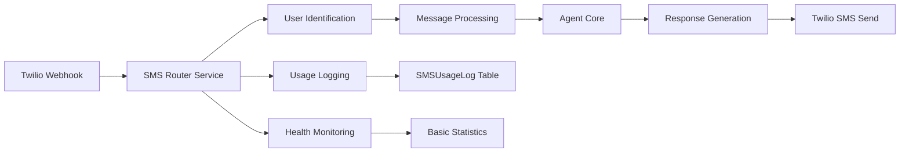
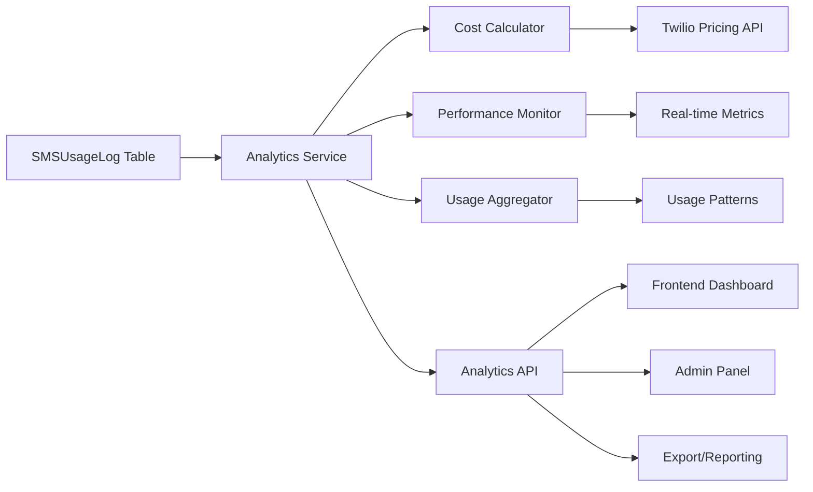
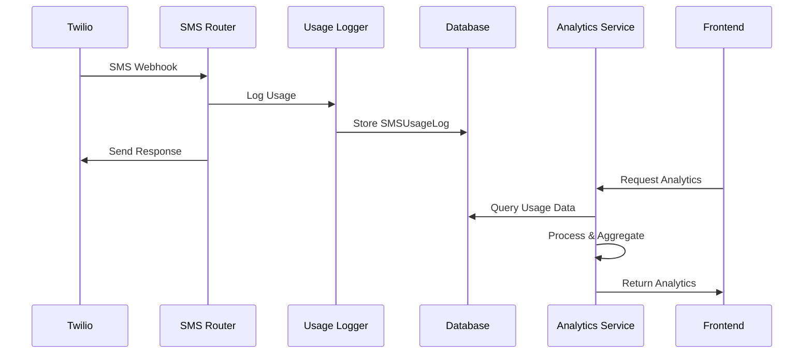
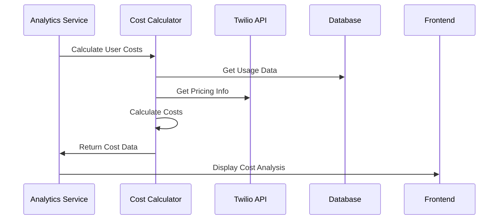

# Task 047: SMS Usage Analytics & Monitoring - Onboarding

## 📋 **Onboarding Summary**

**Task ID**: 047  
**Phase**: 2.5 - Core Application Features  
**Component**: 2.5.1 - SMS Router Service  
**Status**: 🚀 **READY TO START**  
**Onboarding Date**: January 2025

## 🎯 **Task Understanding**

### **What We're Building**

**Task 2.5.1.6: SMS Usage Analytics** - A comprehensive analytics and monitoring system for the SMS Router Service that provides user SMS usage tracking, cost analysis for the single number strategy, performance monitoring, and actionable insights. This will enable cost optimization, performance monitoring, and user behavior analysis.

### **Key Insight**

This is a **data-driven enhancement task** that builds upon the existing SMS infrastructure to provide visibility into usage patterns, costs, and performance. The system will transform raw SMS logs into actionable business intelligence while maintaining the multi-user architecture and single Twilio number strategy.

---

## 🔍 **Codebase Exploration**

### **1. Current SMS Infrastructure ✅ EXISTS**

**Location**: `src/personal_assistant/sms_router/`
**Status**: Fully implemented SMS routing with basic logging

**Key Components**:

- **SMS Router Service**: Multi-user SMS routing with phone identification
- **Usage Logging**: `SMSUsageLog` model with comprehensive message tracking
- **Database Schema**: Optimized indexes for analytics queries
- **Webhook Processing**: Twilio integration for message handling

**Current Capabilities**:

- ✅ Multi-user SMS routing with phone number identification
- ✅ Usage logging for all SMS messages (inbound/outbound)
- ✅ Performance tracking (processing time, success rates)
- ✅ Error logging and metadata storage
- ✅ Basic health checks and statistics

**Current Limitations**:

- ❌ No cost calculation or billing insights
- ❌ No user analytics or usage patterns
- ❌ No performance monitoring or alerting
- ❌ No analytics dashboard or reporting
- ❌ No cost optimization recommendations

### **2. Database Schema ✅ READY**

**Location**: `src/personal_assistant/sms_router/models/sms_models.py`
**Status**: Complete analytics-ready database schema

**Available Infrastructure**:

```python
class SMSUsageLog(Base):
    __tablename__ = 'sms_usage_logs'

    id = Column(Integer, primary_key=True)
    user_id = Column(Integer, ForeignKey('users.id'), nullable=False)
    phone_number = Column(String(20), nullable=False)
    message_direction = Column(String(10), nullable=False)  # 'inbound' or 'outbound'
    message_length = Column(Integer, nullable=False)
    message_content = Column(Text)
    success = Column(Boolean, default=True)
    processing_time_ms = Column(Integer)
    error_message = Column(Text)
    sms_metadata = Column(JSON)
    created_at = Column(DateTime, default=datetime.utcnow)

    # Relationships
    user = relationship("User", back_populates="sms_usage_logs")
```

**Database Indexes**:

```python
# Performance-optimized for analytics queries
Index('idx_sms_usage_logs_user_id', SMSUsageLog.user_id)
Index('idx_sms_usage_logs_phone_number', SMSUsageLog.phone_number)
Index('idx_sms_usage_logs_created_at', SMSUsageLog.created_at)
```

### **3. Existing Analytics Infrastructure ✅ PARTIAL**

**Location**: `src/personal_assistant/sms_router/services/routing_engine.py`
**Status**: Basic usage logging and health checks implemented

**Available Methods**:

```python
async def _log_usage(self, phone_number: str, message_content: str,
                     direction: str, success: bool, processing_time_ms: float,
                     error_message: str = None, user_id: int = None) -> None:
    """Log SMS usage for analytics and monitoring."""
    # Already implemented with comprehensive logging

async def health_check(self) -> Dict[str, Any]:
    """Perform health check of the routing engine."""
    # Basic health monitoring

async def get_routing_stats(self) -> Dict[str, Any]:
    """Get comprehensive routing statistics."""
    # Basic statistics collection
```

**Current Analytics Data**:

- ✅ Message volume tracking (inbound/outbound)
- ✅ Success/failure rates
- ✅ Processing time metrics
- ✅ Error logging and categorization
- ✅ User identification and phone mapping

### **4. Frontend Dashboard ✅ EXISTS**

**Location**: `src/apps/frontend/src/components/dashboard/`
**Status**: Complete dashboard infrastructure ready for analytics integration

**Available Components**:

- **DashboardLayout**: Main dashboard container
- **Sidebar**: Navigation and menu structure
- **UserProfileCard**: User information display
- **DashboardHeader**: Header with user controls

**Integration Points**:

- ✅ Dashboard routing and layout system
- ✅ User authentication and context
- ✅ Responsive design and mobile support
- ✅ Component library and UI patterns

### **5. API Infrastructure ✅ EXISTS**

**Location**: `src/apps/fastapi_app/routes/`
**Status**: Complete FastAPI application with authentication and routing

**Available Infrastructure**:

- ✅ FastAPI application with middleware
- ✅ JWT authentication and user management
- ✅ Database session management
- ✅ Error handling and logging
- ✅ CORS and security configuration

---

## 🏗️ **Architecture Understanding**

### **Current SMS Flow**



### **Target Analytics Flow**



---

## 🔧 **Technical Implementation Plan**

### **Phase 1: Core Analytics Service (Day 1 - Morning)**

#### **1.1 SMS Analytics Service**

**File**: `src/personal_assistant/sms_router/services/analytics.py`

**Core Methods**:

```python
class SMSAnalyticsService:
    async def get_user_usage_summary(self, user_id: int, time_range: str) -> Dict[str, Any]:
        """Get comprehensive usage summary for a user."""
        # Aggregate SMSUsageLog data by user and time range
        # Calculate message counts, success rates, processing times
        # Return structured analytics data

    async def get_cost_analysis(self, user_id: int, time_range: str) -> Dict[str, Any]:
        """Calculate SMS costs for a user."""
        # Use SMSCostCalculator for pricing
        # Aggregate costs by message type and direction
        # Provide cost optimization insights

    async def get_performance_metrics(self, time_range: str) -> Dict[str, Any]:
        """Get system-wide performance metrics."""
        # Aggregate performance data across all users
        # Calculate SLA compliance and trends
        # Identify performance bottlenecks
```

#### **1.2 Cost Calculator Service**

**File**: `src/personal_assistant/sms_router/services/cost_calculator.py`

**Core Methods**:

```python
class SMSCostCalculator:
    async def calculate_user_costs(self, user_id: int, time_range: str) -> Dict[str, float]:
        """Calculate detailed costs for a user."""
        # Query SMSUsageLog for user's message volume
        # Apply Twilio pricing rates
        # Calculate inbound vs outbound costs
        # Provide cost breakdown and trends

    async def get_twilio_pricing(self) -> Dict[str, float]:
        """Get current Twilio pricing information."""
        # Cache Twilio pricing API responses
        # Handle rate limiting and fallbacks
        # Return structured pricing data

    async def estimate_monthly_costs(self, user_id: int) -> float:
        """Estimate monthly costs based on usage patterns."""
        # Analyze historical usage trends
        # Project future usage based on patterns
        # Calculate estimated monthly costs
```

#### **1.3 Performance Monitor Service**

**File**: `src/personal_assistant/sms_router/services/performance_monitor.py`

**Core Methods**:

```python
class SMSPerformanceMonitor:
    async def get_real_time_metrics(self) -> Dict[str, Any]:
        """Get current system performance metrics."""
        # Monitor active SMS processing
        # Track response times and success rates
        # Provide real-time health status

    async def check_sla_compliance(self) -> Dict[str, bool]:
        """Check SLA compliance for various metrics."""
        # Define SLA thresholds (response time, success rate)
        # Monitor compliance in real-time
        # Generate compliance reports

    async def generate_performance_alerts(self) -> List[Dict[str, Any]]:
        """Generate alerts for performance issues."""
        # Monitor threshold violations
        # Generate actionable alerts
        # Provide alert severity and recommendations
```

### **Phase 2: API & Frontend Integration (Day 1 - Afternoon)**

#### **2.1 Analytics API Endpoints**

**File**: `src/apps/fastapi_app/routes/analytics.py`

**User Endpoints**:

```python
@router.get("/me/sms-analytics", response_model=SMSAnalyticsResponse)
async def get_user_sms_analytics(
    current_user: User = Depends(get_current_user_db),
    time_range: str = Query("30d", description="Time range: 7d, 30d, 90d, 1y")
):
    """Get current user's SMS analytics."""
    # Authenticate user
    # Call SMSAnalyticsService
    # Return formatted analytics data

@router.get("/me/sms-costs", response_model=SMSCostAnalysisResponse)
async def get_user_sms_costs(
    current_user: User = Depends(get_current_user_db),
    time_range: str = Query("30d", description="Time range for cost analysis")
):
    """Get current user's SMS cost analysis."""
    # Authenticate user
    # Call SMSCostCalculator
    # Return cost breakdown and insights
```

**Admin Endpoints**:

```python
@router.get("/admin/sms-analytics/system", response_model=SystemAnalyticsResponse)
async def get_system_sms_analytics(
    admin_user: User = Depends(get_current_user_db),
    time_range: str = Query("30d", description="Time range for system analytics")
):
    """Get system-wide SMS analytics (admin only)."""
    # Verify admin permissions
    # Call analytics service for system data
    # Return aggregated system metrics
```

#### **2.2 Frontend Analytics Components**

**File**: `src/apps/frontend/src/components/dashboard/SMSAnalyticsWidget.tsx`

**Component Structure**:

```typescript
interface SMSAnalyticsWidgetProps {
  timeRange: "7d" | "30d" | "90d" | "1y";
  showCosts: boolean;
  showPerformance: boolean;
  className?: string;
}

const SMSAnalyticsWidget: React.FC<SMSAnalyticsWidgetProps> = ({
  timeRange,
  showCosts,
  showPerformance,
  className = "",
}) => {
  const [analytics, setAnalytics] = useState<SMSAnalytics | null>(null);
  const [loading, setLoading] = useState(false);
  const [error, setError] = useState<string | null>(null);

  // Fetch analytics data
  // Render charts and metrics
  // Handle time range changes
  // Display cost breakdown
  // Show performance indicators
};
```

### **Phase 3: Dashboard Integration & Testing (Day 2)**

#### **3.1 Dashboard Integration**

**Integration Points**:

- **Main Dashboard**: Add SMS analytics widget to overview
- **User Profile**: Include usage statistics and cost breakdown
- **Admin Panel**: Create comprehensive analytics dashboard
- **Settings Page**: Add analytics preferences and alert configuration

#### **3.2 Testing Strategy**

**Test Coverage**:

- **Unit Tests**: All analytics service methods
- **Integration Tests**: API endpoints and database queries
- **Frontend Tests**: Component rendering and data display
- **End-to-End Tests**: Complete analytics flow from SMS to dashboard

---

## 📊 **Data Flow & Integration**

### **Data Collection Flow**



### **Cost Calculation Flow**



---

## 🎯 **Key Implementation Decisions**

### **1. Caching Strategy**

**Decision**: Implement Redis caching for analytics data
**Rationale**: Analytics queries can be expensive, caching improves performance
**Implementation**: Cache aggregated data with TTL based on time range

### **2. Real-time vs Batch Processing**

**Decision**: Hybrid approach with real-time metrics and batch aggregation
**Rationale**: Real-time for critical metrics, batch for historical analysis
**Implementation**: Real-time monitoring + hourly/daily aggregation jobs

### **3. Data Retention Policy**

**Decision**: Keep detailed logs for 90 days, aggregated data for 1 year
**Rationale**: Balance between analytics depth and storage costs
**Implementation**: Database partitioning and cleanup jobs

### **4. Cost Calculation Accuracy**

**Decision**: Use Twilio pricing API with fallback to cached rates
**Rationale**: Ensure accurate cost tracking while handling API limits
**Implementation**: Cache pricing data with 24-hour TTL

---

## 🚨 **Potential Challenges & Solutions**

### **Challenge 1: Database Performance**

**Problem**: Analytics queries on large datasets may be slow
**Solution**:

- Implement query optimization and pagination
- Use database indexes effectively
- Consider materialized views for complex aggregations

### **Challenge 2: Real-time Data Accuracy**

**Problem**: Ensuring analytics data is current and accurate
**Solution**:

- Implement data validation and consistency checks
- Use transaction-based logging
- Provide data freshness indicators

### **Challenge 3: Frontend Performance**

**Problem**: Large datasets may cause slow dashboard loading
**Solution**:

- Implement lazy loading and data virtualization
- Use progressive data loading
- Cache analytics data in frontend state

### **Challenge 4: Cost Calculation Complexity**

**Problem**: Twilio pricing varies by region and message type
**Solution**:

- Implement comprehensive pricing logic
- Handle edge cases and fallbacks
- Provide cost estimation ranges

---

## 🔗 **Integration Points**

### **Internal Dependencies**

#### **✅ Ready Components**

- **SMS Router Service**: Complete SMS processing infrastructure
- **Database Schema**: SMSUsageLog and related models
- **User Management**: Authentication and user identification
- **Frontend Dashboard**: Component infrastructure and routing

#### **🔄 Integration Points**

- **Usage Logging**: Extend existing logging for analytics
- **Health Monitoring**: Enhance with performance metrics
- **Dashboard**: Integrate analytics widgets seamlessly
- **API Layer**: Add analytics endpoints to existing FastAPI app

### **External Dependencies**

#### **Twilio Integration**

- **Pricing API**: For accurate cost calculation
- **Webhook Data**: For message delivery status
- **Account Limits**: For usage quota monitoring

#### **Monitoring Infrastructure**

- **Prometheus**: For metrics collection (future enhancement)
- **Grafana**: For advanced dashboards (future enhancement)
- **Redis**: For caching and real-time data

---

## 📚 **Reference Materials**

### **Existing Code Examples**

#### **Usage Logging Pattern**

```python
# From routing_engine.py - _log_usage method
async def _log_usage(self, phone_number: str, message_content: str,
                     direction: str, success: bool, processing_time_ms: float,
                     error_message: str = None, user_id: int = None) -> None:
    """Log SMS usage for analytics and monitoring."""
    # This pattern should be extended for analytics
```

#### **Health Check Pattern**

```python
# From routing_engine.py - health_check method
async def health_check(self) -> Dict[str, Any]:
    """Perform health check of the routing engine."""
    # This pattern should be enhanced with analytics
```

#### **Database Query Pattern**

```python
# From routing_engine.py - get_routing_stats method
async def get_routing_stats(self) -> Dict[str, Any]:
    """Get comprehensive routing statistics."""
    # This pattern should be expanded for analytics
```

### **Frontend Component Patterns**

#### **Dashboard Widget Pattern**

```typescript
// From existing dashboard components
const DashboardWidget: React.FC<DashboardWidgetProps> = ({ ... }) => {
  // Use this pattern for SMS analytics widget
};
```

#### **API Integration Pattern**

```typescript
// From existing services
const apiClient = {
  get: async (url: string) => {
    /* implementation */
  },
  post: async (url: string, data: any) => {
    /* implementation */
  },
};
```

---

## 🚀 **Getting Started Checklist**

### **Pre-Implementation Setup**

- [ ] **Review Current SMS Infrastructure**: Understand existing usage logging
- [ ] **Analyze Database Schema**: Review SMSUsageLog structure and indexes
- [ ] **Study Frontend Dashboard**: Understand component patterns and routing
- [ ] **Review API Infrastructure**: Understand FastAPI patterns and authentication

### **Development Environment**

- [ ] **Activate Virtual Environment**: `source venv_personal_assistant/bin/activate`
- [ ] **Navigate to Project Root**: `cd /Users/ianleblanc/Desktop/personal_assistant`
- [ ] **Run Existing Tests**: Ensure current system stability
- [ ] **Check Database Connection**: Verify SMSUsageLog table access

### **Implementation Order**

1. **Start with Analytics Service**: Build core data processing logic
2. **Add Cost Calculator**: Implement pricing integration
3. **Create Performance Monitor**: Build monitoring and alerting
4. **Develop API Endpoints**: Expose analytics data
5. **Build Frontend Components**: Create visualization widgets
6. **Integrate with Dashboard**: Seamless user experience
7. **Test and Validate**: Ensure accuracy and performance

### **Key Success Factors**

- **Data Accuracy**: Ensure analytics calculations are correct
- **Performance**: Maintain fast response times for analytics queries
- **User Experience**: Provide intuitive and actionable insights
- **Integration**: Seamlessly integrate with existing dashboard
- **Scalability**: Support growing user base and message volume

---

## 📝 **Next Steps**

### **Immediate Actions**

1. **Create Analytics Service**: Start with `SMSAnalyticsService` class
2. **Implement Basic Queries**: Begin with user usage aggregation
3. **Add Cost Calculation**: Integrate with Twilio pricing
4. **Build API Endpoints**: Create analytics routes
5. **Develop Frontend Widget**: Create analytics visualization

### **Questions for Clarification**

- **Cost Calculation**: Should we support multiple Twilio pricing tiers?
- **Data Retention**: What's the preferred retention policy for analytics data?
- **Real-time Updates**: How frequently should analytics data refresh?
- **Export Formats**: What export formats are needed (CSV, PDF, JSON)?

### **Success Metrics**

- **Functionality**: All analytics features working correctly
- **Performance**: Analytics queries complete within 500ms
- **Accuracy**: Cost calculations within 1% of actual Twilio billing
- **User Experience**: Intuitive analytics dashboard with clear insights

---

**Onboarding Status**: ✅ **COMPLETE**  
**Ready to Start**: Yes  
**Estimated Timeline**: 2 days  
**Next Action**: Begin Phase 1 - Core Analytics Service Implementation
