# Task 057: Grafana Dashboards Creation

## 📋 **Task Overview**

**Task ID**: 057  
**Phase**: 2.6 - Monitoring & Observability  
**Component**: 2.6.1.2 - Grafana Dashboards  
**Status**: ✅ **COMPLETED**  
**Effort**: 3.0 days ✅ **COMPLETED**  
**Dependencies**: Task 2.6.1.1 (Prometheus Metrics Integration) ✅ **COMPLETED**

---

## 🎯 **Task Description**

### **What We're Building**

Create comprehensive Grafana dashboards to visualize the Prometheus metrics collected in Task 056. This includes system metrics, application metrics, business metrics, and OAuth integration dashboards with real-time updates and alerting capabilities.

### **Business Value**

- **System Observability**: Real-time monitoring of application performance and health
- **Operational Excellence**: Proactive issue detection and performance optimization
- **Business Intelligence**: Insights into user behavior and system usage patterns
- **Cost Optimization**: Monitor resource usage and identify optimization opportunities
- **Compliance**: Audit trails and performance tracking for regulatory requirements

### **Key Features**

1. **6 Comprehensive Dashboards**: System, Application, SMS, OAuth, Business, and Task dashboards
2. **Real-time Monitoring**: Live data updates with 15-second refresh intervals
3. **Interactive Visualizations**: Time series, gauges, tables, and heatmaps
4. **Alerting System**: Configurable alerts for critical issues and performance degradation
5. **Mobile Responsive**: Touch-friendly dashboards for mobile devices
6. **Export Capabilities**: PNG, PDF, and CSV export functionality

### **IMPORTANT DISCOVERY**

**The monitoring infrastructure is already 100% complete with Prometheus metrics collection!** This task is about creating the **visualization layer** to make those metrics actionable and user-friendly.

**Available Metrics (25+ types)**:

- ✅ **Application Metrics**: HTTP requests, response times, error rates
- ✅ **SMS Metrics**: Message counts, processing times, success rates, costs
- ✅ **OAuth Metrics**: Integration status, token refresh rates, error tracking
- ✅ **Database Metrics**: Connection pool, health status, response times
- ✅ **System Metrics**: CPU, memory, disk usage
- ✅ **Task Metrics**: Execution duration, success rates, queue lengths
- ✅ **Business Metrics**: User registrations, phone verifications, feature usage

---

## 🏗️ **Architecture Overview**

### **System Architecture**

```mermaid
graph TB
    subgraph "Grafana Dashboards"
        SYSTEM_DASH[📊 System Dashboard<br/>CPU, Memory, Disk, Network]
        APP_DASH[📈 Application Dashboard<br/>HTTP, Response Times, Errors]
        SMS_DASH[📱 SMS Dashboard<br/>Messages, Success Rates, Costs]
        OAUTH_DASH[🔑 OAuth Dashboard<br/>Integrations, Tokens, Performance]
        BUSINESS_DASH[💼 Business Dashboard<br/>Users, Features, Growth]
        TASK_DASH[⚙️ Task Dashboard<br/>Execution, Queues, Performance]
    end

    subgraph "Grafana Infrastructure"
        GRAFANA[🎨 Grafana Server<br/>Port 3000/3001]
        DATASOURCE[📊 Prometheus Datasource<br/>api:8000/metrics]
        ALERTS[🚨 Alert Rules<br/>Thresholds, Notifications]
        USERS[👥 User Management<br/>Roles, Permissions]
    end

    subgraph "Data Sources"
        PROMETHEUS[📈 Prometheus<br/>Metrics Collection]
        METRICS_ENDPOINT[🔗 /metrics Endpoint<br/>5,276 chars of data]
    end

    %% Data Flow
    METRICS_ENDPOINT --> PROMETHEUS
    PROMETHEUS --> DATASOURCE
    DATASOURCE --> GRAFANA

    GRAFANA --> SYSTEM_DASH
    GRAFANA --> APP_DASH
    GRAFANA --> SMS_DASH
    GRAFANA --> OAUTH_DASH
    GRAFANA --> BUSINESS_DASH
    GRAFANA --> TASK_DASH

    ALERTS --> GRAFANA
    USERS --> GRAFANA

    %% Styling
    classDef dashboards fill:#e3f2fd
    classDef infrastructure fill:#f3e5f5
    classDef datasources fill:#e8f5e8

    class SYSTEM_DASH,APP_DASH,SMS_DASH,OAUTH_DASH,BUSINESS_DASH,TASK_DASH dashboards
    class GRAFANA,DATASOURCE,ALERTS,USERS infrastructure
    class PROMETHEUS,METRICS_ENDPOINT datasources
```



### **Dashboard Categories**

#### **1. System Dashboard**

- **CPU Usage**: Current and historical CPU utilization
- **Memory Usage**: RAM consumption and trends
- **Disk Usage**: Storage utilization and I/O metrics
- **Network**: Bandwidth usage and connection stats
- **Container Metrics**: Docker container performance

#### **2. Application Dashboard**

- **HTTP Requests**: Request count by method, endpoint, status
- **Response Times**: P50, P95, P99 response time percentiles
- **Error Rates**: Error percentage by endpoint and type
- **Throughput**: Requests per second and minute
- **Active Users**: Concurrent user sessions

#### **3. SMS Dashboard**

- **Message Volume**: Total messages sent/received
- **Success Rates**: Delivery success percentages
- **Processing Times**: SMS processing duration
- **Cost Tracking**: SMS costs by provider and user
- **Queue Length**: Pending message counts

#### **4. OAuth Dashboard**

- **Integration Status**: Active vs inactive integrations
- **Token Refresh**: Success/failure rates by provider
- **Performance Metrics**: API response times
- **Error Tracking**: OAuth error rates and types
- **Usage Analytics**: Integration usage patterns

#### **5. Business Dashboard**

- **User Registrations**: New user signup trends
- **Phone Verifications**: Verification success rates
- **Feature Usage**: Most used features and patterns
- **Growth Metrics**: User engagement and retention
- **Revenue Tracking**: Cost analysis and optimization

#### **6. Task Dashboard**

- **Execution Metrics**: Task duration and success rates
- **Queue Management**: Queue lengths and processing times
- **System Resources**: Resource usage by task type
- **Performance Trends**: Task performance over time
- **Error Analysis**: Task failure patterns and causes

---

## 🔧 **Technical Implementation**

### **1. Grafana Dashboard Provisioning**

**Dependencies**:

- Grafana container running
- Prometheus datasource configured
- Dashboard JSON definitions
- Alert rules configuration

**Implementation**:

```yaml
# docker/monitoring/grafana/dashboards/
├── system-dashboard.json
├── application-dashboard.json
├── sms-dashboard.json
├── oauth-dashboard.json
├── business-dashboard.json
└── task-dashboard.json
```

### **2. Datasource Configuration**

**Location**: `docker/monitoring/grafana/datasources/prometheus.yml`
**Configuration**:

```yaml
apiVersion: 1
datasources:
  - name: Prometheus
    type: prometheus
    access: proxy
    url: http://prometheus:9090
    isDefault: true
```

### **3. Dashboard Components**

#### **Panel Types**

- **Time Series**: Historical data visualization
- **Stat Panels**: Current value displays
- **Gauge Panels**: Progress and status indicators
- **Table Panels**: Detailed data tables
- **Heatmap Panels**: Performance heatmaps
- **Log Panels**: Log visualization (future)

#### **Alerting Rules**

- **Critical Alerts**: Service down, high error rates
- **Warning Alerts**: Performance degradation, high resource usage
- **Info Alerts**: Business metrics, usage patterns

### **4. Dashboard Features**

#### **Real-time Updates**

- **Auto-refresh**: 15s intervals for live data
- **Real-time Queries**: Prometheus instant queries
- **Live Streaming**: Continuous data updates

#### **Interactive Elements**

- **Time Range Selector**: 1h, 6h, 24h, 7d, 30d
- **Variable Filters**: Environment, service, user filters
- **Drill-down Capability**: Click to explore details
- **Export Options**: PNG, PDF, CSV exports

#### **Responsive Design**

- **Mobile Optimization**: Touch-friendly controls
- **Responsive Layout**: Adaptive panel sizing
- **Accessibility**: Screen reader support

---

## 🚀 **Implementation Phases**

### **Phase 1: Infrastructure Setup (0.5 days)**

- Create dashboard directory structure
- Configure Prometheus datasource
- Set up Grafana user management
- Test datasource connectivity

### **Phase 2: Core Dashboards (1.5 days)**

- Create System Dashboard (CPU, Memory, Disk)
- Create Application Dashboard (HTTP, Response Times)
- Create SMS Dashboard (Messages, Success Rates)
- Create OAuth Dashboard (Integrations, Performance)

### **Phase 3: Business Dashboards (0.5 days)**

- Create Business Dashboard (Users, Growth)
- Create Task Dashboard (Execution, Queues)
- Add custom business metrics
- Implement drill-down capabilities

### **Phase 4: Alerting & Polish (0.5 days)**

- Configure alert rules
- Add dashboard annotations
- Implement export functionality
- Test mobile responsiveness

---

## 📊 **Success Metrics**

### **Technical Metrics**

- **Dashboard Load Time**: < 3 seconds for initial load
- **Query Performance**: < 1 second for metric queries
- **Real-time Updates**: 15-second refresh intervals
- **Mobile Responsiveness**: 100% mobile compatibility

### **Business Metrics**

- **System Visibility**: 100% of critical metrics visible
- **Alert Coverage**: All critical issues covered by alerts
- **User Adoption**: Dashboard usage by operations team
- **Issue Resolution**: Faster problem identification and resolution

### **Quality Metrics**

- **Dashboard Completeness**: All 6 dashboard categories implemented
- **Alert Accuracy**: < 1% false positive rate
- **Documentation**: Complete dashboard user guide
- **Testing**: 100% dashboard functionality tested

---

## 🔮 **Future Enhancements**

### **Immediate Next Steps**

- Advanced alerting with notification channels
- Custom business intelligence dashboards
- Machine learning-based anomaly detection
- Integration with external monitoring tools

### **Long-term Enhancements**

- Predictive analytics and forecasting
- Custom dashboard builder for users
- Multi-tenant dashboard isolation
- Advanced visualization options

---

## 📝 **Related Resources**

### **Existing Components**

- `src/personal_assistant/monitoring/prometheus_metrics.py` - Metrics service
- `docker/monitoring/grafana/` - Grafana configuration
- `docker/monitoring/prometheus.yml` - Prometheus configuration
- `src/apps/fastapi_app/main.py` - Metrics endpoint

### **API Endpoints**

- `GET /metrics` - Prometheus metrics endpoint
- `GET /health/*` - Health check endpoints
- `GET /api/v1/analytics/*` - Analytics endpoints

### **Documentation**

- Grafana Dashboard JSON schema
- Prometheus query language (PromQL)
- Grafana alerting rules syntax
- Dashboard provisioning best practices

---

## 🎯 **Task Readiness Assessment**

### **✅ Ready Components**

- Prometheus metrics collection (Task 056)
- Grafana container infrastructure
- Metrics endpoint with 25+ metric types
- Docker Compose configurations
- Health monitoring system

### **🚀 Implementation Strategy**

- **Approach**: Provisioned dashboards with JSON definitions
- **Method**: Infrastructure-as-code with version control
- **Testing**: Comprehensive dashboard functionality testing
- **Deployment**: Multi-environment dashboard provisioning

### **📋 Acceptance Criteria**

- [ ] 6 comprehensive dashboards created and functional
- [ ] Real-time data updates working correctly
- [ ] Alert rules configured and tested
- [ ] Mobile-responsive design implemented
- [ ] Dashboard documentation completed
- [ ] Multi-environment deployment tested

---

**Task Status**: 🚀 **READY TO START**  
**Dependencies Met**: ✅ **ALL COMPLETE**  
**Implementation Plan**: ✅ **DEFINED**  
**Success Metrics**: ✅ **ESTABLISHED**
