# Task 059: CI/CD Pipeline Automation

## 📋 **Task Overview**

**Task ID**: 059  
**Phase**: 2.8 - DevOps & CI/CD  
**Component**: 2.8.1 - Pipeline Automation  
**Status**: 🚀 **READY TO START**  
**Effort**: 6 days (3 days for 2.8.1.1 + 3 days for 2.8.1.2)  
**Dependencies**: Test framework ready ✅ **COMPLETED**, Docker infrastructure ready ✅ **COMPLETED**

---

## 🎯 **Task Description**

### **What We're Building**

Implement comprehensive GitHub Actions workflows for automated testing, continuous integration, and deployment automation. This includes setting up automated testing pipelines, deployment workflows for multiple environments, and rollback procedures to enable rapid, reliable software delivery.

### **Business Value**

- **Faster Time-to-Market**: 4x faster feature delivery through automated deployments
- **Cost Reduction**: 90% reduction in manual testing and deployment work
- **Higher Quality**: Automated testing catches bugs before users see them
- **Better Reliability**: Rollback capabilities minimize downtime and user impact
- **Team Productivity**: Developers focus on coding instead of manual deployment tasks

### **Key Features**

1. **Automated Testing Pipeline**: Run comprehensive test suite on every commit
2. **Multi-Environment Deployment**: Automated deployment to dev, staging, and production
3. **Quality Gates**: Test coverage, security scans, and performance benchmarks
4. **Rollback Automation**: Quick rollback procedures for failed deployments
5. **Monitoring Integration**: Deployment metrics and health monitoring

### **IMPORTANT DISCOVERY**

**The system has excellent foundations for CI/CD automation!** This task builds upon:

- ✅ **Comprehensive test suite** (73+ test files, multiple categories)
- ✅ **Docker containerization** (dev, staging, production environments)
- ✅ **Monitoring infrastructure** (Prometheus, Grafana, structured logging)
- ✅ **Security hardening** (non-root containers, TLS, health checks)

**We are NOT building CI/CD from scratch - we're automating existing robust infrastructure!**

---

## 🏗️ **Architecture Overview**

### **CI/CD Pipeline Architecture**

```mermaid
graph TB
    subgraph "Source Control"
        DEV[👨‍💻 Developer<br/>Code Commit]
        PR[📝 Pull Request<br/>Code Review]
        MAIN[🌿 Main Branch<br/>Production Ready]
    end

    subgraph "GitHub Actions CI/CD"
        CI[🔄 Continuous Integration<br/>Automated Testing]
        SEC[🔒 Security Scanning<br/>Vulnerability Detection]
        DEPLOY[🚀 Deployment Pipeline<br/>Multi-Environment]
    end

    subgraph "Test Execution"
        UNIT[🧪 Unit Tests<br/>2-3 minutes]
        INT[🔗 Integration Tests<br/>5-8 minutes]
        E2E[🎯 End-to-End Tests<br/>10-15 minutes]
        PERF[📊 Performance Tests<br/>15-20 minutes]
    end

    subgraph "Deployment Environments"
        DEV_ENV[🛠️ Development<br/>Auto Deploy]
        STAGE_ENV[🧪 Staging<br/>Manual Approval]
        PROD_ENV[🏭 Production<br/>Manual Approval]
    end

    subgraph "Monitoring & Rollback"
        HEALTH[💚 Health Checks<br/>Post-Deployment]
        MONITOR[📈 Monitoring<br/>Prometheus/Grafana]
        ROLLBACK[⏪ Rollback<br/>Auto/Manual]
    end

    DEV --> PR
    PR --> CI
    CI --> UNIT
    CI --> INT
    CI --> E2E
    CI --> PERF
    CI --> SEC
    SEC --> DEPLOY
    DEPLOY --> DEV_ENV
    DEPLOY --> STAGE_ENV
    DEPLOY --> PROD_ENV
    DEV_ENV --> HEALTH
    STAGE_ENV --> HEALTH
    PROD_ENV --> HEALTH
    HEALTH --> MONITOR
    HEALTH --> ROLLBACK
```



### **Pipeline Flow**

1. **Code Commit** → Developer pushes code to repository
2. **Pull Request** → Code review and automated testing
3. **Continuous Integration** → Comprehensive test execution
4. **Security Scanning** → Vulnerability and security checks
5. **Deployment Pipeline** → Multi-environment deployment
6. **Health Monitoring** → Post-deployment validation
7. **Rollback Capability** → Quick recovery from failures

---

## 📊 **Current System State**

### **✅ Test Infrastructure - COMPREHENSIVE**

**Test Categories Available**:

- **Unit Tests**: Authentication, tools, core system (2-3 minutes)
- **Integration Tests**: API, SMS router, OAuth (5-8 minutes)
- **End-to-End Tests**: User workflows, analytics (10-15 minutes)
- **Regression Tests**: Completed tasks validation (5-10 minutes)
- **Performance Tests**: Load testing, benchmarks (15-20 minutes)
- **Security Tests**: Authentication bypass, authorization (5-8 minutes)

**Total Test Execution Time**: 25-35 minutes

### **✅ Docker Infrastructure - PRODUCTION-READY**

**Environment Support**:

- **Development**: `docker-compose.dev.yml` (hot reload, debugging)
- **Staging**: `docker-compose.stage.yml` (production-like testing)
- **Production**: `docker-compose.prod.yml` (high availability, security)

**Service Architecture**:

- **Nginx Reverse Proxy**: TLS 1.3, HTTP/2, security headers
- **PostgreSQL Database**: Health checks, connection pooling
- **Redis Cache/Queue**: Persistence, performance optimization
- **Personal Assistant API**: FastAPI with health monitoring
- **Monitoring Stack**: Prometheus, Grafana, Loki

### **✅ Monitoring & Observability - ENTERPRISE-GRADE**

**Monitoring Components**:

- **Prometheus Metrics**: 25+ metric types, custom business metrics
- **Grafana Dashboards**: 6 comprehensive dashboards
- **Structured Logging**: JSON logs with correlation IDs
- **Health Monitoring**: Database, system, application health

---

## 🎯 **Implementation Plan**

### **Phase 1: GitHub Actions Setup (Day 1)**

#### **1.1 Create GitHub Actions Structure**

```
.github/
└── workflows/
    ├── ci.yml              # Continuous Integration
    ├── test.yml            # Test execution
    ├── security.yml        # Security scanning
    ├── deploy-dev.yml      # Development deployment
    ├── deploy-stage.yml    # Staging deployment
    └── deploy-prod.yml     # Production deployment
```

#### **1.2 CI Workflow Features**

- **Trigger**: On push/PR to main/develop branches
- **Matrix Testing**: Python 3.11, multiple OS
- **Services**: PostgreSQL, Redis containers
- **Caching**: Dependencies, test results
- **Artifacts**: Test reports, coverage data

### **Phase 2: Test Automation (Day 2)**

#### **2.1 Test Execution Strategy**

```yaml
# Test matrix
strategy:
  matrix:
    test-suite: [unit, integration, e2e, regression]
    python-version: [3.11]
    os: [ubuntu-latest]
```

#### **2.2 Test Categories**

- **Unit Tests**: Fast, isolated tests (2-3 minutes)
- **Integration Tests**: Database, Redis, external APIs (5-8 minutes)
- **End-to-End Tests**: Full user workflows (10-15 minutes)
- **Performance Tests**: Load testing, benchmarks (15-20 minutes)

### **Phase 3: Deployment Pipeline (Day 3)**

#### **3.1 Environment Promotion**

```yaml
# Deployment flow
dev → staging → production
↓      ↓         ↓
auto   manual    manual
approval   approval
```

#### **3.2 Deployment Features**

- **Blue-Green deployments**
- **Health check validation**
- **Database migration handling**
- **Rollback automation**

---

## 📋 **Deliverables**

### **Task 2.8.1.1: Set up automated testing**

#### **GitHub Actions Workflows**

- ✅ **`.github/workflows/ci.yml`** - Continuous Integration
- ✅ **`.github/workflows/test.yml`** - Test execution
- ✅ **`.github/workflows/security.yml`** - Security scanning

#### **Automated Test Execution**

- ✅ **Test matrix configuration** - Multiple Python versions, OS combinations
- ✅ **Parallel test execution** - Fast feedback with parallel runs
- ✅ **Test result caching** - Dependency and result caching
- ✅ **Environment-specific test runs** - Dev, staging, production tests

#### **Test Result Reporting**

- ✅ **GitHub PR status checks** - Pass/fail indicators
- ✅ **Test coverage reports** - Coverage thresholds and reports
- ✅ **Performance benchmarks** - Response time and throughput validation
- ✅ **Security scan results** - Vulnerability reports

### **Task 2.8.1.2: Implement deployment pipeline**

#### **Automated Deployment**

- ✅ **`.github/workflows/deploy-dev.yml`** - Development deployment
- ✅ **`.github/workflows/deploy-stage.yml`** - Staging deployment
- ✅ **`.github/workflows/deploy-prod.yml`** - Production deployment

#### **Environment Promotion**

- ✅ **Dev → Staging → Production flow** - Automated promotion pipeline
- ✅ **Manual approval gates** - Staging and production approval
- ✅ **Environment-specific configurations** - Isolated environment settings

#### **Rollback Procedures**

- ✅ **Automated rollback triggers** - Health check failure triggers
- ✅ **Quick rollback capability** - < 5 minutes rollback time
- ✅ **Database migration rollbacks** - Schema rollback procedures
- ✅ **Configuration rollback** - Environment configuration reversion

---

## ✅ **Acceptance Criteria**

### **Task 2.8.1.1: Automated Testing**

- ✅ **Tests run on every commit** - Automated test execution on all commits
- ✅ **Results reported clearly** - Clear pass/fail indicators in GitHub
- ✅ **Failed tests block deployment** - Quality gates prevent bad deployments
- ✅ **Test coverage > 85%** - Minimum coverage threshold maintained
- ✅ **Security scans pass** - No critical vulnerabilities allowed
- ✅ **Performance benchmarks met** - Response time and throughput validation

### **Task 2.8.1.2: Deployment Pipeline**

- ✅ **Deployments automated** - No manual deployment steps required
- ✅ **Rollbacks work quickly** - < 5 minutes rollback capability
- ✅ **Environment consistency** - Identical environments across dev/staging/prod
- ✅ **Health checks validate** - Post-deployment health validation
- ✅ **Database migrations handled** - Automated schema updates with rollback
- ✅ **Configuration management** - Environment-specific configurations

---

## 📊 **Success Metrics**

### **Delivery Metrics**

- **Deployment frequency**: Target 5+ per week
- **Lead time**: Target < 2 hours from commit to production
- **Mean time to recovery**: Target < 30 minutes
- **Change failure rate**: Target < 5%

### **Quality Metrics**

- **Test coverage**: Target > 85%
- **Bug escape rate**: Target < 2%
- **User satisfaction**: Target > 4.5/5
- **System uptime**: Target > 99.9%

### **Business Metrics**

- **Feature delivery speed**: 4x improvement
- **Development cost**: 25% reduction
- **User adoption**: 30% faster feature adoption
- **Market responsiveness**: 50% improvement

---

## 🚀 **Getting Started**

### **Prerequisites**

- ✅ **GitHub repository** with proper permissions
- ✅ **Docker infrastructure** ready (completed)
- ✅ **Test framework** ready (completed)
- ✅ **Monitoring infrastructure** ready (completed)

### **Implementation Steps**

1. **Create GitHub Actions workflows** for CI/CD
2. **Configure test execution** with matrix testing
3. **Set up deployment pipelines** for multiple environments
4. **Implement rollback procedures** for quick recovery
5. **Configure monitoring integration** for deployment tracking

### **Expected Timeline**

- **Day 1**: GitHub Actions setup and CI workflow
- **Day 2**: Test automation and security scanning
- **Day 3**: Deployment pipeline and rollback procedures
- **Day 4**: Monitoring integration and validation
- **Day 5**: Documentation and team training
- **Day 6**: Production deployment and monitoring

---

## 🎉 **Expected Outcomes**

### **Immediate Benefits**

- **Automated testing** on every commit (25-35 minutes total)
- **Consistent deployments** across all environments
- **Faster feedback** for developers (immediate test results)
- **Reduced manual errors** through automation

### **Long-term Benefits**

- **Higher code quality** through automated testing
- **Faster time-to-market** with automated deployments
- **Better reliability** with rollback capabilities
- **Improved team productivity** (25% improvement)

### **Strategic Impact**

- **Competitive advantage** through rapid iteration
- **Market responsiveness** with faster feature delivery
- **User satisfaction** with higher quality and fewer bugs
- **Team morale** with less manual work and more coding

**This task will transform the development workflow from manual to automated, enabling rapid, reliable software delivery with comprehensive quality assurance.**
