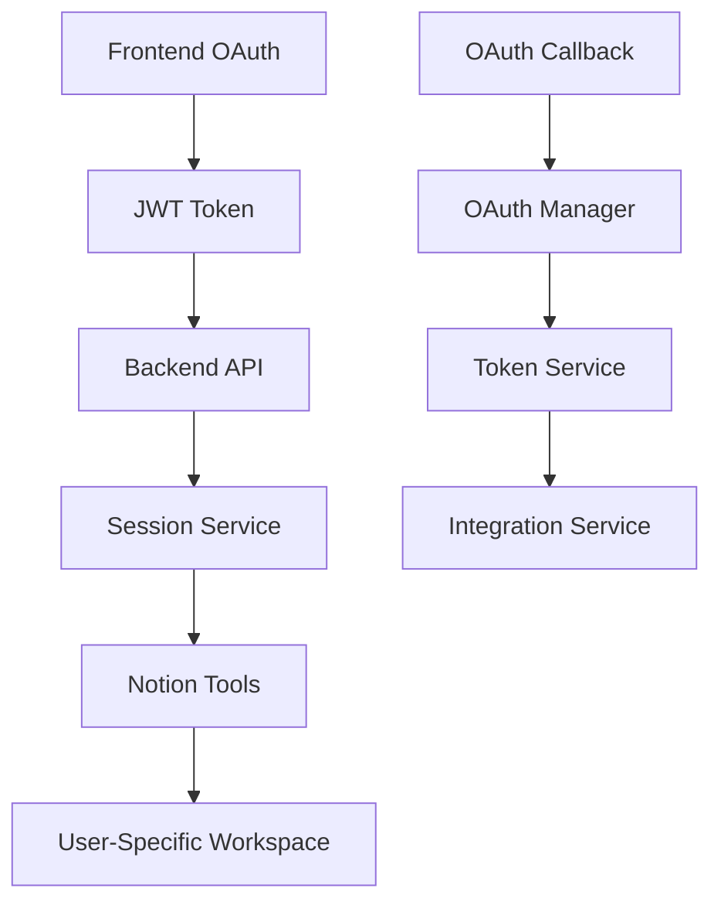
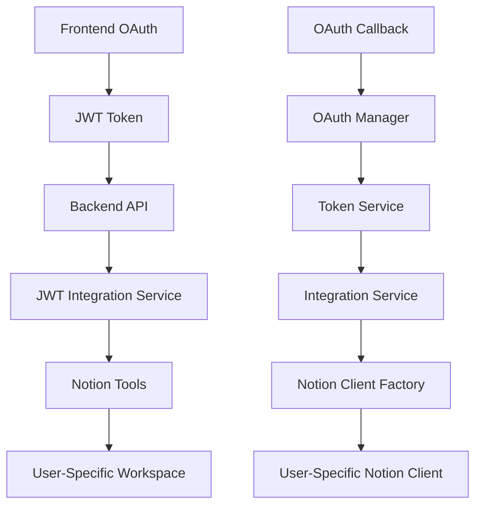

# Task 067 Technical Implementation: Notion OAuth Frontend Integration

## 🏗️ **Architecture Overview**

### **Current Architecture**



### **Target Architecture**



## 🔧 **Technical Implementation Details**

### **Phase 1: JWT Integration Service**

#### **1.1 JWT Integration Service Implementation**

**File**: `src/personal_assistant/tools/notion_pages/jwt_integration.py`

```python
"""
JWT Integration Service for Notion Tools

This service provides JWT token-based user identification for Notion tools,
replacing the session_id parameter approach with JWT token extraction.
"""

from typing import Dict, Any, Optional
from fastapi import Request, HTTPException, status
from personal_assistant.auth.jwt_service import jwt_service
from personal_assistant.auth.auth_utils import AuthUtils
from personal_assistant.config.logging_config import get_logger

logger = get_logger(__name__)


class NotionJWTIntegration:
    """JWT integration service for Notion tools"""

    @staticmethod
    async def get_user_id_from_request(request: Request) -> int:
        """
        Extract user ID from JWT token in request headers.

        Args:
            request: FastAPI request object

        Returns:
            User ID extracted from JWT token

        Raises:
            HTTPException: If token is invalid, expired, or missing
        """
        try:
            # Extract token from Authorization header
            token = AuthUtils.extract_token_from_header(request)
            if not token:
                raise HTTPException(
                    status_code=status.HTTP_401_UNAUTHORIZED,
                    detail="Authentication required: JWT token missing"
                )

            # Validate and decode token
            payload = jwt_service.verify_access_token(token)

            # Extract user ID from payload
            user_id = AuthUtils.get_user_id_from_token(payload)
            if not user_id:
                raise HTTPException(
                    status_code=status.HTTP_401_UNAUTHORIZED,
                    detail="Invalid token: user ID not found"
                )

            logger.debug(f"Successfully extracted user ID {user_id} from JWT token")
            return user_id

        except HTTPException:
            # Re-raise HTTP exceptions as-is
            raise
        except Exception as e:
            logger.error(f"Error extracting user ID from JWT token: {e}")
            raise HTTPException(
                status_code=status.HTTP_401_UNAUTHORIZED,
                detail="Token validation failed"
            )

    @staticmethod
    async def get_user_context_from_request(request: Request) -> Dict[str, Any]:
        """
        Extract complete user context from JWT token.

        Args:
            request: FastAPI request object

        Returns:
            Dictionary containing user context (user_id, email, full_name)

        Raises:
            HTTPException: If token is invalid or missing
        """
        try:
            # Extract token from Authorization header
            token = AuthUtils.extract_token_from_header(request)
            if not token:
                raise HTTPException(
                    status_code=status.HTTP_401_UNAUTHORIZED,
                    detail="Authentication required: JWT token missing"
                )

            # Validate and decode token
            payload = jwt_service.verify_access_token(token)

            # Extract user context
            user_id = AuthUtils.get_user_id_from_token(payload)
            email = AuthUtils.get_user_email_from_token(payload)
            full_name = payload.get("full_name", "")

            if not user_id:
                raise HTTPException(
                    status_code=status.HTTP_401_UNAUTHORIZED,
                    detail="Invalid token: user ID not found"
                )

            context = {
                "user_id": user_id,
                "email": email,
                "full_name": full_name
            }

            logger.debug(f"Successfully extracted user context: {context}")
            return context

        except HTTPException:
            # Re-raise HTTP exceptions as-is
            raise
        except Exception as e:
            logger.error(f"Error extracting user context from JWT token: {e}")
            raise HTTPException(
                status_code=status.HTTP_401_UNAUTHORIZED,
                detail="Token validation failed"
            )

    @staticmethod
    async def validate_notion_access(request: Request) -> bool:
        """
        Validate that user has Notion OAuth integration.

        Args:
            request: FastAPI request object

        Returns:
            True if user has Notion access, False otherwise
        """
        try:
            user_id = await NotionJWTIntegration.get_user_id_from_request(request)

            # TODO: Check if user has Notion OAuth integration
            # This would integrate with OAuthIntegrationService
            # For now, return True (assume user has access)
            return True

        except HTTPException:
            return False
        except Exception as e:
            logger.error(f"Error validating Notion access: {e}")
            return False


# Global instance for easy access
notion_jwt_integration = NotionJWTIntegration()
```

#### **1.2 Unit Tests for JWT Integration**

**File**: `tests/unit/test_notion_jwt_integration.py`

```python
"""
Unit tests for Notion JWT Integration Service
"""

import pytest
from unittest.mock import Mock, patch
from fastapi import Request, HTTPException

from src.personal_assistant.tools.notion_pages.jwt_integration import NotionJWTIntegration


class TestNotionJWTIntegration:
    """Test cases for NotionJWTIntegration"""

    @pytest.fixture
    def mock_request(self):
        """Create mock FastAPI request"""
        request = Mock(spec=Request)
        request.headers = {}
        return request

    @pytest.mark.asyncio
    async def test_get_user_id_from_request_success(self, mock_request):
        """Test successful user ID extraction"""
        mock_request.headers = {"Authorization": "Bearer valid_token"}

        with patch('src.personal_assistant.tools.notion_pages.jwt_integration.AuthUtils') as mock_auth_utils, \
             patch('src.personal_assistant.tools.notion_pages.jwt_integration.jwt_service') as mock_jwt_service:

            # Setup mocks
            mock_auth_utils.extract_token_from_header.return_value = "valid_token"
            mock_jwt_service.verify_access_token.return_value = {"user_id": 123, "email": "test@example.com"}
            mock_auth_utils.get_user_id_from_token.return_value = 123

            # Test
            result = await NotionJWTIntegration.get_user_id_from_request(mock_request)

            # Assertions
            assert result == 123
            mock_auth_utils.extract_token_from_header.assert_called_once_with(mock_request)
            mock_jwt_service.verify_access_token.assert_called_once_with("valid_token")
            mock_auth_utils.get_user_id_from_token.assert_called_once()

    @pytest.mark.asyncio
    async def test_get_user_id_from_request_missing_token(self, mock_request):
        """Test error when token is missing"""
        mock_request.headers = {}

        with patch('src.personal_assistant.tools.notion_pages.jwt_integration.AuthUtils') as mock_auth_utils:
            mock_auth_utils.extract_token_from_header.return_value = None

            with pytest.raises(HTTPException) as exc_info:
                await NotionJWTIntegration.get_user_id_from_request(mock_request)

            assert exc_info.value.status_code == 401
            assert "Authentication required" in str(exc_info.value.detail)

    @pytest.mark.asyncio
    async def test_get_user_id_from_request_invalid_token(self, mock_request):
        """Test error when token is invalid"""
        mock_request.headers = {"Authorization": "Bearer invalid_token"}

        with patch('src.personal_assistant.tools.notion_pages.jwt_integration.AuthUtils') as mock_auth_utils, \
             patch('src.personal_assistant.tools.notion_pages.jwt_integration.jwt_service') as mock_jwt_service:

            mock_auth_utils.extract_token_from_header.return_value = "invalid_token"
            mock_jwt_service.verify_access_token.side_effect = HTTPException(
                status_code=401, detail="Invalid token"
            )

            with pytest.raises(HTTPException) as exc_info:
                await NotionJWTIntegration.get_user_id_from_request(mock_request)

            assert exc_info.value.status_code == 401
            assert "Invalid token" in str(exc_info.value.detail)

    @pytest.mark.asyncio
    async def test_get_user_context_from_request_success(self, mock_request):
        """Test successful user context extraction"""
        mock_request.headers = {"Authorization": "Bearer valid_token"}

        with patch('src.personal_assistant.tools.notion_pages.jwt_integration.AuthUtils') as mock_auth_utils, \
             patch('src.personal_assistant.tools.notion_pages.jwt_integration.jwt_service') as mock_jwt_service:

            # Setup mocks
            mock_auth_utils.extract_token_from_header.return_value = "valid_token"
            mock_jwt_service.verify_access_token.return_value = {
                "user_id": 123,
                "email": "test@example.com",
                "full_name": "Test User"
            }
            mock_auth_utils.get_user_id_from_token.return_value = 123
            mock_auth_utils.get_user_email_from_token.return_value = "test@example.com"

            # Test
            result = await NotionJWTIntegration.get_user_context_from_request(mock_request)

            # Assertions
            assert result["user_id"] == 123
            assert result["email"] == "test@example.com"
            assert result["full_name"] == "Test User"

    @pytest.mark.asyncio
    async def test_validate_notion_access_success(self, mock_request):
        """Test successful Notion access validation"""
        with patch.object(NotionJWTIntegration, 'get_user_id_from_request', return_value=123):
            result = await NotionJWTIntegration.validate_notion_access(mock_request)
            assert result is True

    @pytest.mark.asyncio
    async def test_validate_notion_access_failure(self, mock_request):
        """Test failed Notion access validation"""
        with patch.object(NotionJWTIntegration, 'get_user_id_from_request',
                         side_effect=HTTPException(status_code=401, detail="Invalid token")):
            result = await NotionJWTIntegration.validate_notion_access(mock_request)
            assert result is False
```

### **Phase 2: Tool Parameter Updates**

#### **2.1 Updated Notion Tools**

**File**: `src/personal_assistant/tools/notion_pages/notion_pages_tool_user_specific.py`

```python
# Updated tool parameters (remove session_id)
self.create_note_page_tool = Tool(
    name="create_note_page",
    func=self.create_note_page,
    description="Create a new note page under the user's Personal Assistant page",
    parameters={
        "type": "object",
        "properties": {
            "title": {
                "type": "string",
                "description": "Title of the note page (required)",
            },
            "content": {
                "type": "string",
                "description": "Initial content for the note page (optional)",
            },
        },
        "required": ["title"],
    },
)

# Updated method signature
async def create_note_page(
    self,
    title: str,
    content: Optional[str] = None,
    request: Optional[Request] = None,
    db: Optional[AsyncSession] = None
) -> Dict[str, Any]:
    """
    Create a new note page under the user's Personal Assistant page.

    Args:
        title: Title of the note page
        content: Initial content for the note page
        request: FastAPI request object (for JWT token extraction)
        db: Database session

    Returns:
        Dictionary with page information or error details
    """
    try:
        if not db:
            return {"error": "Database session required"}

        if not request:
            return {"error": "Request object required for authentication"}

        # Get user ID from JWT token
        user_id = await notion_jwt_integration.get_user_id_from_request(request)

        # Ensure user has Personal Assistant page
        main_page_id = await ensure_user_main_page_exists(db, user_id)

        # Create the note page
        page_id = await self.notion_internal.create_user_page(
            db, user_id, title, content, main_page_id
        )

        # Update table of contents
        await self._update_table_of_contents(db, user_id)

        return {
            "success": True,
            "page_id": page_id,
            "title": title,
            "message": f"Note page '{title}' created successfully"
        }

    except HTTPException as e:
        return {"error": f"Authentication error: {e.detail}"}
    except NotionNotConnectedError:
        return {"error": "User must connect Notion account first"}
    except NotionWorkspaceError as e:
        return {"error": f"Notion workspace error: {e}"}
    except Exception as e:
        logger.error(f"Error creating note page: {e}")
        return {"error": f"Failed to create note page: {e}"}
```

#### **2.2 Updated Internal Functions**

**File**: `src/personal_assistant/tools/notion_pages/notion_internal_user_specific.py`

```python
# Updated function signatures (remove session_id)
async def ensure_user_main_page_exists(
    self,
    db: AsyncSession,
    user_id: int
) -> str:
    """
    Ensure the user's Personal Assistant page exists, create if it doesn't.

    Args:
        db: Database session
        user_id: User identifier

    Returns:
        Page ID of the user's Personal Assistant page
    """
    try:
        # Use workspace manager to ensure user has Personal Assistant page
        return await self.workspace_manager.ensure_user_root_page(
            db, user_id
        )

    except Exception as e:
        logger.error(f"Error ensuring user main page exists for user {user_id}: {e}")
        if isinstance(e, (NotionNotConnectedError, NotionWorkspaceError)):
            raise
        raise NotionWorkspaceError(f"Failed to ensure user main page: {e}")

# Updated convenience functions
async def ensure_user_main_page_exists(
    db: AsyncSession,
    user_id: int
) -> str:
    """Ensure the user's Personal Assistant page exists"""
    return await _user_specific_notion.ensure_user_main_page_exists(db, user_id)

async def get_user_notion_client(
    db: AsyncSession,
    user_id: int
) -> Client:
    """Get user-specific Notion client"""
    return await _user_specific_notion.get_user_client(db, user_id)
```

### **Phase 3: OAuth Route Verification**

#### **3.1 OAuth Callback Route Verification**

**File**: `src/apps/fastapi_app/routes/oauth.py`

```python
# Verify existing OAuth callback route
@router.get("/callback")
async def oauth_callback(
    state: str = Query(..., description="OAuth state parameter"),
    code: str = Query(..., description="OAuth authorization code"),
    provider: Optional[str] = Query(
        None,
        description="OAuth provider name (optional, will be extracted from state if not provided)",
    ),
    db: AsyncSession = Depends(get_db),
    oauth_manager: OAuthManager = Depends(get_oauth_manager),
):
    """
    Handle OAuth callback and complete the flow.

    This endpoint is called by the OAuth provider after user authorization.
    Supports Notion OAuth callbacks.
    """
    try:
        # If provider is not provided, extract it from the state token
        if not provider:
            state_obj = await oauth_manager.security_service.get_state_by_token(
                db=db, state_token=state
            )
            if not state_obj:
                raise HTTPException(
                    status_code=status.HTTP_400_BAD_REQUEST,
                    detail="Invalid state token",
                )
            provider = state_obj.provider

        # Handle OAuth callback
        result = await oauth_manager.handle_oauth_callback(
            db=db, state_token=state, authorization_code=code, provider_name=provider
        )

        # Return success response
        return {
            "message": "OAuth integration completed successfully",
            "integration_id": result["integration_id"],
            "provider": result["provider"],
            "status": result["status"],
        }

    except OAuthError as e:
        raise HTTPException(status_code=status.HTTP_400_BAD_REQUEST, detail=str(e))
    except Exception as e:
        raise HTTPException(
            status_code=status.HTTP_500_INTERNAL_SERVER_ERROR,
            detail=f"Failed to complete OAuth flow: {str(e)}",
        )
```

#### **3.2 Integration Testing**

**File**: `tests/integration/test_notion_oauth_integration.py`

```python
"""
Integration tests for Notion OAuth frontend integration
"""

import pytest
from fastapi.testclient import TestClient
from unittest.mock import Mock, patch

from src.apps.fastapi_app.main import app

client = TestClient(app)


class TestNotionOAuthIntegration:
    """Integration tests for Notion OAuth"""

    def test_oauth_callback_route_exists(self):
        """Test that OAuth callback route exists"""
        response = client.get("/api/v1/oauth/callback?state=test&code=test")
        # Should not return 404 (route exists)
        assert response.status_code != 404

    def test_notion_oauth_flow(self):
        """Test complete Notion OAuth flow"""
        # Test OAuth initiation
        with patch('src.personal_assistant.oauth.oauth_manager.OAuthManager') as mock_manager:
            mock_manager.return_value.initiate_oauth_flow.return_value = {
                "authorization_url": "https://api.notion.com/v1/oauth/authorize",
                "state_token": "test_state",
                "provider": "notion",
                "scopes": ["read", "write"]
            }

            response = client.post("/api/v1/oauth/initiate", json={
                "provider": "notion",
                "scopes": ["read", "write"]
            })

            assert response.status_code == 200
            data = response.json()
            assert data["provider"] == "notion"
            assert "authorization_url" in data

    def test_notion_tools_with_jwt(self):
        """Test Notion tools with JWT authentication"""
        # Mock JWT token
        mock_token = "mock_jwt_token"

        with patch('src.personal_assistant.tools.notion_pages.jwt_integration.notion_jwt_integration') as mock_jwt:
            mock_jwt.get_user_id_from_request.return_value = 123

            # Test create note page
            response = client.post("/api/v1/tools/notion/create_note_page",
                                 headers={"Authorization": f"Bearer {mock_token}"},
                                 json={"title": "Test Page"})

            # Should not return 401 (authentication works)
            assert response.status_code != 401
```

## 🔧 **Configuration Updates**

### **Environment Variables**

```bash
# JWT Configuration (already exists)
JWT_SECRET_KEY=your_jwt_secret_key
ACCESS_TOKEN_EXPIRE_MINUTES=15
REFRESH_TOKEN_EXPIRE_DAYS=7

# OAuth Configuration (already exists)
NOTION_CLIENT_ID=your_notion_client_id
NOTION_CLIENT_SECRET=your_notion_client_secret
NOTION_REDIRECT_URI=http://localhost:8000/api/v1/oauth/callback/notion
```

### **FastAPI Route Updates**

```python
# Add JWT authentication to Notion tool routes
from fastapi import Depends, Request
from personal_assistant.auth.decorators import require_authenticated

@router.post("/tools/notion/create_note_page")
@require_authenticated()
async def create_note_page_endpoint(
    request: Request,
    title: str,
    content: Optional[str] = None,
    db: AsyncSession = Depends(get_db)
):
    """Create a new note page"""
    tool = UserSpecificNotionPagesTool()
    return await tool.create_note_page(title, content, request, db)
```

## 📊 **Performance Considerations**

### **JWT Token Validation Performance**

- Use existing JWT service (already optimized)
- Consider caching for frequently accessed tokens
- Monitor token validation performance

### **Database Query Optimization**

- Use existing OAuth integration queries
- Minimize database calls in JWT integration
- Cache user context when possible

### **Error Handling Performance**

- Fast fail for invalid tokens
- Proper error logging without performance impact
- Graceful degradation for OAuth failures

## 🚨 **Error Handling Strategy**

### **Authentication Errors**

- Clear error messages for missing tokens
- Proper HTTP status codes (401, 403)
- User-friendly error responses

### **OAuth Errors**

- Handle OAuth provider errors gracefully
- Provide clear error messages
- Support error recovery

### **Notion API Errors**

- Handle Notion API rate limits
- Retry logic for transient errors
- Clear error messages for users

## 📈 **Monitoring and Observability**

### **Metrics to Track**

- JWT token validation success rate
- OAuth callback success rate
- Notion tool operation success rate
- User authentication errors

### **Logging Strategy**

- Log JWT token validation attempts
- Log OAuth flow completions
- Log Notion tool operations
- Log error scenarios with context

### **Alerting**

- Alert on high JWT validation failure rates
- Alert on OAuth callback failures
- Alert on Notion API errors
- Alert on authentication system issues

## 🎯 **Deployment Strategy**

### **Staging Deployment**

1. Deploy JWT integration service
2. Update Notion tools
3. Test OAuth flow
4. Verify frontend integration

### **Production Deployment**

1. Deploy with feature flags
2. Gradual rollout to users
3. Monitor performance and errors
4. Full rollout after verification

### **Rollback Plan**

1. Keep old session_id support temporarily
2. Feature flag to switch between approaches
3. Quick rollback capability
4. Monitor for issues

## 📚 **Documentation Updates**

### **API Documentation**

- Update tool parameters
- Document JWT authentication
- Update error responses
- Add OAuth flow documentation

### **Developer Documentation**

- JWT integration guide
- OAuth flow documentation
- Error handling guide
- Testing guide

### **User Documentation**

- OAuth connection guide
- Notion integration guide
- Troubleshooting guide
- FAQ updates
