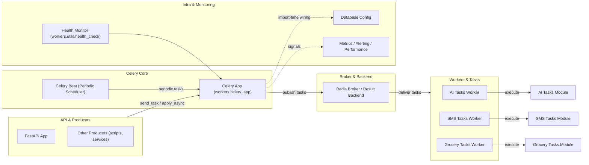

## Celery Component Refactor – Onboarding

### Context and goal

The current Celery setup in the Personal Assistant project is functional but has grown complex over time:

- Import-time side effects (environment loading, database initialization, feature wiring) are concentrated in `celery_app.py`.
- Asynchronous work is handled with multiple patterns (manual event loop management with `nest_asyncio` and native `async def` tasks).
- Documentation and tests for Celery have partially drifted from the actual implementation.

The goal of this task is to:

- **Understand and document** the existing Celery component thoroughly.
- **Identify weaknesses and design tradeoffs** in how Celery is configured and used.
- **Lay out refactor options** aligned with modern Celery 5.6.2 guidance.

This onboarding doc is the entry point for anyone working on Celery refactors in this repo.

Relevant upstream docs:

- Celery 5.6.2 API Reference – `https://docs.celeryq.dev/en/main/reference/index.html`
- Celery 5.6.2 User Guide – `https://docs.celeryq.dev/en/main/userguide/index.html`

### Scope of the Celery component

The Celery “component” in this project spans:

- **Celery application definition and configuration**
- **Task modules** (AI, SMS, grocery/flyer scraping, etc.)
- **Redis and environment configuration related to Celery**
- **Health checks, monitoring, and scheduling abstractions**
- **Tests and troubleshooting documentation**

We are **not** refactoring the business logic of AI tasks or grocery scraping itself in this task; we are documenting how those pieces are wired into Celery and where the Celery boundaries sit.

### Key code locations

#### Core app & package entrypoints

- `src/personal_assistant/celery/` (package)  
  **Canonical Celery app** (post-refactor). `celery/__init__.py` creates the app, loads config from `personal_assistant.celery.config`, and calls `autodiscover_tasks(["personal_assistant.workers"])`. Use `-A personal_assistant.celery` for worker and beat.

- `src/personal_assistant/celery/config.py`  
  **Pure configuration**: broker/result backend, queues (`ai_tasks`, `sms_tasks`, `grocery_tasks`), task routes, beat_schedule. No app creation or import-time side effects.

- `src/personal_assistant/workers/celery_app.py`  
  **Backward-compatible adapter.** Imports `app` from `personal_assistant.celery`; keeps signal handlers and `initialize_enhanced_features()`. Task modules import from here and get the same app.

- `src/personal_assistant/workers/__init__.py`  
  Package entrypoint exposing the Celery `app`, schedulers, task modules, and health helpers (`get_system_status`, `get_scheduler_status`, `initialize_workers`).

#### Task modules

- `src/personal_assistant/workers/tasks/ai_tasks.py`  
  AI-specific tasks driven by Celery beat:
  - `process_due_ai_tasks`
  - `create_ai_reminder`
  - `create_periodic_ai_task`
  - `test_scheduler_connection`
  - `cleanup_old_logs`

- `src/personal_assistant/workers/tasks/grocery_tasks.py`  
  Grocery-related tasks:
  - `fetch_iga_flyer_data`
  - `test_grocery_task_connection`
  - `cleanup_expired_grocery_deals`

- `src/personal_assistant/workers/tasks/sms_tasks.py`  
  SMS retry and health tasks:
  - `process_sms_retries`
  - `cleanup_old_retries`
  - `sms_retry_health_check`

> Note: there is also a task registry and additional helpers under `src/personal_assistant/workers/tasks/` that are used by tests and initialization.

#### Supporting infrastructure

- `src/personal_assistant/config/redis.py`  
  Redis clients for:
  - Celery broker / result backend (`settings.CELERY_BROKER_URL`)
  - Session storage (sync + async clients)
  - Redis health checks.

- `src/personal_assistant/workers/utils/health_check.py`  
  `HealthMonitor` that checks database, Celery, and Twilio health. The Celery check imports `celery_app` and inspects its broker configuration.

- `src/personal_assistant/tools/ai_scheduler/core/scheduler.py`  
  `TaskScheduler` wrapper that starts Celery worker/beat for AI tasks and exposes scheduler status and statistics.

#### Tests and troubleshooting docs

- `tests/unit/test_workers/test_celery_app.py`  
  (Currently skipped.) Historically validated Celery configuration, routing, beat schedule, logging, Redis config, and task registration.

- `tests/unit/test_workers/test_queue_routing.py`  
  Focused on Celery queue routing and Redis configuration, with regression tests for queue naming issues.

- `tests/integration/test_celery_integration.py`  
  Integration tests validating:
  - Beat → Redis → Worker flow
  - Correct queue routing to `ai_tasks` vs default `celery` queue
  - Queue isolation and naming.

- `tests/workers/test_system_initialization.py`  
  Verifies that the workers package, Celery app, tasks, utils, schedulers, and task registry can all be imported and initialized coherently.

- `docs/troubleshooting/celery_queue_issues.md`  
  Operational guide describing historic Celery queue problems (queue routing mismatch, suffixed Redis queue names, etc.) and the steps to diagnose and fix them.

- `docs/architecture/tasks/062_celery_redis_system_validation/old_files/celery_config.py`  
  Legacy Celery config module (fully commented) that illustrates a cleaner, modular configuration style.

#### Miscellaneous Celery-related artifacts

- `celery_test.py` (repo root) – small test harness or experiment for Celery.
- `docs/architecture/tasks/070_celery_worker_queue_routing_fix/` – prior architecture task focused on queue routing problems and their resolution.

### High-level architecture diagram

The following diagram shows the high-level flow of Celery-related responsibilities in the system:

Key points from this diagram:

- Producers (mainly the FastAPI app) and Celery Beat both enqueue work into the **same Celery application**.
- Redis acts as both the **broker** (task queue) and the **result backend**.
- Different worker processes listen on specific queues (`ai_tasks`, `sms_tasks`, `grocery_tasks`) as configured in `celery_app.py`.
- Additional infrastructure such as database configuration, health monitoring, and metrics/alerting are wired to Celery via imports and signal handlers.

### How to use this task folder

- Start with this `onboarding.md` to understand scope and where to look in the codebase.
- Use `observations.md` in this same folder to record:
  - Detailed findings about current behavior and weaknesses.
  - Concrete refactor options and tradeoffs.
- Once a direction is chosen, create an `IMPLEMENTATION_PLAN.md` (or equivalent) that describes:
  - Exact code changes per file.
  - Migration and deployment steps.
  - Testing and rollback strategies.

### Refactor completed (Option B)

The refactor to a canonical Celery 5.6 layout is complete. Summary of the new layout:

- **Canonical app:** `personal_assistant.celery` — create the app in `celery/__init__.py`, load config from `personal_assistant.celery.config`, and run `autodiscover_tasks(["personal_assistant.workers"])`. All worker and beat invocations should use `-A personal_assistant.celery`.
- **Config:** `personal_assistant.celery.config` — broker, result backend, queues (`ai_tasks`, `sms_tasks`, `grocery_tasks`), routes, beat_schedule, and worker/result options only. No app or heavy imports.
- **Adapter:** `personal_assistant.workers.celery_app` — re-exports `app` from `personal_assistant.celery` and retains signal handlers and `initialize_enhanced_features()`. Task modules continue to import from `..celery_app` for compatibility; they receive the same app instance.
- **Package root:** `personal_assistant.__init__` no longer imports or exposes Celery, so importing `personal_assistant` does not pull in workers or the Celery chain.
- **Docker/CLI:** Dev, stage, and prod compose files use `-A personal_assistant.celery` for worker and beat. Dev worker listens on `--queues=ai_tasks,sms_tasks,grocery_tasks`; prod `ai_worker` uses `--queues=ai_tasks` only.

Differences from the pre-refactor layout: configuration and app creation are separated from the workers package; the single source of truth for the app and config is `personal_assistant.celery` + `personal_assistant.celery.config`; `workers.celery_app` is a thin adapter for signals and backward-compatible imports.

