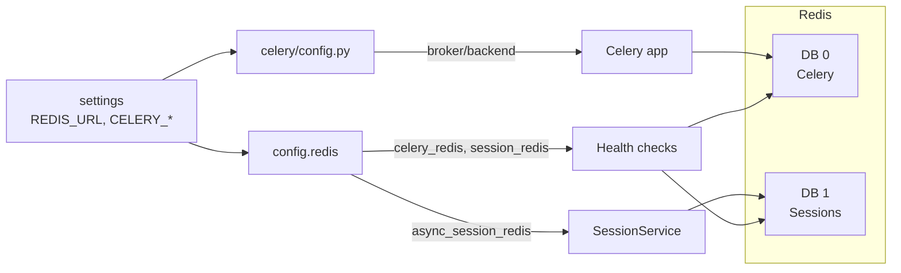

# Task 102: Redis Implementation Improvement

## Task overview

**Task ID:** 102  
**Title:** Redis Implementation Improvement  
**Status:** Completed  
**Priority:** Medium  
**Dependencies:** Task 100 (Celery refactor) completed; Redis is used by Celery and session storage.

### Objective (achieved)

- **Single source of truth:** `REDIS_URL` in settings; session URL derived from `REDIS_URL` + `SESSION_REDIS_DB`; Celery broker/result backend and `config.redis` use the same source (settings/env).
- **Session Redis** works in all environments (Docker, production) via env-driven URL; no hardcoded localhost.
- Configuration, health checks, and unit tests are consistent and documented (`config/env.example`, task onboarding).

Business logic (session semantics, Celery tasks) unchanged; only configuration, URL derivation, and wiring were updated.

---

## Architecture (after Task 102)

Single config source (settings with `REDIS_URL`); session URL derived from `REDIS_URL` + `SESSION_REDIS_DB`; Celery aligned to same source.

## Integrations (summary)

| Integration        | Purpose                    | Config source                          |
|--------------------|----------------------------|----------------------------------------|
| Celery broker      | Task queue + result store  | `celery/config.py` (CELERY_BROKER_URL or REDIS_URL) |
| Celery health      | Ping broker                | `config.redis.celery_redis` (settings) |
| Session storage    | User sessions (FastAPI)   | `config.redis` (derived from REDIS_URL + SESSION_REDIS_DB) |
| Session health     | Ping session Redis        | `config.redis` async client (same derived URL) |

---

## Good things (retained)

- Session and Celery use different Redis DBs (1 vs 0); key isolation.
- Async and sync clients for sessions; health checks for both Celery and session Redis.
- SessionService uses sound Redis patterns (strings + TTL, sets for user session index).
- Docker Compose passes `REDIS_URL` (and Celery vars) for api, worker, scheduler; single source of truth in env.

---

## Implemented changes

1. **`REDIS_URL`** in settings; session URL derived from `REDIS_URL` + `SESSION_REDIS_DB` via `get_session_redis_url()` in `config/redis.py`.
2. **Celery config** aligned to same source: `celery/config.py` uses `CELERY_BROKER_URL` with fallback to `REDIS_URL`.
3. **Environment-driven session Redis URL** — no hardcoded localhost; Docker and production use `REDIS_URL` from env.
4. **Health checks** use the same module-level clients as runtime (no second hardcoded URL).
5. **Unit tests** in `tests/unit/test_config/test_redis_config.py` for REDIS_URL, derived session URL, same host, no hardcoded localhost.
6. **Docs:** `config/env.example` documents `REDIS_URL` and `SESSION_REDIS_DB`; task onboarding and README updated.

---

## Key files

- `src/personal_assistant/config/redis.py` — clients, health, getters.
- `src/personal_assistant/config/settings.py` — REDIS_URL, CELERY_*, SESSION_REDIS_DB.
- `src/personal_assistant/celery/config.py` — Celery broker/backend.
- `src/personal_assistant/auth/session_service.py` — session Redis usage.
- `src/apps/fastapi_app/routes/sessions.py` — session API and Redis injection.
- `docker/docker-compose.*.yml` — Redis service and env vars.

---

## Onboarding

Use **`onboarding.md`** in this folder for full context: current integrations, good/bad, key code locations, and possible changes. It is written so a new session can continue the task from this doc.
