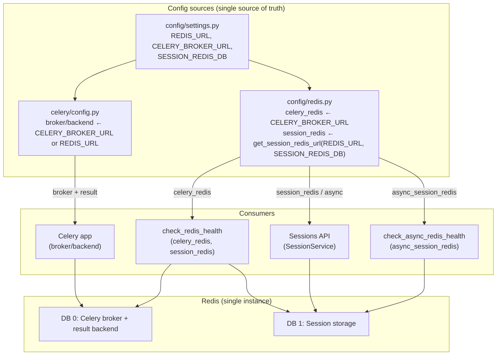

# Task 102 Onboarding: Redis Implementation Improvement

## Context and goal

**AI models are geniuses who start from scratch on every task.** — Noam Brown

This document onboards you to the current Redis usage in the Personal Assistant project and prepares you to plan and implement improvements. The goal is to:

- **Document** all current Redis integrations, their behavior, and configuration.
- **Identify** what works well and what is fragile or inconsistent.
- **Propose** concrete improvements (single source of truth, env-aware URLs, pooling, tests) without changing business logic.

This onboarding is the entry point for anyone working on Redis improvements in this repo.

---

## Implemented behavior (Task 102 completed)

- **Single source of truth:** `settings.REDIS_URL` (default `redis://localhost:6379/0`) is the base Redis URL. It is documented in `config/env.example` and passed in Docker via `REDIS_URL` for api, worker, and scheduler.
- **Session Redis URL:** Derived from `REDIS_URL` + `SESSION_REDIS_DB` via `get_session_redis_url()` in `config/redis.py`. Session clients (`session_redis`, `async_session_redis`) use this derived URL—no hardcoded localhost—so Docker and production work with the same env.
- **Celery alignment:** Celery broker and result backend use `settings.CELERY_BROKER_URL` / env, with fallback to `settings.REDIS_URL` in `celery/config.py`, so Celery and `config.redis` can share the same Redis host. `config.redis.celery_redis` is built from `settings.CELERY_BROKER_URL` (which can be set from the same base as `REDIS_URL` in env).
- **Health checks:** `check_redis_health()` and `check_async_redis_health()` use the same module-level clients (`celery_redis`, `session_redis`, `async_session_redis`) as runtime; no second hardcoded URL.

**Relevant upstream docs:**

- Redis: https://redis.io/docs/
- redis-py: https://redis.readthedocs.io/en/stable/
- Redis session storage: https://redis.io/solutions/session-store/

---

## Current Redis integrations (after Task 102)

**Diagram notes:** `REDIS_URL` in settings is the base; session URL is derived from it + `SESSION_REDIS_DB`. Celery uses `CELERY_BROKER_URL` (or fallback to `REDIS_URL`). All clients and health checks use the same config; session URL is env-driven (no hardcoded localhost).

### 1. Celery broker and result backend

- **Purpose:** Message broker and result backend for Celery workers (AI, SMS, grocery tasks).
- **Configuration (after Task 102):**
  - **Celery app:** `src/personal_assistant/celery/config.py` uses `settings.CELERY_BROKER_URL` with fallback to `getattr(settings, "REDIS_URL", "redis://localhost:6379/0")`, so Celery and settings share the same source.
  - **Config module:** `src/personal_assistant/config/redis.py` builds `celery_redis` from `settings.CELERY_BROKER_URL` (from `config/settings.py`; defaults align with `REDIS_URL`).
- **Usage:** `celery_redis` is used for health checks (`check_redis_health()`). Celery connects via the same URL source (settings/env).
- **Docker:** Compose sets `CELERY_BROKER_URL`, `CELERY_RESULT_BACKEND`, `REDIS_URL` to the same Redis URL for api, worker, scheduler (e.g. `redis://:redis_password@redis:6379/0` in dev).

### 2. Session storage (FastAPI / auth)

- **Purpose:** Store user session data (session id, user_id, device_info, TTL) and index sessions per user (set of session IDs).
- **Configuration (after Task 102):** `src/personal_assistant/config/redis.py` builds:
  - `session_redis` (sync) and `async_session_redis` (async) from **derived URL:** `get_session_redis_url(settings.REDIS_URL, settings.SESSION_REDIS_DB)` — same host/port as `REDIS_URL`, DB index from `SESSION_REDIS_DB` (default 1). No hardcoded localhost; env-driven for Docker/production.
- **Settings:** `config/settings.py` has `REDIS_URL` (single source of truth), `SESSION_REDIS_DB: int = 1`, `SESSION_EXPIRY_HOURS`, `SESSION_MAX_CONCURRENT`.
- **Usage:** `src/personal_assistant/auth/session_service.py` uses an async Redis client (injected). Commands: `setex`, `get`, `delete`, `sadd`, `srem`, `smembers`, `expire`. Keys: `session:{session_id}`, `user_sessions:{user_id}`. TTL in seconds from `SESSION_EXPIRY_HOURS`.
- **Injection:** `src/apps/fastapi_app/routes/sessions.py` uses `get_async_session_redis()` from `config.redis` and builds `SessionService(redis_client)`.

### 3. Health checks

- **Sync:** `config/redis.py` — `check_redis_health()` pings `celery_redis` and `session_redis`.
- **Async:** `check_async_redis_health()` pings `async_session_redis` only.
- **API:** Sessions route health (e.g. `/api/v1/sessions/health`) uses the session service’s Redis client and returns a "redis": "connected" style status.

### 4. Other references (no Redis client usage yet)

- **SMS router:** `src/personal_assistant/sms_router/middleware/webhook_validation.py` — comment about using Redis for rate limiting in production; not implemented.
- **SMS router config:** `src/personal_assistant/sms_router/config.py` — comment about Redis for caching.
- **Workers metrics:** `src/personal_assistant/workers/utils/metrics.py` — comment about getting queue lengths from Redis; not implemented.

---

## Good things about the current implementation

1. **Separation of concerns:** Sessions use a different Redis DB (`SESSION_REDIS_DB=1`) than Celery (db 0), reducing key collision and allowing different eviction/usage patterns.
2. **Async support:** Both sync and async Redis clients for sessions; FastAPI uses async client and `SessionService` is async.
3. **Health checks:** Explicit health for Celery and session Redis (sync and async).
4. **Session patterns:** `SessionService` uses appropriate Redis patterns: string keys with TTL (`setex`), sets for per-user session IDs, and expiry on the set key.
5. **Connection options:** `socket_connect_timeout`, `socket_timeout`, `retry_on_timeout` are set on clients in `config/redis.py`.
6. **Docker:** Compose correctly passes Redis URL and password for Celery (api, worker, scheduler); Celery and queue routing work in dev.

---

## Bad things / risks

1. **Two sources of truth for Celery Redis:**
   - Celery app uses `personal_assistant.celery.config` (env: `REDIS_URL` / broker URL).
   - `config.redis.celery_redis` uses `settings.CELERY_BROKER_URL`.
   - If env and settings drift (e.g. different compose vs app config), health check and Celery could point at different instances or DBs.

2. **Session Redis URL is hardcoded to localhost:**
   - Session clients use `f"redis://localhost:6379/{settings.SESSION_REDIS_DB}"`. There is no `REDIS_URL` or `SESSION_REDIS_URL` in settings.
   - In Docker or production, the API container must reach Redis by service name (e.g. `redis:6379`), so session storage would fail or connect to the wrong host.

3. **No single REDIS_URL in settings:**
   - Settings has `CELERY_BROKER_URL`, `CELERY_RESULT_BACKEND`, `SESSION_REDIS_DB` but not a generic `REDIS_URL`. Session URL cannot be derived from the same base URL as Celery for multi-environment consistency.

4. **Module-level client creation:**
   - Clients are created at import time in `config/redis.py`. No lazy init, no explicit connection pooling configuration, and no env-specific URL switching without code change.

5. **Celery config vs config.redis:**
   - Task 100 observations (e.g. `docs/architecture/tasks/100_celery_component_refactor/observations.md`) note that workers/celery_app and config.redis can disagree on Redis; post–Task 100 the canonical Celery config is `personal_assistant.celery.config`, but `config.redis.celery_redis` still uses settings and is used only for health.

6. **Mentioned but not implemented:**
   - SMS rate limiting and caching are mentioned as “use Redis” but not implemented; any future use will need a clear Redis URL and possibly a dedicated DB or key prefix.

---

## Key code locations

| Path | Role |
|------|------|
| `src/personal_assistant/config/redis.py` | Celery + session Redis clients (sync/async), health, getters. |
| `src/personal_assistant/config/settings.py` | `REDIS_URL`, `CELERY_BROKER_URL`, `CELERY_RESULT_BACKEND`, `SESSION_REDIS_DB`, session expiry/concurrency. |
| `src/personal_assistant/celery/config.py` | Celery broker/backend from settings (`CELERY_BROKER_URL` or fallback `REDIS_URL`). |
| `src/personal_assistant/auth/session_service.py` | Session CRUD and indexing via Redis (setex, get, delete, sadd, srem, smembers, expire). |
| `src/apps/fastapi_app/routes/sessions.py` | Session API; uses `get_async_session_redis()` and `SessionService`. |
| `docker/docker-compose.dev.yml` | Redis service; `CELERY_BROKER_URL`, `CELERY_RESULT_BACKEND`, `REDIS_URL` for api, worker, scheduler. |
| `docker/docker-compose.stage.yml`, `docker-compose.prod.yml` | Same pattern with stage/prod Redis URLs and passwords. |
| `tests/unit/test_workers/test_queue_routing.py` | Uses `redis.from_url(app.conf.broker_url)` for queue-name and connection tests. |

---

## Possible changes (for planning)

1. **Single source of truth for Redis URL**
   - Add `REDIS_URL` (and optionally `REDIS_PASSWORD` or keep in URL) to `config/settings.py` with a default.
   - Derive session Redis URL from `REDIS_URL` + `SESSION_REDIS_DB` (e.g. replace path/db in URL).
   - Align Celery config to use the same source (e.g. `celery/config.py` reads from settings or a shared helper) so broker, result backend, and health all agree.

2. **Session Redis URL from environment**
   - Use `REDIS_URL` (or a dedicated `SESSION_REDIS_URL` if needed) for session clients so Docker/production work without hardcoded localhost.

3. **Lazy or factory-based client creation**
   - Optionally create Redis clients lazily or via a small factory (e.g. `get_session_redis()`, `get_celery_redis()`) so URL and options come from settings/env at first use; keeps tests and multi-env easier.

4. **Connection pooling**
   - Document or configure connection pooling for sync/async clients (redis-py supports this); make pool size/timeouts configurable if needed.

5. **Health check consistency**
   - Single place that checks both “Celery Redis” and “session Redis” (and uses the same URLs as runtime); expose in API health if not already.

6. **Tests**
   - Unit tests for Redis config (URL derivation, DB index).
   - Integration tests for session create/get/invalidate and health (with a test Redis or mock).

7. **Documentation**
   - Document Redis usage: Celery vs session, DBs, keys, and required env vars (e.g. `REDIS_URL`, `SESSION_REDIS_DB`) in deployment and dev setup.

8. **Future: SMS rate limiting / caching**
   - If Redis is used for SMS rate limiting or caching, reuse the same URL/settings and define key prefix and DB to avoid collision with sessions and Celery.

9. **Deprecated Redis commands**
   - Session storage uses `setex` (redis-py). Redis recommends `SET key value EX seconds`; confirm redis-py behavior and switch if needed for future-proofing.

---

## Scope and out of scope

- **In scope:** Configuration, URL derivation, client creation, health checks, alignment between Celery and config.redis, tests and docs for Redis.
- **Out of scope:** Changing SessionService business logic (key layout, TTL, concurrency rules), changing Celery task logic, or implementing SMS rate limiting/caching (only plan for where Redis would plug in).

---

## References

- Task 100 Celery refactor (Redis two-sources note): `docs/architecture/tasks/100_celery_component_refactor/observations.md` (§4 Redis and configuration coupling).
- Task 062 Celery/Redis validation: `docs/architecture/tasks/062_celery_redis_system_validation/`.
- Redis implementation file list and doc pointers: see task README or repo “Redis” search for full file list.
