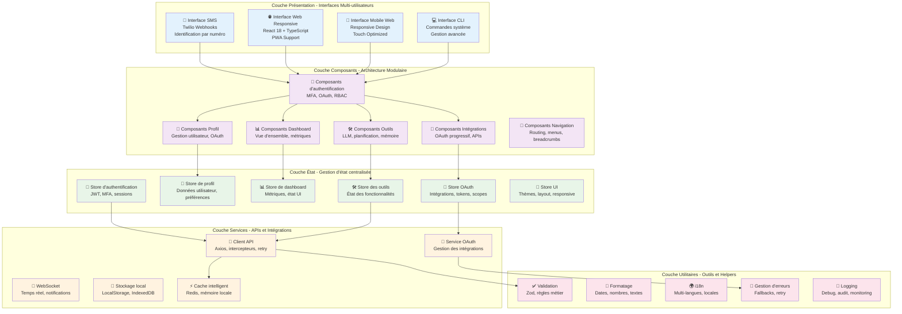
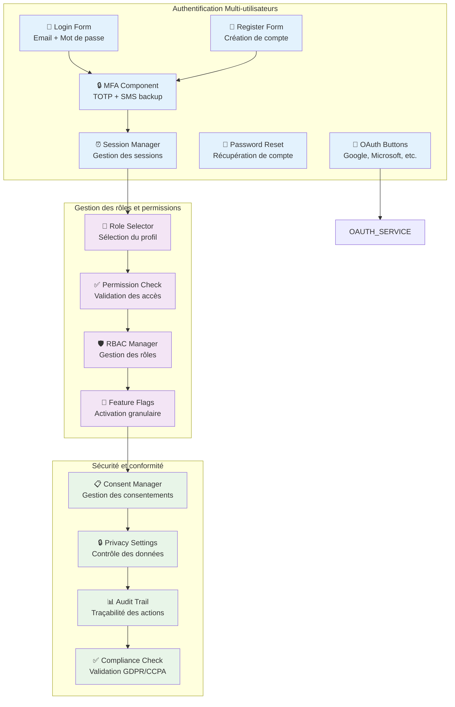
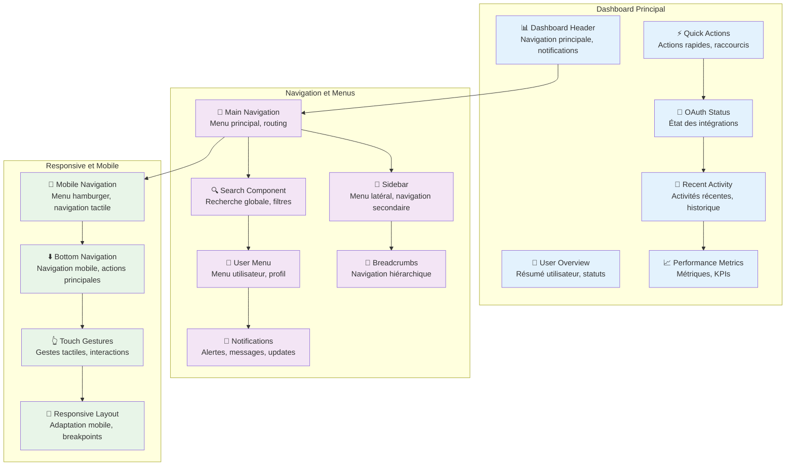
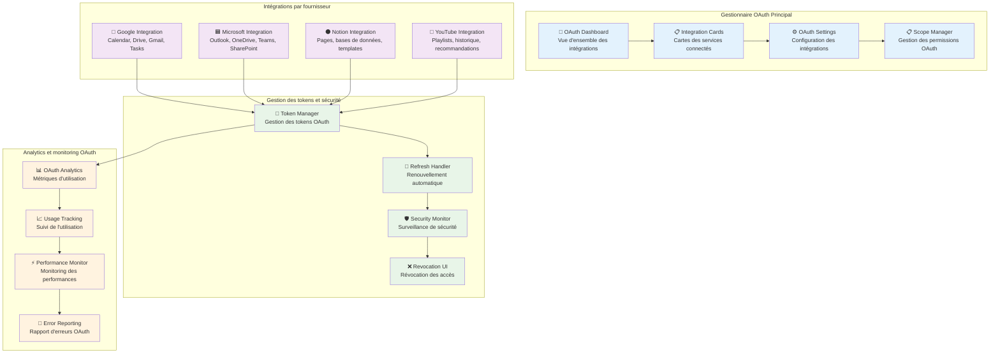
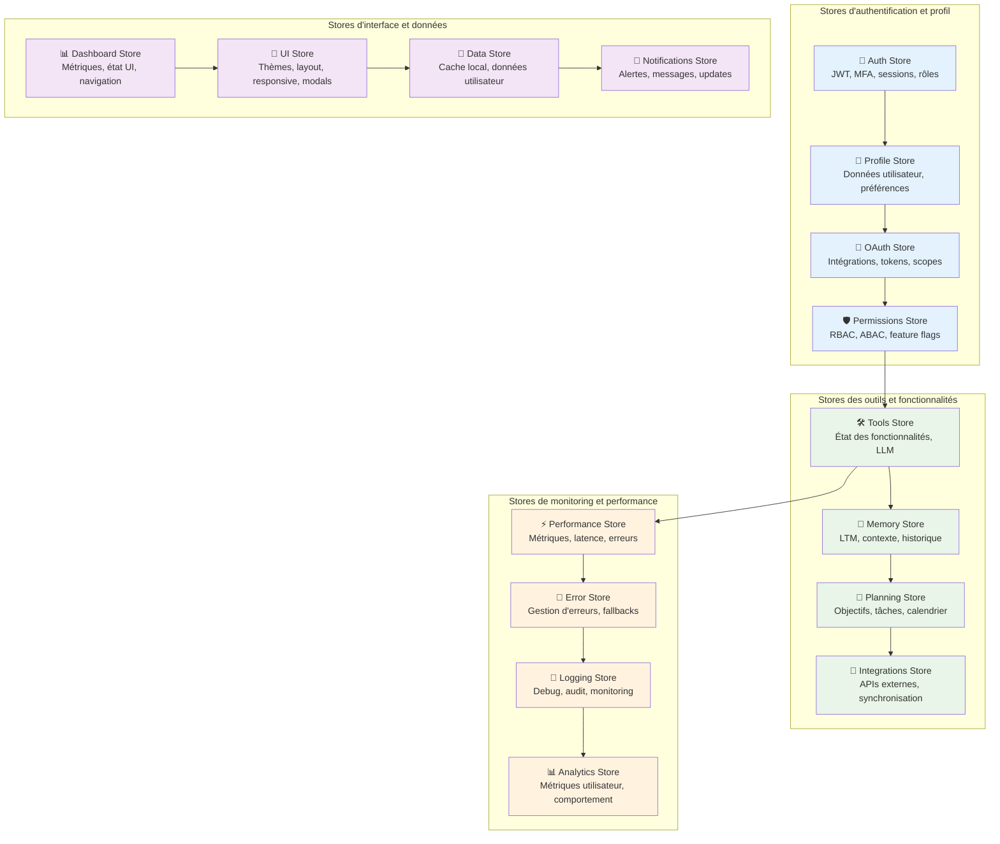
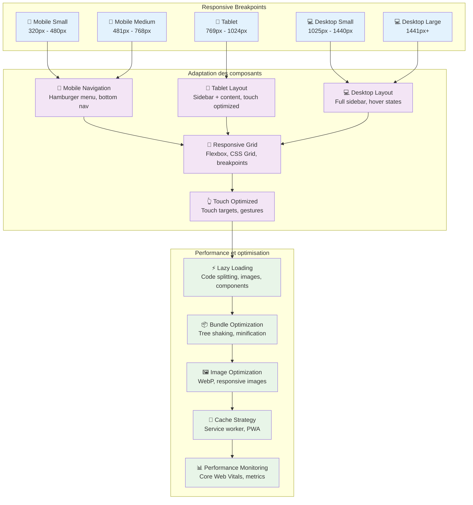

# Frontend Architecture Diagram - Multi-User Personal Assistant

## Vue d'ensemble de l'architecture frontend

Cette section présente l'architecture frontend complète de l'assistant personnel TDAH, **optimisée pour l'architecture multi-utilisateurs avec gestion OAuth progressive**.

### 1.1 Architecture frontend globale

**Vue - Architecture frontend multi-utilisateurs**



### 1.2 Structure détaillée des composants

#### **1.2.1 Composants d'authentification**

**Vue - Composants d'authentification multi-utilisateurs**



#### **1.2.2 Composants Dashboard et Navigation**

**Vue - Dashboard multi-utilisateurs avec OAuth**



#### **1.2.3 Composants d'intégration OAuth**

**Vue - Gestion OAuth progressive multi-utilisateurs**



### 1.3 Architecture des stores et gestion d'état

#### **1.3.1 Stores Zustand multi-utilisateurs**

**Vue - Gestion d'état centralisée avec OAuth**



### 1.4 Architecture des services et APIs

#### **1.4.1 Services frontend avec OAuth**

**Vue - Services et intégrations multi-utilisateurs**

```mermaid
graph TB
    subgraph "Services d'API et communication"
        API_CLIENT[🚀 API Client<br/>Axios, intercepteurs, retry logic]
        WEBSOCKET_SERVICE[🔌 WebSocket Service<br/>Temps réel, notifications]
        HTTP_INTERCEPTORS[🔄 HTTP Interceptors<br/>Auth, retry, error handling]
        API_CACHE[⚡ API Cache<br/>Cache intelligent, TTL]
    end

    subgraph "Services OAuth et intégrations"
        OAUTH_SERVICE[🔑 OAuth Service<br/>Gestion des intégrations OAuth]
        TOKEN_SERVICE[🔐 Token Service<br/>Gestion des tokens, refresh]
        INTEGRATION_SERVICE[🔗 Integration Service<br/>APIs externes, synchronisation]
        WEBHOOK_SERVICE[🎣 Webhook Service<br/>Réception des événements]
    end

    subgraph "Services de données et stockage"
        STORAGE_SERVICE[💾 Storage Service<br/>LocalStorage, IndexedDB]
        CACHE_SERVICE[⚡ Cache Service<br/>Redis, mémoire locale]
        SYNC_SERVICE[🔄 Sync Service<br/>Synchronisation des données]
        BACKUP_SERVICE[💿 Backup Service<br/>Sauvegarde locale, cloud]
    end

    subgraph "Services de sécurité et conformité"
        SECURITY_SERVICE[🛡️ Security Service<br/>Validation, chiffrement]
        COMPLIANCE_SERVICE[✅ Compliance Service<br/>GDPR, CCPA, audit]
        ENCRYPTION_SERVICE[🔒 Encryption Service<br/>Chiffrement local, HSM]
        AUDIT_SERVICE[📊 Audit Service<br/>Traçabilité, logging]
    end

    %% Flux des services
    API_CLIENT --> HTTP_INTERCEPTORS
    HTTP_INTERCEPTORS --> API_CACHE
    API_CACHE --> WEBSOCKET_SERVICE

    OAUTH_SERVICE --> TOKEN_SERVICE
    TOKEN_SERVICE --> INTEGRATION_SERVICE
    INTEGRATION_SERVICE --> WEBHOOK_SERVICE

    STORAGE_SERVICE --> CACHE_SERVICE
    CACHE_SERVICE --> SYNC_SERVICE
    SYNC_SERVICE --> BACKUP_SERVICE

    SECURITY_SERVICE --> COMPLIANCE_SERVICE
    COMPLIANCE_SERVICE --> ENCRYPTION_SERVICE
    ENCRYPTION_SERVICE --> AUDIT_SERVICE

    %% Styling
    classDef api_services fill:#e3f2fd
    classDef oauth_services fill:#f3e5f5
    classDef data_services fill:#e8f5e8
    classDef security_services fill:#fff3e0

    class API_CLIENT,WEBSOCKET_SERVICE,HTTP_INTERCEPTORS,API_CACHE api_services
    class OAUTH_SERVICE,TOKEN_SERVICE,INTEGRATION_SERVICE,WEBHOOK_SERVICE oauth_services
    class STORAGE_SERVICE,CACHE_SERVICE,SYNC_SERVICE,BACKUP_SERVICE data_services
    class SECURITY_SERVICE,COMPLIANCE_SERVICE,ENCRYPTION_SERVICE,AUDIT_SERVICE security_services
```



### 1.5 Architecture des composants UI réutilisables

#### **1.5.1 Système de composants UI**

**Vue - Composants UI réutilisables multi-utilisateurs**

```mermaid
graph TB
    subgraph "Composants de base (Base Components)"
        BUTTON[🔘 Button<br/>Variants, sizes, states]
        INPUT[📝 Input<br/>Types, validation, error states]
        CARD[🃏 Card<br/>Layout, variants, interactions]
        MODAL[🪟 Modal<br/>Overlay, content, actions]
        TOOLTIP[💡 Tooltip<br/>Positioning, content, triggers]
        LOADER[⏳ Loader<br/>Spinners, skeletons, progress]
    end

    subgraph "Composants de formulaire (Form Components)"
        FORM[📋 Form<br/>Validation, submission, error handling]
        FIELD_GROUP[📑 Field Group<br/>Grouping, layout, validation]
        SELECT[🔽 Select<br/>Options, search, multi-select]
        CHECKBOX[☑️ Checkbox<br/>States, groups, validation]
        RADIO[🔘 Radio<br/>Groups, selection, validation]
        UPLOAD[📤 Upload<br/>Drag & drop, progress, validation]
    end

    subgraph "Composants de navigation (Navigation Components)"
        NAVBAR[🧭 Navbar<br/>Brand, menu, actions]
        SIDEBAR[📱 Sidebar<br/>Menu, collapse, responsive]
        BREADCRUMB[🍞 Breadcrumb<br/>Hierarchy, navigation]
        PAGINATION[📄 Pagination<br/>Pages, navigation, info]
        TABS[📑 Tabs<br/>Content switching, states]
        MENU[🍽️ Menu<br/>Dropdown, context, navigation]
    end

    subgraph "Composants de données (Data Components)"
        TABLE[📊 Table<br/>Sorting, filtering, pagination]
        CHART[📈 Chart<br/>Visualization, interactions]
        LIST[📋 List<br/>Items, selection, actions]
        GRID[🔲 Grid<br/>Layout, responsive, items]
        TREE[🌳 Tree<br/>Hierarchy, expansion, selection]
        CALENDAR[📅 Calendar<br/>Dates, events, navigation]
    end

    %% Flux des composants
    BUTTON --> FORM
    INPUT --> FORM
    CARD --> MODAL
    TOOLTIP --> BUTTON
    LOADER --> UPLOAD

    FORM --> FIELD_GROUP
    FIELD_GROUP --> SELECT
    FIELD_GROUP --> CHECKBOX
    FIELD_GROUP --> RADIO
    FIELD_GROUP --> UPLOAD

    NAVBAR --> SIDEBAR
    SIDEBAR --> BREADCRUMB
    BREADCRUMB --> PAGINATION
    PAGINATION --> TABS
    TABS --> MENU

    TABLE --> CHART
    CHART --> LIST
    LIST --> GRID
    GRID --> TREE
    TREE --> CALENDAR

    %% Styling
    classDef base fill:#e3f2fd
    classDef form fill:#f3e5f5
    classDef navigation fill:#e8f5e8
    classDef data fill:#fff3e0

    class BUTTON,INPUT,CARD,MODAL,TOOLTIP,LOADER base
    class FORM,FIELD_GROUP,SELECT,CHECKBOX,RADIO,UPLOAD form
    class NAVBAR,SIDEBAR,BREADCRUMB,PAGINATION,TABS,MENU navigation
    class TABLE,CHART,LIST,GRID,TREE,CALENDAR data
```



### 1.6 Architecture responsive et mobile

#### **1.6.1 Responsive Design et Mobile First**

**Vue - Architecture responsive multi-plateformes**



### 1.7 Architecture de sécurité et conformité

#### **1.7.1 Sécurité frontend multi-utilisateurs**

**Vue - Sécurité et conformité frontend**

```mermaid
graph TB
    subgraph "Authentification et autorisation"
        JWT_MANAGER[🔑 JWT Manager<br/>Validation, refresh, expiration]
        MFA_HANDLER[🔒 MFA Handler<br/>TOTP, SMS, backup codes]
        ROLE_VALIDATOR[👥 Role Validator<br/>RBAC, permissions, access control]
        SESSION_MANAGER[⏰ Session Manager<br/>Timeout, renewal, logout]
    end

    subgraph "Sécurité des données"
        DATA_ENCRYPTION[🔐 Data Encryption<br/>Chiffrement local, transmission]
        INPUT_SANITIZATION[🧹 Input Sanitization<br/>XSS, injection, validation]
        OUTPUT_ENCODING[📤 Output Encoding<br/>HTML, URL, JavaScript encoding]
        CSRF_PROTECTION[🛡️ CSRF Protection<br/>Tokens, validation, headers]
    end

    subgraph "Conformité et audit"
        GDPR_COMPLIANCE[✅ GDPR Compliance<br/>Consent, data rights, deletion]
        CCPA_COMPLIANCE[✅ CCPA Compliance<br/>Privacy, opt-out, data access]
        AUDIT_LOGGING[📊 Audit Logging<br/>User actions, security events]
        PRIVACY_CONTROLS[🔒 Privacy Controls<br/>Data sharing, preferences]
    end

    subgraph "Monitoring et détection"
        SECURITY_MONITORING[🛡️ Security Monitoring<br/>Threat detection, alerts]
        VULNERABILITY_SCANNING[🔍 Vulnerability Scanning<br/>Dependencies, code analysis]
        INCIDENT_RESPONSE[🚨 Incident Response<br/>Detection, response, recovery]
        COMPLIANCE_REPORTING[📋 Compliance Reporting<br/>Audits, assessments, reports]
    end

    %% Flux de sécurité
    JWT_MANAGER --> MFA_HANDLER
    MFA_HANDLER --> ROLE_VALIDATOR
    ROLE_VALIDATOR --> SESSION_MANAGER

    SESSION_MANAGER --> DATA_ENCRYPTION
    DATA_ENCRYPTION --> INPUT_SANITIZATION
    INPUT_SANITIZATION --> OUTPUT_ENCODING
    OUTPUT_ENCODING --> CSRF_PROTECTION

    CSRF_PROTECTION --> GDPR_COMPLIANCE
    GDPR_COMPLIANCE --> CCPA_COMPLIANCE
    CCPA_COMPLIANCE --> AUDIT_LOGGING
    AUDIT_LOGGING --> PRIVACY_CONTROLS

    PRIVACY_CONTROLS --> SECURITY_MONITORING
    SECURITY_MONITORING --> VULNERABILITY_SCANNING
    VULNERABILITY_SCANNING --> INCIDENT_RESPONSE
    INCIDENT_RESPONSE --> COMPLIANCE_REPORTING

    %% Styling
    classDef auth_security fill:#e3f2fd
    classDef data_security fill:#f3e5f5
    classDef compliance fill:#e8f5e8
    classDef monitoring fill:#fff3e0

    class JWT_MANAGER,MFA_HANDLER,ROLE_VALIDATOR,SESSION_MANAGER auth_security
    class DATA_ENCRYPTION,INPUT_SANITIZATION,OUTPUT_ENCODING,CSRF_PROTECTION data_security
    class GDPR_COMPLIANCE,CCPA_COMPLIANCE,AUDIT_LOGGING,PRIVACY_CONTROLS compliance
    class SECURITY_MONITORING,VULNERABILITY_SCANNING,INCIDENT_RESPONSE,COMPLIANCE_REPORTING monitoring
```



## 2. Implémentation technique

### 2.1 Technologies et frameworks

#### **2.1.1 Stack technologique**

- **Frontend Framework**: React 18 avec TypeScript
- **State Management**: Zustand pour la gestion d'état centralisée
- **Styling**: Tailwind CSS avec système de design personnalisé
- **Routing**: React Router v6 avec navigation protégée
- **HTTP Client**: Axios avec intercepteurs et gestion d'erreurs
- **Build Tool**: Vite avec optimisation et HMR
- **Testing**: Vitest + React Testing Library
- **Linting**: ESLint + Prettier pour la qualité du code

#### **2.1.2 Architecture des composants**

- **Atomic Design**: Atoms, Molecules, Organisms, Templates, Pages
- **Composition over Inheritance**: Réutilisation des composants
- **Props Interface**: TypeScript strict pour les props
- **Custom Hooks**: Logique métier réutilisable
- **Context API**: Gestion des thèmes et préférences globales

### 2.2 Structure des dossiers

```
src/
├── components/           # Composants réutilisables
│   ├── ui/              # Composants de base (Button, Input, Card)
│   ├── forms/           # Composants de formulaire
│   ├── navigation/      # Composants de navigation
│   ├── data/            # Composants d'affichage de données
│   └── layout/          # Composants de mise en page
├── pages/               # Pages de l'application
│   ├── auth/            # Pages d'authentification
│   ├── dashboard/       # Pages du dashboard
│   ├── profile/         # Pages de profil
│   ├── integrations/    # Pages d'intégrations OAuth
│   └── tools/           # Pages des outils
├── stores/              # Stores Zustand
│   ├── authStore.ts     # Store d'authentification
│   ├── profileStore.ts  # Store de profil
│   ├── oauthStore.ts    # Store OAuth
│   └── uiStore.ts       # Store d'interface
├── services/            # Services et APIs
│   ├── api/             # Client API et intercepteurs
│   ├── oauth/           # Services OAuth
│   ├── storage/         # Services de stockage
│   └── websocket/       # Service WebSocket
├── hooks/               # Custom hooks
│   ├── useAuth.ts       # Hook d'authentification
│   ├── useOAuth.ts      # Hook OAuth
│   └── useApi.ts        # Hook API
├── utils/               # Utilitaires et helpers
│   ├── validation.ts    # Validation des données
│   ├── formatting.ts    # Formatage des données
│   └── security.ts      # Utilitaires de sécurité
├── types/               # Types TypeScript
│   ├── auth.ts          # Types d'authentification
│   ├── oauth.ts         # Types OAuth
│   └── api.ts           # Types API
├── constants/           # Constantes de l'application
├── assets/              # Images, icônes, styles
└── styles/              # Styles globaux et thèmes
```

### 2.3 Gestion des états et stores

#### **2.3.1 Store d'authentification**

```typescript
interface AuthState {
  user: User | null;
  isAuthenticated: boolean;
  isLoading: boolean;
  error: string | null;
  mfaEnabled: boolean;
  mfaMethod: "totp" | "sms" | null;
  session: Session | null;
}

interface AuthActions {
  login: (credentials: LoginCredentials) => Promise<void>;
  logout: () => void;
  refreshToken: () => Promise<void>;
  enableMFA: (method: "totp" | "sms") => Promise<void>;
  verifyMFA: (code: string) => Promise<void>;
}
```

#### **2.3.2 Store OAuth**

```typescript
interface OAuthState {
  integrations: OAuthIntegration[];
  isLoading: boolean;
  error: string | null;
  activeIntegrations: string[];
  scopes: Record<string, string[]>;
}

interface OAuthActions {
  connectIntegration: (provider: string, scopes: string[]) => Promise<void>;
  disconnectIntegration: (provider: string) => Promise<void>;
  refreshTokens: (provider: string) => Promise<void>;
  updateScopes: (provider: string, scopes: string[]) => Promise<void>;
}
```

### 2.4 Gestion des erreurs et fallbacks

#### **2.4.1 Stratégie de gestion d'erreurs**

- **Error Boundaries**: Capture des erreurs React
- **Fallback UI**: Interfaces de secours en cas d'erreur
- **Retry Logic**: Tentatives automatiques de reconnexion
- **User Feedback**: Messages d'erreur clairs et utiles
- **Error Logging**: Journalisation des erreurs pour le debugging

#### **2.4.2 Gestion des états de chargement**

- **Skeleton Loaders**: Indicateurs de chargement
- **Progressive Loading**: Chargement progressif des données
- **Optimistic Updates**: Mises à jour optimistes de l'UI
- **Loading States**: États de chargement cohérents

## 3. Considérations de performance

### 3.1 Optimisations de rendu

- **React.memo**: Mémorisation des composants
- **useMemo/useCallback**: Mémorisation des valeurs et fonctions
- **Code Splitting**: Division du bundle par routes
- **Lazy Loading**: Chargement différé des composants
- **Virtual Scrolling**: Rendu virtuel pour les longues listes

### 3.2 Optimisations de bundle

- **Tree Shaking**: Élimination du code inutilisé
- **Dynamic Imports**: Import dynamique des composants
- **Bundle Analysis**: Analyse et optimisation des bundles
- **Compression**: Gzip/Brotli pour la compression
- **CDN**: Distribution géographique des assets

### 3.3 Métriques de performance

- **Core Web Vitals**: LCP, FID, CLS
- **Bundle Size**: Taille des bundles JavaScript
- **Load Time**: Temps de chargement des pages
- **Render Performance**: Performance du rendu React
- **Memory Usage**: Utilisation de la mémoire

## 4. Considérations de sécurité

### 4.1 Sécurité des composants

- **Input Validation**: Validation stricte des entrées utilisateur
- **XSS Prevention**: Protection contre les attaques XSS
- **CSRF Protection**: Protection contre les attaques CSRF
- **Content Security Policy**: Politique de sécurité du contenu
- **Secure Headers**: En-têtes de sécurité HTTP

### 4.2 Gestion des tokens et sessions

- **Secure Storage**: Stockage sécurisé des tokens
- **Token Rotation**: Rotation automatique des tokens
- **Session Management**: Gestion sécurisée des sessions
- **Logout Security**: Déconnexion sécurisée
- **Token Validation**: Validation des tokens côté client

### 4.3 Conformité et audit

- **GDPR Compliance**: Conformité au règlement européen
- **CCPA Compliance**: Conformité à la loi californienne
- **Audit Trail**: Traçabilité des actions utilisateur
- **Data Minimization**: Minimisation des données collectées
- **User Consent**: Gestion des consentements utilisateur

---

**Document généré le**: $(date)
**Version**: 1.0
**Statut**: Finalisé
**Approbé par**: Équipe d'architecture frontend
