# Frontend Architecture Diagram - Multi-User Personal Assistant

## Vue d'ensemble de l'architecture frontend

Cette section présente l'architecture frontend complète de l'assistant personnel TDAH, **optimisée pour l'architecture multi-utilisateurs avec gestion OAuth progressive**.

### 1.1 Architecture frontend globale

**Vue - Architecture frontend multi-utilisateurs**

```mermaid
graph TB
    subgraph "Couche Présentation - Interfaces Multi-utilisateurs"
        SMS[📱 Interface SMS<br/>Twilio Webhooks<br/>Identification par numéro]
        WEB[🌐 Interface Web Responsive<br/>React 18 + TypeScript<br/>PWA Support]
        MOBILE[📱 Interface Mobile Web<br/>Responsive Design<br/>Touch Optimized]
        CLI[💻 Interface CLI<br/>Commandes système<br/>Gestion avancée]
    end

    subgraph "Couche Composants - Architecture Modulaire"
        AUTH[🔐 Composants d'authentification<br/>MFA, OAuth, RBAC]
        DASHBOARD[📊 Composants Dashboard<br/>Vue d'ensemble, métriques]
        PROFILE[👤 Composants Profil<br/>Gestion utilisateur, OAuth]
        INTEGRATIONS[🔗 Composants Intégrations<br/>OAuth progressif, APIs]
        TOOLS[🛠️ Composants Outils<br/>LLM, planification, mémoire]
        NAVIGATION[🧭 Composants Navigation<br/>Routing, menus, breadcrumbs]
    end

    subgraph "Couche État - Gestion d'état centralisée"
        AUTH_STORE[🔑 Store d'authentification<br/>JWT, MFA, sessions]
        PROFILE_STORE[👤 Store de profil<br/>Données utilisateur, préférences]
        DASHBOARD_STORE[📊 Store de dashboard<br/>Métriques, état UI]
        OAUTH_STORE[🔐 Store OAuth<br/>Intégrations, tokens, scopes]
        TOOLS_STORE[🛠️ Store des outils<br/>État des fonctionnalités]
        UI_STORE[🎨 Store UI<br/>Thèmes, layout, responsive]
    end

    subgraph "Couche Services - APIs et Intégrations"
        API_CLIENT[🚀 Client API<br/>Axios, intercepteurs, retry]
        OAUTH_SERVICE[🔑 Service OAuth<br/>Gestion des intégrations]
        WEBSOCKET[🔌 WebSocket<br/>Temps réel, notifications]
        STORAGE[💾 Stockage local<br/>LocalStorage, IndexedDB]
        CACHE[⚡ Cache intelligent<br/>Redis, mémoire locale]
    end

    subgraph "Couche Utilitaires - Outils et Helpers"
        VALIDATION[✅ Validation<br/>Zod, règles métier]
        FORMATTING[🎯 Formatage<br/>Dates, nombres, textes]
        INTERNATIONALIZATION[🌍 i18n<br/>Multi-langues, locales]
        ERROR_HANDLING[🚨 Gestion d'erreurs<br/>Fallbacks, retry]
        LOGGING[📝 Logging<br/>Debug, audit, monitoring]
    end

    %% Flux principal
    SMS --> AUTH
    WEB --> AUTH
    MOBILE --> AUTH
    CLI --> AUTH

    AUTH --> DASHBOARD
    AUTH --> PROFILE
    AUTH --> INTEGRATIONS
    AUTH --> TOOLS

    DASHBOARD --> DASHBOARD_STORE
    PROFILE --> PROFILE_STORE
    INTEGRATIONS --> OAUTH_STORE
    TOOLS --> TOOLS_STORE

    AUTH_STORE --> API_CLIENT
    OAUTH_STORE --> OAUTH_SERVICE
    TOOLS_STORE --> API_CLIENT

    API_CLIENT --> VALIDATION
    OAUTH_SERVICE --> ERROR_HANDLING
    API_CLIENT --> CACHE

    %% Styling
    classDef presentation fill:#e3f2fd
    classDef components fill:#f3e5f5
    classDef stores fill:#e8f5e8
    classDef services fill:#fff3e0
    classDef utils fill:#fce4ec

    class SMS,WEB,MOBILE,CLI presentation
    class AUTH,DASHBOARD,PROFILE,INTEGRATIONS,TOOLS,NAVIGATION components
    class AUTH_STORE,PROFILE_STORE,DASHBOARD_STORE,OAUTH_STORE,TOOLS_STORE,UI_STORE stores
    class API_CLIENT,OAUTH_SERVICE,WEBSOCKET,STORAGE,CACHE services
    class VALIDATION,FORMATTING,INTERNATIONALIZATION,ERROR_HANDLING,LOGGING utils
```



### 1.2 Structure détaillée des composants

#### **1.2.1 Composants d'authentification**

**Vue - Composants d'authentification multi-utilisateurs**

```mermaid
graph TB
    subgraph "Authentification Multi-utilisateurs"
        LOGIN[🔐 Login Form<br/>Email + Mot de passe]
        REGISTER[📝 Register Form<br/>Création de compte]
        MFA[🔒 MFA Component<br/>TOTP + SMS backup]
        OAUTH_BUTTONS[🔑 OAuth Buttons<br/>Google, Microsoft, etc.]
        PASSWORD_RESET[🔄 Password Reset<br/>Récupération de compte]
        SESSION_MANAGER[⏰ Session Manager<br/>Gestion des sessions]
    end

    subgraph "Gestion des rôles et permissions"
        ROLE_SELECTOR[👥 Role Selector<br/>Sélection du profil]
        PERMISSION_CHECK[✅ Permission Check<br/>Validation des accès]
        RBAC_MANAGER[🛡️ RBAC Manager<br/>Gestion des rôles]
        FEATURE_FLAGS[🚩 Feature Flags<br/>Activation granulaire]
    end

    subgraph "Sécurité et conformité"
        CONSENT_MANAGER[📋 Consent Manager<br/>Gestion des consentements]
        PRIVACY_SETTINGS[🔒 Privacy Settings<br/>Contrôle des données]
        AUDIT_TRAIL[📊 Audit Trail<br/>Traçabilité des actions]
        COMPLIANCE_CHECK[✅ Compliance Check<br/>Validation GDPR/CCPA]
    end

    %% Flux d'authentification
    LOGIN --> MFA
    REGISTER --> MFA
    OAUTH_BUTTONS --> OAUTH_SERVICE
    MFA --> SESSION_MANAGER

    SESSION_MANAGER --> ROLE_SELECTOR
    ROLE_SELECTOR --> PERMISSION_CHECK
    PERMISSION_CHECK --> RBAC_MANAGER

    RBAC_MANAGER --> FEATURE_FLAGS
    FEATURE_FLAGS --> CONSENT_MANAGER
    CONSENT_MANAGER --> PRIVACY_SETTINGS

    PRIVACY_SETTINGS --> AUDIT_TRAIL
    AUDIT_TRAIL --> COMPLIANCE_CHECK

    %% Styling
    classDef auth fill:#e3f2fd
    classDef roles fill:#f3e5f5
    classDef security fill:#e8f5e8

    class LOGIN,REGISTER,MFA,OAUTH_BUTTONS,PASSWORD_RESET,SESSION_MANAGER auth
    class ROLE_SELECTOR,PERMISSION_CHECK,RBAC_MANAGER,FEATURE_FLAGS roles
    class CONSENT_MANAGER,PRIVACY_SETTINGS,AUDIT_TRAIL,COMPLIANCE_CHECK security
```



#### **1.2.2 Composants Dashboard et Navigation**

**Vue - Dashboard multi-utilisateurs avec OAuth**

```mermaid
graph TB
    subgraph "Dashboard Principal"
        DASHBOARD_HEADER[📊 Dashboard Header<br/>Navigation principale, notifications]
        QUICK_ACTIONS[⚡ Quick Actions<br/>Actions rapides, raccourcis]
        USER_OVERVIEW[👤 User Overview<br/>Résumé utilisateur, statuts]
        OAUTH_STATUS[🔑 OAuth Status<br/>État des intégrations]
        RECENT_ACTIVITY[📝 Recent Activity<br/>Activités récentes, historique]
        PERFORMANCE_METRICS[📈 Performance Metrics<br/>Métriques, KPIs]
    end

    subgraph "Navigation et Menus"
        MAIN_NAV[🧭 Main Navigation<br/>Menu principal, routing]
        SIDEBAR[📱 Sidebar<br/>Menu latéral, navigation secondaire]
        BREADCRUMBS[🍞 Breadcrumbs<br/>Navigation hiérarchique]
        SEARCH[🔍 Search Component<br/>Recherche globale, filtres]
        USER_MENU[👤 User Menu<br/>Menu utilisateur, profil]
        NOTIFICATIONS[🔔 Notifications<br/>Alertes, messages, updates]
    end

    subgraph "Responsive et Mobile"
        MOBILE_NAV[📱 Mobile Navigation<br/>Menu hamburger, navigation tactile]
        BOTTOM_NAV[⬇️ Bottom Navigation<br/>Navigation mobile, actions principales]
        TOUCH_GESTURES[👆 Touch Gestures<br/>Gestes tactiles, interactions]
        RESPONSIVE_LAYOUT[📐 Responsive Layout<br/>Adaptation mobile, breakpoints]
    end

    %% Flux de navigation
    DASHBOARD_HEADER --> MAIN_NAV
    MAIN_NAV --> SIDEBAR
    SIDEBAR --> BREADCRUMBS

    QUICK_ACTIONS --> OAUTH_STATUS
    OAUTH_STATUS --> RECENT_ACTIVITY
    RECENT_ACTIVITY --> PERFORMANCE_METRICS

    MAIN_NAV --> SEARCH
    SEARCH --> USER_MENU
    USER_MENU --> NOTIFICATIONS

    MAIN_NAV --> MOBILE_NAV
    MOBILE_NAV --> BOTTOM_NAV
    BOTTOM_NAV --> TOUCH_GESTURES
    TOUCH_GESTURES --> RESPONSIVE_LAYOUT

    %% Styling
    classDef dashboard fill:#e3f2fd
    classDef navigation fill:#f3e5f5
    classDef mobile fill:#e8f5e8

    class DASHBOARD_HEADER,QUICK_ACTIONS,USER_OVERVIEW,OAUTH_STATUS,RECENT_ACTIVITY,PERFORMANCE_METRICS dashboard
    class MAIN_NAV,SIDEBAR,BREADCRUMBS,SEARCH,USER_MENU,NOTIFICATIONS navigation
    class MOBILE_NAV,BOTTOM_NAV,TOUCH_GESTURES,RESPONSIVE_LAYOUT mobile
```



#### **1.2.3 Composants d'intégration OAuth**

**Vue - Gestion OAuth progressive multi-utilisateurs**


### 1.3 Architecture des stores et gestion d'état

#### **1.3.1 Stores Zustand multi-utilisateurs**

**Vue - Gestion d'état centralisée avec OAuth**

```mermaid
graph TB
    subgraph "Stores d'authentification et profil"
        AUTH_STORE[🔑 Auth Store<br/>JWT, MFA, sessions, rôles]
        PROFILE_STORE[👤 Profile Store<br/>Données utilisateur, préférences]
        OAUTH_STORE[🔐 OAuth Store<br/>Intégrations, tokens, scopes]
        PERMISSIONS_STORE[🛡️ Permissions Store<br/>RBAC, ABAC, feature flags]
    end

    subgraph "Stores d'interface et données"
        DASHBOARD_STORE[📊 Dashboard Store<br/>Métriques, état UI, navigation]
        UI_STORE[🎨 UI Store<br/>Thèmes, layout, responsive, modals]
        DATA_STORE[💾 Data Store<br/>Cache local, données utilisateur]
        NOTIFICATIONS_STORE[🔔 Notifications Store<br/>Alertes, messages, updates]
    end

    subgraph "Stores des outils et fonctionnalités"
        TOOLS_STORE[🛠️ Tools Store<br/>État des fonctionnalités, LLM]
        MEMORY_STORE[🧠 Memory Store<br/>LTM, contexte, historique]
        PLANNING_STORE[📅 Planning Store<br/>Objectifs, tâches, calendrier]
        INTEGRATIONS_STORE[🔗 Integrations Store<br/>APIs externes, synchronisation]
    end

    subgraph "Stores de monitoring et performance"
        PERFORMANCE_STORE[⚡ Performance Store<br/>Métriques, latence, erreurs]
        ERROR_STORE[🚨 Error Store<br/>Gestion d'erreurs, fallbacks]
        LOGGING_STORE[📝 Logging Store<br/>Debug, audit, monitoring]
        ANALYTICS_STORE[📊 Analytics Store<br/>Métriques utilisateur, comportement]
    end

    %% Flux entre stores
    AUTH_STORE --> PROFILE_STORE
    PROFILE_STORE --> OAUTH_STORE
    OAUTH_STORE --> PERMISSIONS_STORE

    PERMISSIONS_STORE --> TOOLS_STORE
    TOOLS_STORE --> MEMORY_STORE
    MEMORY_STORE --> PLANNING_STORE
    PLANNING_STORE --> INTEGRATIONS_STORE

    DASHBOARD_STORE --> UI_STORE
    UI_STORE --> DATA_STORE
    DATA_STORE --> NOTIFICATIONS_STORE

    TOOLS_STORE --> PERFORMANCE_STORE
    PERFORMANCE_STORE --> ERROR_STORE
    ERROR_STORE --> LOGGING_STORE
    LOGGING_STORE --> ANALYTICS_STORE

    %% Styling
    classDef auth_stores fill:#e3f2fd
    classDef ui_stores fill:#f3e5f5
    classDef tools_stores fill:#e8f5e8
    classDef monitoring_stores fill:#fff3e0

    class AUTH_STORE,PROFILE_STORE,OAUTH_STORE,PERMISSIONS_STORE auth_stores
    class DASHBOARD_STORE,UI_STORE,DATA_STORE,NOTIFICATIONS_STORE ui_stores
    class TOOLS_STORE,MEMORY_STORE,PLANNING_STORE,INTEGRATIONS_STORE tools_stores
    class PERFORMANCE_STORE,ERROR_STORE,LOGGING_STORE,ANALYTICS_STORE monitoring_stores
```



### 1.4 Architecture des services et APIs

#### **1.4.1 Services frontend avec OAuth**

**Vue - Services et intégrations multi-utilisateurs**

```mermaid
graph TB
    subgraph "Services d'API et communication"
        API_CLIENT[🚀 API Client<br/>Axios, intercepteurs, retry logic]
        WEBSOCKET_SERVICE[🔌 WebSocket Service<br/>Temps réel, notifications]
        HTTP_INTERCEPTORS[🔄 HTTP Interceptors<br/>Auth, retry, error handling]
        API_CACHE[⚡ API Cache<br/>Cache intelligent, TTL]
    end

    subgraph "Services OAuth et intégrations"
        OAUTH_SERVICE[🔑 OAuth Service<br/>Gestion des intégrations OAuth]
        TOKEN_SERVICE[🔐 Token Service<br/>Gestion des tokens, refresh]
        INTEGRATION_SERVICE[🔗 Integration Service<br/>APIs externes, synchronisation]
        WEBHOOK_SERVICE[🎣 Webhook Service<br/>Réception des événements]
    end

    subgraph "Services de données et stockage"
        STORAGE_SERVICE[💾 Storage Service<br/>LocalStorage, IndexedDB]
        CACHE_SERVICE[⚡ Cache Service<br/>Redis, mémoire locale]
        SYNC_SERVICE[🔄 Sync Service<br/>Synchronisation des données]
        BACKUP_SERVICE[💿 Backup Service<br/>Sauvegarde locale, cloud]
    end

    subgraph "Services de sécurité et conformité"
        SECURITY_SERVICE[🛡️ Security Service<br/>Validation, chiffrement]
        COMPLIANCE_SERVICE[✅ Compliance Service<br/>GDPR, CCPA, audit]
        ENCRYPTION_SERVICE[🔒 Encryption Service<br/>Chiffrement local, HSM]
        AUDIT_SERVICE[📊 Audit Service<br/>Traçabilité, logging]
    end

    %% Flux des services
    API_CLIENT --> HTTP_INTERCEPTORS
    HTTP_INTERCEPTORS --> API_CACHE
    API_CACHE --> WEBSOCKET_SERVICE

    OAUTH_SERVICE --> TOKEN_SERVICE
    TOKEN_SERVICE --> INTEGRATION_SERVICE
    INTEGRATION_SERVICE --> WEBHOOK_SERVICE

    STORAGE_SERVICE --> CACHE_SERVICE
    CACHE_SERVICE --> SYNC_SERVICE
    SYNC_SERVICE --> BACKUP_SERVICE

    SECURITY_SERVICE --> COMPLIANCE_SERVICE
    COMPLIANCE_SERVICE --> ENCRYPTION_SERVICE
    ENCRYPTION_SERVICE --> AUDIT_SERVICE

    %% Styling
    classDef api_services fill:#e3f2fd
    classDef oauth_services fill:#f3e5f5
    classDef data_services fill:#e8f5e8
    classDef security_services fill:#fff3e0

    class API_CLIENT,WEBSOCKET_SERVICE,HTTP_INTERCEPTORS,API_CACHE api_services
    class OAUTH_SERVICE,TOKEN_SERVICE,INTEGRATION_SERVICE,WEBHOOK_SERVICE oauth_services
    class STORAGE_SERVICE,CACHE_SERVICE,SYNC_SERVICE,BACKUP_SERVICE data_services
    class SECURITY_SERVICE,COMPLIANCE_SERVICE,ENCRYPTION_SERVICE,AUDIT_SERVICE security_services
```



### 1.5 Architecture des composants UI réutilisables

#### **1.5.1 Système de composants UI**

**Vue - Composants UI réutilisables multi-utilisateurs**

```mermaid
graph TB
    subgraph "Composants de base (Base Components)"
        BUTTON[🔘 Button<br/>Variants, sizes, states]
        INPUT[📝 Input<br/>Types, validation, error states]
        CARD[🃏 Card<br/>Layout, variants, interactions]
        MODAL[🪟 Modal<br/>Overlay, content, actions]
        TOOLTIP[💡 Tooltip<br/>Positioning, content, triggers]
        LOADER[⏳ Loader<br/>Spinners, skeletons, progress]
    end

    subgraph "Composants de formulaire (Form Components)"
        FORM[📋 Form<br/>Validation, submission, error handling]
        FIELD_GROUP[📑 Field Group<br/>Grouping, layout, validation]
        SELECT[🔽 Select<br/>Options, search, multi-select]
        CHECKBOX[☑️ Checkbox<br/>States, groups, validation]
        RADIO[🔘 Radio<br/>Groups, selection, validation]
        UPLOAD[📤 Upload<br/>Drag & drop, progress, validation]
    end

    subgraph "Composants de navigation (Navigation Components)"
        NAVBAR[🧭 Navbar<br/>Brand, menu, actions]
        SIDEBAR[📱 Sidebar<br/>Menu, collapse, responsive]
        BREADCRUMB[🍞 Breadcrumb<br/>Hierarchy, navigation]
        PAGINATION[📄 Pagination<br/>Pages, navigation, info]
        TABS[📑 Tabs<br/>Content switching, states]
        MENU[🍽️ Menu<br/>Dropdown, context, navigation]
    end

    subgraph "Composants de données (Data Components)"
        TABLE[📊 Table<br/>Sorting, filtering, pagination]
        CHART[📈 Chart<br/>Visualization, interactions]
        LIST[📋 List<br/>Items, selection, actions]
        GRID[🔲 Grid<br/>Layout, responsive, items]
        TREE[🌳 Tree<br/>Hierarchy, expansion, selection]
        CALENDAR[📅 Calendar<br/>Dates, events, navigation]
    end

    %% Flux des composants
    BUTTON --> FORM
    INPUT --> FORM
    CARD --> MODAL
    TOOLTIP --> BUTTON
    LOADER --> UPLOAD

    FORM --> FIELD_GROUP
    FIELD_GROUP --> SELECT
    FIELD_GROUP --> CHECKBOX
    FIELD_GROUP --> RADIO
    FIELD_GROUP --> UPLOAD

    NAVBAR --> SIDEBAR
    SIDEBAR --> BREADCRUMB
    BREADCRUMB --> PAGINATION
    PAGINATION --> TABS
    TABS --> MENU

    TABLE --> CHART
    CHART --> LIST
    LIST --> GRID
    GRID --> TREE
    TREE --> CALENDAR

    %% Styling
    classDef base fill:#e3f2fd
    classDef form fill:#f3e5f5
    classDef navigation fill:#e8f5e8
    classDef data fill:#fff3e0

    class BUTTON,INPUT,CARD,MODAL,TOOLTIP,LOADER base
    class FORM,FIELD_GROUP,SELECT,CHECKBOX,RADIO,UPLOAD form
    class NAVBAR,SIDEBAR,BREADCRUMB,PAGINATION,TABS,MENU navigation
    class TABLE,CHART,LIST,GRID,TREE,CALENDAR data
```



### 1.6 Architecture responsive et mobile

#### **1.6.1 Responsive Design et Mobile First**

**Vue - Architecture responsive multi-plateformes**

```mermaid
graph TB
    subgraph "Responsive Breakpoints"
        MOBILE_SM[📱 Mobile Small<br/>320px - 480px]
        MOBILE_MD[📱 Mobile Medium<br/>481px - 768px]
        TABLET[📱 Tablet<br/>769px - 1024px]
        DESKTOP_SM[💻 Desktop Small<br/>1025px - 1440px]
        DESKTOP_LG[💻 Desktop Large<br/>1441px+]
    end

    subgraph "Adaptation des composants"
        MOBILE_NAV[📱 Mobile Navigation<br/>Hamburger menu, bottom nav]
        TABLET_LAYOUT[📱 Tablet Layout<br/>Sidebar + content, touch optimized]
        DESKTOP_LAYOUT[💻 Desktop Layout<br/>Full sidebar, hover states]
        RESPONSIVE_GRID[🔲 Responsive Grid<br/>Flexbox, CSS Grid, breakpoints]
        TOUCH_OPTIMIZED[👆 Touch Optimized<br/>Touch targets, gestures]
    end

    subgraph "Performance et optimisation"
        LAZY_LOADING[⚡ Lazy Loading<br/>Code splitting, images, components]
        BUNDLE_OPTIMIZATION[📦 Bundle Optimization<br/>Tree shaking, minification]
        IMAGE_OPTIMIZATION[🖼️ Image Optimization<br/>WebP, responsive images]
        CACHE_STRATEGY[💾 Cache Strategy<br/>Service worker, PWA]
        PERFORMANCE_MONITORING[📊 Performance Monitoring<br/>Core Web Vitals, metrics]
    end

    %% Flux responsive
    MOBILE_SM --> MOBILE_NAV
    MOBILE_MD --> MOBILE_NAV
    TABLET --> TABLET_LAYOUT
    DESKTOP_SM --> DESKTOP_LAYOUT
    DESKTOP_LG --> DESKTOP_LAYOUT

    MOBILE_NAV --> RESPONSIVE_GRID
    TABLET_LAYOUT --> RESPONSIVE_GRID
    DESKTOP_LAYOUT --> RESPONSIVE_GRID
    RESPONSIVE_GRID --> TOUCH_OPTIMIZED

    TOUCH_OPTIMIZED --> LAZY_LOADING
    LAZY_LOADING --> BUNDLE_OPTIMIZATION
    BUNDLE_OPTIMIZATION --> IMAGE_OPTIMIZATION
    IMAGE_OPTIMIZATION --> CACHE_STRATEGY
    CACHE_STRATEGY --> PERFORMANCE_MONITORING

    %% Styling
    classDef breakpoints fill:#e3f2fd
    classDef components fill:#f3e5f5
    classDef performance fill:#e8f5e8

    class MOBILE_SM,MOBILE_MD,TABLET,DESKTOP_SM,DESKTOP_LG breakpoints
    class MOBILE_NAV,TABLET_LAYOUT,DESKTOP_LAYOUT,RESPONSIVE_GRID,TOUCH_OPTIMIZED components
    class LAZY_LOADING,BUNDLE_OPTIMIZATION,IMAGE_OPTIMIZATION,CACHE_STRATEGY,PERFORMANCE_MONITORING performance
```



### 1.7 Architecture de sécurité et conformité

#### **1.7.1 Sécurité frontend multi-utilisateurs**

**Vue - Sécurité et conformité frontend**

```mermaid
graph TB
    subgraph "Authentification et autorisation"
        JWT_MANAGER[🔑 JWT Manager<br/>Validation, refresh, expiration]
        MFA_HANDLER[🔒 MFA Handler<br/>TOTP, SMS, backup codes]
        ROLE_VALIDATOR[👥 Role Validator<br/>RBAC, permissions, access control]
        SESSION_MANAGER[⏰ Session Manager<br/>Timeout, renewal, logout]
    end

    subgraph "Sécurité des données"
        DATA_ENCRYPTION[🔐 Data Encryption<br/>Chiffrement local, transmission]
        INPUT_SANITIZATION[🧹 Input Sanitization<br/>XSS, injection, validation]
        OUTPUT_ENCODING[📤 Output Encoding<br/>HTML, URL, JavaScript encoding]
        CSRF_PROTECTION[🛡️ CSRF Protection<br/>Tokens, validation, headers]
    end

    subgraph "Conformité et audit"
        GDPR_COMPLIANCE[✅ GDPR Compliance<br/>Consent, data rights, deletion]
        CCPA_COMPLIANCE[✅ CCPA Compliance<br/>Privacy, opt-out, data access]
        AUDIT_LOGGING[📊 Audit Logging<br/>User actions, security events]
        PRIVACY_CONTROLS[🔒 Privacy Controls<br/>Data sharing, preferences]
    end

    subgraph "Monitoring et détection"
        SECURITY_MONITORING[🛡️ Security Monitoring<br/>Threat detection, alerts]
        VULNERABILITY_SCANNING[🔍 Vulnerability Scanning<br/>Dependencies, code analysis]
        INCIDENT_RESPONSE[🚨 Incident Response<br/>Detection, response, recovery]
        COMPLIANCE_REPORTING[📋 Compliance Reporting<br/>Audits, assessments, reports]
    end

    %% Flux de sécurité
    JWT_MANAGER --> MFA_HANDLER
    MFA_HANDLER --> ROLE_VALIDATOR
    ROLE_VALIDATOR --> SESSION_MANAGER

    SESSION_MANAGER --> DATA_ENCRYPTION
    DATA_ENCRYPTION --> INPUT_SANITIZATION
    INPUT_SANITIZATION --> OUTPUT_ENCODING
    OUTPUT_ENCODING --> CSRF_PROTECTION

    CSRF_PROTECTION --> GDPR_COMPLIANCE
    GDPR_COMPLIANCE --> CCPA_COMPLIANCE
    CCPA_COMPLIANCE --> AUDIT_LOGGING
    AUDIT_LOGGING --> PRIVACY_CONTROLS

    PRIVACY_CONTROLS --> SECURITY_MONITORING
    SECURITY_MONITORING --> VULNERABILITY_SCANNING
    VULNERABILITY_SCANNING --> INCIDENT_RESPONSE
    INCIDENT_RESPONSE --> COMPLIANCE_REPORTING

    %% Styling
    classDef auth_security fill:#e3f2fd
    classDef data_security fill:#f3e5f5
    classDef compliance fill:#e8f5e8
    classDef monitoring fill:#fff3e0

    class JWT_MANAGER,MFA_HANDLER,ROLE_VALIDATOR,SESSION_MANAGER auth_security
    class DATA_ENCRYPTION,INPUT_SANITIZATION,OUTPUT_ENCODING,CSRF_PROTECTION data_security
    class GDPR_COMPLIANCE,CCPA_COMPLIANCE,AUDIT_LOGGING,PRIVACY_CONTROLS compliance
    class SECURITY_MONITORING,VULNERABILITY_SCANNING,INCIDENT_RESPONSE,COMPLIANCE_REPORTING monitoring
```



## 2. Implémentation technique

### 2.1 Technologies et frameworks

#### **2.1.1 Stack technologique**

- **Frontend Framework**: React 18 avec TypeScript
- **State Management**: Zustand pour la gestion d'état centralisée
- **Styling**: Tailwind CSS avec système de design personnalisé
- **Routing**: React Router v6 avec navigation protégée
- **HTTP Client**: Axios avec intercepteurs et gestion d'erreurs
- **Build Tool**: Vite avec optimisation et HMR
- **Testing**: Vitest + React Testing Library
- **Linting**: ESLint + Prettier pour la qualité du code

#### **2.1.2 Architecture des composants**

- **Atomic Design**: Atoms, Molecules, Organisms, Templates, Pages
- **Composition over Inheritance**: Réutilisation des composants
- **Props Interface**: TypeScript strict pour les props
- **Custom Hooks**: Logique métier réutilisable
- **Context API**: Gestion des thèmes et préférences globales

### 2.2 Structure des dossiers

```
src/
├── components/           # Composants réutilisables
│   ├── ui/              # Composants de base (Button, Input, Card)
│   ├── forms/           # Composants de formulaire
│   ├── navigation/      # Composants de navigation
│   ├── data/            # Composants d'affichage de données
│   └── layout/          # Composants de mise en page
├── pages/               # Pages de l'application
│   ├── auth/            # Pages d'authentification
│   ├── dashboard/       # Pages du dashboard
│   ├── profile/         # Pages de profil
│   ├── integrations/    # Pages d'intégrations OAuth
│   └── tools/           # Pages des outils
├── stores/              # Stores Zustand
│   ├── authStore.ts     # Store d'authentification
│   ├── profileStore.ts  # Store de profil
│   ├── oauthStore.ts    # Store OAuth
│   └── uiStore.ts       # Store d'interface
├── services/            # Services et APIs
│   ├── api/             # Client API et intercepteurs
│   ├── oauth/           # Services OAuth
│   ├── storage/         # Services de stockage
│   └── websocket/       # Service WebSocket
├── hooks/               # Custom hooks
│   ├── useAuth.ts       # Hook d'authentification
│   ├── useOAuth.ts      # Hook OAuth
│   └── useApi.ts        # Hook API
├── utils/               # Utilitaires et helpers
│   ├── validation.ts    # Validation des données
│   ├── formatting.ts    # Formatage des données
│   └── security.ts      # Utilitaires de sécurité
├── types/               # Types TypeScript
│   ├── auth.ts          # Types d'authentification
│   ├── oauth.ts         # Types OAuth
│   └── api.ts           # Types API
├── constants/           # Constantes de l'application
├── assets/              # Images, icônes, styles
└── styles/              # Styles globaux et thèmes
```

### 2.3 Gestion des états et stores

#### **2.3.1 Store d'authentification**

```typescript
interface AuthState {
  user: User | null;
  isAuthenticated: boolean;
  isLoading: boolean;
  error: string | null;
  mfaEnabled: boolean;
  mfaMethod: "totp" | "sms" | null;
  session: Session | null;
}

interface AuthActions {
  login: (credentials: LoginCredentials) => Promise<void>;
  logout: () => void;
  refreshToken: () => Promise<void>;
  enableMFA: (method: "totp" | "sms") => Promise<void>;
  verifyMFA: (code: string) => Promise<void>;
}
```

#### **2.3.2 Store OAuth**

```typescript
interface OAuthState {
  integrations: OAuthIntegration[];
  isLoading: boolean;
  error: string | null;
  activeIntegrations: string[];
  scopes: Record<string, string[]>;
}

interface OAuthActions {
  connectIntegration: (provider: string, scopes: string[]) => Promise<void>;
  disconnectIntegration: (provider: string) => Promise<void>;
  refreshTokens: (provider: string) => Promise<void>;
  updateScopes: (provider: string, scopes: string[]) => Promise<void>;
}
```

### 2.4 Gestion des erreurs et fallbacks

#### **2.4.1 Stratégie de gestion d'erreurs**

- **Error Boundaries**: Capture des erreurs React
- **Fallback UI**: Interfaces de secours en cas d'erreur
- **Retry Logic**: Tentatives automatiques de reconnexion
- **User Feedback**: Messages d'erreur clairs et utiles
- **Error Logging**: Journalisation des erreurs pour le debugging

#### **2.4.2 Gestion des états de chargement**

- **Skeleton Loaders**: Indicateurs de chargement
- **Progressive Loading**: Chargement progressif des données
- **Optimistic Updates**: Mises à jour optimistes de l'UI
- **Loading States**: États de chargement cohérents

## 3. Considérations de performance

### 3.1 Optimisations de rendu

- **React.memo**: Mémorisation des composants
- **useMemo/useCallback**: Mémorisation des valeurs et fonctions
- **Code Splitting**: Division du bundle par routes
- **Lazy Loading**: Chargement différé des composants
- **Virtual Scrolling**: Rendu virtuel pour les longues listes

### 3.2 Optimisations de bundle

- **Tree Shaking**: Élimination du code inutilisé
- **Dynamic Imports**: Import dynamique des composants
- **Bundle Analysis**: Analyse et optimisation des bundles
- **Compression**: Gzip/Brotli pour la compression
- **CDN**: Distribution géographique des assets

### 3.3 Métriques de performance

- **Core Web Vitals**: LCP, FID, CLS
- **Bundle Size**: Taille des bundles JavaScript
- **Load Time**: Temps de chargement des pages
- **Render Performance**: Performance du rendu React
- **Memory Usage**: Utilisation de la mémoire

## 4. Considérations de sécurité

### 4.1 Sécurité des composants

- **Input Validation**: Validation stricte des entrées utilisateur
- **XSS Prevention**: Protection contre les attaques XSS
- **CSRF Protection**: Protection contre les attaques CSRF
- **Content Security Policy**: Politique de sécurité du contenu
- **Secure Headers**: En-têtes de sécurité HTTP

### 4.2 Gestion des tokens et sessions

- **Secure Storage**: Stockage sécurisé des tokens
- **Token Rotation**: Rotation automatique des tokens
- **Session Management**: Gestion sécurisée des sessions
- **Logout Security**: Déconnexion sécurisée
- **Token Validation**: Validation des tokens côté client

### 4.3 Conformité et audit

- **GDPR Compliance**: Conformité au règlement européen
- **CCPA Compliance**: Conformité à la loi californienne
- **Audit Trail**: Traçabilité des actions utilisateur
- **Data Minimization**: Minimisation des données collectées
- **User Consent**: Gestion des consentements utilisateur

---

**Document généré le**: $(date)
**Version**: 1.0
**Statut**: Finalisé
**Approbé par**: Équipe d'architecture frontend
