# System Design Diagram Generation Prompt

## Context & Mission

You are tasked with creating comprehensive system design diagrams for the Personal Assistant TDAH backend services. This prompt ensures consistency across all backend section diagrams while maintaining the principles established in the onboard.md methodology.

## Core Principles (from onboard.md)

- **"AI models are geniuses who start from scratch on every task."** - Noam Brown
- Use ultrathink and comprehensive exploration
- Ask questions if needed
- Limit redundancy
- Overdoing it is better than underdoing it
- Record everything comprehensively for future sessions

## System Design Diagram Standards

### 1. Diagram Structure Requirements

Every system design diagram MUST include:

#### **A. Service Layer Architecture**

- **Primary Service**: The main orchestrator/controller
- **Supporting Services**: Sub-services and dependencies
- **External Integrations**: APIs, databases, third-party services
- **Data Flow**: Clear directional arrows showing data movement
- **Security Boundaries**: Authentication, authorization, and security layers

#### **B. Component Identification**

- **Service Names**: Use exact class names from codebase (e.g., `AgentCore`, `OAuthManager`, `SMSRoutingEngine`)
- **Service Responsibilities**: Brief description of each service's role
- **Dependencies**: Clear indication of service-to-service dependencies
- **Data Stores**: Database connections, cache layers, external storage

#### **C. Visual Standards**

- **Consistent Color Coding**:

  - 🔵 **Blue**: Core orchestration services
  - 🟢 **Green**: Data processing services
  - 🟡 **Yellow**: External integrations
  - 🔴 **Red**: Security and authentication
  - 🟣 **Purple**: Background/async services
  - ⚫ **Gray**: Data storage layers

- **Consistent Icons**:
  - 🚀 **Rocket**: Main service orchestrators
  - ⚙️ **Gear**: Processing services
  - 🔗 **Link**: Integration services
  - 🛡️ **Shield**: Security services
  - 📊 **Chart**: Analytics/monitoring services
  - 💾 **Disk**: Data storage

### 2. Required Sections for Each Backend Service

#### **A. Service Overview**

```mermaid
graph TB
    subgraph "Service Name - Overview"
        MAIN["🚀 MainService - Primary Orchestrator"]
        SUPPORT["⚙️ SupportService - Secondary Processing"]
        EXTERNAL["🔗 ExternalAPI - Third-party Integration"]
        DATA[("💾 Database - Data Storage")]
    end

    MAIN --> SUPPORT
    MAIN --> EXTERNAL
    SUPPORT --> DATA
    EXTERNAL --> DATA
```

#### **B. Detailed Component Breakdown**

#### **C. Data Flow Diagram**

#### **D. Security Architecture**

```mermaid
graph TB
    subgraph "Security Layer"
        AUTH["🛡️ Authentication - JWT/MFA"]
        RBAC["🔐 RBAC - Role-based Access"]
        AUDIT["📝 Audit Logging - Security Events"]
    end

    subgraph "Service Layer"
        SERVICE["🚀 Main Service"]
    end

    AUTH --> RBAC
    RBAC --> SERVICE
    SERVICE --> AUDIT
```

### 3. Service-Specific Requirements

#### **A. Core Services (AgentCore, ContextService, etc.)**

- Show agent execution flow
- Include LLM integration points
- Display memory management (LTM, STM)
- Show tool execution pipeline
- Include conversation state management

#### **B. Authentication Services (PermissionService, MFA, etc.)**

- Show authentication flow
- Include MFA components
- Display RBAC hierarchy
- Show session management
- Include audit logging

#### **C. OAuth Services (OAuthManager, Provider Services)**

- Show OAuth flow initiation
- Include token management
- Display provider-specific integrations
- Show consent management
- Include security validation

#### **D. SMS Router Services (SMSRoutingEngine, MessageProcessor)**

- Show SMS routing pipeline
- Include user identification
- Display message processing
- Show agent integration
- Include delivery tracking

#### **E. AI Scheduler Services (TaskScheduler, AITaskManager)**

- Show task creation flow
- Include Celery integration
- Display periodic scheduling
- Show notification system
- Include task execution pipeline

### 4. Documentation Standards

Each diagram MUST be accompanied by:

#### **A. Service Description**

- Purpose and primary responsibilities
- Key business logic and workflows
- Integration points and dependencies
- Performance characteristics
- Security considerations

#### **B. Component Details**

- Class names and file locations
- Method signatures for key operations
- Configuration requirements
- Error handling strategies
- Monitoring and logging

#### **C. Data Models**

- Database schema relationships
- API request/response formats
- External service data structures
- Cache key patterns
- Message formats

#### **D. Integration Points**

- External API endpoints
- Database connections
- Cache layer interactions
- Background job processing
- Webhook endpoints

### 5. Quality Assurance Checklist

Before finalizing any diagram, verify:

- [ ] **Completeness**: All major components included
- [ ] **Accuracy**: Service names match codebase exactly
- [ ] **Consistency**: Follows established color/icon standards
- [ ] **Clarity**: Data flow is clear and logical
- [ ] **Security**: Security boundaries clearly defined
- [ ] **Dependencies**: All service dependencies shown
- [ ] **Documentation**: Comprehensive accompanying text
- [ ] **Future-proofing**: Extensibility considerations included

### 6. Common Patterns to Include

#### **A. Service Initialization Pattern**

#### **B. Error Handling Pattern**

#### **C. Background Processing Pattern**

### 7. Implementation Guidelines

#### **A. Mermaid Syntax Standards**

- Use consistent subgraph naming
- Include descriptive labels on all connections
- Use proper arrow types (--> for data flow, -.-> for optional)
- Include port specifications for complex diagrams
- Use proper node shapes ([] for processes, () for data, {} for groups)

#### **B. File Organization**

- Create separate files for each service
- Use consistent naming: `[SERVICE_NAME]_system_design.md`
- Include all four required diagram types
- Store in `/docs/architecture/services/` directory

#### **C. Version Control**

- Include creation date and version
- Document any changes or updates
- Maintain backward compatibility
- Include references to related documentation

## Usage Instructions

1. **Select Target Service**: Choose the backend service to diagram
2. **Gather Context**: Review service code, dependencies, and documentation
3. **Create Diagrams**: Generate all four required diagram types
4. **Write Documentation**: Include comprehensive service description
5. **Quality Check**: Verify against checklist and standards
6. **Review**: Ensure consistency with existing diagrams

## Example Implementation

For the `AgentCore` service:

1. **Service Overview**: Show AgentCore as main orchestrator with ContextService, ConversationService, etc.
2. **Component Details**: Break down into ContextService, BackgroundService, ToolExecutionService
3. **Data Flow**: Show user input → context retrieval → tool execution → response
4. **Security**: Show authentication, permission checking, audit logging

This prompt ensures every backend service diagram follows the same high-quality standards while maintaining consistency across the entire system architecture documentation.

## Success Criteria

A successful system design diagram will:

- ✅ Clearly show service architecture and relationships
- ✅ Include all required components and dependencies
- ✅ Follow established visual and documentation standards
- ✅ Provide comprehensive context for future development
- ✅ Enable easy onboarding for new team members
- ✅ Serve as definitive reference for service understanding
