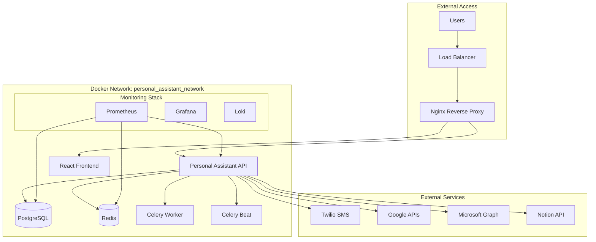

# Docker Setup Guide

This guide covers Docker configuration, containerization, and deployment strategies for the Personal Assistant TDAH system.

## Table of Contents

- [Overview](#overview)
- [Docker Architecture](#docker-architecture)
- [Environment Configurations](#environment-configurations)
- [Container Services](#container-services)
- [Networking](#networking)
- [Volumes and Data Persistence](#volumes-and-data-persistence)
- [Health Checks](#health-checks)
- [Security Considerations](#security-considerations)
- [Development Setup](#development-setup)
- [Production Deployment](#production-deployment)
- [Monitoring Integration](#monitoring-integration)
- [Troubleshooting](#troubleshooting)

## Overview

The Personal Assistant system uses Docker for containerization across multiple environments:

- **Development**: Local development with hot reloading
- **Staging**: Pre-production testing environment
- **Production**: Live deployment with security hardening

### Key Benefits

- **Consistency**: Identical environments across development, staging, and production
- **Isolation**: Each service runs in its own container
- **Scalability**: Easy horizontal scaling of services
- **Portability**: Deploy anywhere Docker runs
- **Security**: Container-level isolation and security controls

## Docker Architecture

### Service Architecture



### Container Specifications

| Service        | Image       | Ports   | Resources | Purpose                        |
| -------------- | ----------- | ------- | --------- | ------------------------------ |
| **nginx**      | Custom      | 80, 443 | 256MB RAM | Reverse proxy, SSL termination |
| **frontend**   | Node.js 18  | 3001    | 512MB RAM | React development server       |
| **api**        | Python 3.11 | 8000    | 1GB RAM   | FastAPI application            |
| **worker**     | Python 3.11 | -       | 512MB RAM | Background task processing     |
| **scheduler**  | Python 3.11 | -       | 256MB RAM | Scheduled task management      |
| **redis**      | Redis 7     | 6379    | 256MB RAM | Caching and message broker     |
| **prometheus** | Prometheus  | 9090    | 512MB RAM | Metrics collection             |
| **grafana**    | Grafana     | 3000    | 512MB RAM | Metrics visualization          |
| **loki**       | Loki        | 3100    | 256MB RAM | Log aggregation                |

## Environment Configurations

### Development Environment

**File**: `docker/docker-compose.dev.yml`

```yaml
version: "3.8"

services:
  nginx:
    build:
      context: ./nginx
      dockerfile: Dockerfile
    container_name: personal_assistant_nginx_dev
    ports:
      - "8081:80"
      - "8445:443"
    volumes:
      - ./nginx/ssl/dev:/etc/nginx/ssl:ro
      - ./nginx/logs:/var/log/nginx
      - ./nginx/conf.d:/etc/nginx/conf.d:ro
    depends_on:
      - api
    networks:
      - personal_assistant_network
    restart: unless-stopped
    healthcheck:
      test: ["CMD", "curl", "-f", "http://localhost/health"]
      interval: 30s
      timeout: 10s
      retries: 3
      start_period: 40s
```

**Key Features**:

- Hot reloading for frontend development
- Volume mounting for live code changes
- Development SSL certificates
- Debug logging enabled
- Local PostgreSQL connection

### Staging Environment

**File**: `docker/docker-compose.stage.yml`

**Key Features**:

- Production-like configuration
- Staging SSL certificates
- Performance monitoring enabled
- Limited debug logging
- Staging database

### Production Environment

**File**: `docker/docker-compose.prod.yml`

**Key Features**:

- Production SSL certificates
- Security hardening
- Performance optimization
- Comprehensive monitoring
- Production database

## Container Services

### 1. Nginx Reverse Proxy

**Purpose**: SSL termination, load balancing, static file serving

**Configuration**:

```nginx
server {
    listen 80;
    server_name localhost;
    return 301 https://$server_name$request_uri;
}

server {
    listen 443 ssl http2;
    server_name localhost;

    ssl_certificate /etc/nginx/ssl/cert.pem;
    ssl_certificate_key /etc/nginx/ssl/key.pem;

    # Security headers
    add_header X-Frame-Options DENY;
    add_header X-Content-Type-Options nosniff;
    add_header X-XSS-Protection "1; mode=block";

    # API proxy
    location /api/ {
        proxy_pass http://api:8000/;
        proxy_set_header Host $host;
        proxy_set_header X-Real-IP $remote_addr;
        proxy_set_header X-Forwarded-For $proxy_add_x_forwarded_for;
        proxy_set_header X-Forwarded-Proto $scheme;
    }

    # Frontend proxy
    location / {
        proxy_pass http://frontend:3001/;
        proxy_set_header Host $host;
        proxy_set_header X-Real-IP $remote_addr;
        proxy_set_header X-Forwarded-For $proxy_add_x_forwarded_for;
        proxy_set_header X-Forwarded-Proto $scheme;
    }
}
```

### 2. Personal Assistant API

**Dockerfile**: `docker/Dockerfile`

```dockerfile
FROM python:3.11-slim as base

# Set environment variables
ENV PYTHONUNBUFFERED=1
ENV PYTHONDONTWRITEBYTECODE=1
ENV PIP_NO_CACHE_DIR=1
ENV PIP_DISABLE_PIP_VERSION_CHECK=1

# Install system dependencies
RUN apt-get update && apt-get install -y \
    curl \
    && rm -rf /var/lib/apt/lists/*

# Create app directory
WORKDIR /app

# Copy requirements and install Python dependencies
COPY requirements.txt .
RUN pip install --no-cache-dir -r requirements.txt

# Copy application code
COPY src/ ./src/
COPY config/ ./config/

# Create non-root user
RUN useradd --create-home --shell /bin/bash app
RUN chown -R app:app /app
USER app

# Expose port
EXPOSE 8000

# Health check
HEALTHCHECK --interval=30s --timeout=10s --start-period=60s --retries=3 \
    CMD curl -f http://localhost:8000/health/overall || exit 1

# Start command
CMD ["uvicorn", "src.apps.fastapi_app.main:app", "--host", "0.0.0.0", "--port", "8000"]
```

### 3. Frontend Development Server

**Dockerfile**: `src/apps/frontend/Dockerfile.dev`

```dockerfile
FROM node:18-alpine

WORKDIR /app

# Copy package files
COPY package*.json ./

# Install dependencies
RUN npm install

# Copy source code
COPY . .

# Expose port
EXPOSE 3001

# Start development server
CMD ["npm", "run", "dev", "--", "--host", "0.0.0.0", "--port", "3001"]
```

### 4. Celery Worker

**Configuration**:

```yaml
worker:
  build:
    context: ..
    dockerfile: docker/Dockerfile
    target: development
  container_name: personal_assistant_worker
  env_file:
    - ../config/development.env
  command:
    [
      "celery",
      "-A",
      "personal_assistant.workers.celery_app",
      "worker",
      "--loglevel=info",
      "--queues=ai_tasks",
    ]
  depends_on:
    redis:
      condition: service_healthy
  restart: unless-stopped
  networks:
    - personal_assistant_network
```

### 5. Celery Beat Scheduler

**Configuration**:

```yaml
scheduler:
  build:
    context: ..
    dockerfile: docker/Dockerfile
    target: development
  container_name: personal_assistant_scheduler
  env_file:
    - ../config/development.env
  command:
    [
      "celery",
      "-A",
      "personal_assistant.workers.celery_app",
      "beat",
      "--loglevel=info",
    ]
  depends_on:
    redis:
      condition: service_healthy
  restart: unless-stopped
  networks:
    - personal_assistant_network
```

## Networking

### Network Configuration

**Network**: `personal_assistant_network`

- **Type**: Bridge network
- **Subnet**: 172.20.0.0/16
- **Driver**: bridge

### Service Communication

```yaml
networks:
  personal_assistant_network:
    driver: bridge
    ipam:
      config:
        - subnet: 172.20.0.0/16
```

### Internal Service URLs

| Service    | Internal URL             | External URL             |
| ---------- | ------------------------ | ------------------------ |
| API        | `http://api:8000`        | `http://localhost:8000`  |
| Frontend   | `http://frontend:3001`   | `http://localhost:3001`  |
| Redis      | `redis://redis:6379`     | `redis://localhost:6379` |
| Prometheus | `http://prometheus:9090` | `http://localhost:9090`  |
| Grafana    | `http://grafana:3000`    | `http://localhost:3000`  |

## Volumes and Data Persistence

### Volume Configuration

```yaml
volumes:
  postgres_data:
    driver: local
  redis_data:
    driver: local
  prometheus_data:
    driver: local
  grafana_data:
    driver: local
  loki_data:
    driver: local
```

### Volume Mounts

| Service        | Volume Mount                    | Purpose             |
| -------------- | ------------------------------- | ------------------- |
| **nginx**      | `./nginx/logs:/var/log/nginx`   | Log persistence     |
| **nginx**      | `./nginx/ssl:/etc/nginx/ssl:ro` | SSL certificates    |
| **api**        | `../src:/app/src:ro`            | Code mounting (dev) |
| **api**        | `../logs:/app/logs`             | Application logs    |
| **redis**      | `redis_data:/data`              | Redis persistence   |
| **prometheus** | `prometheus_data:/prometheus`   | Metrics storage     |
| **grafana**    | `grafana_data:/var/lib/grafana` | Dashboard storage   |

## Health Checks

### API Health Check

```yaml
healthcheck:
  test: ["CMD", "curl", "-f", "http://localhost:8000/health/overall"]
  interval: 30s
  timeout: 10s
  retries: 3
  start_period: 60s
```

### Redis Health Check

```yaml
healthcheck:
  test: ["CMD", "redis-cli", "--raw", "incr", "ping"]
  interval: 10s
  timeout: 3s
  retries: 5
  start_period: 30s
```

### Nginx Health Check

```yaml
healthcheck:
  test: ["CMD", "curl", "-f", "http://localhost/health"]
  interval: 30s
  timeout: 10s
  retries: 3
  start_period: 40s
```

## Security Considerations

### Container Security

1. **Non-root User**: All containers run as non-root user
2. **Read-only Filesystems**: Where possible, use read-only mounts
3. **Resource Limits**: Set memory and CPU limits
4. **Network Isolation**: Services communicate through internal network
5. **Secrets Management**: Use Docker secrets or environment files

### SSL/TLS Configuration

```nginx
ssl_protocols TLSv1.2 TLSv1.3;
ssl_ciphers ECDHE-RSA-AES256-GCM-SHA512:DHE-RSA-AES256-GCM-SHA512:ECDHE-RSA-AES256-GCM-SHA384:DHE-RSA-AES256-GCM-SHA384;
ssl_prefer_server_ciphers off;
ssl_session_cache shared:SSL:10m;
ssl_session_timeout 10m;
```

### Environment Variables Security

```bash
# Production environment variables
PROD_DB_PASSWORD=your_secure_production_password_here_32chars_min
PROD_REDIS_PASSWORD=your_secure_redis_password_here_32chars_min
JWT_SECRET_KEY=your_jwt_secret_key_here_32_chars_minimum
ENCRYPTION_KEY=your_32_character_encryption_key_here
```

## Development Setup

### Prerequisites

- Docker Desktop 4.0+
- Docker Compose 2.0+
- 8GB+ RAM available
- 20GB+ disk space

### Quick Start

1. **Clone Repository**:

   ```bash
   git clone <repository-url>
   cd personal_assistant
   ```

2. **Set Up Environment**:

   ```bash
   cp config/env.example config/development.env
   # Edit development.env with your values
   ```

3. **Start Development Environment**:

   ```bash
   cd docker
   docker-compose -f docker-compose.dev.yml up -d
   ```

4. **Verify Services**:

   ```bash
   docker-compose -f docker-compose.dev.yml ps
   ```

5. **Access Applications**:
   - Frontend: http://localhost:3001
   - API: http://localhost:8000
   - Grafana: http://localhost:3000
   - Prometheus: http://localhost:9090

### Development Workflow

1. **Code Changes**: Edit files in `src/` directory
2. **Hot Reload**: Frontend automatically reloads
3. **API Restart**: Restart API container for changes
4. **Database Changes**: Use migrations for schema changes
5. **Logs**: View logs with `docker-compose logs -f <service>`

## Production Deployment

### Production Checklist

- [ ] SSL certificates configured
- [ ] Environment variables secured
- [ ] Database backups enabled
- [ ] Monitoring configured
- [ ] Log aggregation set up
- [ ] Security scanning completed
- [ ] Performance testing done
- [ ] Disaster recovery plan tested

### Deployment Steps

1. **Prepare Production Environment**:

   ```bash
   cp docker/env.prod.example docker/.env.prod
   # Configure production values
   ```

2. **Build Production Images**:

   ```bash
   docker-compose -f docker-compose.prod.yml build
   ```

3. **Deploy Services**:

   ```bash
   docker-compose -f docker-compose.prod.yml up -d
   ```

4. **Verify Deployment**:
   ```bash
   docker-compose -f docker-compose.prod.yml ps
   curl -f https://your-domain.com/health/overall
   ```

### Production Optimizations

1. **Multi-stage Builds**: Separate build and runtime stages
2. **Image Optimization**: Minimize image size
3. **Resource Limits**: Set appropriate CPU/memory limits
4. **Health Checks**: Comprehensive health monitoring
5. **Logging**: Structured logging with log rotation

## Monitoring Integration

### Prometheus Configuration

```yaml
scrape_configs:
  - job_name: "personal_assistant_api"
    static_configs:
      - targets: ["api:8000"]
    metrics_path: "/health/database/performance"
    scrape_interval: 30s
```

### Grafana Dashboards

- **System Overview**: CPU, memory, disk usage
- **Application Metrics**: Request rates, response times
- **Database Performance**: Query performance, connection pools
- **Business Metrics**: User activity, feature usage

### Log Aggregation

**Loki Configuration**:

```yaml
auth_enabled: false
server:
  http_listen_port: 3100
storage_config:
  filesystem:
    chunks_directory: /loki/chunks
    rules_directory: /loki/rules
```

## Troubleshooting

### Common Issues

1. **Container Won't Start**:

   ```bash
   docker-compose logs <service-name>
   docker-compose ps
   ```

2. **Database Connection Issues**:

   ```bash
   docker-compose exec api python -c "from personal_assistant.database.connection import get_db; print('DB OK')"
   ```

3. **Redis Connection Issues**:

   ```bash
   docker-compose exec redis redis-cli ping
   ```

4. **Port Conflicts**:
   ```bash
   netstat -tulpn | grep :8000
   ```

### Debug Commands

```bash
# View all container logs
docker-compose logs -f

# View specific service logs
docker-compose logs -f api

# Execute commands in container
docker-compose exec api bash

# Check container resource usage
docker stats

# Restart specific service
docker-compose restart api

# Rebuild and restart service
docker-compose up -d --build api
```

### Performance Issues

1. **High Memory Usage**:

   - Check for memory leaks
   - Adjust container memory limits
   - Monitor garbage collection

2. **Slow Database Queries**:

   - Check database performance metrics
   - Review query execution plans
   - Optimize database indexes

3. **Network Latency**:
   - Check network configuration
   - Monitor DNS resolution
   - Verify service discovery

### Recovery Procedures

1. **Service Failure**:

   ```bash
   docker-compose restart <service>
   ```

2. **Data Loss**:

   - Restore from database backups
   - Rebuild Redis cache
   - Restart affected services

3. **Complete System Failure**:
   ```bash
   docker-compose down
   docker-compose up -d
   ```

## Best Practices

### Development

1. **Use Development Compose**: Always use `docker-compose.dev.yml` for development
2. **Volume Mounting**: Mount source code for hot reloading
3. **Environment Variables**: Use `.env` files for configuration
4. **Health Checks**: Implement comprehensive health checks
5. **Logging**: Use structured logging for debugging

### Production

1. **Security**: Run containers as non-root users
2. **Resource Limits**: Set appropriate CPU and memory limits
3. **Monitoring**: Implement comprehensive monitoring
4. **Backups**: Regular database and volume backups
5. **Updates**: Regular security updates and patches

### Maintenance

1. **Image Updates**: Regularly update base images
2. **Dependency Updates**: Keep dependencies current
3. **Security Scanning**: Regular vulnerability scans
4. **Performance Monitoring**: Continuous performance monitoring
5. **Documentation**: Keep documentation updated

This Docker setup provides a robust, scalable, and maintainable containerized environment for the Personal Assistant TDAH system across all deployment stages.
