# Production Deployment Guide

This guide covers production deployment procedures, security hardening, and operational best practices for the Personal Assistant TDAH system.

## Table of Contents

- [Overview](#overview)
- [Production Architecture](#production-architecture)
- [Prerequisites](#prerequisites)
- [Security Hardening](#security-hardening)
- [SSL/TLS Configuration](#ssltls-configuration)
- [Database Setup](#database-setup)
- [Deployment Procedures](#deployment-procedures)
- [High Availability](#high-availability)
- [Backup and Recovery](#backup-and-recovery)
- [Performance Optimization](#performance-optimization)
- [Monitoring and Alerting](#monitoring-and-alerting)
- [Maintenance Procedures](#maintenance-procedures)
- [Disaster Recovery](#disaster-recovery)

## Overview

Production deployment requires careful planning, security hardening, and operational excellence. This guide covers:

- **Security Hardening**: Comprehensive security measures
- **High Availability**: Redundancy and failover mechanisms
- **Performance Optimization**: Production-grade performance tuning
- **Monitoring**: Comprehensive observability and alerting
- **Backup Strategy**: Data protection and recovery procedures
- **Maintenance**: Regular maintenance and update procedures

### Production Environment Characteristics

- **Security**: Multi-layer security with encryption and access controls
- **Reliability**: High availability with redundancy and failover
- **Performance**: Optimized for high throughput and low latency
- **Scalability**: Horizontal scaling capabilities
- **Monitoring**: Comprehensive observability and alerting
- **Compliance**: Security and privacy compliance measures

## Production Architecture

### High-Level Architecture

```mermaid
graph TB
    subgraph "External Access"
        Users[👤 Users]
        Admin[👨‍💼 Administrators]
        Mobile[📱 Mobile Apps]
    end

    subgraph "Load Balancer Layer"
        LB[Load Balancer<br/>HAProxy/Nginx]
    end

    subgraph "Application Layer"
        API1[API Instance 1]
        API2[API Instance 2]
        API3[API Instance 3]
        FRONTEND1[Frontend Instance 1]
        FRONTEND2[Frontend Instance 2]
    end

    subgraph "Data Layer"
        DB_MASTER[(PostgreSQL Master)]
        DB_REPLICA[(PostgreSQL Replica)]
        REDIS_CLUSTER[(Redis Cluster)]
    end

    subgraph "Monitoring Stack"
        PROM[Prometheus]
        GRAF[Grafana]
        LOKI[Loki]
        ALERT[AlertManager]
    end

    subgraph "External Services"
        TWILIO[Twilio SMS]
        GOOGLE[Google APIs]
        MICROSOFT[Microsoft Graph]
        NOTION[Notion API]
    end

    Users --> LB
    Admin --> LB
    Mobile --> LB

    LB --> API1
    LB --> API2
    LB --> API3
    LB --> FRONTEND1
    LB --> FRONTEND2

    API1 --> DB_MASTER
    API2 --> DB_MASTER
    API3 --> DB_MASTER

    DB_MASTER --> DB_REPLICA

    API1 --> REDIS_CLUSTER
    API2 --> REDIS_CLUSTER
    API3 --> REDIS_CLUSTER

    API1 --> TWILIO
    API1 --> GOOGLE
    API1 --> MICROSOFT
    API1 --> NOTION

    PROM --> API1
    PROM --> API2
    PROM --> API3
    PROM --> DB_MASTER
    PROM --> REDIS_CLUSTER
```



### Production Components

| Component              | Count | Purpose              | Resources           |
| ---------------------- | ----- | -------------------- | ------------------- |
| **Load Balancer**      | 2     | Traffic distribution | 2 CPU, 4GB RAM      |
| **API Instances**      | 3     | Application servers  | 4 CPU, 8GB RAM each |
| **Frontend Instances** | 2     | Static file serving  | 2 CPU, 4GB RAM each |
| **Database Master**    | 1     | Primary database     | 8 CPU, 16GB RAM     |
| **Database Replica**   | 1     | Read replica         | 8 CPU, 16GB RAM     |
| **Redis Cluster**      | 3     | Caching and sessions | 2 CPU, 4GB RAM each |
| **Monitoring**         | 1     | Observability stack  | 4 CPU, 8GB RAM      |

## Prerequisites

### Infrastructure Requirements

- **Servers**: Minimum 3 servers for high availability
- **CPU**: 32+ cores total across all servers
- **Memory**: 64GB+ RAM total across all servers
- **Storage**: 500GB+ SSD storage per server
- **Network**: High-speed internet with redundancy
- **Domain**: Registered domain name with DNS control

### External Services

- **SSL Certificate**: Valid SSL certificate from trusted CA
- **Database**: PostgreSQL 15+ with replication support
- **Redis**: Redis 7+ with clustering support
- **Monitoring**: Prometheus, Grafana, Loki setup
- **Backup**: Automated backup solution
- **CDN**: Content delivery network for static assets

### Security Requirements

- **Firewall**: Properly configured firewall rules
- **VPN**: Secure access for administrators
- **SSH**: Key-based authentication only
- **Updates**: Regular security updates
- **Monitoring**: Security monitoring and alerting

## Security Hardening

### Container Security

```yaml
# Security configuration for containers
security_opt:
  - no-new-privileges:true
cap_drop:
  - ALL
cap_add:
  - CHOWN
  - SETGID
  - SETUID
read_only: true
user: "1000:1000"
```

### Network Security

```yaml
# Network security configuration
networks:
  production_network:
    driver: bridge
    ipam:
      config:
        - subnet: 172.21.0.0/16
    driver_opts:
      com.docker.network.bridge.enable_icc: "false"
      com.docker.network.bridge.enable_ip_masquerade: "true"
```

### Environment Security

```bash
# Production environment variables
ENVIRONMENT=production
DEBUG=false
LOG_LEVEL=INFO

# Security settings
JWT_SECRET_KEY=your_very_secure_jwt_secret_key_here_64_chars_minimum
ENCRYPTION_KEY=your_very_secure_32_character_encryption_key_here
SESSION_SECRET=your_very_secure_session_secret_key_here

# Database security
DB_SSL_MODE=require
DB_SSL_CERT=/app/ssl/client-cert.pem
DB_SSL_KEY=/app/ssl/client-key.pem
DB_SSL_ROOT_CERT=/app/ssl/ca-cert.pem

# Redis security
REDIS_PASSWORD=your_very_secure_redis_password_here_32_chars_minimum
REDIS_SSL=true
```

### Access Control

```yaml
# RBAC configuration
rbac:
  default_role: "user"
  admin_roles:
    - "admin"
    - "super_admin"
  permissions:
    - "read:users"
    - "write:users"
    - "delete:users"
    - "read:analytics"
    - "write:analytics"
    - "admin:system"
```

## SSL/TLS Configuration

### Certificate Setup

```bash
# Generate private key
openssl genrsa -out private.key 4096

# Generate certificate signing request
openssl req -new -key private.key -out certificate.csr

# Submit CSR to CA and receive certificate
# Place certificate files in docker/nginx/ssl/prod/
```

### Nginx SSL Configuration

```nginx
# SSL configuration
ssl_protocols TLSv1.2 TLSv1.3;
ssl_ciphers ECDHE-RSA-AES256-GCM-SHA512:DHE-RSA-AES256-GCM-SHA512:ECDHE-RSA-AES256-GCM-SHA384:DHE-RSA-AES256-GCM-SHA384;
ssl_prefer_server_ciphers off;
ssl_session_cache shared:SSL:10m;
ssl_session_timeout 10m;
ssl_session_tickets off;

# HSTS
add_header Strict-Transport-Security "max-age=31536000; includeSubDomains" always;

# Security headers
add_header X-Frame-Options DENY always;
add_header X-Content-Type-Options nosniff always;
add_header X-XSS-Protection "1; mode=block" always;
add_header Referrer-Policy "strict-origin-when-cross-origin" always;
add_header Content-Security-Policy "default-src 'self'; script-src 'self' 'unsafe-inline'; style-src 'self' 'unsafe-inline'; img-src 'self' data: https:; font-src 'self' data:; connect-src 'self' https:; frame-ancestors 'none';" always;
```

### Certificate Renewal

```bash
#!/bin/bash
# certificate-renewal.sh

# Check certificate expiration
openssl x509 -in /etc/nginx/ssl/prod/cert.pem -noout -dates

# Renew certificate (using Let's Encrypt as example)
certbot renew --nginx

# Reload nginx
docker-compose exec nginx nginx -s reload
```

## Database Setup

### PostgreSQL Configuration

```sql
-- Production PostgreSQL configuration
-- postgresql.conf

# Memory settings
shared_buffers = 4GB
effective_cache_size = 12GB
maintenance_work_mem = 512MB
work_mem = 64MB

# Connection settings
max_connections = 200
shared_preload_libraries = 'pg_stat_statements'

# Logging
log_destination = 'stderr'
logging_collector = on
log_directory = 'log'
log_filename = 'postgresql-%Y-%m-%d_%H%M%S.log'
log_rotation_age = 1d
log_rotation_size = 100MB
log_min_duration_statement = 1000
log_line_prefix = '%t [%p]: [%l-1] user=%u,db=%d,app=%a,client=%h '

# Performance
checkpoint_completion_target = 0.9
wal_buffers = 16MB
default_statistics_target = 100
random_page_cost = 1.1
effective_io_concurrency = 200
```

### Database Replication

```sql
-- Master configuration
-- postgresql.conf
wal_level = replica
max_wal_senders = 3
max_replication_slots = 3
hot_standby = on

-- Replica configuration
-- recovery.conf
standby_mode = 'on'
primary_conninfo = 'host=master_host port=5432 user=replica_user password=replica_password'
trigger_file = '/tmp/postgresql.trigger'
```

### Database Security

```sql
-- Create production users
CREATE USER app_user WITH PASSWORD 'secure_app_password';
CREATE USER replica_user WITH PASSWORD 'secure_replica_password';
CREATE USER backup_user WITH PASSWORD 'secure_backup_password';

-- Grant permissions
GRANT CONNECT ON DATABASE personal_assistant_prod TO app_user;
GRANT USAGE ON SCHEMA public TO app_user;
GRANT SELECT, INSERT, UPDATE, DELETE ON ALL TABLES IN SCHEMA public TO app_user;
GRANT USAGE, SELECT ON ALL SEQUENCES IN SCHEMA public TO app_user;

-- Replication permissions
GRANT REPLICATION TO replica_user;

-- Backup permissions
GRANT CONNECT ON DATABASE personal_assistant_prod TO backup_user;
GRANT USAGE ON SCHEMA public TO backup_user;
GRANT SELECT ON ALL TABLES IN SCHEMA public TO backup_user;
```

## Deployment Procedures

### Pre-Deployment Checklist

- [ ] SSL certificates installed and valid
- [ ] Database configured with replication
- [ ] Redis cluster configured
- [ ] Environment variables secured
- [ ] Monitoring stack deployed
- [ ] Backup procedures tested
- [ ] Load balancer configured
- [ ] DNS records updated
- [ ] Security scanning completed
- [ ] Performance testing completed

### Deployment Steps

1. **Prepare Environment**:

   ```bash
   # Copy production configuration
   cp docker/env.prod.example docker/.env.prod

   # Configure environment variables
   nano docker/.env.prod
   ```

2. **Deploy Infrastructure**:

   ```bash
   # Start production environment
   cd docker
   docker-compose -f docker-compose.prod.yml --env-file .env.prod up -d
   ```

3. **Run Database Migrations**:

   ```bash
   # Run migrations
   docker-compose -f docker-compose.prod.yml exec api python -m alembic upgrade head
   ```

4. **Verify Deployment**:

   ```bash
   # Check service health
   curl https://your-domain.com/health/overall

   # Check all services
   docker-compose -f docker-compose.prod.yml ps
   ```

5. **Configure Load Balancer**:
   ```bash
   # Update load balancer configuration
   # Add new instances to load balancer pool
   ```

### Post-Deployment Verification

```bash
#!/bin/bash
# post-deployment-check.sh

echo "Running post-deployment checks..."

# Check API health
if curl -f https://your-domain.com/health/overall > /dev/null 2>&1; then
    echo "✅ API: Healthy"
else
    echo "❌ API: Unhealthy"
    exit 1
fi

# Check database connectivity
if curl -f https://your-domain.com/health/database > /dev/null 2>&1; then
    echo "✅ Database: Healthy"
else
    echo "❌ Database: Unhealthy"
    exit 1
fi

# Check Redis connectivity
if docker-compose exec redis redis-cli ping > /dev/null 2>&1; then
    echo "✅ Redis: Healthy"
else
    echo "❌ Redis: Unhealthy"
    exit 1
fi

# Check SSL certificate
if openssl s_client -connect your-domain.com:443 -servername your-domain.com < /dev/null 2>&1 | grep -q "Verify return code: 0"; then
    echo "✅ SSL: Valid"
else
    echo "❌ SSL: Invalid"
    exit 1
fi

echo "✅ All checks passed!"
```

## High Availability

### Load Balancer Configuration

```nginx
# HAProxy configuration
global
    daemon
    log 127.0.0.1:514 local0
    chroot /var/lib/haproxy
    stats socket /run/haproxy/admin.sock mode 660 level admin
    stats timeout 30s
    user haproxy
    group haproxy

defaults
    mode http
    log global
    option httplog
    option dontlognull
    option log-health-checks
    option forwardfor
    option httpchk GET /health/overall
    timeout connect 5000
    timeout client 50000
    timeout server 50000

frontend http_front
    bind *:80
    redirect scheme https code 301

frontend https_front
    bind *:443 ssl crt /etc/ssl/certs/your-domain.com.pem
    default_backend api_backend

backend api_backend
    balance roundrobin
    option httpchk GET /health/overall
    server api1 172.21.0.10:8000 check
    server api2 172.21.0.11:8000 check
    server api3 172.21.0.12:8000 check
```

### Database High Availability

```yaml
# PostgreSQL cluster configuration
postgresql:
  cluster_name: "personal_assistant_cluster"
  nodes:
    - name: "master"
      host: "db-master"
      port: 5432
      role: "master"
    - name: "replica1"
      host: "db-replica1"
      port: 5432
      role: "replica"
    - name: "replica2"
      host: "db-replica2"
      port: 5432
      role: "replica"
```

### Redis High Availability

```yaml
# Redis cluster configuration
redis:
  cluster:
    enabled: true
    nodes:
      - host: "redis-1"
        port: 6379
      - host: "redis-2"
        port: 6379
      - host: "redis-3"
        port: 6379
  sentinel:
    enabled: true
    master_name: "mymaster"
    nodes:
      - host: "sentinel-1"
        port: 26379
      - host: "sentinel-2"
        port: 26379
      - host: "sentinel-3"
        port: 26379
```

## Backup and Recovery

### Database Backup

```bash
#!/bin/bash
# database-backup.sh

BACKUP_DIR="/backups/postgresql"
DATE=$(date +%Y%m%d_%H%M%S)
DB_NAME="personal_assistant_prod"

# Create backup directory
mkdir -p $BACKUP_DIR

# Full database backup
pg_dump -h db-master -U backup_user -d $DB_NAME \
  --verbose --clean --no-owner --no-privileges \
  --format=custom --file=$BACKUP_DIR/full_backup_$DATE.dump

# Compress backup
gzip $BACKUP_DIR/full_backup_$DATE.dump

# Remove old backups (keep 30 days)
find $BACKUP_DIR -name "full_backup_*.dump.gz" -mtime +30 -delete

echo "Database backup completed: full_backup_$DATE.dump.gz"
```

### Application Backup

```bash
#!/bin/bash
# application-backup.sh

BACKUP_DIR="/backups/application"
DATE=$(date +%Y%m%d_%H%M%S)

# Create backup directory
mkdir -p $BACKUP_DIR

# Backup application code
tar -czf $BACKUP_DIR/application_$DATE.tar.gz \
  --exclude=node_modules \
  --exclude=.git \
  /app/src

# Backup configuration
tar -czf $BACKUP_DIR/config_$DATE.tar.gz \
  /app/config

# Backup logs
tar -czf $BACKUP_DIR/logs_$DATE.tar.gz \
  /app/logs

echo "Application backup completed: $DATE"
```

### Recovery Procedures

```bash
#!/bin/bash
# database-recovery.sh

BACKUP_FILE=$1
DB_NAME="personal_assistant_prod"

if [ -z "$BACKUP_FILE" ]; then
    echo "Usage: $0 <backup_file>"
    exit 1
fi

# Stop application
docker-compose stop api

# Restore database
pg_restore -h db-master -U backup_user -d $DB_NAME \
  --verbose --clean --no-owner --no-privileges \
  --format=custom $BACKUP_FILE

# Start application
docker-compose start api

echo "Database recovery completed"
```

## Performance Optimization

### Application Performance

```python
# Production performance settings
# config/production.env

# Database connection pooling
DB_POOL_SIZE=20
DB_MAX_OVERFLOW=30
DB_POOL_TIMEOUT=30
DB_POOL_RECYCLE=3600
DB_POOL_PRE_PING=true

# Redis configuration
REDIS_MAX_CONNECTIONS=100
REDIS_RETRY_ON_TIMEOUT=true
REDIS_SOCKET_KEEPALIVE=true
REDIS_SOCKET_KEEPALIVE_OPTIONS={}

# Application settings
WORKERS=4
WORKER_CLASS=uvicorn.workers.UvicornWorker
WORKER_CONNECTIONS=1000
MAX_REQUESTS=1000
MAX_REQUESTS_JITTER=100
```

### Database Performance

```sql
-- Performance indexes
CREATE INDEX CONCURRENTLY idx_users_email ON users(email);
CREATE INDEX CONCURRENTLY idx_users_phone ON users(phone_number);
CREATE INDEX CONCURRENTLY idx_conversations_user_id ON conversation_states(user_id);
CREATE INDEX CONCURRENTLY idx_messages_conversation_id ON conversation_messages(conversation_id);
CREATE INDEX CONCURRENTLY idx_messages_timestamp ON conversation_messages(timestamp);

-- Query optimization
ANALYZE;
VACUUM ANALYZE;
```

### Caching Strategy

```python
# Redis caching configuration
CACHE_TTL = {
    'user_profile': 3600,  # 1 hour
    'oauth_tokens': 1800,  # 30 minutes
    'sms_routing': 7200,   # 2 hours
    'analytics': 300,      # 5 minutes
}

# Cache invalidation patterns
CACHE_INVALIDATION = {
    'user_update': ['user_profile'],
    'oauth_refresh': ['oauth_tokens'],
    'sms_config': ['sms_routing'],
}
```

## Monitoring and Alerting

### Production Monitoring

```yaml
# Prometheus production configuration
global:
  scrape_interval: 15s
  evaluation_interval: 15s

rule_files:
  - "production-alerts.yml"

scrape_configs:
  - job_name: "personal_assistant_api"
    static_configs:
      - targets: ["api1:8000", "api2:8000", "api3:8000"]
    metrics_path: "/health/database/performance"
    scrape_interval: 30s
```

### Critical Alerts

```yaml
# production-alerts.yml
groups:
  - name: production-critical
    rules:
      - alert: HighErrorRate
        expr: rate(http_requests_total{status=~"5.."}[5m]) / rate(http_requests_total[5m]) * 100 > 1
        for: 2m
        labels:
          severity: critical
        annotations:
          summary: "High error rate in production"
          description: "Error rate is {{ $value }}% for the last 5 minutes"

      - alert: DatabaseDown
        expr: database_health_status == 0
        for: 1m
        labels:
          severity: critical
        annotations:
          summary: "Database is down"
          description: "Database health check failed"

      - alert: HighResponseTime
        expr: histogram_quantile(0.95, rate(http_request_duration_seconds_bucket[5m])) > 1
        for: 5m
        labels:
          severity: warning
        annotations:
          summary: "High response time"
          description: "95th percentile response time is {{ $value }}s"
```

## Maintenance Procedures

### Regular Maintenance

```bash
#!/bin/bash
# weekly-maintenance.sh

echo "Starting weekly maintenance..."

# Update system packages
apt-get update && apt-get upgrade -y

# Clean Docker images
docker system prune -f

# Optimize database
docker-compose exec postgres psql -U postgres -d personal_assistant_prod -c "
VACUUM ANALYZE;
REINDEX DATABASE personal_assistant_prod;
"

# Rotate logs
logrotate /etc/logrotate.d/personal-assistant

# Check disk usage
df -h

# Check memory usage
free -h

echo "Weekly maintenance completed"
```

### Security Updates

```bash
#!/bin/bash
# security-updates.sh

echo "Applying security updates..."

# Update base images
docker-compose pull

# Rebuild containers
docker-compose build --no-cache

# Restart services
docker-compose up -d

# Verify deployment
curl -f https://your-domain.com/health/overall

echo "Security updates applied"
```

### Performance Monitoring

```bash
#!/bin/bash
# performance-check.sh

echo "Running performance checks..."

# Check response times
curl -w "@curl-format.txt" -o /dev/null -s https://your-domain.com/health/overall

# Check database performance
curl -s https://your-domain.com/health/database/performance | jq

# Check memory usage
docker stats --no-stream

# Check disk I/O
iostat -x 1 5

echo "Performance checks completed"
```

## Disaster Recovery

### Disaster Recovery Plan

1. **Assessment**: Assess the scope and impact of the disaster
2. **Communication**: Notify stakeholders and users
3. **Recovery**: Execute recovery procedures
4. **Verification**: Verify system functionality
5. **Documentation**: Document lessons learned

### Recovery Procedures

```bash
#!/bin/bash
# disaster-recovery.sh

echo "Starting disaster recovery procedures..."

# Stop all services
docker-compose down

# Restore from backup
./database-recovery.sh /backups/postgresql/latest_backup.dump.gz
./application-recovery.sh /backups/application/latest_backup.tar.gz

# Start services
docker-compose up -d

# Verify recovery
./post-deployment-check.sh

echo "Disaster recovery completed"
```

### Business Continuity

- **RTO (Recovery Time Objective)**: 4 hours
- **RPO (Recovery Point Objective)**: 1 hour
- **Backup Frequency**: Every 6 hours
- **Testing Frequency**: Monthly
- **Documentation**: Updated quarterly

This production deployment guide provides comprehensive procedures for deploying, securing, and maintaining the Personal Assistant TDAH system in a production environment with high availability, security, and performance.
