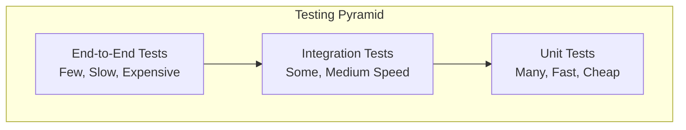
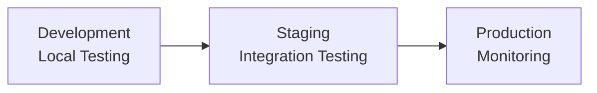

# Testing Guide

This guide covers testing strategies, tools, and best practices for the Personal Assistant TDAH system.

## Table of Contents

- [Testing Overview](#testing-overview)
- [Testing Strategy](#testing-strategy)
- [Backend Testing](#backend-testing)
- [Frontend Testing](#frontend-testing)
- [Integration Testing](#integration-testing)
- [End-to-End Testing](#end-to-end-testing)
- [Performance Testing](#performance-testing)
- [Security Testing](#security-testing)
- [Test Data Management](#test-data-management)
- [CI/CD Testing](#cicd-testing)
- [Testing Best Practices](#testing-best-practices)

## Testing Overview

### Testing Pyramid



### Testing Types

| Test Type             | Purpose                           | Tools               | Coverage          |
| --------------------- | --------------------------------- | ------------------- | ----------------- |
| **Unit Tests**        | Test individual functions/classes | pytest, Jest        | 80%+              |
| **Integration Tests** | Test component interactions       | pytest, Supertest   | Key workflows     |
| **E2E Tests**         | Test complete user journeys       | Playwright, Cypress | Critical paths    |
| **Performance Tests** | Test system performance           | Locust, Artillery   | Load scenarios    |
| **Security Tests**    | Test security vulnerabilities     | Bandit, OWASP ZAP   | Security controls |

## Testing Strategy

### Test Categories

1. **Smoke Tests**: Basic functionality verification
2. **Regression Tests**: Ensure changes don't break existing features
3. **Feature Tests**: Test new functionality
4. **Performance Tests**: Test system performance under load
5. **Security Tests**: Test security controls and vulnerabilities

### Test Environment Strategy



## Backend Testing

### Unit Testing with pytest

#### Setup

```bash
# Install testing dependencies
pip install pytest pytest-asyncio pytest-cov pytest-mock

# Create test configuration
# pytest.ini
[tool:pytest]
testpaths = tests
python_files = test_*.py
python_classes = Test*
python_functions = test_*
addopts =
    --verbose
    --cov=src
    --cov-report=html
    --cov-report=term-missing
    --cov-fail-under=80
```

#### Test Structure

```
tests/
├── unit/
│   ├── test_auth_service.py
│   ├── test_user_service.py
│   ├── test_oauth_service.py
│   └── test_sms_service.py
├── integration/
│   ├── test_api_endpoints.py
│   ├── test_database_integration.py
│   └── test_external_services.py
├── fixtures/
│   ├── conftest.py
│   ├── auth_fixtures.py
│   └── database_fixtures.py
└── utils/
    ├── test_helpers.py
    └── mock_data.py
```

#### Example Unit Test

```python
# tests/unit/test_auth_service.py
import pytest
from unittest.mock import Mock, patch, AsyncMock
from personal_assistant.services.auth import AuthService
from personal_assistant.models.users import User
from personal_assistant.exceptions import AuthenticationError

class TestAuthService:
    @pytest.fixture
    def auth_service(self):
        return AuthService()

    @pytest.fixture
    def mock_user(self):
        return User(
            id=1,
            email="test@example.com",
            full_name="Test User",
            hashed_password="$2b$12$hashedpassword"
        )

    @pytest.mark.asyncio
    async def test_authenticate_user_success(self, auth_service, mock_user):
        # Arrange
        email = "test@example.com"
        password = "password123"

        with patch.object(auth_service.user_repo, 'get_by_email',
                         new_callable=AsyncMock) as mock_get_user:
            mock_get_user.return_value = mock_user

            with patch.object(auth_service, '_verify_password',
                             return_value=True) as mock_verify:
                # Act
                result = await auth_service.authenticate_user(email, password)

                # Assert
                assert result is not None
                assert result.email == email
                mock_get_user.assert_called_once_with(email)
                mock_verify.assert_called_once_with(password, mock_user.hashed_password)

    @pytest.mark.asyncio
    async def test_authenticate_user_invalid_credentials(self, auth_service):
        # Arrange
        email = "test@example.com"
        password = "wrongpassword"

        with patch.object(auth_service.user_repo, 'get_by_email',
                         new_callable=AsyncMock) as mock_get_user:
            mock_get_user.return_value = None

            # Act & Assert
            with pytest.raises(AuthenticationError):
                await auth_service.authenticate_user(email, password)

    @pytest.mark.asyncio
    async def test_authenticate_user_wrong_password(self, auth_service, mock_user):
        # Arrange
        email = "test@example.com"
        password = "wrongpassword"

        with patch.object(auth_service.user_repo, 'get_by_email',
                         new_callable=AsyncMock) as mock_get_user:
            mock_get_user.return_value = mock_user

            with patch.object(auth_service, '_verify_password',
                             return_value=False) as mock_verify:
                # Act & Assert
                with pytest.raises(AuthenticationError):
                    await auth_service.authenticate_user(email, password)
```

#### Database Testing

```python
# tests/integration/test_database_integration.py
import pytest
from sqlalchemy import create_engine
from sqlalchemy.orm import sessionmaker
from personal_assistant.database.models.users import User
from personal_assistant.database.connection import get_db

class TestDatabaseIntegration:
    @pytest.fixture
    def test_db(self):
        # Use in-memory SQLite for testing
        engine = create_engine("sqlite:///:memory:")
        Base.metadata.create_all(engine)
        SessionLocal = sessionmaker(autocommit=False, autoflush=False, bind=engine)

        def override_get_db():
            try:
                db = SessionLocal()
                yield db
            finally:
                db.close()

        return override_get_db

    @pytest.mark.asyncio
    async def test_user_crud_operations(self, test_db):
        # Create user
        user = User(
            email="test@example.com",
            full_name="Test User",
            hashed_password="hashedpassword"
        )

        db = next(test_db())
        db.add(user)
        db.commit()
        db.refresh(user)

        # Read user
        found_user = db.query(User).filter(User.email == "test@example.com").first()
        assert found_user is not None
        assert found_user.full_name == "Test User"

        # Update user
        found_user.full_name = "Updated Name"
        db.commit()

        updated_user = db.query(User).filter(User.id == found_user.id).first()
        assert updated_user.full_name == "Updated Name"

        # Delete user
        db.delete(updated_user)
        db.commit()

        deleted_user = db.query(User).filter(User.id == found_user.id).first()
        assert deleted_user is None
```

### API Testing

```python
# tests/integration/test_api_endpoints.py
import pytest
from httpx import AsyncClient
from personal_assistant.apps.fastapi_app.main import app

class TestAuthEndpoints:
    @pytest.mark.asyncio
    async def test_user_registration(self):
        async with AsyncClient(app=app, base_url="http://test") as client:
            response = await client.post("/api/v1/auth/register", json={
                "email": "test@example.com",
                "password": "password123",
                "full_name": "Test User"
            })

            assert response.status_code == 201
            data = response.json()
            assert "access_token" in data
            assert "refresh_token" in data
            assert data["user"]["email"] == "test@example.com"

    @pytest.mark.asyncio
    async def test_user_login(self):
        # First register a user
        async with AsyncClient(app=app, base_url="http://test") as client:
            await client.post("/api/v1/auth/register", json={
                "email": "test@example.com",
                "password": "password123",
                "full_name": "Test User"
            })

            # Then login
            response = await client.post("/api/v1/auth/login", json={
                "email": "test@example.com",
                "password": "password123"
            })

            assert response.status_code == 200
            data = response.json()
            assert "access_token" in data
            assert "refresh_token" in data

    @pytest.mark.asyncio
    async def test_protected_endpoint(self):
        async with AsyncClient(app=app, base_url="http://test") as client:
            # Register and login
            await client.post("/api/v1/auth/register", json={
                "email": "test@example.com",
                "password": "password123",
                "full_name": "Test User"
            })

            login_response = await client.post("/api/v1/auth/login", json={
                "email": "test@example.com",
                "password": "password123"
            })

            token = login_response.json()["access_token"]

            # Access protected endpoint
            response = await client.get(
                "/api/v1/users/me",
                headers={"Authorization": f"Bearer {token}"}
            )

            assert response.status_code == 200
            data = response.json()
            assert data["email"] == "test@example.com"
```

## Frontend Testing

### Unit Testing with Jest and React Testing Library

#### Setup

```bash
# Install testing dependencies
npm install --save-dev @testing-library/react @testing-library/jest-dom @testing-library/user-event jest jest-environment-jsdom
```

#### Jest Configuration

```javascript
// jest.config.js
module.exports = {
  testEnvironment: "jsdom",
  setupFilesAfterEnv: ["<rootDir>/src/setupTests.ts"],
  moduleNameMapping: {
    "^@/(.*)$": "<rootDir>/src/$1",
  },
  collectCoverageFrom: [
    "src/**/*.{ts,tsx}",
    "!src/**/*.d.ts",
    "!src/main.tsx",
    "!src/vite-env.d.ts",
  ],
  coverageThreshold: {
    global: {
      branches: 80,
      functions: 80,
      lines: 80,
      statements: 80,
    },
  },
};
```

#### Test Structure

```
src/
├── components/
│   ├── LoginForm/
│   │   ├── LoginForm.tsx
│   │   ├── LoginForm.test.tsx
│   │   └── index.ts
│   └── UserProfile/
│       ├── UserProfile.tsx
│       ├── UserProfile.test.tsx
│       └── index.ts
├── services/
│   ├── authService.ts
│   └── authService.test.ts
└── utils/
    ├── testUtils.tsx
    └── mockData.ts
```

#### Example Component Test

```typescript
// src/components/LoginForm/LoginForm.test.tsx
import { render, screen, fireEvent, waitFor } from "@testing-library/react";
import userEvent from "@testing-library/user-event";
import { LoginForm } from "./LoginForm";
import { AuthProvider } from "@/contexts/AuthContext";
import { authService } from "@/services/authService";

// Mock the auth service
jest.mock("@/services/authService");
const mockAuthService = authService as jest.Mocked<typeof authService>;

describe("LoginForm", () => {
  const renderWithAuth = (component: React.ReactElement) => {
    return render(<AuthProvider>{component}</AuthProvider>);
  };

  beforeEach(() => {
    jest.clearAllMocks();
  });

  it("renders login form correctly", () => {
    renderWithAuth(<LoginForm />);

    expect(screen.getByLabelText(/email/i)).toBeInTheDocument();
    expect(screen.getByLabelText(/password/i)).toBeInTheDocument();
    expect(screen.getByRole("button", { name: /login/i })).toBeInTheDocument();
  });

  it("submits form with valid data", async () => {
    const user = userEvent.setup();
    mockAuthService.login.mockResolvedValue({
      access_token: "token",
      refresh_token: "refresh",
      user: { id: "1", email: "test@example.com", full_name: "Test User" },
    });

    renderWithAuth(<LoginForm />);

    await user.type(screen.getByLabelText(/email/i), "test@example.com");
    await user.type(screen.getByLabelText(/password/i), "password123");
    await user.click(screen.getByRole("button", { name: /login/i }));

    await waitFor(() => {
      expect(mockAuthService.login).toHaveBeenCalledWith({
        email: "test@example.com",
        password: "password123",
      });
    });
  });

  it("shows error message for invalid credentials", async () => {
    const user = userEvent.setup();
    mockAuthService.login.mockRejectedValue(new Error("Invalid credentials"));

    renderWithAuth(<LoginForm />);

    await user.type(screen.getByLabelText(/email/i), "test@example.com");
    await user.type(screen.getByLabelText(/password/i), "wrongpassword");
    await user.click(screen.getByRole("button", { name: /login/i }));

    await waitFor(() => {
      expect(screen.getByText(/invalid credentials/i)).toBeInTheDocument();
    });
  });

  it("validates required fields", async () => {
    const user = userEvent.setup();

    renderWithAuth(<LoginForm />);

    await user.click(screen.getByRole("button", { name: /login/i }));

    await waitFor(() => {
      expect(screen.getByText(/email is required/i)).toBeInTheDocument();
      expect(screen.getByText(/password is required/i)).toBeInTheDocument();
    });
  });
});
```

#### Service Testing

```typescript
// src/services/authService.test.ts
import { authService } from "./authService";

// Mock fetch
global.fetch = jest.fn();
const mockFetch = fetch as jest.MockedFunction<typeof fetch>;

describe("authService", () => {
  beforeEach(() => {
    jest.clearAllMocks();
  });

  describe("login", () => {
    it("returns user data on successful login", async () => {
      const mockResponse = {
        access_token: "token",
        refresh_token: "refresh",
        user: { id: "1", email: "test@example.com", full_name: "Test User" },
      };

      mockFetch.mockResolvedValueOnce({
        ok: true,
        json: async () => mockResponse,
      } as Response);

      const result = await authService.login({
        email: "test@example.com",
        password: "password123",
      });

      expect(mockFetch).toHaveBeenCalledWith("/api/v1/auth/login", {
        method: "POST",
        headers: { "Content-Type": "application/json" },
        body: JSON.stringify({
          email: "test@example.com",
          password: "password123",
        }),
      });

      expect(result).toEqual(mockResponse);
    });

    it("throws error on failed login", async () => {
      mockFetch.mockResolvedValueOnce({
        ok: false,
        status: 401,
        json: async () => ({ error: "Invalid credentials" }),
      } as Response);

      await expect(
        authService.login({
          email: "test@example.com",
          password: "wrongpassword",
        })
      ).rejects.toThrow("Invalid credentials");
    });
  });
});
```

## Integration Testing

### API Integration Tests

```python
# tests/integration/test_oauth_integration.py
import pytest
from unittest.mock import patch, AsyncMock
from httpx import AsyncClient
from personal_assistant.apps.fastapi_app.main import app

class TestOAuthIntegration:
    @pytest.mark.asyncio
    async def test_google_oauth_flow(self):
        async with AsyncClient(app=app, base_url="http://test") as client:
            # Test OAuth initiation
            response = await client.get("/api/v1/oauth/initiate?provider=google")
            assert response.status_code == 200

            # Test OAuth callback
            with patch('personal_assistant.services.oauth.OAuthService.exchange_code_for_token') as mock_exchange:
                mock_exchange.return_value = {
                    'access_token': 'google_token',
                    'refresh_token': 'google_refresh',
                    'expires_in': 3600
                }

                response = await client.get("/api/v1/oauth/callback/google?code=test_code")
                assert response.status_code == 200
```

### Database Integration Tests

```python
# tests/integration/test_sms_integration.py
import pytest
from unittest.mock import patch, AsyncMock
from personal_assistant.services.sms import SMSService
from personal_assistant.models.sms import SMSMessage

class TestSMSIntegration:
    @pytest.fixture
    async def sms_service(self):
        return SMSService()

    @pytest.mark.asyncio
    async def test_sms_sending_integration(self, sms_service):
        with patch('twilio.rest.Client.messages.create') as mock_create:
            mock_create.return_value.sid = 'test_sid'
            mock_create.return_value.status = 'sent'

            result = await sms_service.send_sms(
                to="+1234567890",
                body="Test message",
                user_id=1
            )

            assert result.success is True
            assert result.message_id == 'test_sid'
```

## End-to-End Testing

### Playwright Setup

```bash
# Install Playwright
npm install --save-dev @playwright/test
npx playwright install
```

#### Playwright Configuration

```typescript
// playwright.config.ts
import { defineConfig, devices } from "@playwright/test";

export default defineConfig({
  testDir: "./tests/e2e",
  fullyParallel: true,
  forbidOnly: !!process.env.CI,
  retries: process.env.CI ? 2 : 0,
  workers: process.env.CI ? 1 : undefined,
  reporter: "html",
  use: {
    baseURL: "http://localhost:3001",
    trace: "on-first-retry",
  },
  projects: [
    {
      name: "chromium",
      use: { ...devices["Desktop Chrome"] },
    },
    {
      name: "firefox",
      use: { ...devices["Desktop Firefox"] },
    },
    {
      name: "webkit",
      use: { ...devices["Desktop Safari"] },
    },
  ],
  webServer: {
    command: "npm run dev",
    url: "http://localhost:3001",
    reuseExistingServer: !process.env.CI,
  },
});
```

#### E2E Test Example

```typescript
// tests/e2e/auth.spec.ts
import { test, expect } from "@playwright/test";

test.describe("Authentication Flow", () => {
  test("user can register and login", async ({ page }) => {
    // Navigate to registration page
    await page.goto("/register");

    // Fill registration form
    await page.fill('[data-testid="email"]', "test@example.com");
    await page.fill('[data-testid="password"]', "password123");
    await page.fill('[data-testid="full-name"]', "Test User");

    // Submit registration
    await page.click('[data-testid="register-button"]');

    // Should redirect to dashboard
    await expect(page).toHaveURL("/dashboard");
    await expect(page.locator('[data-testid="welcome-message"]')).toContainText(
      "Welcome, Test User"
    );

    // Logout
    await page.click('[data-testid="logout-button"]');
    await expect(page).toHaveURL("/login");

    // Login with same credentials
    await page.fill('[data-testid="email"]', "test@example.com");
    await page.fill('[data-testid="password"]', "password123");
    await page.click('[data-testid="login-button"]');

    // Should redirect to dashboard again
    await expect(page).toHaveURL("/dashboard");
  });

  test("user can connect OAuth providers", async ({ page }) => {
    // Login first
    await page.goto("/login");
    await page.fill('[data-testid="email"]', "test@example.com");
    await page.fill('[data-testid="password"]', "password123");
    await page.click('[data-testid="login-button"]');

    // Navigate to settings
    await page.goto("/settings");

    // Connect Google
    await page.click('[data-testid="connect-google"]');

    // Mock OAuth callback
    await page.goto("/oauth/google/callback?code=test_code");

    // Should show connected status
    await expect(page.locator('[data-testid="google-status"]')).toContainText(
      "Connected"
    );
  });
});
```

## Performance Testing

### Load Testing with Locust

```python
# tests/performance/locustfile.py
from locust import HttpUser, task, between

class WebsiteUser(HttpUser):
    wait_time = between(1, 3)

    def on_start(self):
        # Login user
        response = self.client.post("/api/v1/auth/login", json={
            "email": "test@example.com",
            "password": "password123"
        })
        self.token = response.json()["access_token"]
        self.headers = {"Authorization": f"Bearer {self.token}"}

    @task(3)
    def get_user_profile(self):
        self.client.get("/api/v1/users/me", headers=self.headers)

    @task(2)
    def send_chat_message(self):
        self.client.post("/api/v1/chat/messages",
                        json={"message": "Hello, AI!"},
                        headers=self.headers)

    @task(1)
    def get_conversations(self):
        self.client.get("/api/v1/chat/conversations", headers=self.headers)
```

### Performance Test Configuration

```bash
# Run performance tests
locust -f tests/performance/locustfile.py --host=http://localhost:8000 --users=100 --spawn-rate=10 --run-time=5m
```

## Security Testing

### Security Test Suite

```python
# tests/security/test_security.py
import pytest
from httpx import AsyncClient
from personal_assistant.apps.fastapi_app.main import app

class TestSecurity:
    @pytest.mark.asyncio
    async def test_sql_injection_protection(self):
        async with AsyncClient(app=app, base_url="http://test") as client:
            # Test SQL injection in email field
            response = await client.post("/api/v1/auth/login", json={
                "email": "'; DROP TABLE users; --",
                "password": "password123"
            })

            # Should not crash or expose data
            assert response.status_code in [400, 401, 422]

    @pytest.mark.asyncio
    async def test_xss_protection(self):
        async with AsyncClient(app=app, base_url="http://test") as client:
            # Test XSS in user input
            response = await client.post("/api/v1/auth/register", json={
                "email": "test@example.com",
                "password": "password123",
                "full_name": "<script>alert('xss')</script>"
            })

            # Should sanitize input
            assert response.status_code == 201
            data = response.json()
            assert "<script>" not in data["user"]["full_name"]

    @pytest.mark.asyncio
    async def test_rate_limiting(self):
        async with AsyncClient(app=app, base_url="http://test") as client:
            # Make multiple requests quickly
            for _ in range(10):
                response = await client.post("/api/v1/auth/login", json={
                    "email": "test@example.com",
                    "password": "wrongpassword"
                })

            # Should be rate limited
            assert response.status_code == 429
```

## Test Data Management

### Test Fixtures

```python
# tests/fixtures/conftest.py
import pytest
from sqlalchemy import create_engine
from sqlalchemy.orm import sessionmaker
from personal_assistant.database.models import Base
from personal_assistant.database.models.users import User

@pytest.fixture(scope="session")
def test_db_engine():
    engine = create_engine("sqlite:///:memory:")
    Base.metadata.create_all(engine)
    return engine

@pytest.fixture
def test_db_session(test_db_engine):
    SessionLocal = sessionmaker(autocommit=False, autoflush=False, bind=test_db_engine)
    session = SessionLocal()
    yield session
    session.close()

@pytest.fixture
def test_user(test_db_session):
    user = User(
        email="test@example.com",
        full_name="Test User",
        hashed_password="$2b$12$hashedpassword"
    )
    test_db_session.add(user)
    test_db_session.commit()
    test_db_session.refresh(user)
    return user
```

### Mock Data

```python
# tests/utils/mock_data.py
from personal_assistant.models.users import User
from personal_assistant.models.oauth import OAuthIntegration

def create_test_user(email="test@example.com", **kwargs):
    return User(
        email=email,
        full_name=kwargs.get("full_name", "Test User"),
        hashed_password=kwargs.get("hashed_password", "$2b$12$hashedpassword"),
        is_active=kwargs.get("is_active", True),
        is_verified=kwargs.get("is_verified", True)
    )

def create_test_oauth_integration(user_id=1, provider="google", **kwargs):
    return OAuthIntegration(
        user_id=user_id,
        provider=provider,
        access_token=kwargs.get("access_token", "test_token"),
        refresh_token=kwargs.get("refresh_token", "test_refresh"),
        expires_at=kwargs.get("expires_at", None)
    )
```

## CI/CD Testing

### GitHub Actions Workflow

```yaml
# .github/workflows/test.yml
name: Tests

on:
  push:
    branches: [main, develop]
  pull_request:
    branches: [main]

jobs:
  backend-tests:
    runs-on: ubuntu-latest

    services:
      postgres:
        image: postgres:15
        env:
          POSTGRES_PASSWORD: postgres
          POSTGRES_DB: test_db
        options: >-
          --health-cmd pg_isready
          --health-interval 10s
          --health-timeout 5s
          --health-retries 5
        ports:
          - 5432:5432

      redis:
        image: redis:7
        options: >-
          --health-cmd "redis-cli ping"
          --health-interval 10s
          --health-timeout 5s
          --health-retries 5
        ports:
          - 6379:6379

    steps:
      - uses: actions/checkout@v3

      - name: Set up Python
        uses: actions/setup-python@v4
        with:
          python-version: "3.11"

      - name: Install dependencies
        run: |
          python -m pip install --upgrade pip
          pip install -r requirements.txt
          pip install pytest pytest-asyncio pytest-cov

      - name: Run tests
        run: |
          pytest tests/ --cov=src --cov-report=xml

      - name: Upload coverage
        uses: codecov/codecov-action@v3
        with:
          file: ./coverage.xml

  frontend-tests:
    runs-on: ubuntu-latest

    steps:
      - uses: actions/checkout@v3

      - name: Set up Node.js
        uses: actions/setup-node@v3
        with:
          node-version: "18"
          cache: "npm"
          cache-dependency-path: src/apps/frontend/package-lock.json

      - name: Install dependencies
        run: |
          cd src/apps/frontend
          npm ci

      - name: Run tests
        run: |
          cd src/apps/frontend
          npm test -- --coverage --watchAll=false

      - name: Run E2E tests
        run: |
          cd src/apps/frontend
          npx playwright test

      - name: Upload E2E test results
        uses: actions/upload-artifact@v3
        if: failure()
        with:
          name: playwright-report
          path: src/apps/frontend/playwright-report/
```

## Testing Best Practices

### Test Organization

1. **Arrange-Act-Assert**: Structure tests clearly
2. **One Assertion Per Test**: Keep tests focused
3. **Descriptive Names**: Use clear, descriptive test names
4. **Test Data**: Use consistent test data and fixtures

### Test Maintenance

1. **Keep Tests Simple**: Avoid complex test logic
2. **Mock External Dependencies**: Isolate units under test
3. **Update Tests**: Keep tests in sync with code changes
4. **Remove Dead Tests**: Remove tests for removed features

### Performance Considerations

1. **Fast Tests**: Keep unit tests fast (< 1 second)
2. **Parallel Execution**: Run tests in parallel when possible
3. **Test Data Cleanup**: Clean up test data after tests
4. **Resource Management**: Properly manage database connections and resources

### Quality Gates

1. **Coverage Thresholds**: Maintain minimum coverage levels
2. **Test Quality**: Review test quality in code reviews
3. **Flaky Tests**: Identify and fix flaky tests
4. **Test Documentation**: Document complex test scenarios

This comprehensive testing guide provides the foundation for maintaining high-quality, reliable software through effective testing practices.
