# Communication Flow

## Overview

This document contains comprehensive communication flow diagrams showing how the personal assistant handles SMS communication through Twilio, webhook processing, and message routing. These diagrams illustrate the complete communication pipeline based on the actual implementation.

## Communication System Architecture

### High-Level Communication Architecture

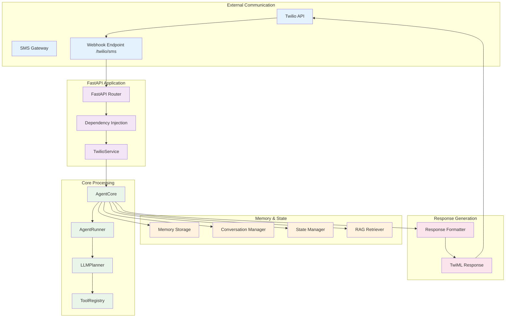

### Message Flow Overview

```mermaid
graph LR
    subgraph "Incoming Flow"
        INCOMING_SMS[Incoming SMS]
        WEBHOOK_RECEIVE[FastAPI Webhook]
        MESSAGE_PARSE[Message Parse]
        USER_VALIDATION[User Validation]
    end

    subgraph "Processing Flow"
        AGENT_CORE_PROCESS[AgentCore Process]
        CONTEXT_RETRIEVAL[Context Retrieval]
        TOOL_EXECUTION[Tool Execution]
        RESPONSE_GENERATION[Response Generation]
        STATE_UPDATE[State Update]
    end

    subgraph "Outgoing Flow"
        TWIML_FORMAT[TwiML Format]
        MESSAGE_SEND[Message Send]
        DELIVERY_CONFIRM[Delivery Confirm]
    end

    INCOMING_SMS --> WEBHOOK_RECEIVE
    WEBHOOK_RECEIVE --> MESSAGE_PARSE
    MESSAGE_PARSE --> USER_VALIDATION
    USER_VALIDATION --> AGENT_CORE_PROCESS
    AGENT_CORE_PROCESS --> CONTEXT_RETRIEVAL
    CONTEXT_RETRIEVAL --> TOOL_EXECUTION
    TOOL_EXECUTION --> RESPONSE_GENERATION
    RESPONSE_GENERATION --> STATE_UPDATE
    STATE_UPDATE --> TWIML_FORMAT
    TWIML_FORMAT --> MESSAGE_SEND
    MESSAGE_SEND --> DELIVERY_CONFIRM

    classDef incoming fill:#e3f2fd
    classDef processing fill:#f3e5f5
    classDef outgoing fill:#e8f5e8

    class INCOMING_SMS,WEBHOOK_RECEIVE,MESSAGE_PARSE,USER_VALIDATION incoming
    class AGENT_CORE_PROCESS,CONTEXT_RETRIEVAL,TOOL_EXECUTION,RESPONSE_GENERATION,STATE_UPDATE processing
    class TWIML_FORMAT,MESSAGE_SEND,DELIVERY_CONFIRM outgoing
```

## Twilio Integration

### Twilio Webhook Processing

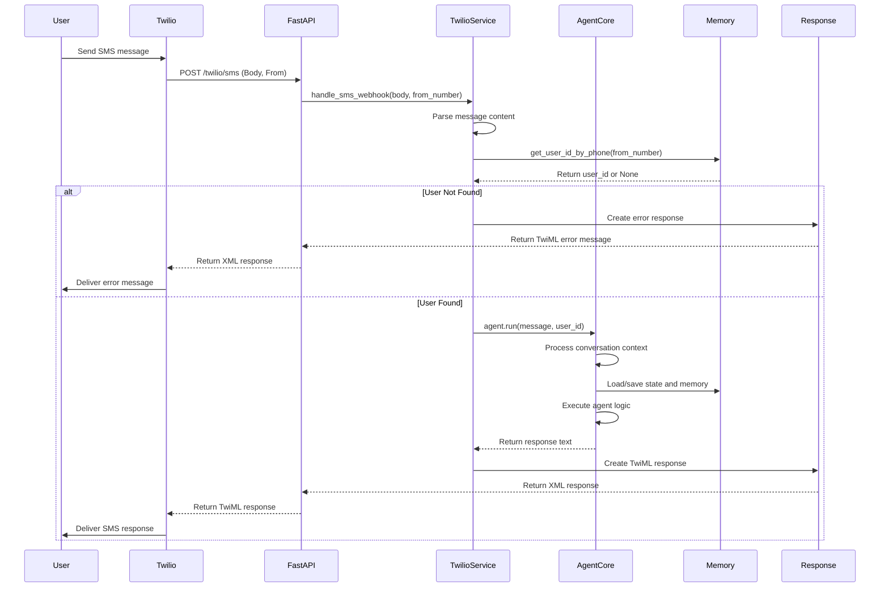

### Twilio Client Architecture

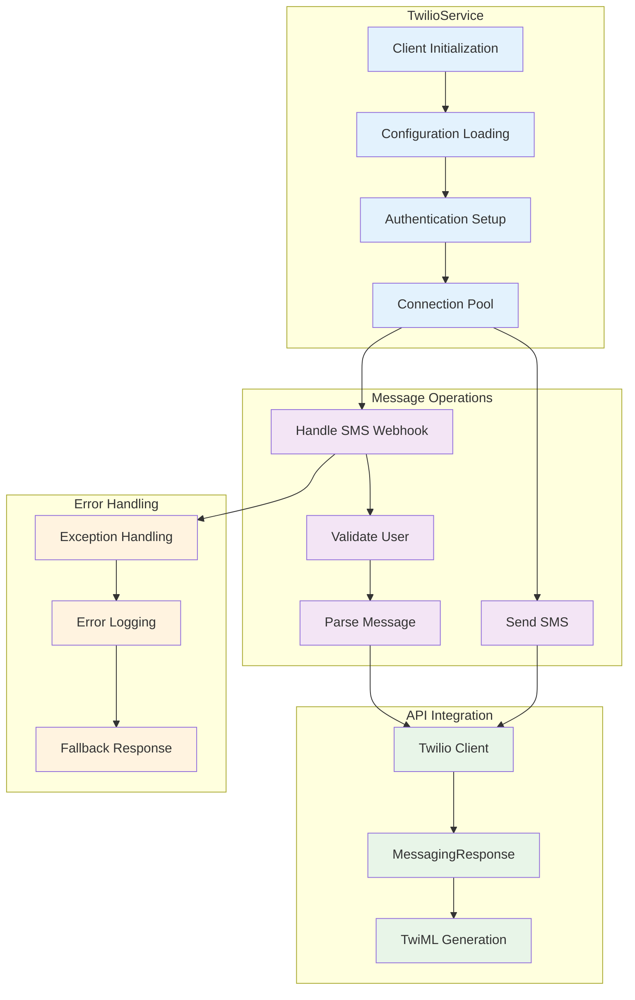

## Message Processing Pipeline

### Incoming Message Processing

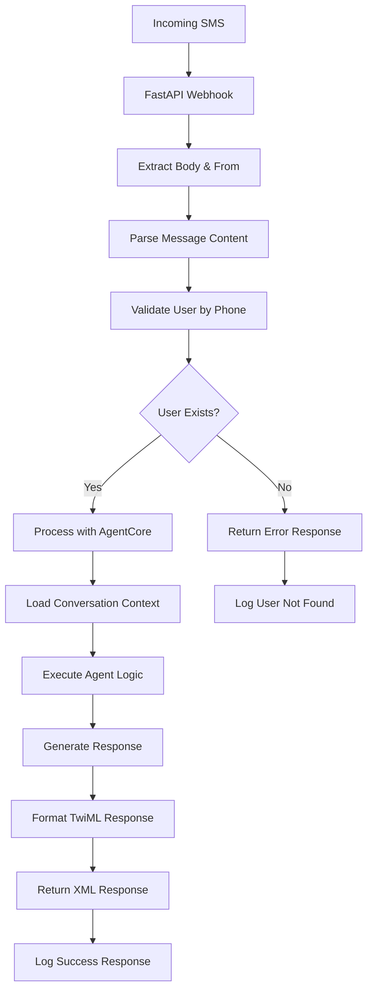

### AgentCore Processing Flow

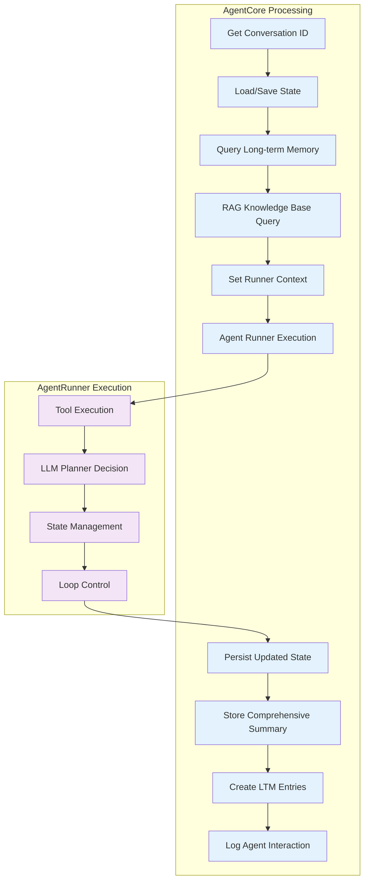

## Response Generation and Delivery

### Response Processing Flow

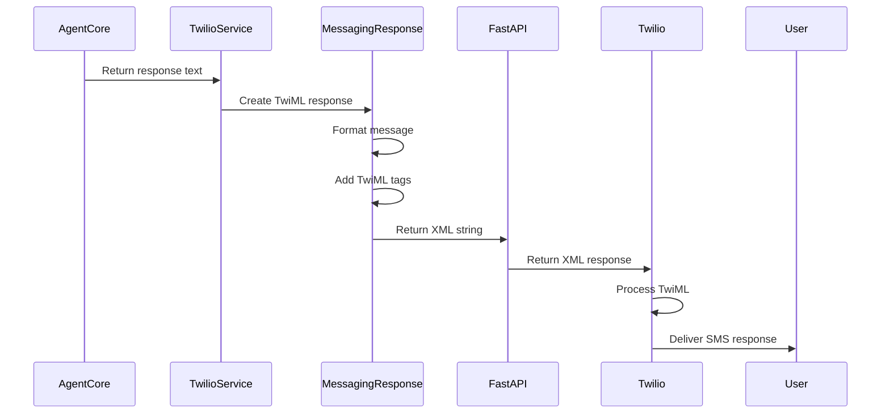

### Response Formatting

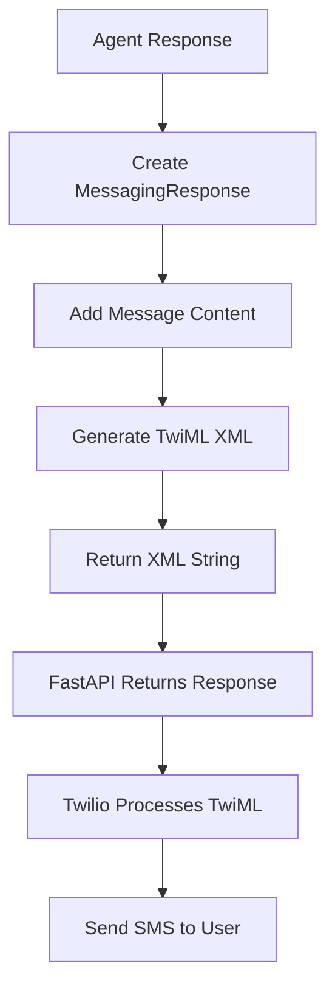

## Error Handling and Recovery

### Communication Error Handling

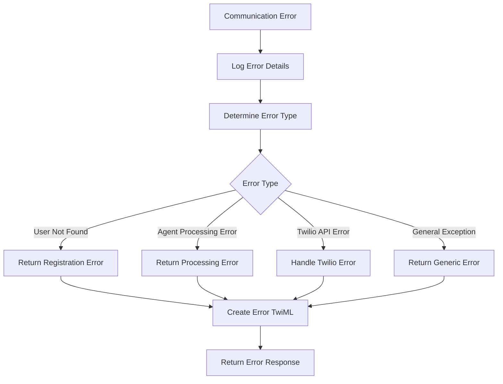

### Current Error Handling Implementation

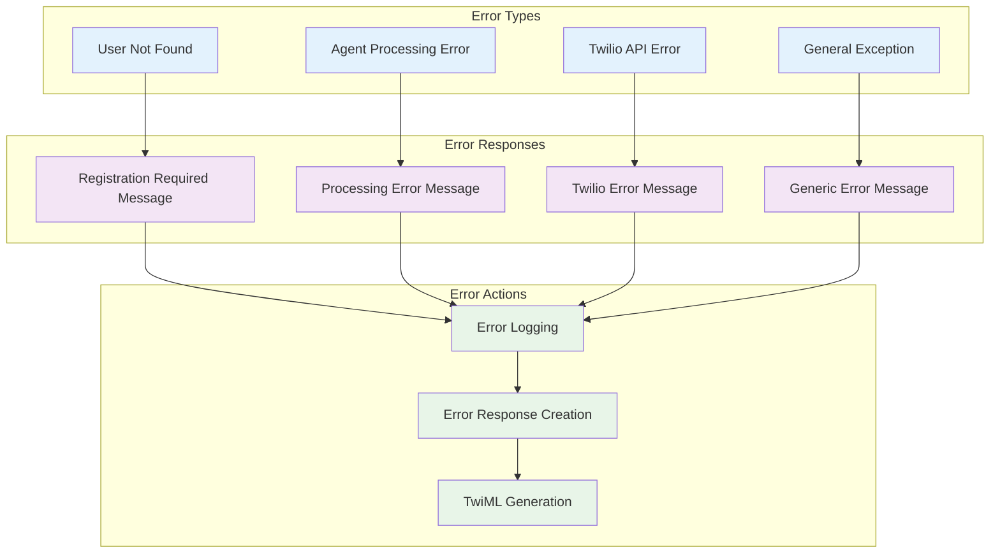

## Security and Authentication

### Current Security Implementation

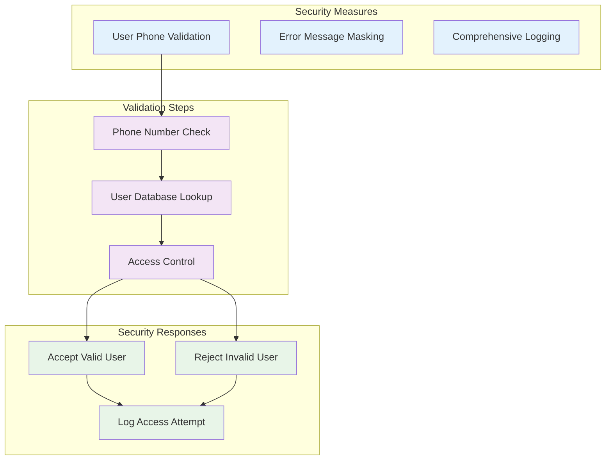

## Performance and Monitoring

### Current Performance Implementation

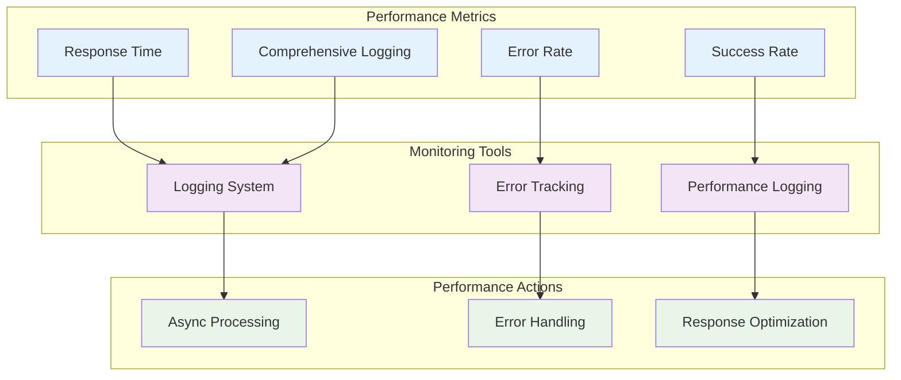

## Notes

### Communication System Design Principles

1. **Simplicity**: Direct webhook processing without complex routing
2. **Reliability**: Robust error handling and logging
3. **User Validation**: Phone number-based user authentication
4. **Async Processing**: Non-blocking message handling
5. **TwiML Integration**: Native Twilio TwiML response generation

### Communication Characteristics

- **Direct Webhook Processing**: FastAPI handles webhooks directly
- **User Validation**: Phone number lookup for user authentication
- **Error Recovery**: Comprehensive error handling with user-friendly messages
- **Logging**: Detailed logging for debugging and monitoring
- **TwiML Responses**: Native Twilio TwiML XML response generation

### Performance Considerations

- **Async Processing**: All operations are asynchronous
- **Error Handling**: Graceful error handling with fallback responses
- **Logging**: Comprehensive logging for performance monitoring
- **User Validation**: Efficient user lookup by phone number

### Security Measures

- **User Validation**: Phone number-based user authentication
- **Error Masking**: User-friendly error messages without exposing internals
- **Access Control**: User validation before processing
- **Audit Logging**: Comprehensive logging of all interactions

### Current Implementation Status

- **✅ Implemented**: Basic Twilio webhook processing
- **✅ Implemented**: User validation by phone number
- **✅ Implemented**: AgentCore integration
- **✅ Implemented**: TwiML response generation
- **✅ Implemented**: Error handling and logging
- **❌ Not Implemented**: Webhook signature validation
- **❌ Not Implemented**: Rate limiting
- **❌ Not Implemented**: Message encryption
- **❌ Not Implemented**: Advanced routing
- **❌ Not Implemented**: Message queuing

This communication system provides a functional foundation for SMS-based interactions with the personal assistant application, with room for future enhancements in security, performance, and scalability.
