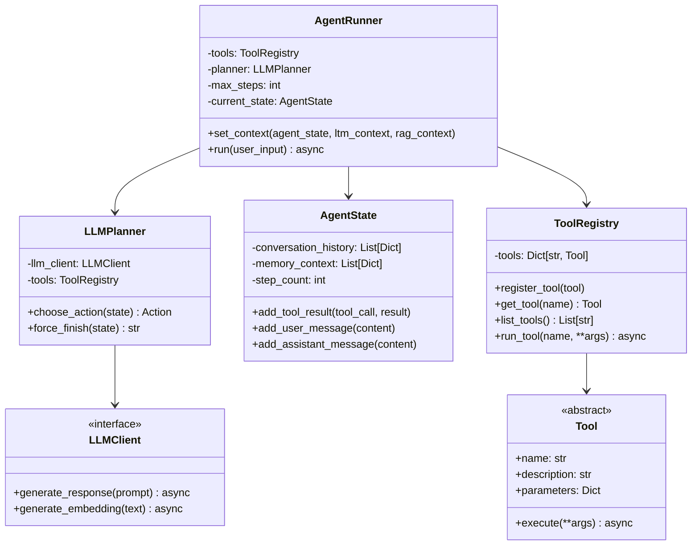
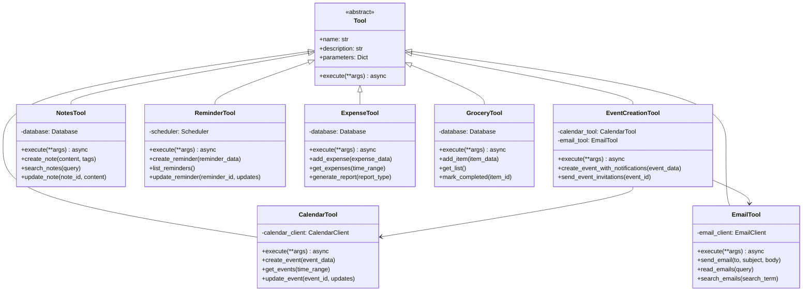
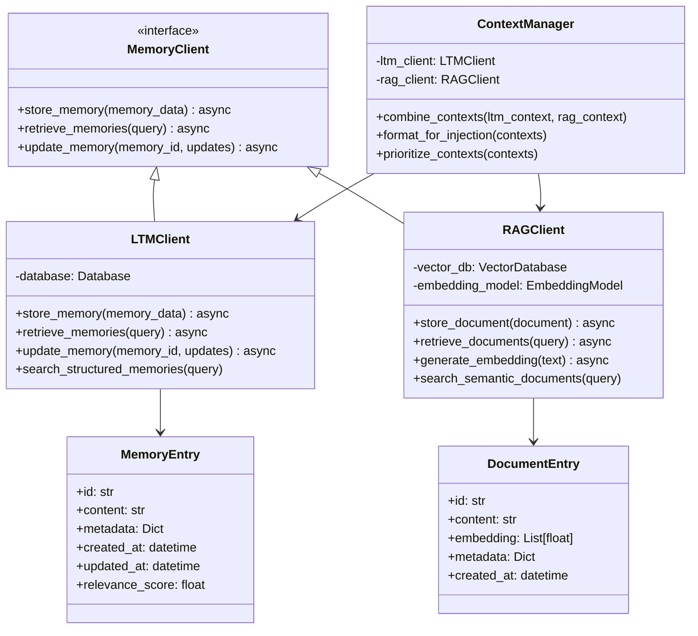
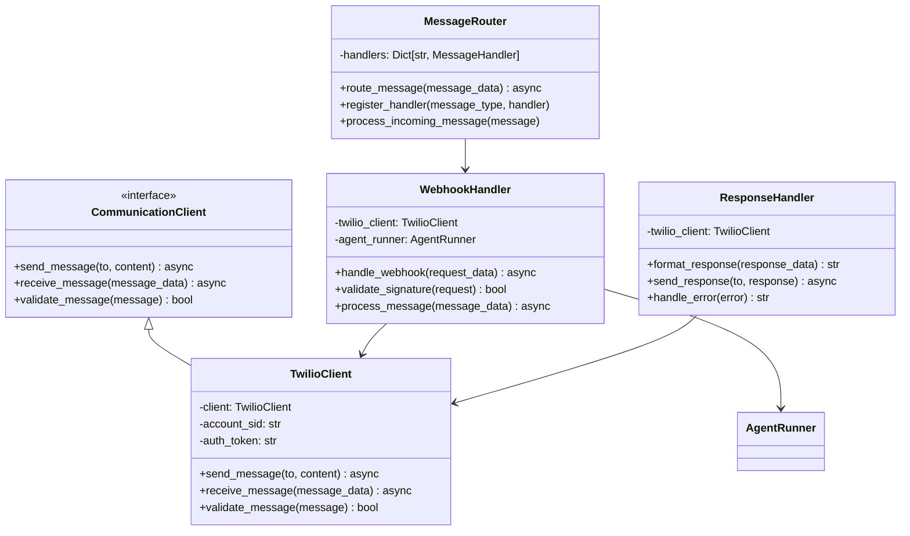
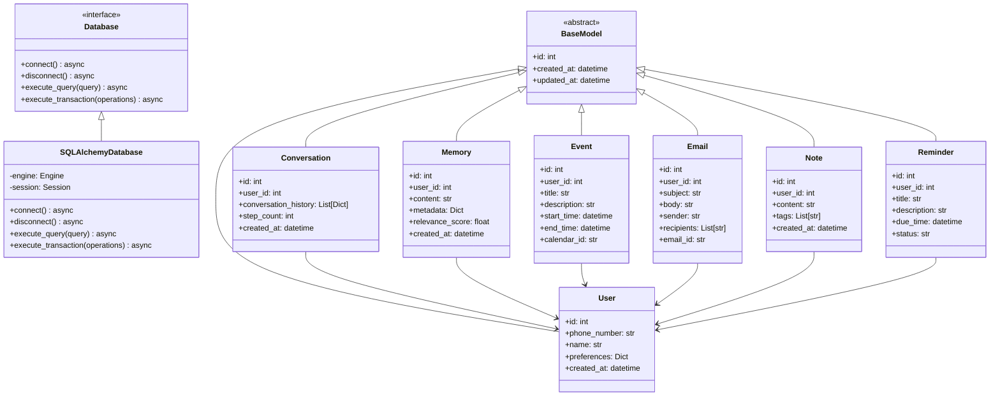
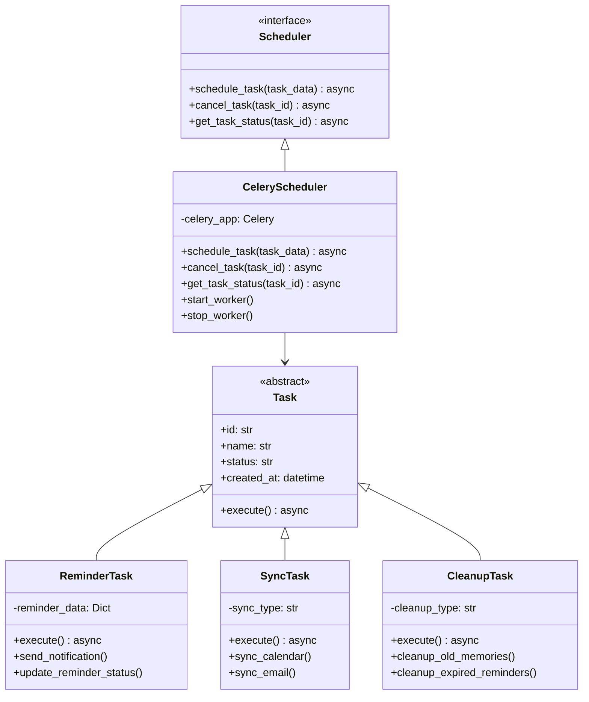
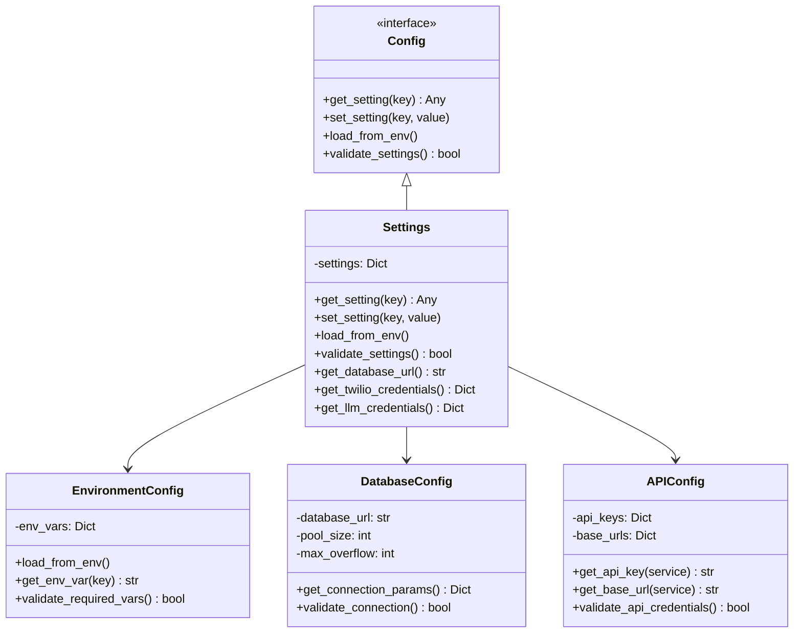
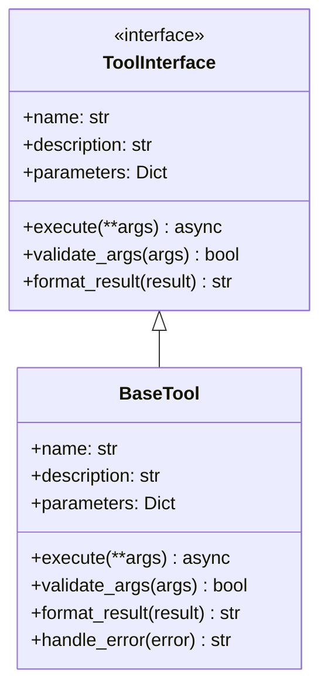
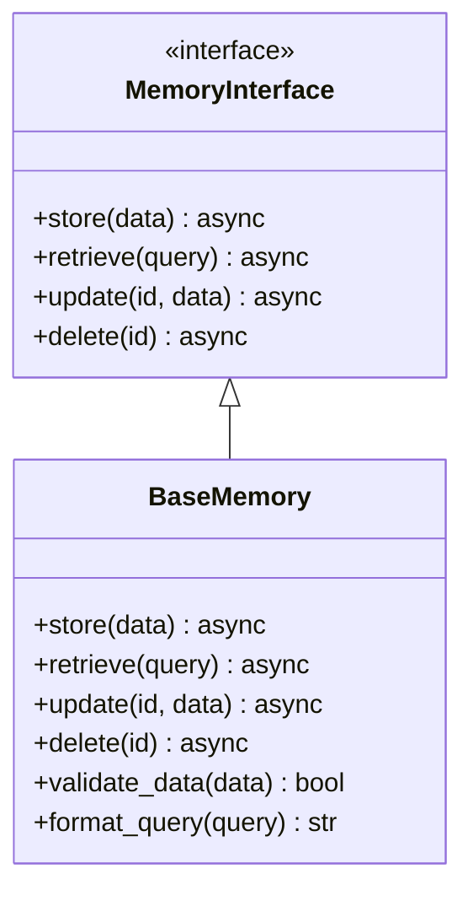
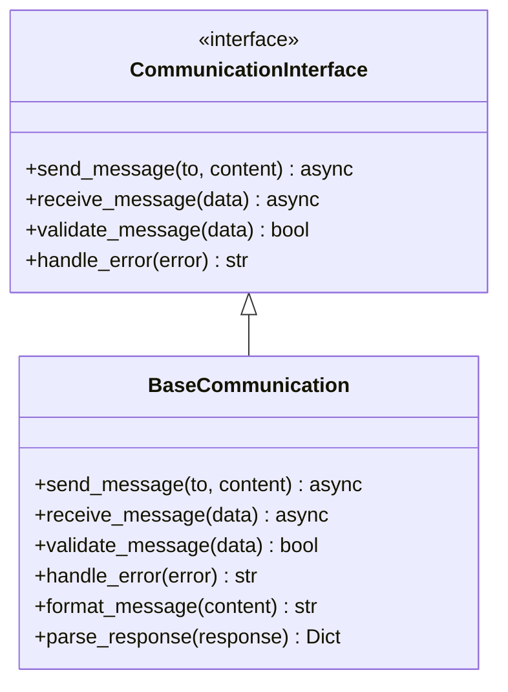

# Component Relationships

## Overview

This document contains class diagrams and component relationship diagrams showing the internal structure of the personal assistant application. These diagrams illustrate class hierarchies, interface contracts, and component dependencies.

## Core Class Diagram

### Main Application Classes

### Tool System Classes

### Memory System Classes

### Communication System Classes

### Database Layer Classes

### Scheduler System Classes

### Configuration Classes

## Interface Contracts

### Tool Interface

### Memory Interface

### Communication Interface

## Notes

### Design Patterns Used

1. **Strategy Pattern**: Different tools implement the same interface
2. **Factory Pattern**: Tool registry creates tool instances
3. **Observer Pattern**: State changes notify dependent components
4. **Template Method**: Base classes define common behavior
5. **Dependency Injection**: Components receive dependencies externally

### Key Relationships

1. **Composition**: AgentRunner contains ToolRegistry and LLMPlanner
2. **Inheritance**: All tools inherit from base Tool class
3. **Association**: Tools use external APIs and databases
4. **Dependency**: Components depend on interfaces, not implementations
5. **Aggregation**: Memory system aggregates LTM and RAG clients

### Interface Design Principles

1. **Single Responsibility**: Each interface has one clear purpose
2. **Open/Closed**: Open for extension, closed for modification
3. **Liskov Substitution**: Subtypes are substitutable for base types
4. **Interface Segregation**: Clients depend only on methods they use
5. **Dependency Inversion**: High-level modules don't depend on low-level modules

This class structure provides a solid foundation for the personal assistant application, ensuring maintainability, extensibility, and testability.
