# Data Flow

## Overview

This document contains comprehensive data flow diagrams showing how information moves through the personal assistant application. These diagrams illustrate user interactions, tool execution, memory management, and communication flows.

## User Interaction Flow

### Main Conversation Loop

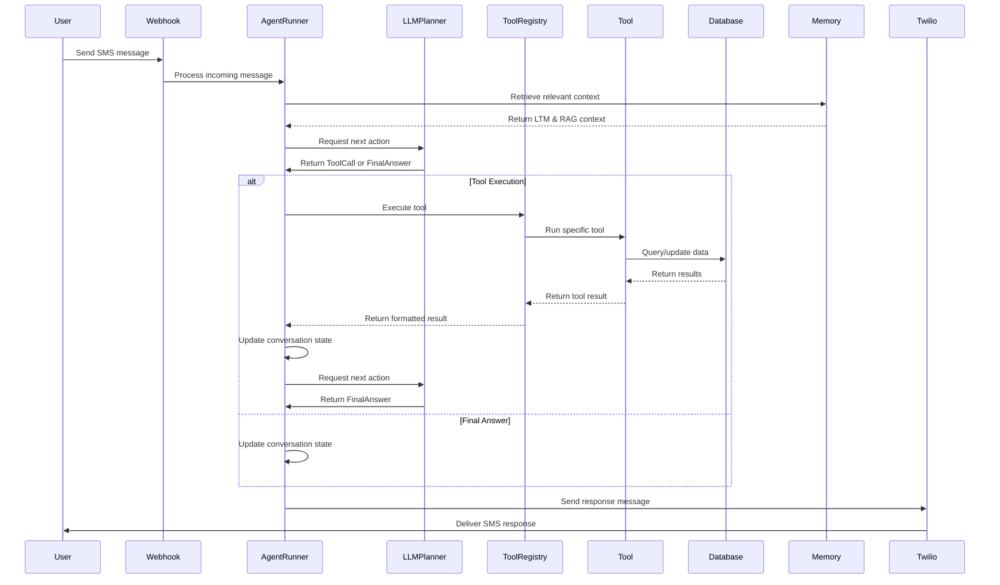

### Tool Execution Flow

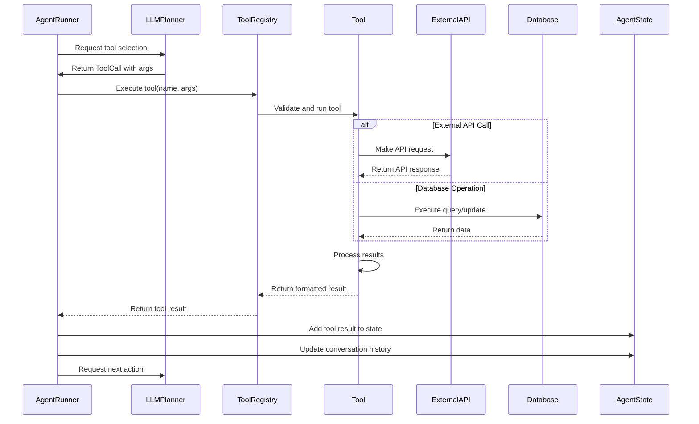

## Memory System Flow

### LTM Retrieval Process

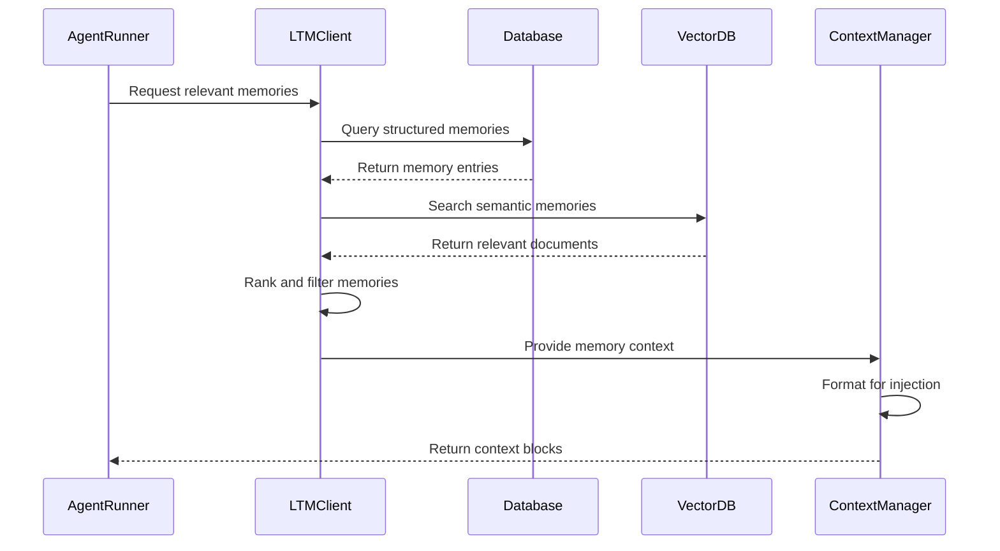

### RAG Document Processing

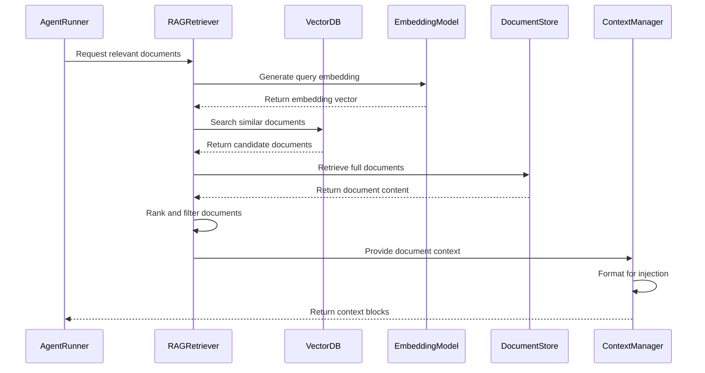

### Context Injection Flow

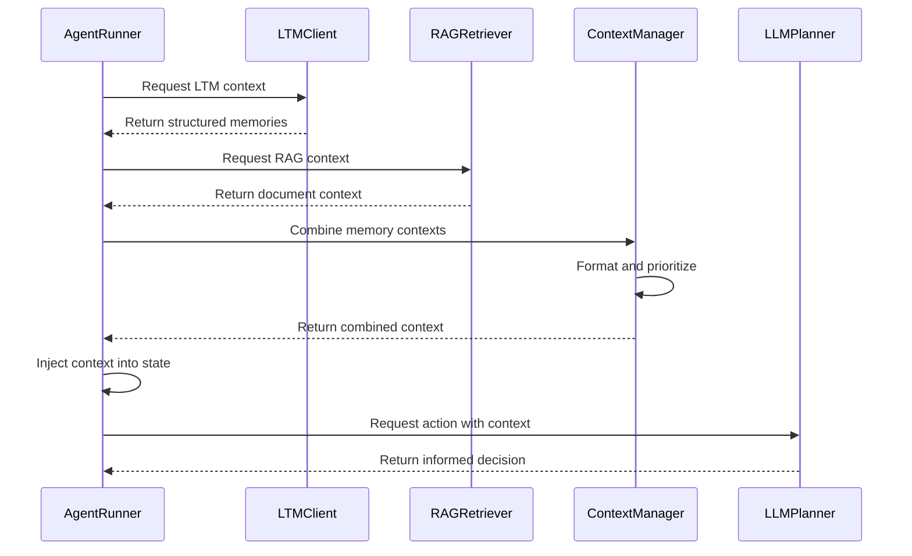

## Communication Flow

### SMS Processing Flow

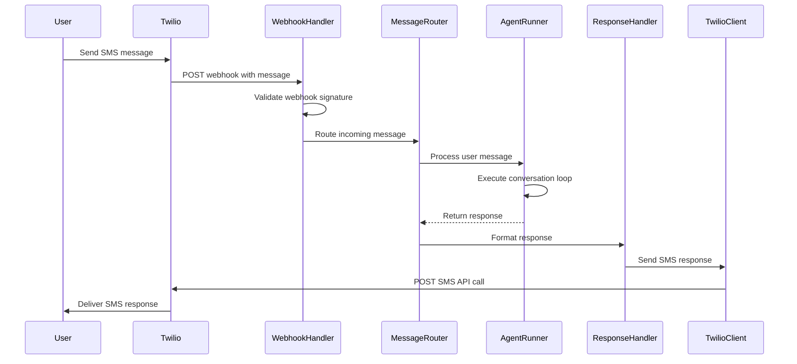

### Webhook Handling

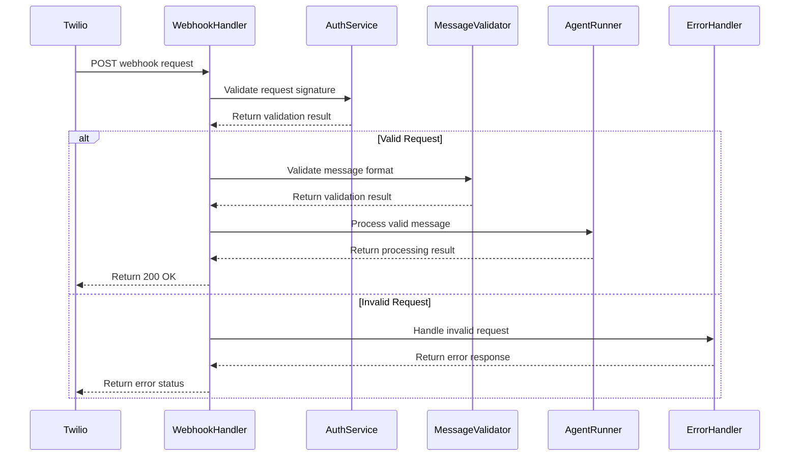

## Tool Execution Flow

### Calendar Tool Flow

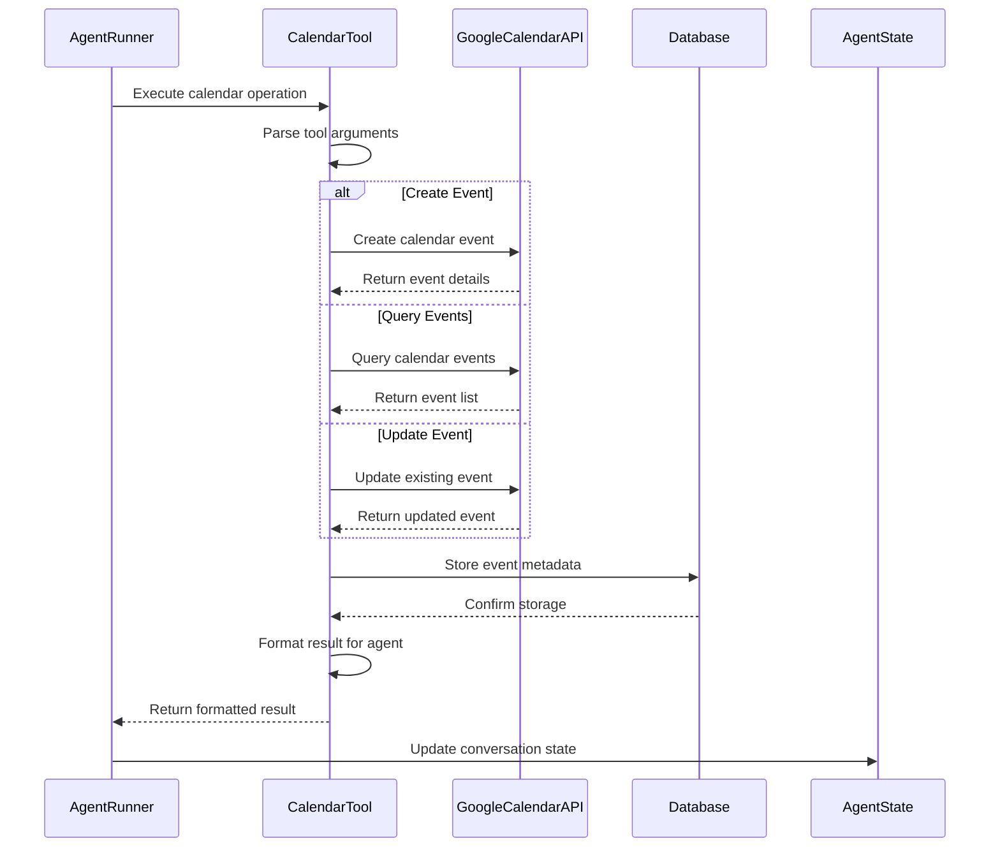

### Email Tool Flow

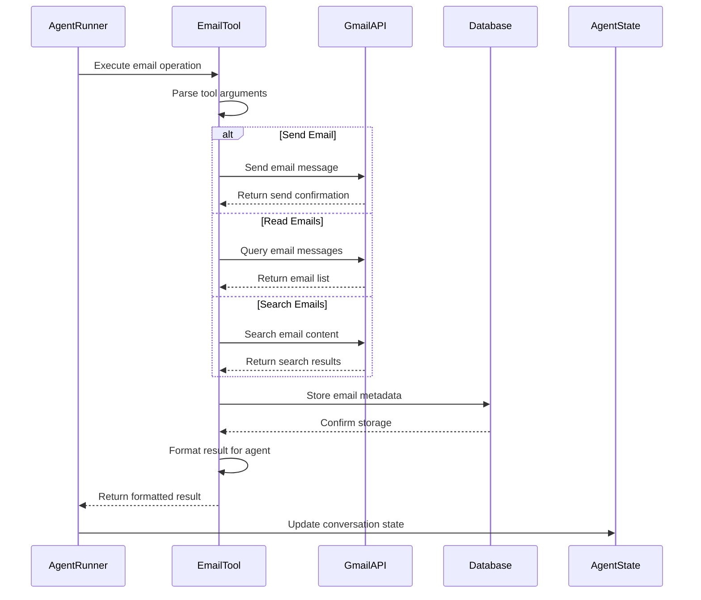

## State Management Flow

### Conversation State Updates

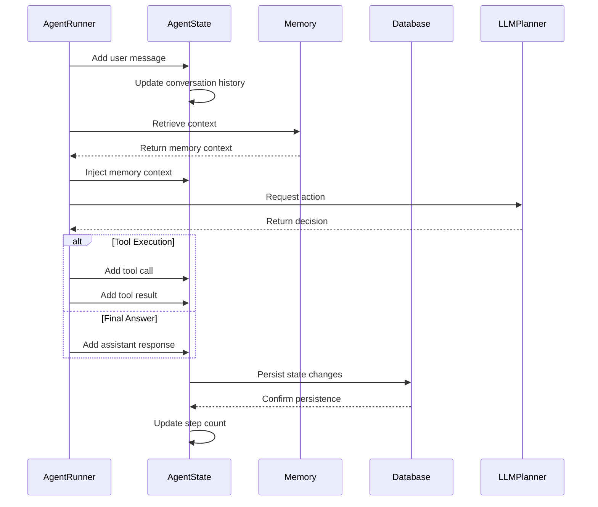

### Memory Storage Flow

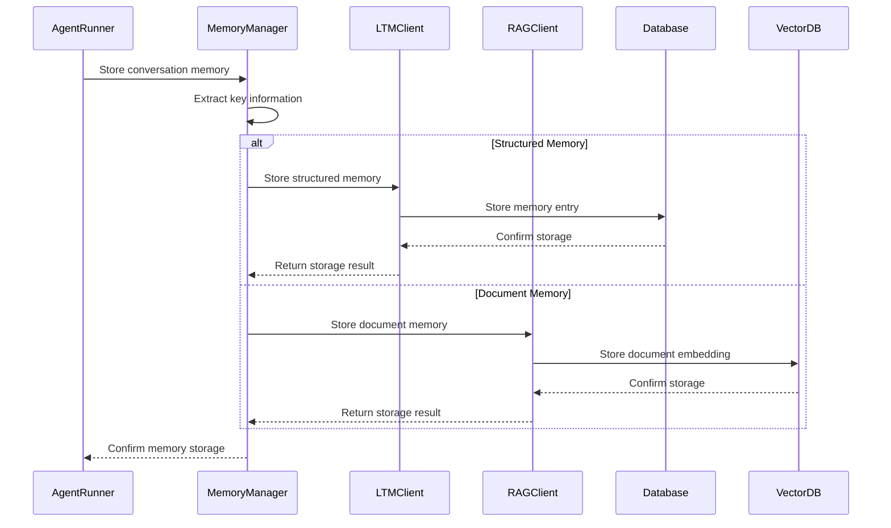

## Error Handling Flow

### Tool Execution Error Handling

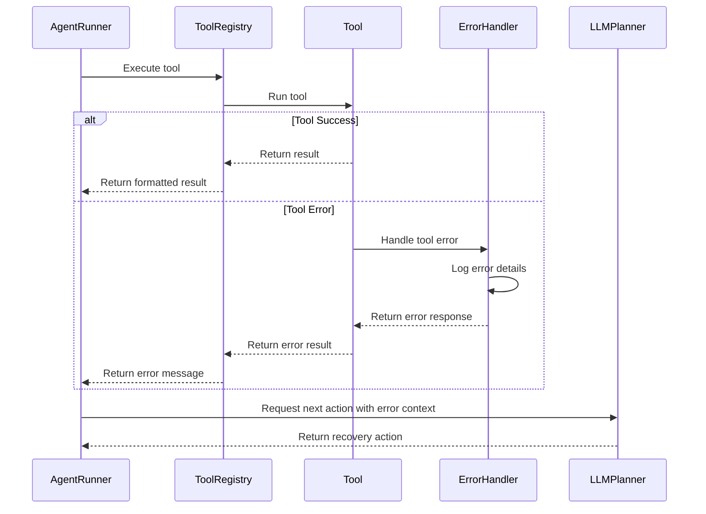

### Communication Error Handling

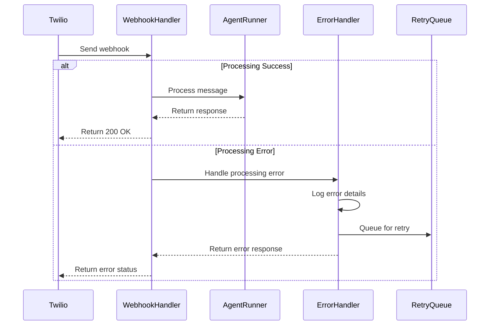

## Notes

### Key Flow Characteristics

1. **Asynchronous Processing**: Most operations are async to handle high concurrency
2. **Error Resilience**: Comprehensive error handling at each step
3. **State Consistency**: State updates are atomic and consistent
4. **Memory Integration**: Context is injected at multiple points
5. **Tool Abstraction**: Tools are executed through a common interface

### Performance Considerations

- Database connections are pooled
- External API calls include timeouts
- Memory retrieval is cached when possible
- Tool execution is parallelized where appropriate
- State updates are batched for efficiency

### Security Measures

- All external API calls are authenticated
- Webhook signatures are validated
- Sensitive data is encrypted
- Error messages don't expose internal details
- Rate limiting is applied to prevent abuse

This data flow architecture ensures reliable, secure, and efficient processing of user interactions while maintaining system integrity and performance.
