# Database Schema

## Overview

This document contains comprehensive database schema diagrams for the personal assistant application. These diagrams show entity relationships, data models, and database operations.

## Entity Relationship Diagram

### Main Database Schema

```mermaid
erDiagram
    USERS {
        int id PK
        string phone_number UK
        string name
        json preferences
        datetime created_at
        datetime updated_at
    }

    CONVERSATIONS {
        int id PK
        int user_id FK
        json conversation_history
        int step_count
        datetime created_at
        datetime updated_at
    }

    MEMORIES {
        int id PK
        int user_id FK
        string content
        json metadata
        float relevance_score
        datetime created_at
        datetime updated_at
    }

    EVENTS {
        int id PK
        int user_id FK
        string title
        string description
        datetime start_time
        datetime end_time
        string calendar_id
        string event_id
        json metadata
        datetime created_at
        datetime updated_at
    }

    EMAILS {
        int id PK
        int user_id FK
        string subject
        text body
        string sender
        json recipients
        string email_id
        string thread_id
        json metadata
        datetime created_at
        datetime updated_at
    }

    NOTES {
        int id PK
        int user_id FK
        text content
        json tags
        datetime created_at
        datetime updated_at
    }

    REMINDERS {
        int id PK
        int user_id FK
        string title
        string description
        datetime due_time
        string status
        json metadata
        datetime created_at
        datetime updated_at
    }

    EXPENSES {
        int id PK
        int user_id FK
        string description
        decimal amount
        string category
        datetime date
        json metadata
        datetime created_at
        datetime updated_at
    }

    GROCERY_ITEMS {
        int id PK
        int user_id FK
        string name
        string category
        int quantity
        string unit
        boolean completed
        datetime created_at
        datetime updated_at
    }

    DOCUMENTS {
        int id PK
        int user_id FK
        text content
        vector embedding
        json metadata
        datetime created_at
        datetime updated_at
    }

    SCHEDULED_TASKS {
        int id PK
        int user_id FK
        string task_type
        json task_data
        string status
        datetime scheduled_time
        datetime created_at
        datetime updated_at
    }

    USERS ||--o{ CONVERSATIONS : "has"
    USERS ||--o{ MEMORIES : "has"
    USERS ||--o{ EVENTS : "has"
    USERS ||--o{ EMAILS : "has"
    USERS ||--o{ NOTES : "has"
    USERS ||--o{ REMINDERS : "has"
    USERS ||--o{ EXPENSES : "has"
    USERS ||--o{ GROCERY_ITEMS : "has"
    USERS ||--o{ DOCUMENTS : "has"
    USERS ||--o{ SCHEDULED_TASKS : "has"
```

### Memory System Schema

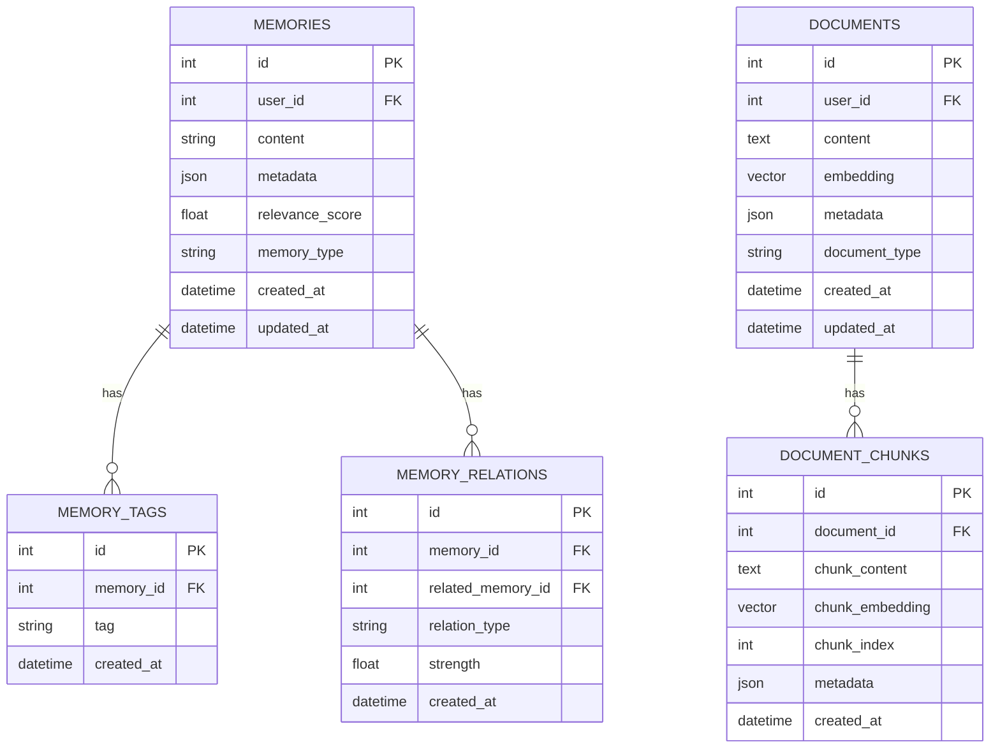

### Calendar and Event Schema

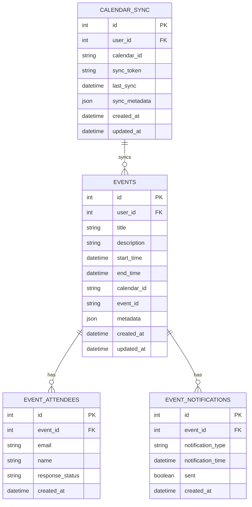

## Data Model Visualizations

### User Data Model

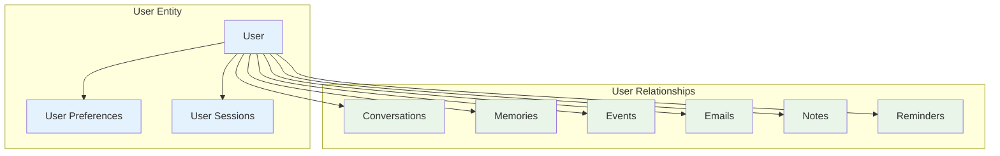

### Memory Data Model

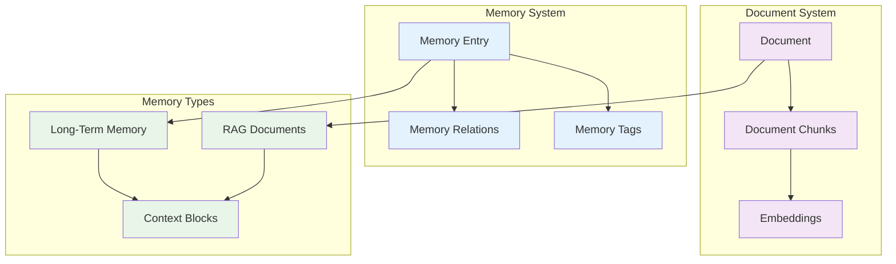

## CRUD Operation Flows

### Create Operations

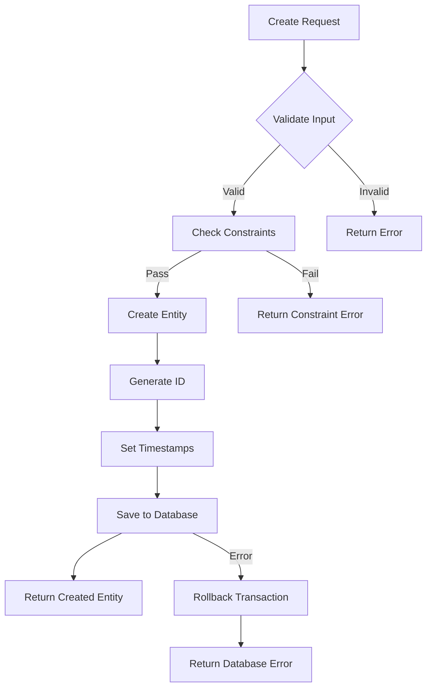

### Read Operations

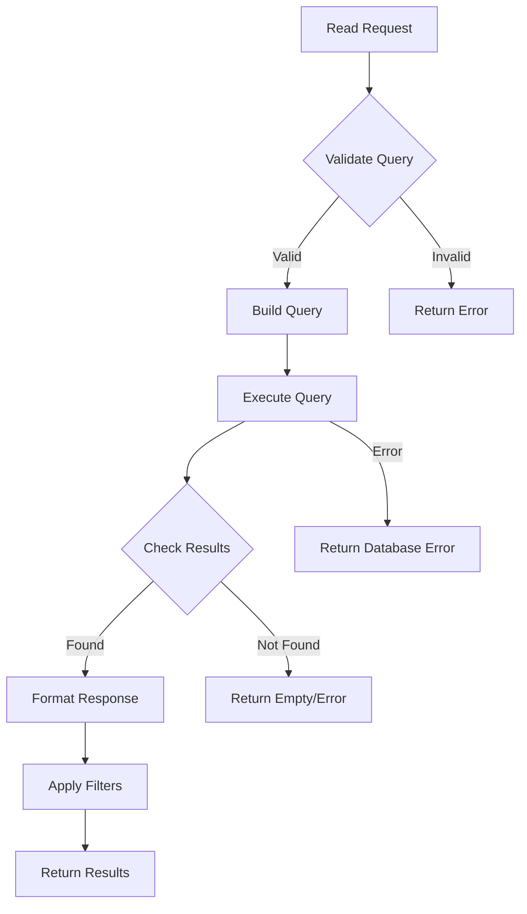

### Update Operations

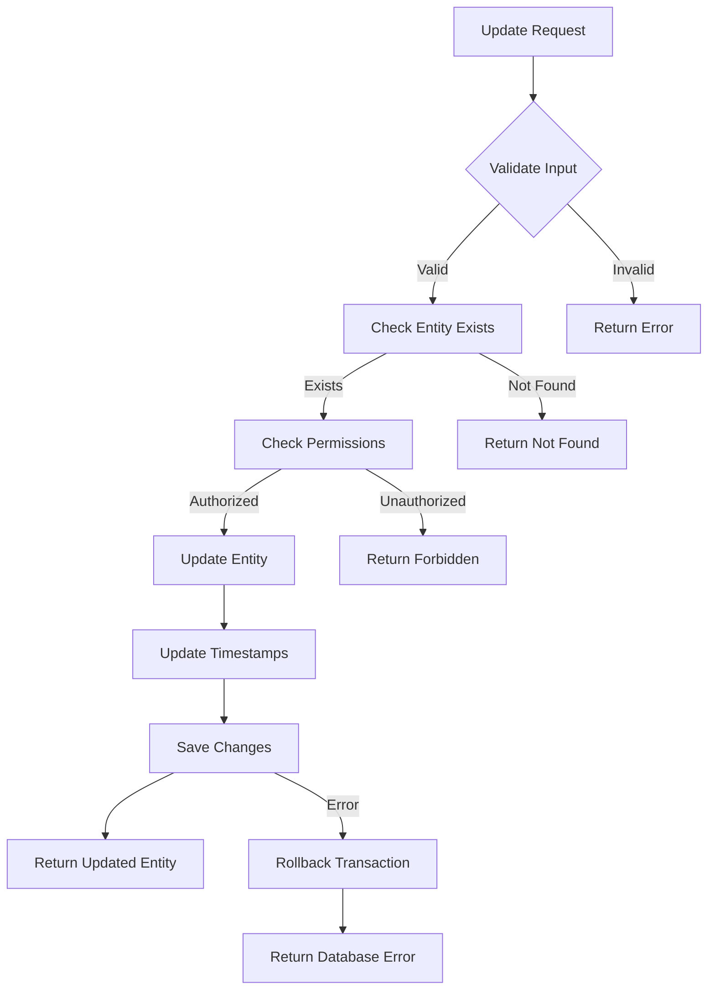

### Delete Operations

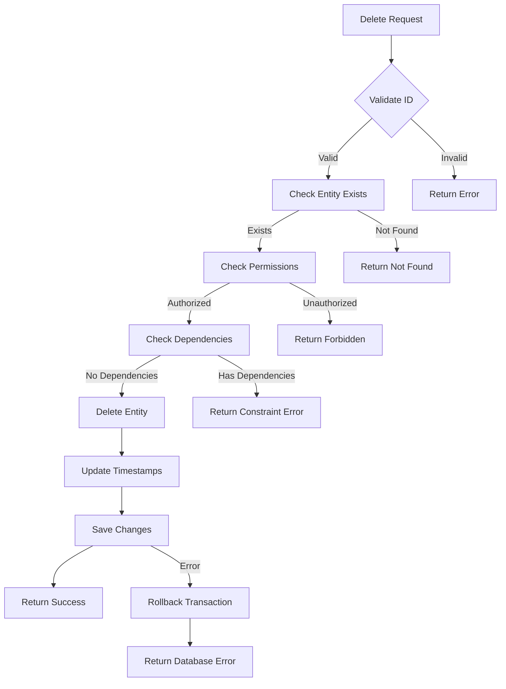

## Migration Patterns

### Database Migration Flow

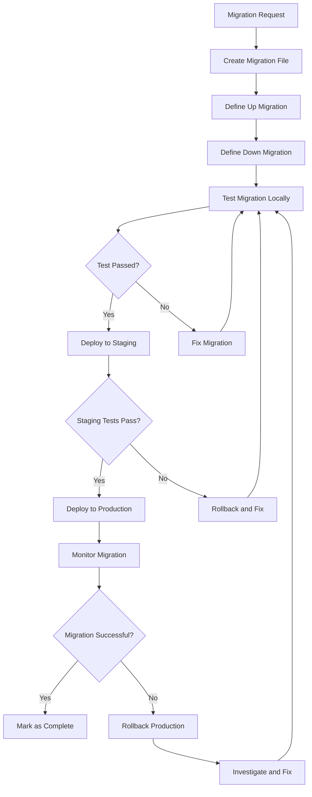

### Schema Evolution

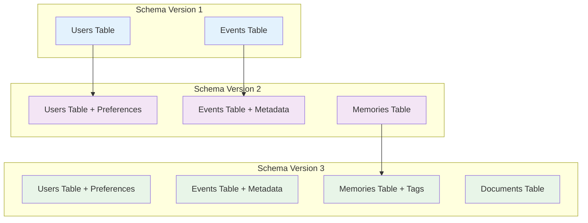

## Data Access Patterns

### Query Optimization

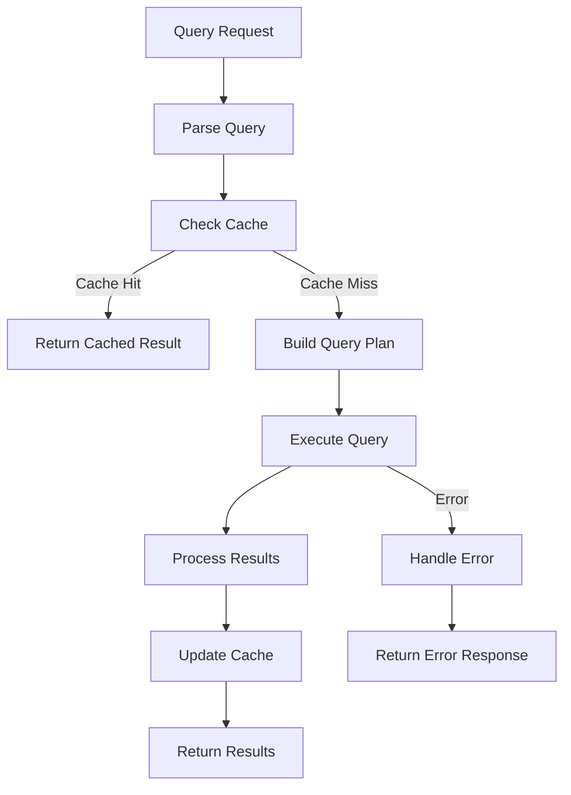

### Transaction Management

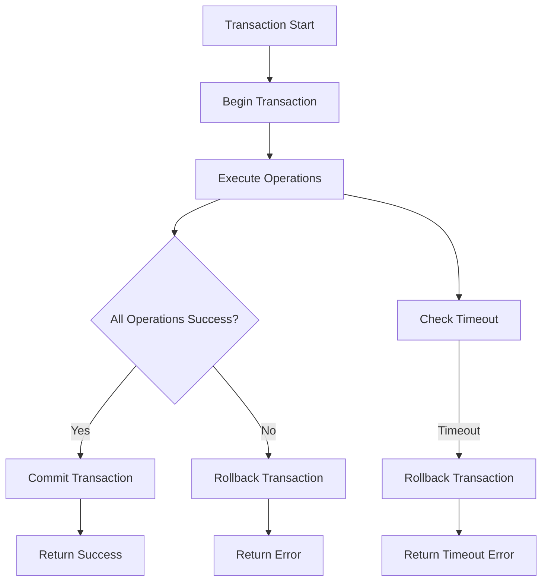

## Indexing Strategy

### Database Indexes

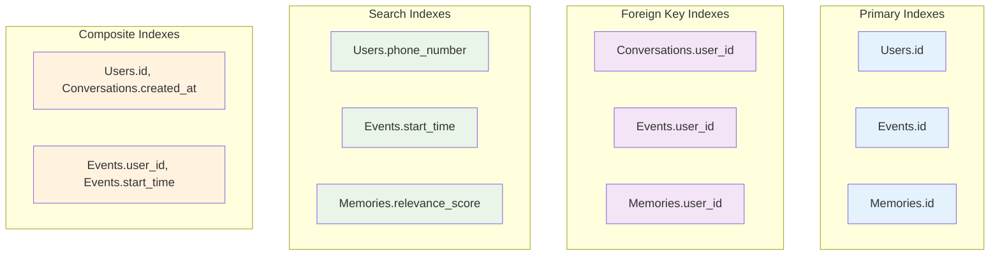

## Notes

### Database Design Principles

1. **Normalization**: Tables are normalized to reduce redundancy
2. **Referential Integrity**: Foreign key constraints ensure data consistency
3. **Indexing Strategy**: Strategic indexes for common query patterns
4. **Soft Deletes**: Important data is soft-deleted rather than hard-deleted
5. **Audit Trail**: All tables include created_at and updated_at timestamps

### Performance Considerations

- **Connection Pooling**: Database connections are pooled for efficiency
- **Query Optimization**: Complex queries are optimized with proper indexes
- **Caching Strategy**: Frequently accessed data is cached
- **Batch Operations**: Bulk operations are batched for performance
- **Async Operations**: Database operations are async where possible

### Data Integrity

- **Constraints**: Database constraints ensure data validity
- **Validation**: Application-level validation complements database constraints
- **Transactions**: ACID transactions ensure data consistency
- **Backup Strategy**: Regular backups with point-in-time recovery
- **Migration Safety**: All schema changes are backward compatible

### Security Measures

- **Encryption**: Sensitive data is encrypted at rest
- **Access Control**: Database access is restricted by user roles
- **Audit Logging**: All database changes are logged
- **SQL Injection Prevention**: Parameterized queries prevent injection
- **Connection Security**: Database connections use SSL/TLS

This database schema provides a robust foundation for storing and managing all application data while ensuring performance, security, and data integrity.
