# Memory System

## Overview

This document contains comprehensive memory system diagrams showing how LTM (Long-Term Memory), RAG (Retrieval-Augmented Generation), and context injection work in the personal assistant application. These diagrams illustrate memory storage, retrieval, and integration processes.

## Memory System Architecture

### High-Level Memory Architecture

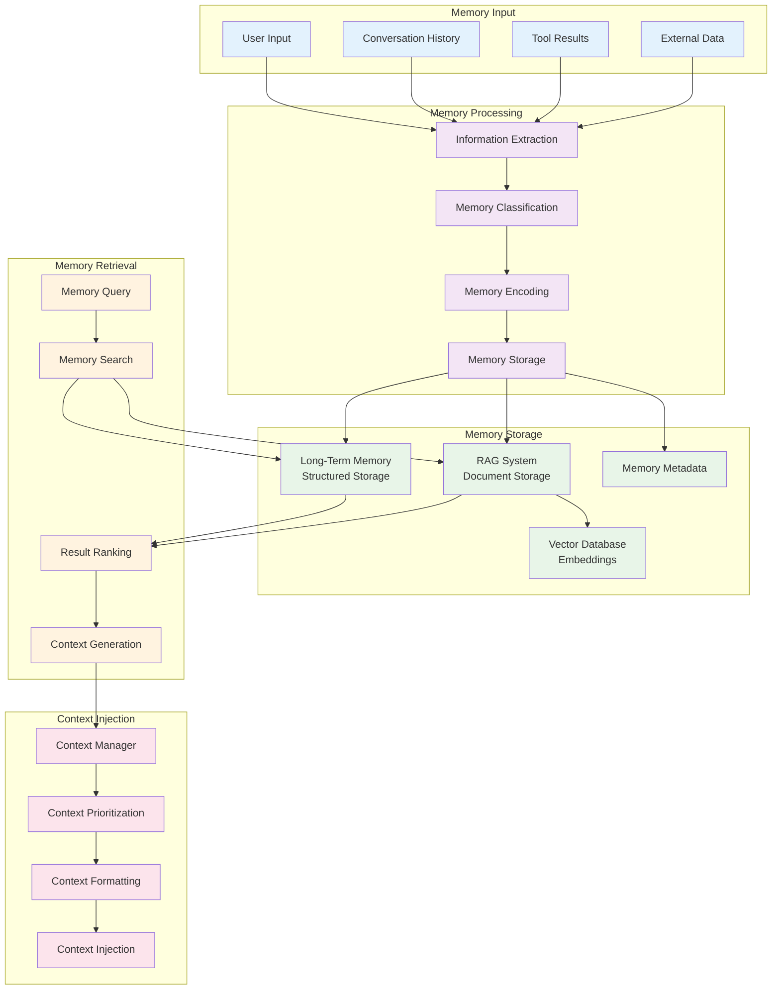

### Memory Types and Relationships

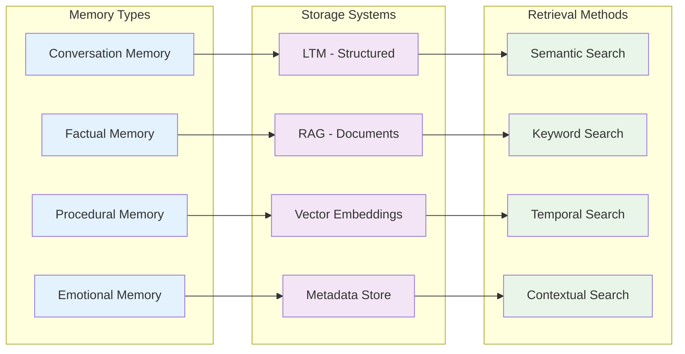

## LTM (Long-Term Memory) System

### LTM Storage Flow

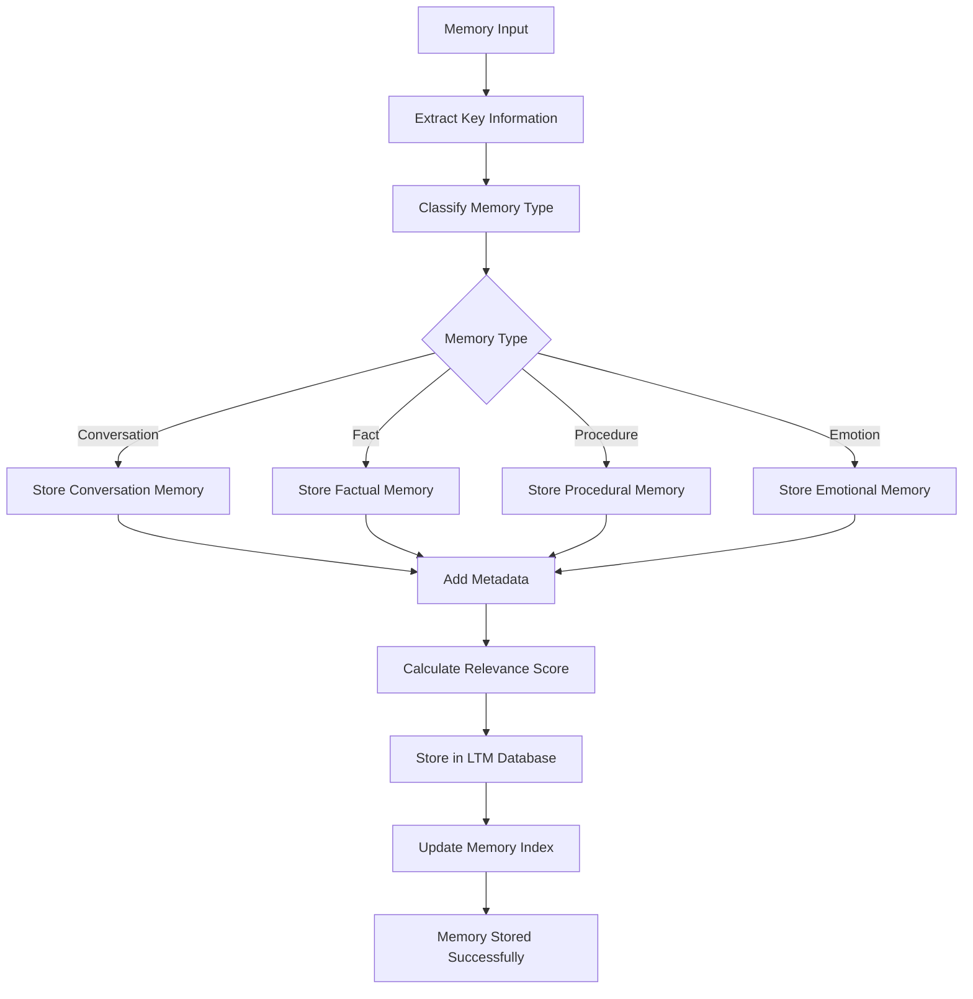

### LTM Retrieval Process

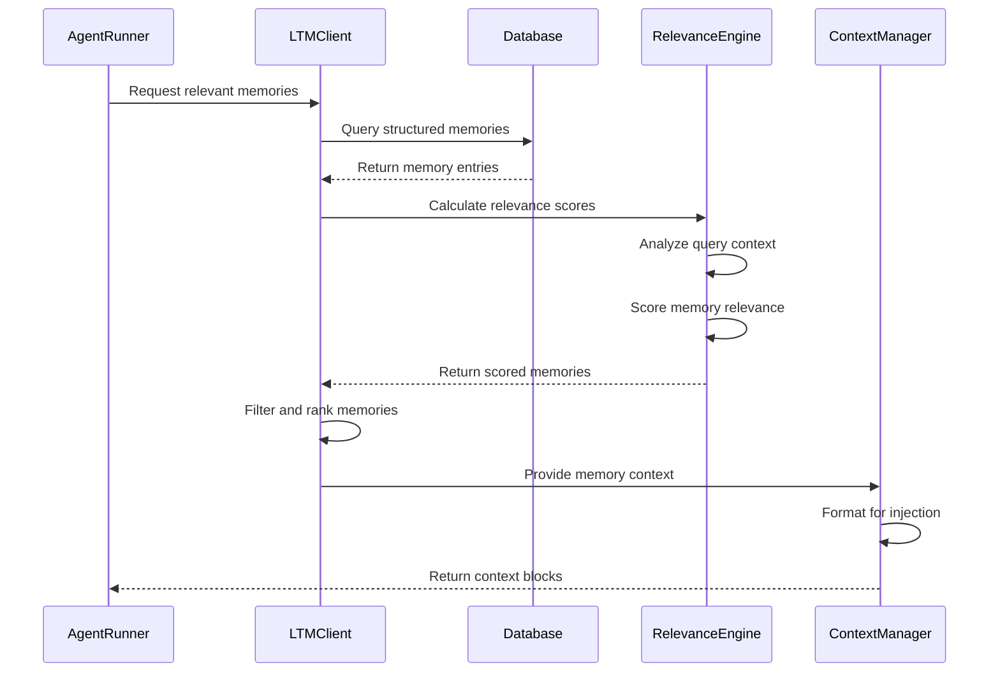

### LTM Memory Structure

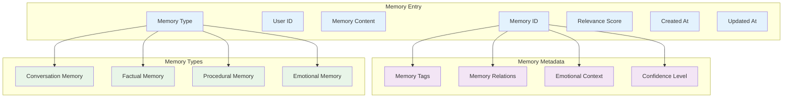

## RAG (Retrieval-Augmented Generation) System

### RAG Document Processing

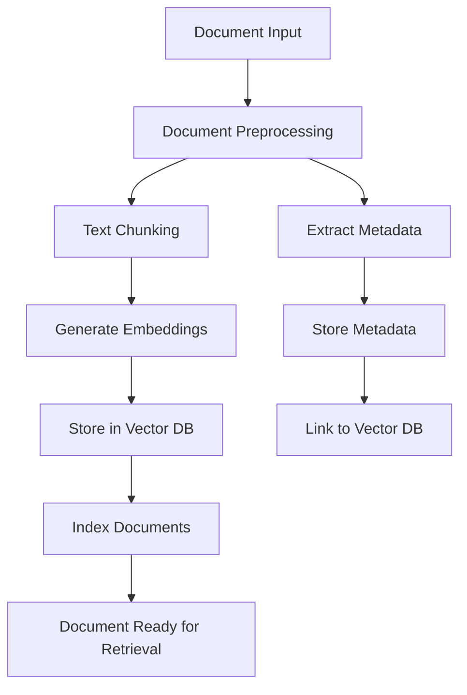

### RAG Retrieval Flow

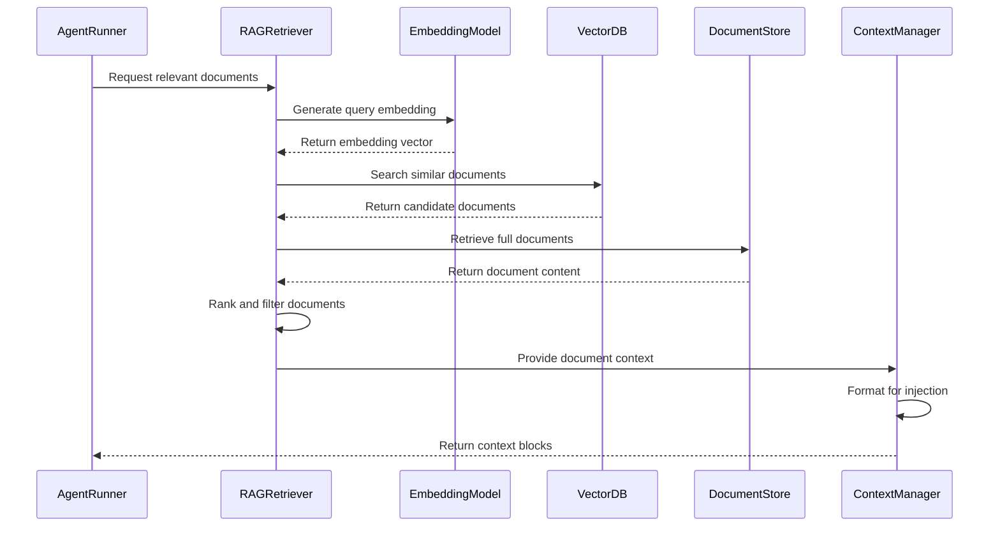

### RAG Document Structure

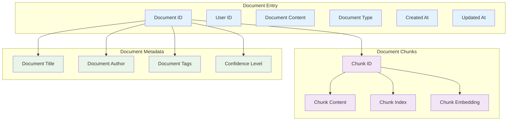

## Context Injection System

### Context Injection Flow

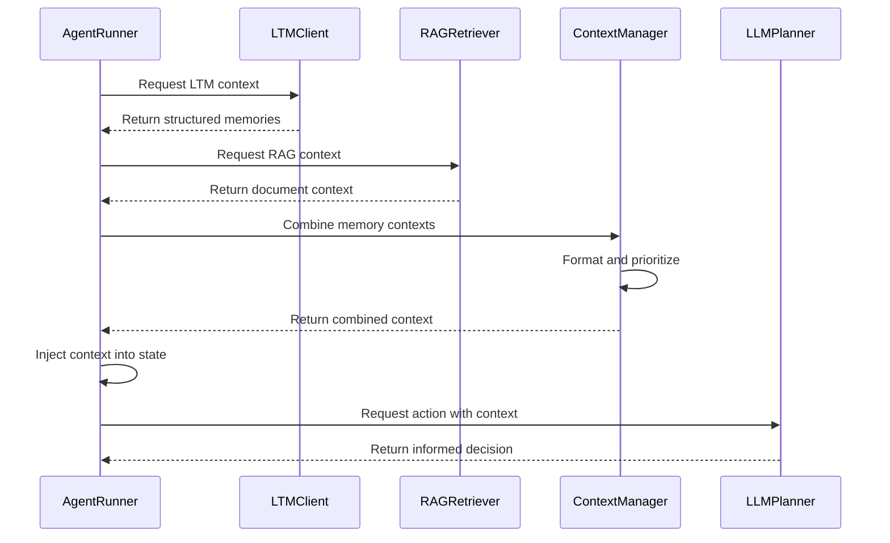

### Context Prioritization

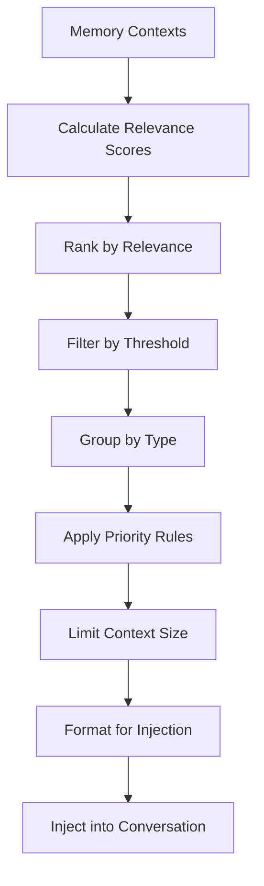

### Context Formatting

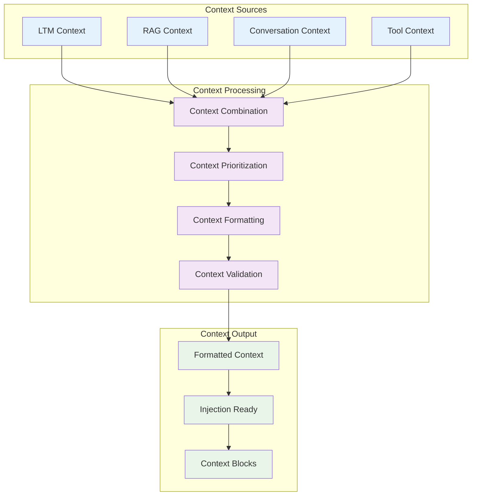

## Memory Retrieval and Search

### Semantic Search Process

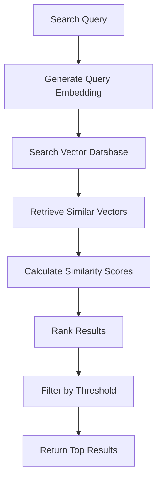

### Memory Search Strategies

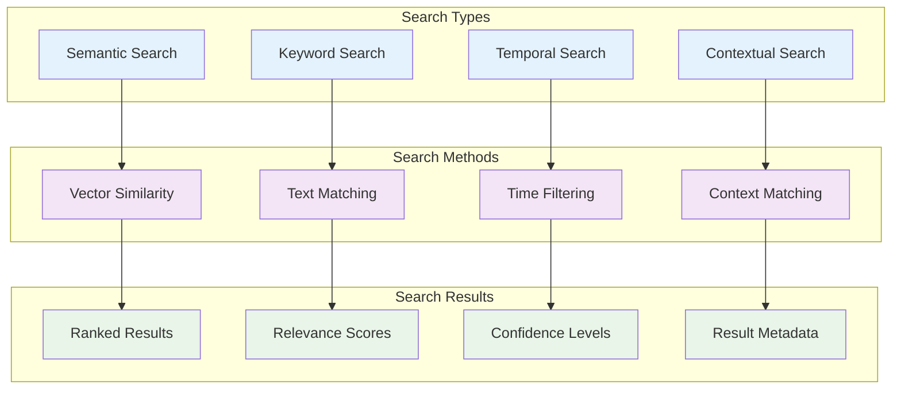

## Memory Management and Optimization

### Memory Cleanup Process

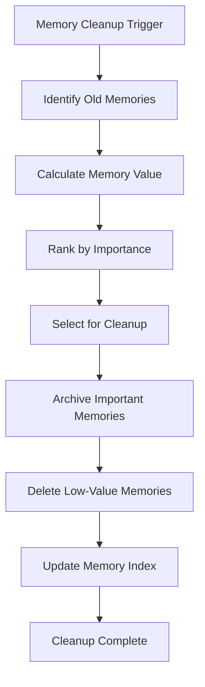

### Memory Performance Optimization

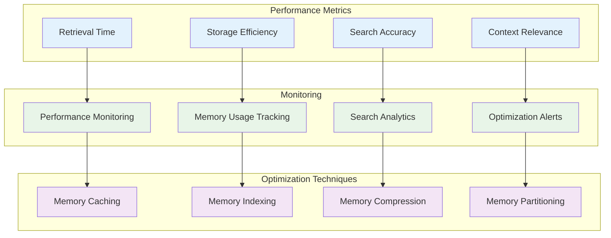

## Notes

### Memory System Design Principles

1. **Separation of Concerns**: LTM and RAG serve different purposes
2. **Scalability**: Memory system scales with data growth
3. **Performance**: Fast retrieval and efficient storage
4. **Accuracy**: High-quality memory retrieval and context injection
5. **Flexibility**: Support for different memory types and formats

### Memory Characteristics

- **LTM**: Structured, persistent, high-reliability memories
- **RAG**: Document-based, semantic search capabilities
- **Context Injection**: Real-time, relevant context provision
- **Memory Management**: Automatic cleanup and optimization

### Performance Considerations

- **Vector Search**: Optimized for semantic similarity
- **Caching**: Frequently accessed memories are cached
- **Indexing**: Efficient indexing for fast retrieval
- **Compression**: Memory compression for storage efficiency
- **Partitioning**: Memory partitioning for scalability

### Security and Privacy

- **Data Encryption**: All memory data is encrypted
- **Access Control**: Memory access is user-specific
- **Audit Logging**: Memory operations are logged
- **Data Retention**: Configurable memory retention policies
- **Privacy Compliance**: GDPR and privacy regulation compliance

This memory system provides a comprehensive foundation for storing, retrieving, and utilizing user information to enhance the personal assistant's capabilities.
