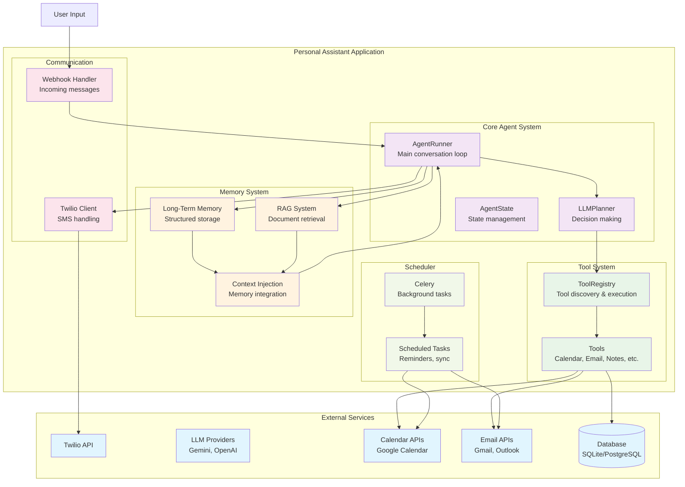
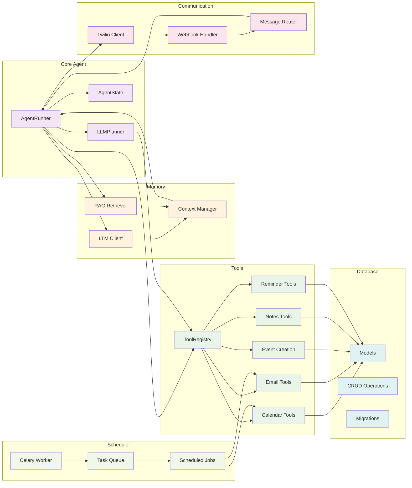
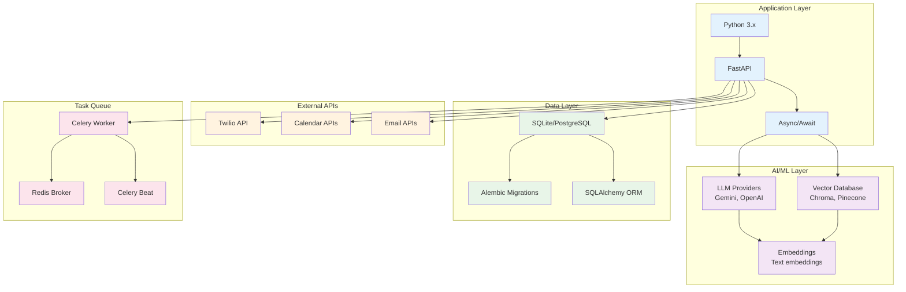
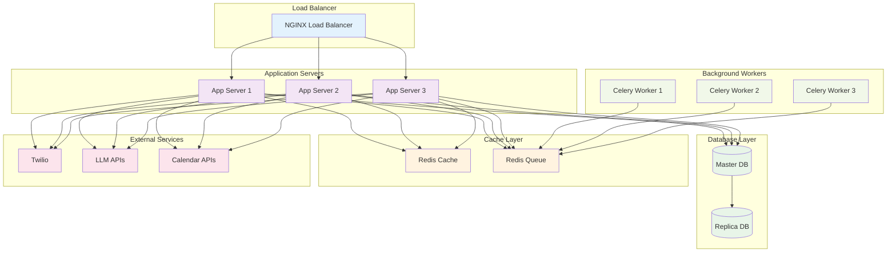
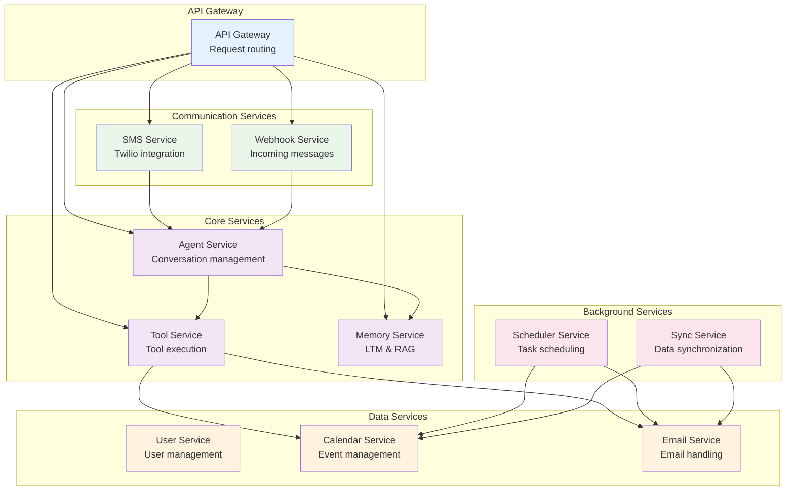

# System Architecture

## Overview

This document contains comprehensive system architecture diagrams for the personal assistant application. These diagrams show the high-level structure, component relationships, and technology stack of the entire system.

## Main System Architecture

### High-Level System Overview

### Component Relationships

## Technology Stack

### Backend Architecture

## Deployment Architecture

### Production Deployment

## Service Boundaries

### Microservices Overview

## Key Design Principles

### 1. **Modular Architecture**

- Clear separation of concerns
- Loose coupling between components
- High cohesion within modules

### 2. **Event-Driven Design**

- Asynchronous message processing
- Event sourcing for state changes
- Reactive programming patterns

### 3. **Scalability Patterns**

- Horizontal scaling capability
- Load balancing support
- Database sharding ready

### 4. **Reliability Features**

- Fault tolerance mechanisms
- Circuit breaker patterns
- Retry logic with exponential backoff

### 5. **Security Considerations**

- API authentication and authorization
- Data encryption in transit and at rest
- Secure external API integrations

## Notes

- All components are designed for async operation
- Database connections are pooled for efficiency
- External API calls include proper error handling
- Background tasks are queued for reliability
- Memory systems are optimized for fast retrieval
- Communication channels support multiple protocols

This architecture provides a solid foundation for the personal assistant application, ensuring scalability, maintainability, and reliability.
