# Tool Execution

## Overview

This document contains comprehensive tool execution diagrams showing how tools are discovered, selected, and executed in the personal assistant application. These diagrams illustrate the tool registry, execution pipeline, and result handling.

## Tool Registry Architecture

### Tool Discovery and Registration

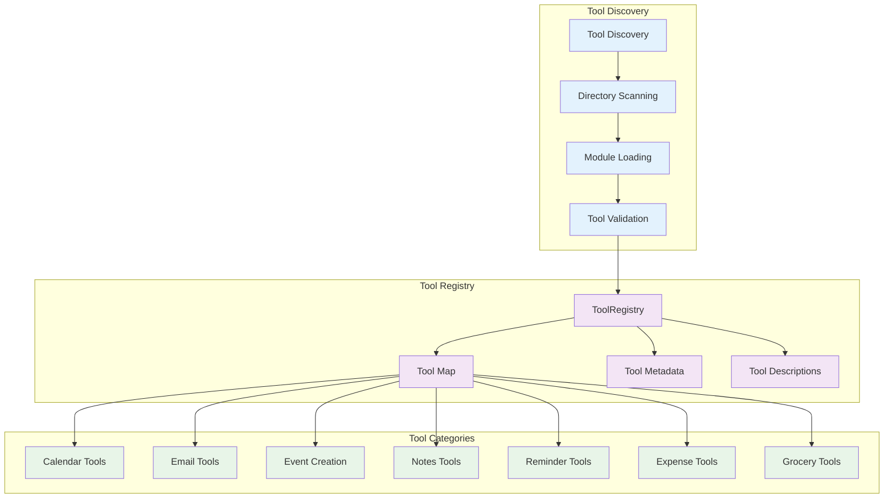

### Tool Selection Process

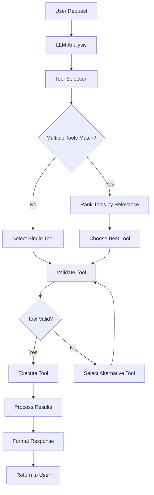

## Tool Execution Pipeline

### Main Execution Flow

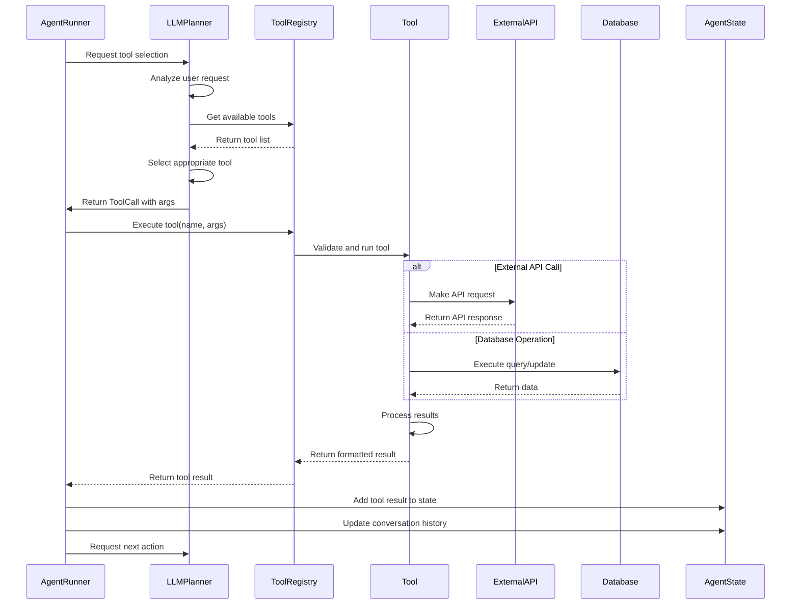

### Tool Execution with Error Handling

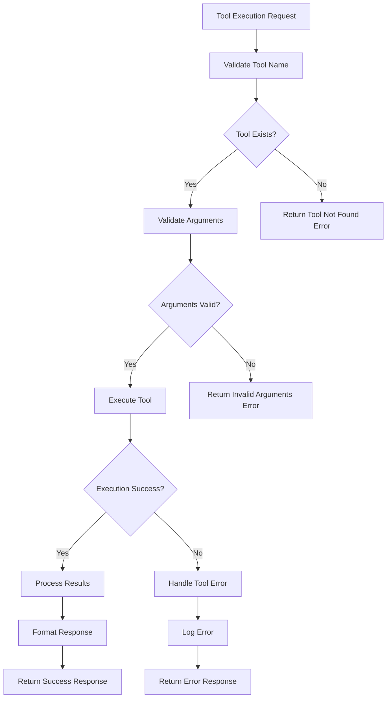

## Tool Categories and Flows

### Calendar Tool Execution

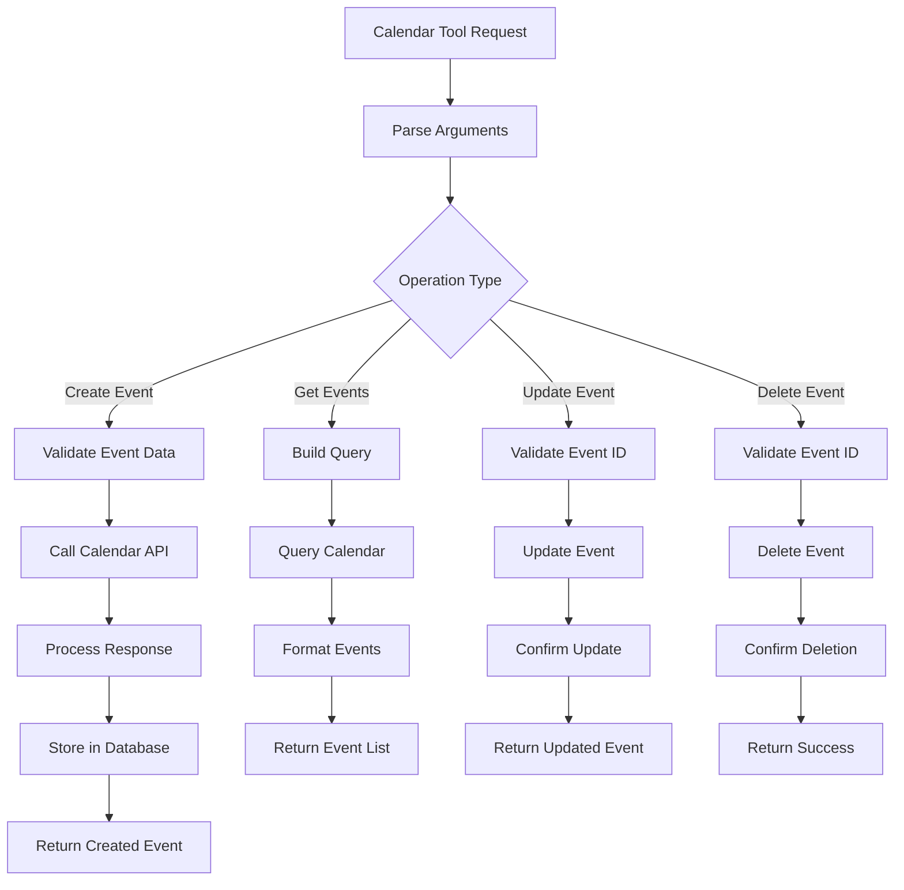

### Email Tool Execution

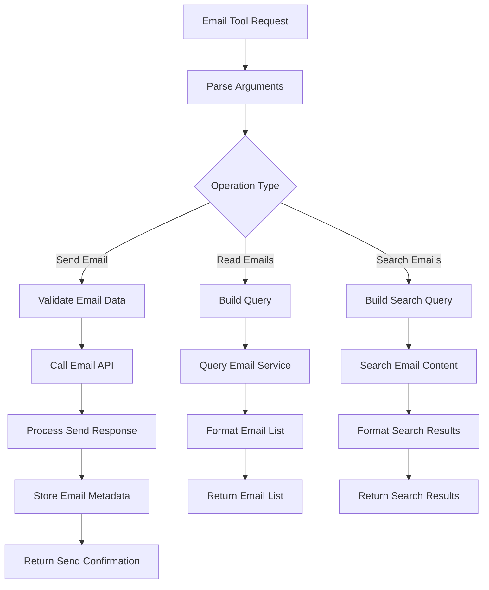

### Event Creation Tool Execution

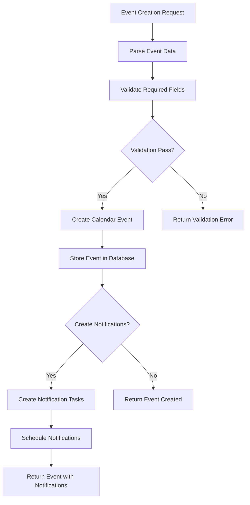

## Tool Result Handling

### Result Processing Pipeline

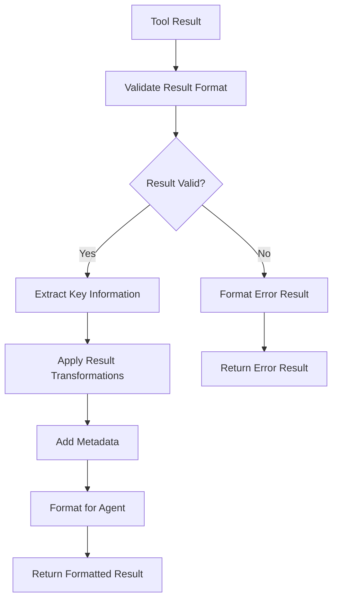

### Error Handling in Tools

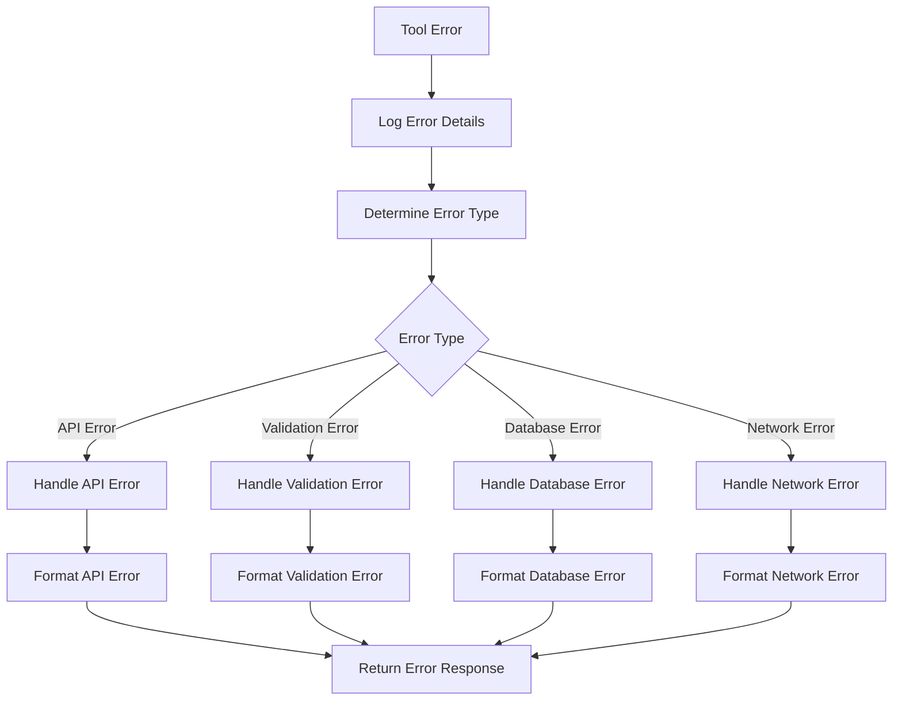

## Tool Configuration and Management

### Tool Configuration

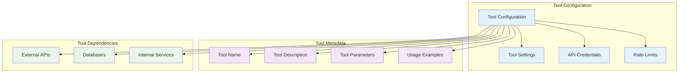

### Tool Lifecycle Management

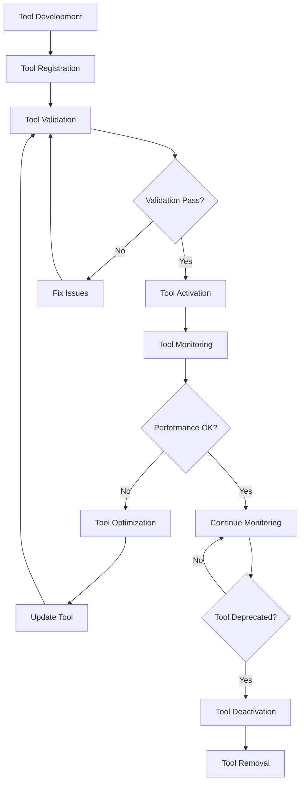

## Tool Performance and Optimization

### Tool Performance Monitoring

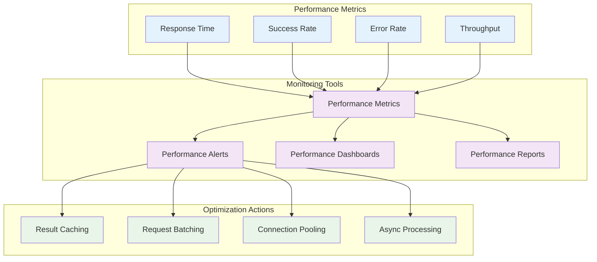

### Tool Caching Strategy

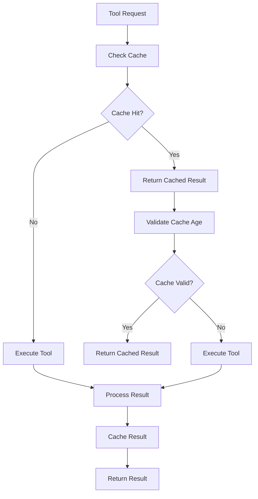

## Tool Security and Validation

### Tool Security Measures

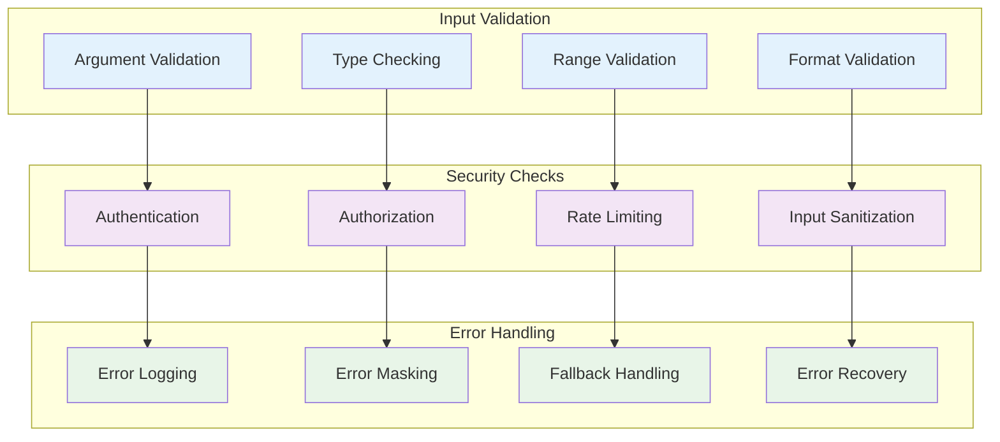

## Notes

### Tool Design Principles

1. **Single Responsibility**: Each tool has one clear purpose
2. **Interface Consistency**: All tools follow the same interface
3. **Error Resilience**: Tools handle errors gracefully
4. **Performance Optimization**: Tools are optimized for speed
5. **Security First**: Tools validate all inputs and outputs

### Tool Execution Characteristics

- **Async Execution**: All tools execute asynchronously
- **Timeout Handling**: Tools have configurable timeouts
- **Retry Logic**: Failed tools can be retried with exponential backoff
- **Result Caching**: Tool results are cached when appropriate
- **Rate Limiting**: Tools respect API rate limits

### Tool Management

- **Dynamic Registration**: Tools can be registered at runtime
- **Hot Reloading**: Tool updates don't require restart
- **Version Management**: Tools support versioning
- **Dependency Management**: Tools declare their dependencies
- **Configuration Management**: Tools are configurable via settings

### Performance Considerations

- **Connection Pooling**: External API connections are pooled
- **Batch Operations**: Tools support batch operations where possible
- **Parallel Execution**: Independent tools can execute in parallel
- **Result Streaming**: Large results are streamed when possible
- **Memory Management**: Tools manage memory efficiently

### Security Measures

- **Input Validation**: All tool inputs are validated
- **Output Sanitization**: Tool outputs are sanitized
- **Authentication**: Tools authenticate with external services
- **Authorization**: Tools check user permissions
- **Audit Logging**: All tool executions are logged

This tool execution architecture provides a robust, secure, and performant foundation for executing various tasks in the personal assistant application.
