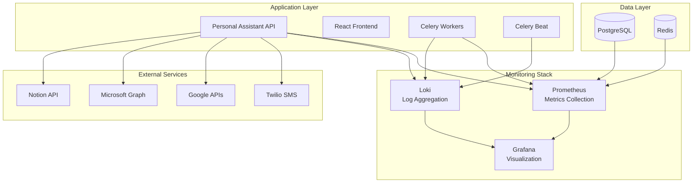

# Monitoring and Observability Guide

This guide covers the comprehensive monitoring, logging, and observability setup for the Personal Assistant TDAH system.

## Table of Contents

- [Overview](#overview)
- [Monitoring Architecture](#monitoring-architecture)
- [Prometheus Configuration](#prometheus-configuration)
- [Grafana Dashboards](#grafana-dashboards)
- [Log Aggregation with Loki](#log-aggregation-with-loki)
- [Alerting System](#alerting-system)
- [Health Checks](#health-checks)
- [Performance Metrics](#performance-metrics)
- [Business Metrics](#business-metrics)
- [Security Monitoring](#security-monitoring)
- [Troubleshooting](#troubleshooting)
- [Best Practices](#best-practices)

## Overview

The Personal Assistant system implements a comprehensive monitoring and observability stack:

- **Prometheus**: Metrics collection and storage
- **Grafana**: Metrics visualization and dashboards
- **Loki**: Log aggregation and analysis
- **Custom Metrics**: Application-specific monitoring
- **Health Checks**: Service availability monitoring
- **Alerting**: Proactive issue detection

### Key Benefits

- **Proactive Monitoring**: Early detection of issues
- **Performance Insights**: Understanding system behavior
- **Business Intelligence**: User engagement and feature usage
- **Security Monitoring**: Threat detection and audit trails
- **Capacity Planning**: Resource utilization trends
- **Debugging**: Comprehensive logging and tracing

## Monitoring Architecture

### System Overview



### Monitoring Components

| Component             | Purpose            | Technology | Port |
| --------------------- | ------------------ | ---------- | ---- |
| **Prometheus**        | Metrics collection | Prometheus | 9090 |
| **Grafana**           | Visualization      | Grafana    | 3000 |
| **Loki**              | Log aggregation    | Loki       | 3100 |
| **Node Exporter**     | System metrics     | Prometheus | 9100 |
| **Postgres Exporter** | Database metrics   | Prometheus | 9187 |
| **Redis Exporter**    | Cache metrics      | Prometheus | 9121 |

## Prometheus Configuration

### Configuration File

**File**: `docker/monitoring/prometheus.yml`

```yaml
global:
  scrape_interval: 15s
  evaluation_interval: 15s

rule_files:
  - "critical-alerts.yml"
  - "warning-alerts.yml"
  - "info-alerts.yml"

scrape_configs:
  # Prometheus itself
  - job_name: "prometheus"
    static_configs:
      - targets: ["localhost:9090"]

  # Personal Assistant API
  - job_name: "personal_assistant_api"
    static_configs:
      - targets: ["api:8000"]
    metrics_path: "/health/database/performance"
    scrape_interval: 30s

  # PostgreSQL Database
  - job_name: "postgres"
    static_configs:
      - targets: ["postgres:5432"]
    # Note: Requires postgres_exporter for actual metrics

  # Redis
  - job_name: "redis"
    static_configs:
      - targets: ["redis:6379"]
    # Note: Requires redis_exporter for actual metrics

  # Node Exporter (if running on host)
  - job_name: "node"
    static_configs:
      - targets: ["host.docker.internal:9100"]
    # Note: Requires node_exporter to be running on host
```

### Custom Metrics

The Personal Assistant API exposes custom metrics:

#### Health Metrics

```python
# Database Performance Metrics
database_health_status: Gauge
database_connection_pool_size: Gauge
database_active_connections: Gauge
database_query_response_time_p95: Histogram
database_slow_query_count: Counter

# Application Metrics
api_request_duration_seconds: Histogram
api_request_total: Counter
api_active_connections: Gauge
api_memory_usage_bytes: Gauge
api_cpu_usage_percent: Gauge

# Business Metrics
user_registration_total: Counter
user_login_total: Counter
sms_sent_total: Counter
oauth_integration_total: Counter
chat_message_total: Counter
```

#### Performance Metrics

```python
# Response Time Metrics
response_time_p50: Histogram
response_time_p95: Histogram
response_time_p99: Histogram

# Throughput Metrics
requests_per_second: Counter
messages_per_minute: Counter
sms_per_hour: Counter

# Error Metrics
error_rate_percentage: Gauge
failed_requests_total: Counter
timeout_requests_total: Counter
```

## Grafana Dashboards

### Dashboard Overview

The system includes six comprehensive dashboards:

1. **System Dashboard**: Infrastructure and system metrics
2. **Application Dashboard**: API performance and health
3. **Business Dashboard**: User engagement and feature usage
4. **SMS Dashboard**: SMS routing and Twilio integration
5. **OAuth Dashboard**: OAuth provider integrations
6. **Task Dashboard**: Background task processing

### System Dashboard

**Purpose**: Monitor infrastructure health and resource utilization

**Key Metrics**:

- CPU usage across all services
- Memory consumption and trends
- Disk I/O and storage usage
- Network traffic and latency
- Container health status

**Visualizations**:

- Time series graphs for resource usage
- Heat maps for performance patterns
- Gauge charts for current status
- Alert panels for critical issues

### Application Dashboard

**Purpose**: Monitor API performance and application health

**Key Metrics**:

- Request rate and response times
- Error rates and status codes
- Database connection pool health
- Cache hit rates and performance
- Authentication success rates

**Visualizations**:

- Response time percentiles (P50, P95, P99)
- Request rate trends
- Error rate trends
- Database performance metrics
- Health check status

### Business Dashboard

**Purpose**: Track user engagement and business metrics

**Key Metrics**:

- User registration and login rates
- Active user sessions
- Feature usage statistics
- Chat message volume
- OAuth integration usage

**Visualizations**:

- User activity trends
- Feature adoption rates
- Engagement metrics
- Conversion funnels
- Retention analysis

### SMS Dashboard

**Purpose**: Monitor SMS routing and Twilio integration

**Key Metrics**:

- SMS delivery rates
- Twilio API response times
- SMS cost tracking
- Routing engine performance
- Phone number mapping statistics

**Visualizations**:

- SMS volume trends
- Delivery success rates
- Cost analysis charts
- Performance metrics
- Error tracking

### OAuth Dashboard

**Purpose**: Monitor OAuth provider integrations

**Key Metrics**:

- OAuth flow success rates
- Token refresh success rates
- Provider-specific metrics
- Integration health status
- Authentication failures

**Visualizations**:

- OAuth flow success rates
- Provider performance comparison
- Token refresh trends
- Integration health status
- Error analysis

### Task Dashboard

**Purpose**: Monitor background task processing

**Key Metrics**:

- Celery worker health
- Task queue lengths
- Task execution times
- Failed task rates
- Scheduled task performance

**Visualizations**:

- Task queue status
- Worker performance
- Task execution trends
- Error rates
- Schedule adherence

## Log Aggregation with Loki

### Loki Configuration

**File**: `docker/monitoring/loki-config.yaml`

```yaml
auth_enabled: false

server:
  http_listen_port: 3100
  grpc_listen_port: 9096

common:
  path_prefix: /loki
  storage:
    filesystem:
      chunks_directory: /loki/chunks
      rules_directory: /loki/rules
  replication_factor: 1
  ring:
    instance_addr: 127.0.0.1
    kvstore:
      store: inmemory

query_scheduler:
  max_outstanding_requests_per_tenant: 2048

schema_config:
  configs:
    - from: 2020-10-24
      store: boltdb-shipper
      object_store: filesystem
      schema: v11
      index:
        prefix: index_
        period: 24h

ruler:
  alertmanager_url: http://localhost:9093

analytics:
  reporting_enabled: false
```

### Log Sources

| Service       | Log Type        | Log Level  | Format |
| ------------- | --------------- | ---------- | ------ |
| **API**       | Application     | INFO/ERROR | JSON   |
| **Worker**    | Task Processing | INFO/ERROR | JSON   |
| **Scheduler** | Scheduled Tasks | INFO/ERROR | JSON   |
| **Nginx**     | Access/Error    | INFO/ERROR | Text   |
| **Database**  | Query Logs      | INFO/ERROR | Text   |
| **Redis**     | Cache Logs      | INFO/ERROR | Text   |

### Log Queries

#### Common Queries

```logql
# Error logs from API
{service="personal_assistant_api"} |= "ERROR"

# Slow database queries
{service="personal_assistant_api"} |= "slow_query" | json | duration > 1000

# SMS routing logs
{service="personal_assistant_api"} |= "sms_routing"

# OAuth integration logs
{service="personal_assistant_api"} |= "oauth"

# User authentication logs
{service="personal_assistant_api"} |= "authentication"
```

#### Performance Queries

```logql
# High response time requests
{service="personal_assistant_api"} | json | response_time > 5000

# Database connection issues
{service="personal_assistant_api"} |= "database_connection"

# Cache miss patterns
{service="personal_assistant_api"} |= "cache_miss"
```

## Alerting System

### Alert Categories

1. **Critical Alerts**: Immediate attention required
2. **Warning Alerts**: Attention needed within hours
3. **Info Alerts**: Informational notifications

### Critical Alerts

**File**: `docker/monitoring/grafana/alerting/critical-alerts.yml`

```yaml
groups:
  - name: critical-alerts
    rules:
      - alert: HighErrorRate
        expr: rate(http_requests_total{status=~"5.."}[5m]) / rate(http_requests_total[5m]) * 100 > 5
        for: 2m
        labels:
          severity: critical
        annotations:
          summary: "High error rate detected"
          description: "Error rate is {{ $value }}% for the last 5 minutes"

      - alert: ServiceDown
        expr: up == 0
        for: 1m
        labels:
          severity: critical
        annotations:
          summary: "Service is down"
          description: "Service {{ $labels.instance }} is down"

      - alert: HighCPUUsage
        expr: system_cpu_usage_percent > 90
        for: 5m
        labels:
          severity: critical
        annotations:
          summary: "High CPU usage"
          description: "CPU usage is {{ $value }}% for {{ $labels.instance }}"

      - alert: HighMemoryUsage
        expr: system_memory_usage_bytes / (1024*1024*1024) > 8
        for: 5m
        labels:
          severity: critical
        annotations:
          summary: "High memory usage"
          description: "Memory usage is {{ $value }}GB for {{ $labels.instance }}"

      - alert: DatabaseConnectionFailure
        expr: database_health_status == 0
        for: 1m
        labels:
          severity: critical
        annotations:
          summary: "Database connection failure"
          description: "Database health check failed for {{ $labels.instance }}"
```

### Warning Alerts

```yaml
groups:
  - name: warning-alerts
    rules:
      - alert: HighResponseTime
        expr: histogram_quantile(0.95, rate(http_request_duration_seconds_bucket[5m])) > 2
        for: 5m
        labels:
          severity: warning
        annotations:
          summary: "High response time"
          description: "95th percentile response time is {{ $value }}s"

      - alert: LowCacheHitRate
        expr: redis_keyspace_hits / (redis_keyspace_hits + redis_keyspace_misses) < 0.8
        for: 10m
        labels:
          severity: warning
        annotations:
          summary: "Low cache hit rate"
          description: "Cache hit rate is {{ $value }}%"
```

### Alert Channels

- **Email**: Critical alerts sent to admin email
- **Slack**: Team notifications for warnings
- **PagerDuty**: Critical alerts for on-call rotation
- **Webhook**: Custom integrations for specific alerts

## Health Checks

### API Health Endpoints

```python
# Overall system health
GET /health/overall
{
  "status": "healthy",
  "timestamp": "2024-01-15T10:30:00Z",
  "services": {
    "database": "healthy",
    "redis": "healthy",
    "external_apis": "healthy"
  }
}

# Database health
GET /health/database
{
  "status": "healthy",
  "connection_pool": {
    "size": 10,
    "active": 3,
    "idle": 7
  },
  "response_time_ms": 15
}

# Performance metrics
GET /health/database/performance
{
  "status": "healthy",
  "metrics": {
    "response_time_p95_ms": 45,
    "slow_query_count": 2,
    "connection_efficiency": 85.5
  }
}
```

### Service Health Checks

| Service      | Health Endpoint    | Check Frequency | Timeout |
| ------------ | ------------------ | --------------- | ------- |
| **API**      | `/health/overall`  | 30s             | 10s     |
| **Database** | `/health/database` | 30s             | 5s      |
| **Redis**    | `redis-cli ping`   | 10s             | 3s      |
| **Nginx**    | `/health`          | 30s             | 10s     |
| **Worker**   | Celery status      | 60s             | 30s     |

## Performance Metrics

### Key Performance Indicators (KPIs)

1. **Response Time**:

   - P50: < 200ms
   - P95: < 1000ms
   - P99: < 2000ms

2. **Throughput**:

   - Requests per second: > 100
   - Concurrent users: > 500
   - Database queries per second: > 50

3. **Availability**:

   - Uptime: > 99.9%
   - Error rate: < 0.1%
   - Recovery time: < 5 minutes

4. **Resource Utilization**:
   - CPU usage: < 80%
   - Memory usage: < 85%
   - Disk I/O: < 70%

### Performance Monitoring

#### Database Performance

```python
# Connection pool metrics
database_connection_pool_size: Gauge
database_active_connections: Gauge
database_idle_connections: Gauge
database_connection_efficiency: Gauge

# Query performance
database_query_duration_seconds: Histogram
database_slow_query_count: Counter
database_query_response_time_p95: Gauge

# Table performance
database_table_bloat_percentage: Gauge
database_index_usage_percentage: Gauge
```

#### Cache Performance

```python
# Redis metrics
redis_connection_count: Gauge
redis_memory_usage_bytes: Gauge
redis_hit_rate_percentage: Gauge
redis_miss_rate_percentage: Gauge
redis_eviction_count: Counter
```

#### API Performance

```python
# Request metrics
api_request_duration_seconds: Histogram
api_request_total: Counter
api_active_connections: Gauge
api_memory_usage_bytes: Gauge
api_cpu_usage_percent: Gauge
```

## Business Metrics

### User Engagement

```python
# User metrics
user_registration_total: Counter
user_login_total: Counter
user_active_sessions: Gauge
user_retention_rate: Gauge

# Feature usage
chat_message_total: Counter
sms_sent_total: Counter
oauth_integration_total: Counter
todo_created_total: Counter
```

### Feature Adoption

```python
# Feature metrics
feature_usage_total: Counter
feature_adoption_rate: Gauge
user_onboarding_completion: Gauge
feature_satisfaction_score: Gauge
```

### Business Intelligence

```python
# Revenue metrics (if applicable)
sms_cost_total: Counter
api_usage_cost: Counter
premium_feature_usage: Counter

# Growth metrics
monthly_active_users: Gauge
daily_active_users: Gauge
user_growth_rate: Gauge
```

## Security Monitoring

### Authentication Monitoring

```python
# Authentication metrics
authentication_attempts_total: Counter
authentication_failures_total: Counter
mfa_setup_total: Counter
mfa_verification_total: Counter
password_reset_total: Counter
```

### Security Events

```python
# Security metrics
security_event_total: Counter
failed_login_attempts: Counter
suspicious_activity: Counter
oauth_token_refresh_failures: Counter
```

### Audit Logging

```python
# Audit metrics
audit_log_total: Counter
permission_check_total: Counter
role_assignment_total: Counter
access_denied_total: Counter
```

## Troubleshooting

### Common Issues

1. **Prometheus Not Scraping**:

   ```bash
   # Check Prometheus targets
   curl http://localhost:9090/api/v1/targets

   # Check service discovery
   curl http://localhost:9090/api/v1/targets?state=active
   ```

2. **Grafana Dashboard Not Loading**:

   ```bash
   # Check Grafana logs
   docker-compose logs grafana

   # Check datasource connection
   curl http://localhost:3000/api/datasources
   ```

3. **Loki Not Receiving Logs**:

   ```bash
   # Check Loki configuration
   curl http://localhost:3100/ready

   # Check log ingestion
   curl http://localhost:3100/api/prom/query
   ```

### Debug Commands

```bash
# Check Prometheus status
curl http://localhost:9090/-/healthy

# Check Grafana status
curl http://localhost:3000/api/health

# Check Loki status
curl http://localhost:3100/ready

# View Prometheus metrics
curl http://localhost:9090/metrics

# Check API health
curl http://localhost:8000/health/overall
```

### Performance Debugging

1. **High Response Times**:

   - Check database query performance
   - Monitor cache hit rates
   - Analyze slow query logs
   - Review connection pool usage

2. **Memory Issues**:

   - Monitor memory usage trends
   - Check for memory leaks
   - Review garbage collection logs
   - Analyze heap dumps

3. **Database Issues**:
   - Check connection pool health
   - Monitor query performance
   - Review slow query logs
   - Check index usage

## Best Practices

### Monitoring Best Practices

1. **Metric Naming**: Use consistent naming conventions
2. **Label Usage**: Use labels for filtering and grouping
3. **Cardinality**: Avoid high-cardinality metrics
4. **Retention**: Set appropriate retention periods
5. **Alerting**: Use meaningful alert thresholds

### Dashboard Best Practices

1. **Layout**: Organize panels logically
2. **Visualization**: Choose appropriate chart types
3. **Time Ranges**: Set relevant default time ranges
4. **Refresh Rates**: Use appropriate refresh intervals
5. **Annotations**: Add context with annotations

### Logging Best Practices

1. **Structured Logging**: Use JSON format
2. **Log Levels**: Use appropriate log levels
3. **Context**: Include relevant context
4. **Performance**: Avoid logging in hot paths
5. **Retention**: Set appropriate log retention

### Alerting Best Practices

1. **Thresholds**: Set meaningful alert thresholds
2. **Escalation**: Define escalation procedures
3. **Documentation**: Document alert procedures
4. **Testing**: Regularly test alerting
5. **Review**: Regularly review and tune alerts

This comprehensive monitoring setup provides complete visibility into the Personal Assistant TDAH system's performance, health, and business metrics, enabling proactive issue detection and data-driven decision making.
