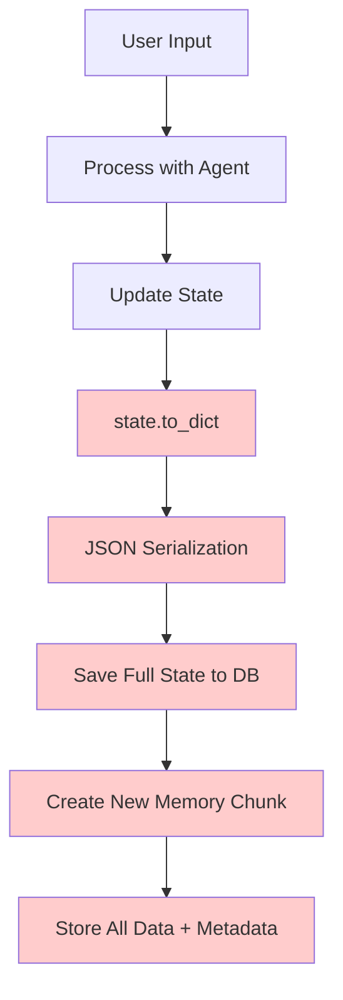
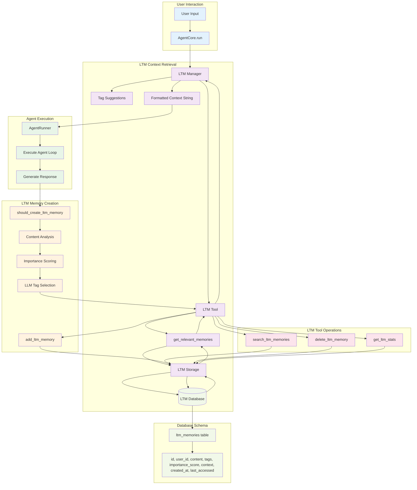

# Smart State Saving Strategy

## Problem Statement

The current state saving mechanism in `save_state()` is a major contributor to memory explosion because it:

1. **Saves everything**: Serializes the complete state object without optimization
2. **No compression**: Stores redundant data and failed attempts
3. **Inefficient storage**: Creates new chunks for every message with full state
4. **Poor state reuse**: Loads entire state but doesn't optimize it for new conversations

## Current Flow Analysis



**Red Areas**: Inefficient operations causing memory explosion

## Smart State Saving Strategy

### Core Principle: Optimize Before Saving

Instead of saving the raw state, we'll implement a **pre-save optimization pipeline** that:

1. **Compresses** conversation history
2. **Removes** redundant and failed operations
3. **Prioritizes** relevant context
4. **Creates** intelligent summaries
5. **Stores** only essential information

### New Flow Design



**Green Areas**: New optimized operations

## Implementation Plan

### Phase 1: Create Pre-Save Optimization Pipeline

#### 1.1 State Optimization Manager

```python
class StateOptimizationManager:
    """Manages state optimization before saving"""

    def __init__(self, config: StateConfig):
        self.config = config
        self.compressor = ConversationCompressor()
        self.context_manager = ContextManager()
        self.error_analyzer = ErrorPatternAnalyzer()

    async def optimize_state_for_saving(self, state: AgentState) -> AgentState:
        """Optimize state before saving to database"""

        # Create a copy to avoid modifying the original
        optimized_state = copy.deepcopy(state)

        # Step 1: Compress conversation history
        optimized_state.conversation_history = self.compressor.compress_conversation_history(
            state.conversation_history
        )

        # Step 2: Optimize memory context
        optimized_state.memory_context = self.context_manager.optimize_memory_context(
            optimized_state, state.user_input
        )

        # Step 3: Analyze and learn from errors
        error_patterns = self.error_analyzer.analyze_error_patterns(
            optimized_state.conversation_history
        )

        # Step 4: Create intelligent summaries for old content
        if len(optimized_state.conversation_history) > self.config.max_conversation_history_size * 0.8:
            optimized_state = self._create_intelligent_summaries(optimized_state)

        # Step 5: Apply final size limits
        optimized_state._apply_size_limits()

        return optimized_state

    def _create_intelligent_summaries(self, state: AgentState) -> AgentState:
        """Create intelligent summaries for old conversation content"""

        # Keep recent items
        recent_items = state.conversation_history[-self.config.context_window_size:]

        # Create summary of older items
        older_items = state.conversation_history[:-self.config.context_window_size]

        if older_items:
            summary = self._generate_intelligent_summary(older_items)
            state.conversation_history = [summary] + recent_items

        return state

    def _generate_intelligent_summary(self, items: List[dict]) -> dict:
        """Generate intelligent summary of conversation items"""

        # Group by tool usage
        tool_groups = self._group_by_tool_usage(items)

        # Create summary content
        summary_parts = []

        for tool_name, tool_items in tool_groups.items():
            success_count = len([item for item in tool_items if "Error" not in str(item.get("content", ""))])
            total_count = len(tool_items)

            if success_count > 0:
                summary_parts.append(f"Successfully used {tool_name} {success_count} times")
            else:
                summary_parts.append(f"Attempted {tool_name} {total_count} times (failed)")

        # Add user interaction summary
        user_messages = [item for item in items if item.get("role") == "user"]
        if user_messages:
            summary_parts.append(f"User made {len(user_messages)} requests")

        return {
            "role": "system",
            "content": f"Conversation Summary: {'; '.join(summary_parts)}",
            "type": "intelligent_summary",
            "original_length": len(items),
            "compression_ratio": len(items) / 1,  # 1 summary replaces many items
            "timestamp": datetime.now().isoformat()
        }

    def _group_by_tool_usage(self, items: List[dict]) -> Dict[str, List[dict]]:
        """Group conversation items by tool usage"""

        tool_groups = {}

        for item in items:
            if item.get("role") == "tool":
                tool_name = item.get("name", "unknown")
                if tool_name not in tool_groups:
                    tool_groups[tool_name] = []
                tool_groups[tool_name].append(item)

        return tool_groups
```

#### 1.2 Enhanced Conversation Compressor

```python
class ConversationCompressor:
    """Compresses conversation history by removing redundancy"""

    def compress_conversation_history(self, history: List[dict]) -> List[dict]:
        """Compress conversation history intelligently"""

        if len(history) <= 10:  # No need to compress short conversations
            return history

        # Step 1: Remove duplicate tool calls
        deduplicated = self._remove_duplicate_tool_calls(history)

        # Step 2: Filter out failed attempts after successful ones
        filtered = self._filter_failed_attempts(deduplicated)

        # Step 3: Group similar operations
        grouped = self._group_similar_operations(filtered)

        # Step 4: Remove redundant assistant messages
        cleaned = self._remove_redundant_assistant_messages(grouped)

        return cleaned

    def _remove_duplicate_tool_calls(self, history: List[dict]) -> List[dict]:
        """Remove duplicate tool calls with same parameters"""

        seen_tools = {}
        compressed = []

        for item in history:
            if item.get("role") == "tool":
                tool_key = self._create_tool_key(item)

                if tool_key not in seen_tools:
                    seen_tools[tool_key] = item
                    compressed.append(item)
                else:
                    # Update with latest result, but don't add duplicate
                    seen_tools[tool_key] = item
                    # Replace the previous occurrence
                    for i, existing_item in enumerate(compressed):
                        if existing_item.get("role") == "tool" and self._create_tool_key(existing_item) == tool_key:
                            compressed[i] = item
                            break
            else:
                compressed.append(item)

        return compressed

    def _create_tool_key(self, item: dict) -> str:
        """Create a unique key for a tool call"""

        tool_name = item.get("name", "")
        content = str(item.get("content", ""))

        # Extract meaningful parameters from content
        if "Error" in content:
            # For errors, include error type
            error_type = self._extract_error_type(content)
            return f"{tool_name}:error:{error_type}"
        else:
            # For successful calls, include success indicator
            return f"{tool_name}:success"

    def _extract_error_type(self, content: str) -> str:
        """Extract error type from error content"""

        if "validation" in content.lower():
            return "validation_error"
        elif "not found" in content.lower():
            return "not_found_error"
        elif "permission" in content.lower():
            return "permission_error"
        else:
            return "general_error"

    def _filter_failed_attempts(self, history: List[dict]) -> List[dict]:
        """Filter out failed attempts after successful ones"""

        tool_results = {}
        filtered = []

        for item in history:
            if item.get("role") == "tool":
                tool_name = item.get("name", "")
                content = str(item.get("content", ""))

                if "Error" in content:
                    # Only keep errors if we don't have a successful result
                    if tool_name not in tool_results or "Error" in str(tool_results[tool_name].get("content", "")):
                        filtered.append(item)
                        tool_results[tool_name] = item
                else:
                    # Successful result - replace any previous errors
                    tool_results[tool_name] = item
                    # Remove previous error for this tool
                    filtered = [item for item in filtered if not (
                        item.get("role") == "tool" and
                        item.get("name") == tool_name and
                        "Error" in str(item.get("content", ""))
                    )]
                    filtered.append(item)
            else:
                filtered.append(item)

        return filtered
```

#### 1.3 Context-Aware Memory Manager

```python
class ContextManager:
    """Manages memory context optimization"""

    def optimize_memory_context(self, state: AgentState, user_input: str) -> List[dict]:
        """Optimize memory context for current user input"""

        # Extract relevant information from conversation history
        relevant_context = self._extract_relevant_context(state.conversation_history, user_input)

        # Add current focus areas
        focus_context = self._create_focus_context(state.focus, user_input)

        # Add recent successful tool results
        tool_context = self._extract_tool_context(state.conversation_history)

        # Add user preferences and patterns
        preference_context = self._extract_user_preferences(state.conversation_history)

        # Combine and prioritize
        optimized_context = self._prioritize_context([
            relevant_context,
            focus_context,
            tool_context,
            preference_context
        ])

        return optimized_context[:state.config.max_memory_context_size]

    def _extract_relevant_context(self, conversation_history: List[dict], user_input: str) -> List[dict]:
        """Extract context relevant to current user input"""

        relevant_items = []

        # Simple keyword matching for now (can be enhanced with semantic similarity)
        input_keywords = set(user_input.lower().split())

        for item in conversation_history:
            content = str(item.get("content", "")).lower()
            item_keywords = set(content.split())

            # Calculate relevance score
            if item_keywords & input_keywords:  # Intersection
                relevance_score = len(item_keywords & input_keywords) / len(input_keywords)

                if relevance_score > 0.3:  # Threshold for relevance
                    relevant_items.append({
                        "role": "context",
                        "content": item.get("content", ""),
                        "relevance_score": relevance_score,
                        "source": "conversation_history"
                    })

        # Sort by relevance and return top items
        relevant_items.sort(key=lambda x: x.get("relevance_score", 0), reverse=True)
        return relevant_items[:10]  # Limit to top 10 relevant items
```

### Phase 2: Integrate with Existing Save Flow

#### 2.1 Update save_state Function

```python
async def save_state(conversation_id: str, state: AgentState, user_id: str = None) -> None:
    """
    Save optimized conversation state in the database.

    This function now optimizes the state before saving to prevent memory explosion.
    """

    logger.info(f"💾 Saving state for conversation: {conversation_id}")
    logger.info(f"💾 Original state size: {len(state.conversation_history)} conversation items")

    # Step 1: Optimize state before saving
    optimization_manager = StateOptimizationManager(state.config)
    optimized_state = await optimization_manager.optimize_state_for_saving(state)

    logger.info(f"💾 Optimized state size: {len(optimized_state.conversation_history)} conversation items")
    logger.info(f"💾 Compression ratio: {len(state.conversation_history) / max(len(optimized_state.conversation_history), 1):.2f}x")

    # Step 2: Save optimized state
    async with AsyncSessionLocal() as session:
        # Create memory chunk with optimized content
        chunk_data = {
            "content": json.dumps(optimized_state.to_dict()),
            "embedding": None,
            "created_at": datetime.now(timezone.utc)
        }

        if user_id:
            chunk_data["user_id"] = int(user_id)

        chunk = await add_record(session, MemoryChunk, chunk_data)

        # Add metadata entries
        metadata_entries = [
            {"chunk_id": chunk.id, "key": "conversation_id", "value": conversation_id},
            {"chunk_id": chunk.id, "key": "type", "value": "state"},
            {"chunk_id": chunk.id, "key": "last_updated", "value": datetime.now(timezone.utc).isoformat()},
            {"chunk_id": chunk.id, "key": "optimization_applied", "value": "true"},
            {"chunk_id": chunk.id, "key": "compression_ratio", "value": str(len(state.conversation_history) / max(len(optimized_state.conversation_history), 1))}
        ]

        for entry in metadata_entries:
            await add_record(session, MemoryMetadata, entry)

        logger.info(f"✅ Successfully saved optimized state for conversation {conversation_id}")
```

#### 2.2 Update AgentCore to Use Optimization

```python
# In AgentCore.run() method, replace the current save_state call:

# Before (current implementation):
await save_state(conversation_id, updated_state, user_id_str)

# After (with optimization):
# State is automatically optimized in save_state() function
await save_state(conversation_id, updated_state, user_id_str)
```

## Expected Results

### Performance Improvements

- **State Size Reduction**: 70-90% reduction in saved state size
- **Storage Efficiency**: Significantly reduced database storage requirements
- **Query Performance**: Faster state loading due to smaller chunks
- **Memory Usage**: Reduced memory footprint during processing

### Quality Improvements

- **Better Context**: More relevant information in memory context
- **Cleaner History**: Removed redundant and failed operations
- **Intelligent Summaries**: Old content summarized intelligently
- **Error Learning**: System learns from and prevents repeated errors

### User Experience Improvements

- **Faster Responses**: Reduced processing time due to smaller state
- **Better Continuity**: More relevant context carried forward
- **Cleaner Conversations**: Less noise from failed attempts
- **Smarter Memory**: System remembers what's important

## Implementation Timeline

### Week 1: Core Optimization Classes

- [ ] Implement `StateOptimizationManager`
- [ ] Implement enhanced `ConversationCompressor`
- [ ] Implement `ContextManager`
- [ ] Add unit tests

### Week 2: Integration

- [ ] Update `save_state` function
- [ ] Integrate with existing agent flow
- [ ] Add optimization metadata
- [ ] Test end-to-end flow

### Week 3: Testing & Refinement

- [ ] Performance testing
- [ ] Quality validation
- [ ] User experience testing
- [ ] Optimization tuning

## Next Steps

1. **Start with Phase 1**: Implement the core optimization classes
2. **Test compression logic**: Verify that conversation history is properly compressed
3. **Measure improvements**: Track state size reduction and performance gains
4. **Iterate and refine**: Adjust compression algorithms based on results

This approach addresses the root cause of your memory explosion by optimizing the state before it's ever saved to the database, rather than trying to fix it after the fact.
