# AI Scheduler System Design Documentation

## Service Overview

The AI Scheduler System is a comprehensive AI task management and automation platform within the Personal Assistant TDAH system. It provides intelligent task scheduling, execution, evaluation, and notification capabilities using AI-powered decision making and background processing.

### Purpose and Primary Responsibilities

- **Task Management**: Create, update, delete, and schedule AI-driven tasks
- **Intelligent Scheduling**: AI-powered task scheduling with Celery background processing
- **Task Execution**: Execute tasks using the AI assistant with enhanced prompt architecture
- **Event Evaluation**: AI-powered evaluation of calendar events and task contexts
- **Notification System**: Multi-channel notifications (SMS, email, in-app)
- **Performance Monitoring**: Task statistics, health monitoring, and system metrics

### Key Business Logic and Workflows

1. **Task Creation Flow**: User creates task → Validation → Database storage → Scheduling
2. **Execution Pipeline**: Due task detection → Context building → AI execution → Result processing
3. **Evaluation Flow**: Event analysis → AI evaluation → Action recommendations → Task generation
4. **Notification Flow**: Task completion → Channel selection → Message formatting → Delivery

### Integration Points and Dependencies

- **AgentCore**: AI assistant for task execution
- **Celery Workers**: Background task processing
- **Database**: Task storage and state management
- **Notification Services**: SMS, email, in-app notifications
- **Calendar Integration**: Event evaluation and context building
- **Tool Registry**: Access to all available tools for task execution

### Performance Characteristics

- **Background Processing**: Non-blocking task execution with Celery
- **Intelligent Scheduling**: AI-powered task timing optimization
- **Scalable Architecture**: Horizontal scaling with worker processes
- **Performance Monitoring**: Real-time metrics and health checks

### Security Considerations

- **User Isolation**: User-specific task management and execution
- **Input Validation**: Comprehensive task parameter validation
- **Execution Security**: Safe AI task execution with error handling
- **Data Protection**: Secure task data storage and transmission

---

## A. Service Overview Diagram

```mermaid
graph TB
    subgraph "AI Scheduler System - Overview"
        SCHEDULER["🚀 TaskScheduler - Main Orchestrator"]
        MANAGER["⚙️ AITaskManager - Database Operations"]
        EXECUTOR["🤖 TaskExecutor - AI Execution"]
        EVALUATOR["🧠 AIEventEvaluator - Event Analysis"]
        NOTIFICATIONS["📱 NotificationService - Multi-channel Alerts"]
        CELERY["⚡ Celery Workers - Background Processing"]
        DATABASE[("💾 Database - Task Storage")]
    end

    SCHEDULER --> MANAGER
    SCHEDULER --> CELERY
    MANAGER --> DATABASE
    EXECUTOR --> DATABASE
    EVALUATOR --> EXECUTOR
    NOTIFICATIONS --> EXECUTOR
    CELERY --> EXECUTOR
```



---

## B. Detailed Component Breakdown


---

## C. Data Flow Diagram


---

## D. Security Architecture

```mermaid
graph TB
    subgraph "Security Layer"
        USER_AUTH["🛡️ User Authentication - User Context"]
        INPUT_VALIDATION["🔐 Input Validation - Task Parameters"]
        EXECUTION_SECURITY["🔒 Execution Security - Safe AI Processing"]
        DATA_PROTECTION["📋 Data Protection - Secure Storage"]
        AUDIT_LOGGING["📝 Audit Logging - Task Execution Tracking"]
    end

    subgraph "AI Scheduler Layer"
        SCHEDULER["🚀 TaskScheduler"]
        MANAGER["⚙️ AITaskManager"]
        EXECUTOR["🤖 TaskExecutor"]
    end

    subgraph "External Layer"
        AI_ASSISTANT["🧠 AI Assistant"]
        NOTIFICATIONS["📱 Notification Services"]
        DATABASE["💾 Database"]
    end

    USER_AUTH --> INPUT_VALIDATION
    INPUT_VALIDATION --> EXECUTION_SECURITY
    EXECUTION_SECURITY --> SCHEDULER
    SCHEDULER --> MANAGER
    MANAGER --> EXECUTOR
    EXECUTOR --> AI_ASSISTANT
    EXECUTOR --> NOTIFICATIONS
    MANAGER --> DATABASE
    EXECUTOR --> AUDIT_LOGGING
```



---

## Component Details

### TaskScheduler Class

- **File Location**: `src/personal_assistant/tools/ai_scheduler/core/scheduler.py`
- **Key Methods**:
  - `start_worker(loglevel: str)`: Start Celery workers
  - `start_beat(loglevel: str)`: Start periodic scheduling
  - `get_status() -> Dict[str, Any]`: System health monitoring
  - `get_task_statistics() -> Dict[str, Any]`: Performance metrics
  - `test_connection() -> Dict[str, Any]`: Connection testing
- **Configuration**: Worker options, logging levels, health checks
- **Error Handling**: Worker failures, connection issues, scheduling errors
- **Monitoring**: Worker status, task statistics, performance metrics

### AITaskManager Class

- **File Location**: `src/personal_assistant/tools/ai_scheduler/core/task_manager.py`
- **Key Methods**:
  - `create_task(user_id, title, description, task_type, schedule_type, schedule_config, next_run_at, ai_context, notification_channels) -> AITask`: Create new task
  - `get_due_tasks(user_id: Optional[int] = None) -> List[AITask]`: Retrieve due tasks
  - `update_task(task_id: int, **updates) -> AITask`: Update task properties
  - `delete_task(task_id: int) -> bool`: Remove task
  - `create_reminder_with_validation(user_id, title, description, schedule_config, notification_channels) -> AITask`: Create validated reminder
- **Configuration**: Database connections, task validation rules
- **Error Handling**: Validation errors, database errors, constraint violations
- **Monitoring**: Task creation rates, update frequencies, deletion patterns

### TaskExecutor Class

- **File Location**: `src/personal_assistant/tools/ai_scheduler/core/executor.py`
- **Key Methods**:
  - `execute_task(task: AITask) -> Dict[str, Any]`: Execute AI task
  - `_build_task_context(task: AITask) -> Dict[str, Any]`: Build execution context
  - `_create_ai_prompt(task: AITask, context: Dict[str, Any]) -> str`: Create AI prompt
  - `_process_ai_response(task: AITask, response: str) -> Dict[str, Any]`: Process AI response
- **Configuration**: AI assistant integration, prompt templates, metadata management
- **Error Handling**: Execution failures, AI errors, context building errors
- **Monitoring**: Execution times, success rates, AI response quality

### AIEventEvaluator Class

- **File Location**: `src/personal_assistant/tools/ai_scheduler/evaluation/evaluator.py`
- **Key Methods**:
  - `evaluate_event(event) -> Dict[str, Any]`: Evaluate calendar event
  - `analyze_recurrence_pattern(event) -> Dict[str, Any]`: Analyze recurring patterns
  - `suggest_actions_for_event(event, context) -> List[str]`: Generate action recommendations
- **Configuration**: AI evaluation criteria, context building rules
- **Error Handling**: Evaluation failures, context errors, AI processing errors
- **Monitoring**: Evaluation accuracy, processing times, recommendation quality

### NotificationService Class

- **File Location**: `src/personal_assistant/tools/ai_scheduler/notifications/service.py`
- **Key Methods**:
  - `send_notification(channels: List[str], message: str, user_id: int) -> Dict[str, Any]`: Send multi-channel notification
  - `format_message(message: str, channel: str) -> str`: Format message for channel
  - `select_channels(user_preferences: Dict[str, Any]) -> List[str]`: Select notification channels
- **Configuration**: Channel settings, message templates, delivery preferences
- **Error Handling**: Delivery failures, channel errors, formatting errors
- **Monitoring**: Delivery rates, channel performance, user preferences

---

## Data Models

### AITask Model Structure

```json
{
  "id": "integer",
  "user_id": "integer",
  "title": "string",
  "description": "string",
  "task_type": "string (reminder|automated_task|periodic_task)",
  "schedule_type": "string (once|daily|weekly|monthly|custom)",
  "schedule_config": "object",
  "next_run_at": "datetime",
  "ai_context": "string",
  "notification_channels": "array",
  "status": "string (pending|running|completed|failed)",
  "created_at": "datetime",
  "updated_at": "datetime"
}
```

### Task Execution Result Structure

```json
{
  "task_id": "integer",
  "execution_id": "uuid",
  "status": "string (success|failure|partial)",
  "result": "object",
  "execution_time": "float",
  "ai_response": "string",
  "error_message": "string",
  "metadata": "object",
  "timestamp": "datetime"
}
```

### Event Evaluation Result Structure

```json
{
  "event_id": "string",
  "should_process": "boolean",
  "reason": "string",
  "confidence": "float",
  "suggested_actions": "array",
  "context": "object",
  "evaluation_time": "datetime"
}
```

---

## Integration Points

### External API Endpoints

- **AgentCore**: AI assistant for task execution
- **Celery Workers**: Background task processing
- **Database**: Task storage and state management
- **SMS Service**: Twilio integration for notifications
- **Email Service**: SMTP integration for notifications
- **Calendar API**: Event data for evaluation

### Database Connections

- **PostgreSQL**: Task storage, execution logs, user preferences
- **Redis**: Celery queue, worker state, caching
- **Session Storage**: User context, execution state

### Cache Layer Interactions

- **Task Cache**: Recent task results, execution state
- **Worker Cache**: Celery worker status, queue state
- **Evaluation Cache**: Event evaluation results, context data

### Background Job Processing

- **Task Execution**: Async AI task processing
- **Periodic Scheduling**: Automated task scheduling
- **Notification Delivery**: Background notification processing
- **Health Monitoring**: System health checks

### Webhook Endpoints

- **Task Completion**: Task execution completion notifications
- **Notification Delivery**: Notification delivery status
- **Health Alerts**: System health threshold breaches

---

## Quality Assurance Checklist

- [x] **Completeness**: All major components included
- [x] **Accuracy**: Service names match codebase exactly
- [x] **Consistency**: Follows established color/icon standards
- [x] **Clarity**: Data flow is clear and logical
- [x] **Security**: Security boundaries clearly defined
- [x] **Dependencies**: All service dependencies shown
- [x] **Documentation**: Comprehensive accompanying text
- [x] **Future-proofing**: Extensibility considerations included

---

## Success Criteria

A successful AI Scheduler System design diagram will:

- ✅ Clearly show AI scheduler architecture and relationships
- ✅ Include all required components and dependencies
- ✅ Follow established visual and documentation standards
- ✅ Provide comprehensive context for future development
- ✅ Enable easy onboarding for new team members
- ✅ Serve as definitive reference for AI scheduler understanding

---

## Future Enhancements

### Planned Improvements

- **Advanced AI Evaluation**: Machine learning-based event evaluation
- **Dynamic Scheduling**: AI-powered optimal scheduling algorithms
- **Predictive Analytics**: Task completion prediction and optimization
- **Enhanced Notifications**: Smart notification timing and channel selection
- **Performance Optimization**: Advanced caching and execution optimization

### Integration Roadmap

- **Additional AI Models**: Integration with specialized AI models
- **Advanced Calendar Integration**: Deeper calendar event analysis
- **Mobile Integration**: Mobile-specific notification and task management
- **Enterprise Features**: Advanced security and compliance features
- **API Expansion**: External API for third-party integrations
