# Calendar System Design Documentation

## Service Overview

The Calendar System is a comprehensive calendar management and event processing platform within the Personal Assistant TDAH system. It provides Microsoft Graph API integration for Outlook calendar operations, intelligent event management, and seamless integration with the AI assistant for calendar-related tasks.

### Purpose and Primary Responsibilities

- **Event Management**: Create, view, update, and delete calendar events
- **Microsoft Graph Integration**: Seamless Outlook calendar synchronization
- **Event Validation**: Comprehensive parameter validation and error handling
- **Email Integration**: Attendee management and email extraction
- **AI Assistant Integration**: Intelligent calendar operations through AI
- **Error Recovery**: Enhanced error handling with calendar-specific context

### Key Business Logic and Workflows

1. **Event Creation Flow**: User input → Validation → Microsoft Graph API → Event creation
2. **Event Retrieval Flow**: Query parameters → API request → Event parsing → Response formatting
3. **Event Deletion Flow**: Event ID validation → API deletion → Confirmation response
4. **Error Handling Flow**: Error detection → Calendar-specific context → Recovery guidance

### Integration Points and Dependencies

- **Microsoft Graph API**: Outlook calendar operations and data synchronization
- **OAuth Integration**: Microsoft authentication and token management
- **Email System**: Attendee management and email extraction
- **AI Assistant**: Intelligent calendar operations and context understanding
- **Error Handling System**: Centralized error management with calendar-specific context

### Performance Characteristics

- **Lazy Token Loading**: OAuth tokens loaded only when needed
- **Parameter Validation**: Fast input validation with sensible defaults
- **API Optimization**: Efficient Microsoft Graph API usage
- **Error Recovery**: Quick error detection and recovery

### Security Considerations

- **OAuth Authentication**: Secure Microsoft Graph API access
- **Input Validation**: Comprehensive parameter validation and sanitization
- **User Context**: User-specific calendar operations
- **Error Sanitization**: Safe error message generation
- **Token Management**: Secure OAuth token handling and refresh

---

## A. Service Overview Diagram

```mermaid
graph TB
    subgraph "Calendar System - Overview"
        CALENDAR_TOOL["🚀 CalendarTool - Main Orchestrator"]
        INTERNAL["⚙️ Calendar Internal - Utility Functions"]
        ERROR_HANDLER["🛡️ Calendar Error Handler - Recovery System"]
        EMAIL_EXTRACTOR["📧 Email Extractor - Attendee Management"]
        MICROSOFT_GRAPH["🔗 Microsoft Graph API - Outlook Integration"]
        OAUTH["🔑 OAuth Service - Authentication"]
    end

    CALENDAR_TOOL --> INTERNAL
    CALENDAR_TOOL --> ERROR_HANDLER
    CALENDAR_TOOL --> EMAIL_EXTRACTOR
    CALENDAR_TOOL --> MICROSOFT_GRAPH
    MICROSOFT_GRAPH --> OAUTH
```



---

## B. Detailed Component Breakdown


---

## C. Data Flow Diagram


---

## D. Security Architecture

```mermaid
graph TB
    subgraph "Security Layer"
        OAUTH_AUTH["🛡️ OAuth Authentication - Microsoft Graph Access"]
        INPUT_VALIDATION["🔐 Input Validation - Parameter Sanitization"]
        TOKEN_MANAGEMENT["🔒 Token Management - Secure Token Handling"]
        USER_CONTEXT["📋 User Context - User-specific Operations"]
        ERROR_SANITIZATION["📝 Error Sanitization - Safe Error Messages"]
    end

    subgraph "Calendar Layer"
        CALENDAR_TOOL["🚀 CalendarTool"]
        INTERNAL["⚙️ Calendar Internal"]
        ERROR_HANDLER["🛡️ Calendar Error Handler"]
    end

    subgraph "External Layer"
        MICROSOFT_GRAPH["🔗 Microsoft Graph API"]
        OAUTH_SERVICE["🔑 OAuth Service"]
        EMAIL_SERVICE["📧 Email Service"]
    end

    OAUTH_AUTH --> INPUT_VALIDATION
    INPUT_VALIDATION --> TOKEN_MANAGEMENT
    TOKEN_MANAGEMENT --> CALENDAR_TOOL
    CALENDAR_TOOL --> INTERNAL
    INTERNAL --> ERROR_HANDLER
    CALENDAR_TOOL --> MICROSOFT_GRAPH
    MICROSOFT_GRAPH --> OAUTH_SERVICE
    INTERNAL --> EMAIL_SERVICE
    ERROR_HANDLER --> ERROR_SANITIZATION
```



---

## Component Details

### CalendarTool Class

- **File Location**: `src/personal_assistant/tools/calendar/calendar_tool.py`
- **Key Methods**:
  - `get_events(count: int, days: int) -> str`: Retrieve calendar events
  - `create_calendar_event(subject: str, start_time: str, duration: int, location: str, attendees: str) -> str`: Create new calendar event
  - `delete_calendar_event(event_id: str) -> str`: Delete calendar event
  - `_get_access_token() -> str`: Get Microsoft Graph access token
- **Configuration**: Microsoft Graph URL, OAuth scopes, environment settings
- **Error Handling**: Calendar-specific error handling with recovery guidance
- **Monitoring**: API call tracking, token usage, error rates

### Calendar Internal Functions

- **File Location**: `src/personal_assistant/tools/calendar/calendar_internal.py`
- **Key Functions**:
  - `validate_calendar_parameters(count: int, days: int) -> tuple[int, int]`: Validate and normalize parameters
  - `validate_event_id(event_id: str) -> tuple[bool, str]`: Validate event ID
  - `validate_subject(subject: str) -> tuple[bool, str]`: Validate event subject
  - `validate_start_time(start_time: str) -> tuple[bool, str]`: Validate start time format
  - `parse_start_time_with_duration(start_time: str, duration: int) -> tuple[datetime, datetime]`: Parse time with duration
  - `build_event_data(subject: str, start_time: datetime, end_time: datetime, location: str, attendees: List[str]) -> Dict[str, Any]`: Build event data
  - `format_event_details_response(events: List[Dict[str, Any]]) -> str`: Format event response
- **Configuration**: Validation rules, time formats, response templates
- **Error Handling**: Parameter validation errors, format errors
- **Monitoring**: Validation success rates, parsing accuracy

### Calendar Error Handler

- **File Location**: `src/personal_assistant/tools/calendar/calendar_error_handler.py`
- **Key Methods**:
  - `handle_calendar_error(error: Exception, method_name: str, args: Dict[str, Any]) -> Dict[str, Any]`: Handle calendar-specific errors
  - `get_calendar_recovery_hints(error_type: str, method_name: str) -> List[str]`: Get recovery hints
  - `get_calendar_suggested_actions(error_type: str, method_name: str) -> List[str]`: Get suggested actions
- **Configuration**: Error patterns, recovery strategies, user intents
- **Error Handling**: Error classification, context creation, recovery guidance
- **Monitoring**: Error rates, recovery success, user guidance effectiveness

### Email Extractor

- **File Location**: `src/personal_assistant/tools/calendar/email_extractor.py`
- **Key Functions**:
  - `extract_emails_from_text(text: str) -> List[str]`: Extract email addresses from text
  - `extract_event_info_with_emails(text: str) -> Tuple[str, List[str]]`: Extract event info and emails
  - `format_attendees_for_api(attendees: str) -> List[Dict[str, str]]`: Format attendees for API
- **Configuration**: Email regex patterns, formatting rules
- **Error Handling**: Invalid email formats, parsing errors
- **Monitoring**: Email extraction accuracy, formatting success

---

## Data Models

### Calendar Event Structure

```json
{
  "id": "string",
  "subject": "string",
  "start": {
    "dateTime": "datetime",
    "timeZone": "string"
  },
  "end": {
    "dateTime": "datetime",
    "timeZone": "string"
  },
  "location": {
    "displayName": "string"
  },
  "attendees": [
    {
      "emailAddress": {
        "address": "string",
        "name": "string"
      },
      "type": "required|optional|resource"
    }
  ],
  "body": {
    "content": "string",
    "contentType": "text|html"
  }
}
```

### Calendar Tool Parameters

```json
{
  "view_calendar_events": {
    "count": "integer",
    "days": "integer"
  },
  "create_calendar_event": {
    "subject": "string",
    "start_time": "string",
    "duration": "integer",
    "location": "string",
    "attendees": "string"
  },
  "delete_calendar_event": {
    "event_id": "string"
  }
}
```

### Error Response Structure

```json
{
  "error": true,
  "error_type": "string",
  "error_message": "string",
  "tool_name": "string",
  "calendar_context": {
    "method_name": "string",
    "user_intent": "string",
    "recovery_hints": "array",
    "suggested_actions": "array"
  },
  "llm_instructions": "string"
}
```

---

## Integration Points

### External API Endpoints

- **Microsoft Graph API**: Calendar operations, event management, attendee handling
- **OAuth Service**: Microsoft authentication, token management, token refresh
- **Email Service**: Attendee notifications, email validation

### Database Connections

- **OAuth Tokens**: Microsoft Graph access tokens, refresh tokens
- **User Preferences**: Calendar settings, notification preferences
- **Event Cache**: Recent events, frequently accessed data

### Cache Layer Interactions

- **Token Cache**: OAuth access tokens, refresh tokens
- **Event Cache**: Recent calendar events, user preferences
- **Validation Cache**: Parameter validation results

### Background Job Processing

- **Token Refresh**: Automatic OAuth token refresh
- **Event Sync**: Calendar synchronization
- **Notification Delivery**: Attendee notifications

### Webhook Endpoints

- **Calendar Changes**: Event creation, updates, deletions
- **Token Expiry**: OAuth token expiration notifications
- **Error Alerts**: Calendar operation failures

---

## Quality Assurance Checklist

- [x] **Completeness**: All major components included
- [x] **Accuracy**: Service names match codebase exactly
- [x] **Consistency**: Follows established color/icon standards
- [x] **Clarity**: Data flow is clear and logical
- [x] **Security**: Security boundaries clearly defined
- [x] **Dependencies**: All service dependencies shown
- [x] **Documentation**: Comprehensive accompanying text
- [x] **Future-proofing**: Extensibility considerations included

---

## Success Criteria

A successful Calendar System design diagram will:

- ✅ Clearly show calendar architecture and relationships
- ✅ Include all required components and dependencies
- ✅ Follow established visual and documentation standards
- ✅ Provide comprehensive context for future development
- ✅ Enable easy onboarding for new team members
- ✅ Serve as definitive reference for calendar understanding

---

## Future Enhancements

### Planned Improvements

- **Advanced Event Management**: Recurring events, event series, complex scheduling
- **Smart Scheduling**: AI-powered optimal meeting time suggestions
- **Calendar Analytics**: Usage patterns, meeting insights, productivity metrics
- **Enhanced Integration**: Additional calendar providers, cross-platform sync
- **Mobile Optimization**: Mobile-specific calendar operations

### Integration Roadmap

- **Google Calendar**: Additional calendar provider support
- **Apple Calendar**: iOS/macOS calendar integration
- **Advanced Notifications**: Smart notification timing, meeting reminders
- **Meeting Intelligence**: AI-powered meeting analysis and optimization
- **Enterprise Features**: Advanced security, compliance, and admin features
