# Email System Design Documentation

## Service Overview

The Email System is a comprehensive email management and processing platform within the Personal Assistant TDAH system. It provides Microsoft Graph API integration for Outlook email operations, intelligent email management, search capabilities, and seamless integration with the AI assistant for email-related tasks.

### Purpose and Primary Responsibilities

- **Email Management**: Read, send, delete, and search emails
- **Microsoft Graph Integration**: Seamless Outlook email synchronization
- **Email Search**: Advanced email search with query processing
- **Folder Management**: Email folder operations and organization
- **OAuth Integration**: User-specific Microsoft authentication
- **Error Recovery**: Enhanced error handling with email-specific context

### Key Business Logic and Workflows

1. **Email Reading Flow**: User request → OAuth token → Microsoft Graph API → Email parsing → Response formatting
2. **Email Sending Flow**: User input → Validation → Message building → API request → Delivery confirmation
3. **Email Search Flow**: Search query → Parameter validation → API search → Result processing → Response formatting
4. **Folder Management Flow**: Folder operations → API requests → Status updates → Response formatting

### Integration Points and Dependencies

- **Microsoft Graph API**: Outlook email operations and data synchronization
- **OAuth Integration**: Microsoft authentication and token management
- **Database**: User integration storage and token management
- **AI Assistant**: Intelligent email operations and context understanding
- **Error Handling System**: Centralized error management with email-specific context

### Performance Characteristics

- **Batch Processing**: Efficient email retrieval with configurable batch sizes
- **Retry Logic**: Robust API retry mechanisms for reliability
- **Token Management**: Lazy loading and automatic refresh of OAuth tokens
- **Search Optimization**: Advanced search parameters and result sorting

### Security Considerations

- **OAuth Authentication**: Secure Microsoft Graph API access
- **User Isolation**: User-specific email operations and data access
- **Input Validation**: Comprehensive parameter validation and sanitization
- **Token Security**: Secure OAuth token handling and refresh
- **Error Sanitization**: Safe error message generation

---

## A. Service Overview Diagram

```mermaid
graph TB
    subgraph "Email System - Overview"
        EMAIL_TOOL["🚀 EmailTool - Main Orchestrator"]
        EMAIL_INTERNAL["⚙️ Email Internal - Utility Functions"]
        EMAIL_ERROR_HANDLER["🛡️ Email Error Handler - Recovery System"]
        MS_GRAPH["🔗 Microsoft Graph API - Outlook Integration"]
        OAUTH_SERVICE["🔑 OAuth Service - Authentication"]
        DATABASE[("💾 Database - User Integration Storage")]
    end

    EMAIL_TOOL --> EMAIL_INTERNAL
    EMAIL_TOOL --> EMAIL_ERROR_HANDLER
    EMAIL_TOOL --> MS_GRAPH
    EMAIL_TOOL --> OAUTH_SERVICE
    EMAIL_TOOL --> DATABASE
    MS_GRAPH --> OAUTH_SERVICE
```



---

## B. Detailed Component Breakdown


---

## C. Data Flow Diagram


---

## D. Security Architecture

```mermaid
graph TB
    subgraph "Security Layer"
        OAUTH_AUTH["🛡️ OAuth Authentication - Microsoft Graph Access"]
        INPUT_VALIDATION["🔐 Input Validation - Parameter Sanitization"]
        USER_ISOLATION["👤 User Isolation - User-specific Operations"]
        TOKEN_MANAGEMENT["🔒 Token Management - Secure Token Handling"]
        ERROR_SANITIZATION["📝 Error Sanitization - Safe Error Messages"]
    end

    subgraph "Email Layer"
        EMAIL_TOOL["🚀 EmailTool"]
        EMAIL_INTERNAL["⚙️ Email Internal"]
        EMAIL_ERROR_HANDLER["🛡️ Email Error Handler"]
    end

    subgraph "External Layer"
        MICROSOFT_GRAPH["🔗 Microsoft Graph API"]
        OAUTH_SERVICE["🔑 OAuth Service"]
        DATABASE["💾 Database"]
    end

    OAUTH_AUTH --> INPUT_VALIDATION
    INPUT_VALIDATION --> USER_ISOLATION
    USER_ISOLATION --> TOKEN_MANAGEMENT
    TOKEN_MANAGEMENT --> EMAIL_TOOL
    EMAIL_TOOL --> EMAIL_INTERNAL
    EMAIL_INTERNAL --> EMAIL_ERROR_HANDLER
    EMAIL_TOOL --> MICROSOFT_GRAPH
    MICROSOFT_GRAPH --> OAUTH_SERVICE
    EMAIL_TOOL --> DATABASE
    EMAIL_ERROR_HANDLER --> ERROR_SANITIZATION
```



---

## Component Details

### EmailTool Class

- **File Location**: `src/personal_assistant/tools/emails/email_tool.py`
- **Key Methods**:
  - `get_emails(count: int, batch_size: int, user_id: int) -> str`: Read recent emails from inbox
  - `send_email(to_recipients: str, subject: str, body: str, is_html: bool, user_id: int) -> str`: Send email to recipients
  - `delete_email(message_id: str, user_id: int) -> str`: Delete email by ID
  - `get_email_content(message_id: str, user_id: int) -> str`: Get full email content
  - `search_emails(query: str, count: int, user_id: int) -> str`: Search emails by query
  - `get_sent_emails(count: int, user_id: int) -> str`: Get sent emails from sent folder
  - `move_email(message_id: str, folder_id: str, user_id: int) -> str`: Move email to different folder
  - `find_all_email_folders(user_id: int) -> str`: List all email folders
  - `create_email_folder(folder_name: str, user_id: int) -> str`: Create new email folder
- **Configuration**: Microsoft Graph URL, OAuth scopes, batch processing settings
- **Error Handling**: Email-specific error handling with recovery guidance
- **Monitoring**: API call tracking, token usage, error rates, email processing metrics

### Email Internal Functions

- **File Location**: `src/personal_assistant/tools/emails/email_internal.py`
- **Key Functions**:
  - `validate_email_parameters(count: int, batch_size: int) -> tuple[int, int]`: Validate and normalize email parameters
  - `validate_message_id(message_id: str) -> tuple[bool, str]`: Validate email message ID
  - `validate_recipients(to_recipients: str) -> tuple[bool, str]`: Validate email recipients
  - `validate_send_email_params(to_recipients: str, subject: str, body: str) -> tuple[bool, str]`: Validate send email parameters
  - `validate_search_parameters(query: str, count: int) -> tuple[bool, str]`: Validate search parameters
  - `build_email_headers(access_token: str) -> Dict[str, str]`: Build API headers
  - `build_email_message_data(to_recipients: str, subject: str, body: str, is_html: bool) -> Dict[str, Any]`: Build email message data
  - `build_search_parameters(query: str, count: int) -> Dict[str, Any]`: Build search parameters
  - `format_email_list_response(emails: List[Dict[str, Any]]) -> str`: Format email list response
  - `format_email_response(email: Dict[str, Any]) -> str`: Format single email response
  - `parse_emails_from_batch(batch_data: List[Dict[str, Any]]) -> List[Dict[str, Any]]`: Parse emails from batch
  - `process_search_results(results: List[Dict[str, Any]]) -> List[Dict[str, Any]]`: Process search results
  - `sort_search_results(results: List[Dict[str, Any]]) -> List[Dict[str, Any]]`: Sort search results
- **Configuration**: Validation rules, formatting templates, search parameters
- **Error Handling**: Parameter validation errors, formatting errors, parsing errors
- **Monitoring**: Validation success rates, formatting accuracy, parsing performance

### Email Error Handler

- **File Location**: `src/personal_assistant/tools/emails/email_error_handler.py`
- **Key Methods**:
  - `handle_email_error(error: Exception, method_name: str, args: Dict[str, Any]) -> Dict[str, Any]`: Handle email-specific errors
  - `get_email_recovery_hints(error_type: str, method_name: str) -> List[str]`: Get recovery hints
  - `get_email_suggested_actions(error_type: str, method_name: str) -> List[str]`: Get suggested actions
- **Configuration**: Error patterns, recovery strategies, user intents
- **Error Handling**: Error classification, context creation, recovery guidance
- **Monitoring**: Error rates, recovery success, user guidance effectiveness

### Microsoft Graph Integration

- **File Location**: `src/personal_assistant/tools/emails/ms_graph.py`
- **Key Functions**:
  - `get_access_token(application_id: str, client_secret: str, scopes: List[str]) -> str`: Get Microsoft Graph access token
- **Configuration**: OAuth client settings, scopes, authentication flow
- **Error Handling**: Authentication errors, token refresh errors
- **Monitoring**: Authentication success rates, token usage patterns

---

## Data Models

### Email Message Structure

```json
{
  "id": "string",
  "subject": "string",
  "from": {
    "emailAddress": {
      "address": "string",
      "name": "string"
    }
  },
  "toRecipients": [
    {
      "emailAddress": {
        "address": "string",
        "name": "string"
      }
    }
  ],
  "body": {
    "content": "string",
    "contentType": "text|html"
  },
  "receivedDateTime": "datetime",
  "sentDateTime": "datetime",
  "isRead": "boolean",
  "hasAttachments": "boolean",
  "importance": "low|normal|high",
  "folderId": "string"
}
```

### Email Tool Parameters

```json
{
  "read_emails": {
    "count": "integer",
    "batch_size": "integer",
    "user_id": "integer"
  },
  "send_email": {
    "to_recipients": "string",
    "subject": "string",
    "body": "string",
    "is_html": "boolean",
    "user_id": "integer"
  },
  "delete_email": {
    "message_id": "string",
    "user_id": "integer"
  },
  "search_emails": {
    "query": "string",
    "count": "integer",
    "user_id": "integer"
  },
  "get_email_content": {
    "message_id": "string",
    "user_id": "integer"
  }
}
```

### Email Folder Structure

```json
{
  "id": "string",
  "displayName": "string",
  "parentFolderId": "string",
  "childFolderCount": "integer",
  "unreadItemCount": "integer",
  "totalItemCount": "integer",
  "sizeInBytes": "integer"
}
```

### Error Response Structure

```json
{
  "error": true,
  "error_type": "string",
  "error_message": "string",
  "tool_name": "string",
  "email_context": {
    "method_name": "string",
    "user_intent": "string",
    "recovery_hints": "array",
    "suggested_actions": "array"
  },
  "llm_instructions": "string"
}
```

---

## Integration Points

### External API Endpoints

- **Microsoft Graph API**: Email operations, folder management, search functionality
- **OAuth Service**: Microsoft authentication, token management, token refresh
- **Database**: User integration storage, token management, user preferences

### Database Connections

- **PostgreSQL**: User integrations, OAuth tokens, email preferences
- **Redis**: Token cache, email cache, search results cache
- **Session Storage**: User context, email state

### Cache Layer Interactions

- **Token Cache**: OAuth access tokens, refresh tokens
- **Email Cache**: Recent emails, frequently accessed emails
- **Search Cache**: Search results, query optimization

### Background Job Processing

- **Token Refresh**: Automatic OAuth token refresh
- **Email Sync**: Email synchronization and updates
- **Search Indexing**: Email search index maintenance

### Webhook Endpoints

- **Email Changes**: Email creation, updates, deletions
- **Token Expiry**: OAuth token expiration notifications
- **Error Alerts**: Email operation failures

---

## Quality Assurance Checklist

- [x] **Completeness**: All major components included
- [x] **Accuracy**: Service names match codebase exactly
- [x] **Consistency**: Follows established color/icon standards
- [x] **Clarity**: Data flow is clear and logical
- [x] **Security**: Security boundaries clearly defined
- [x] **Dependencies**: All service dependencies shown
- [x] **Documentation**: Comprehensive accompanying text
- [x] **Future-proofing**: Extensibility considerations included

---

## Success Criteria

A successful Email System design diagram will:

- ✅ Clearly show email architecture and relationships
- ✅ Include all required components and dependencies
- ✅ Follow established visual and documentation standards
- ✅ Provide comprehensive context for future development
- ✅ Enable easy onboarding for new team members
- ✅ Serve as definitive reference for email understanding

---

## Future Enhancements

### Planned Improvements

- **Advanced Search**: AI-powered email search and categorization
- **Email Analytics**: Usage patterns, response times, productivity metrics
- **Smart Filtering**: Intelligent email filtering and organization
- **Email Templates**: Pre-built email templates and quick responses
- **Attachment Management**: Advanced attachment handling and processing

### Integration Roadmap

- **Gmail Integration**: Additional email provider support
- **Email Encryption**: End-to-end email encryption
- **Advanced Notifications**: Smart notification timing and prioritization
- **Email Intelligence**: AI-powered email analysis and insights
- **Enterprise Features**: Advanced security, compliance, and admin features
