# Grocery System Design Documentation

## Service Overview

The Grocery System is a comprehensive grocery deals management and meal planning platform within the Personal Assistant TDAH system. It provides intelligent search, analysis, and management of IGA grocery deals data, along with budget-based meal planning capabilities using current deals.

### Purpose and Primary Responsibilities

- **Deal Search**: Advanced search and filtering of grocery deals by multiple criteria
- **Meal Planning**: Simple budget-based meal planning using current deals
- **Deal Analysis**: Comprehensive analysis and comparison of grocery deals
- **Deal Management**: User preferences, alerts, and deal tracking
- **Data Processing**: Efficient processing of scraped grocery data
- **User Experience**: Intuitive interface for grocery shopping assistance

### Key Business Logic and Workflows

1. **Deal Search Flow**: User query → Parameter validation → Database query → Result formatting → Response
2. **Meal Planning Flow**: Budget input → Deal filtering → Meal planning → Cost optimization → Plan generation
3. **Deal Analysis Flow**: Deal selection → Analysis processing → Comparison → Insights generation
4. **Deal Management Flow**: User preferences → Alert configuration → Deal tracking → Notification setup

### Integration Points and Dependencies

- **Database**: Grocery deals data storage and retrieval
- **Scraping System**: Automated IGA deals data collection
- **Budget Algorithm**: Simple budget-based meal planning algorithm
- **User Management**: User preferences and alert management
- **Notification System**: Deal alerts and notifications

### Performance Characteristics

- **Efficient Queries**: Optimized database queries with proper indexing
- **Smart Filtering**: Advanced filtering capabilities with multiple criteria
- **Budget Optimization**: Intelligent meal planning within budget constraints
- **Real-time Data**: Current deals data with expiration tracking

### Security Considerations

- **Data Validation**: Comprehensive input validation and sanitization
- **User Isolation**: User-specific preferences and deal management
- **SQL Injection Prevention**: Parameterized queries and input sanitization
- **Error Handling**: Safe error message generation and logging

---

## A. Service Overview Diagram

```mermaid
graph TB
    subgraph "Grocery System - Overview"
        GROCERY_TOOL["🚀 GroceryDealsTool - Main Orchestrator"]
        DATABASE[("💾 Database - Grocery Deals Storage")]
        SCRAPING_SYSTEM["🕷️ Scraping System - IGA Data Collection"]
        USER_MANAGEMENT["👤 User Management - Preferences"]
        NOTIFICATION_SYSTEM["📱 Notification System - Alerts"]
    end

    GROCERY_TOOL --> DATABASE
    GROCERY_TOOL --> USER_MANAGEMENT
    GROCERY_TOOL --> NOTIFICATION_SYSTEM
    SCRAPING_SYSTEM --> DATABASE
```



---

## B. Detailed Component Breakdown


---

## C. Data Flow Diagram


---

## D. Security Architecture

```mermaid
graph TB
    subgraph "Security Layer"
        INPUT_VALIDATION["🔐 Input Validation - Parameter Sanitization"]
        SQL_INJECTION_PREVENTION["🛡️ SQL Injection Prevention - Parameterized Queries"]
        USER_ISOLATION["👤 User Isolation - User-specific Data"]
        ERROR_HANDLING["📝 Error Handling - Safe Error Messages"]
        DATA_PROTECTION["🔒 Data Protection - Secure Data Access"]
    end

    subgraph "Grocery Layer"
        GROCERY_TOOL["🚀 GroceryDealsTool"]
        QUERY_BUILDER["⚙️ Query Builder"]
        VALIDATION["🔍 Validation"]
    end

    subgraph "External Layer"
        DATABASE["💾 Database"]
        NOTIFICATION_SERVICE["📱 Notification Service"]
    end

    INPUT_VALIDATION --> SQL_INJECTION_PREVENTION
    SQL_INJECTION_PREVENTION --> USER_ISOLATION
    USER_ISOLATION --> GROCERY_TOOL
    GROCERY_TOOL --> QUERY_BUILDER
    QUERY_BUILDER --> VALIDATION
    GROCERY_TOOL --> DATABASE
    GROCERY_TOOL --> NOTIFICATION_SERVICE
    VALIDATION --> ERROR_HANDLING
    GROCERY_TOOL --> DATA_PROTECTION
```



---

## Component Details

### GroceryDealsTool Class

- **File Location**: `src/personal_assistant/tools/grocery/grocery_deals_tool.py`
- **Key Methods**:
  - `search_deals(query: str, category: str, max_price: float, min_price: float, brand: str, expiring_soon: bool, limit: int, user_id: int) -> str`: Search and filter grocery deals
  - `plan_budget_meals(budget: float, meal_type: str, dietary_restrictions: List[str], categories: List[str], user_id: int) -> str`: Plan meals within budget using current deals
  - `analyze_deals(deal_ids: List[int], analysis_type: str, user_id: int) -> str`: Analyze and compare grocery deals
  - `manage_deals(action: str, user_id: int, deal_id: int, preference_type: str) -> str`: Manage user preferences and deal tracking
- **Configuration**: Database connection, query limits, default parameters
- **Error Handling**: Database errors, validation errors, formatting errors
- **Monitoring**: Query performance, search success rates, user engagement

### Search Deals Functionality

- **Purpose**: Advanced search and filtering of grocery deals
- **Key Features**:
  - Product name search with ILIKE pattern matching
  - Category filtering with array containment
  - Price range filtering with numeric casting
  - Brand filtering with pattern matching
  - Expiration filtering with date calculations
  - Configurable result limits
- **Database Operations**: Complex SQL queries with multiple conditions
- **Performance**: Optimized queries with proper indexing and sorting

### Meal Planning Functionality

- **Purpose**: Budget-based meal planning using current deals
- **Key Features**:
  - Budget constraint optimization
  - Dietary restriction handling
  - Category preference filtering
  - Cost optimization algorithms
  - Meal type flexibility (daily, weekly, monthly)
- **Budget Algorithm**: Simple budget allocation algorithm
- **Cost Analysis**: Budget tracking and optimization

### Deal Analysis Functionality

- **Purpose**: Comprehensive analysis and comparison of grocery deals
- **Key Features**:
  - Deal comparison algorithms
  - Price trend analysis
  - Category insights generation
  - Deal quality assessment
  - Historical data analysis
- **Analytics**: Statistical analysis and trend identification
- **Reporting**: Detailed analysis reports and insights

### Deal Management Functionality

- **Purpose**: User preferences and deal tracking management
- **Key Features**:
  - User preference storage
  - Alert configuration
  - Deal tracking and monitoring
  - Notification setup
  - Personalization options
- **User Experience**: Personalized deal recommendations
- **Notifications**: Automated deal alerts and updates

---

## Data Models

### Grocery Deal Structure

```json
{
  "id": "integer",
  "name": "string",
  "price_text": "string",
  "post_price_text": "string",
  "brand": "string",
  "categories": "array",
  "description": "string",
  "valid_from": "datetime",
  "valid_to": "datetime",
  "created_at": "datetime",
  "updated_at": "datetime"
}
```

### Search Parameters Structure

```json
{
  "query": "string",
  "category": "string",
  "max_price": "number",
  "min_price": "number",
  "brand": "string",
  "expiring_soon": "boolean",
  "limit": "integer"
}
```

### Meal Planning Parameters Structure

```json
{
  "budget": "number",
  "meal_type": "string",
  "dietary_restrictions": "array",
  "categories": "array",
  "user_id": "integer"
}
```

### Deal Analysis Parameters Structure

```json
{
  "deal_ids": "array",
  "analysis_type": "string",
  "user_id": "integer"
}
```

### User Preferences Structure

```json
{
  "user_id": "integer",
  "preference_type": "string",
  "deal_id": "integer",
  "alert_settings": "object",
  "category_preferences": "array",
  "price_preferences": "object"
}
```

---

## Integration Points

### External API Endpoints

- **Database**: Grocery deals data storage and retrieval
- **Scraping System**: IGA deals data collection and updates
- **AI Assistant**: Intelligent meal planning and analysis
- **Notification Service**: Deal alerts and user notifications

### Database Connections

- **PostgreSQL**: Grocery deals data, user preferences, deal alerts
- **Redis**: Search cache, user session data, temporary data
- **Session Storage**: User context, search history

### Cache Layer Interactions

- **Search Cache**: Recent search results, popular queries
- **Deal Cache**: Frequently accessed deals, trending items
- **User Cache**: User preferences, personalized recommendations

### Background Job Processing

- **Data Updates**: Automated deal data updates from scraping
- **Analysis Processing**: Background deal analysis and insights
- **Notification Delivery**: Automated deal alerts and notifications

### Webhook Endpoints

- **Deal Updates**: New deals and price changes
- **Expiration Alerts**: Deal expiration notifications
- **User Preferences**: Preference change notifications

---

## Quality Assurance Checklist

- [x] **Completeness**: All major components included
- [x] **Accuracy**: Service names match codebase exactly
- [x] **Consistency**: Follows established color/icon standards
- [x] **Clarity**: Data flow is clear and logical
- [x] **Security**: Security boundaries clearly defined
- [x] **Dependencies**: All service dependencies shown
- [x] **Documentation**: Comprehensive accompanying text
- [x] **Future-proofing**: Extensibility considerations included

---

## Success Criteria

A successful Grocery System design diagram will:

- ✅ Clearly show grocery architecture and relationships
- ✅ Include all required components and dependencies
- ✅ Follow established visual and documentation standards
- ✅ Provide comprehensive context for future development
- ✅ Enable easy onboarding for new team members
- ✅ Serve as definitive reference for grocery understanding

---

## Future Enhancements

### Planned Improvements

- **Advanced Analytics**: Machine learning-based deal analysis and predictions
- **Smart Recommendations**: AI-powered personalized deal recommendations
- **Price Tracking**: Historical price tracking and trend analysis
- **Inventory Management**: Integration with inventory tracking systems
- **Multi-store Support**: Support for multiple grocery store chains

### Integration Roadmap

- **Additional Stores**: Support for other grocery chains beyond IGA
- **Mobile Integration**: Mobile-specific grocery shopping features
- **Social Features**: Sharing deals and meal plans with friends
- **Recipe Integration**: Recipe-based meal planning with deal optimization
- **Enterprise Features**: Advanced analytics and reporting for businesses
