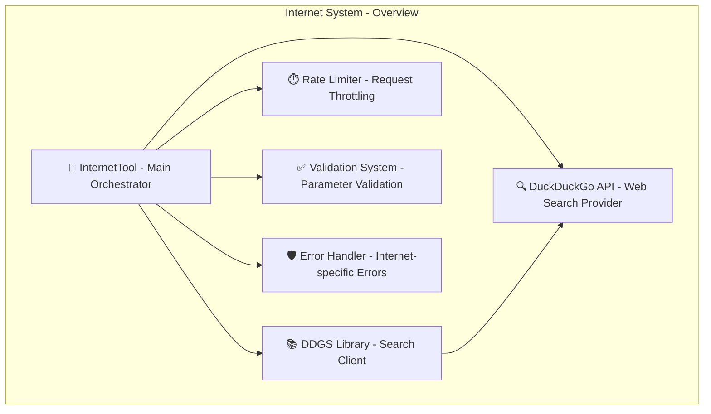
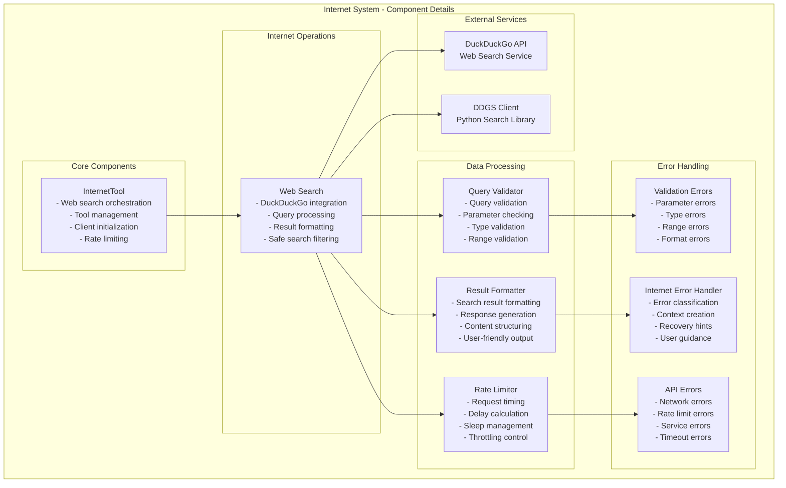
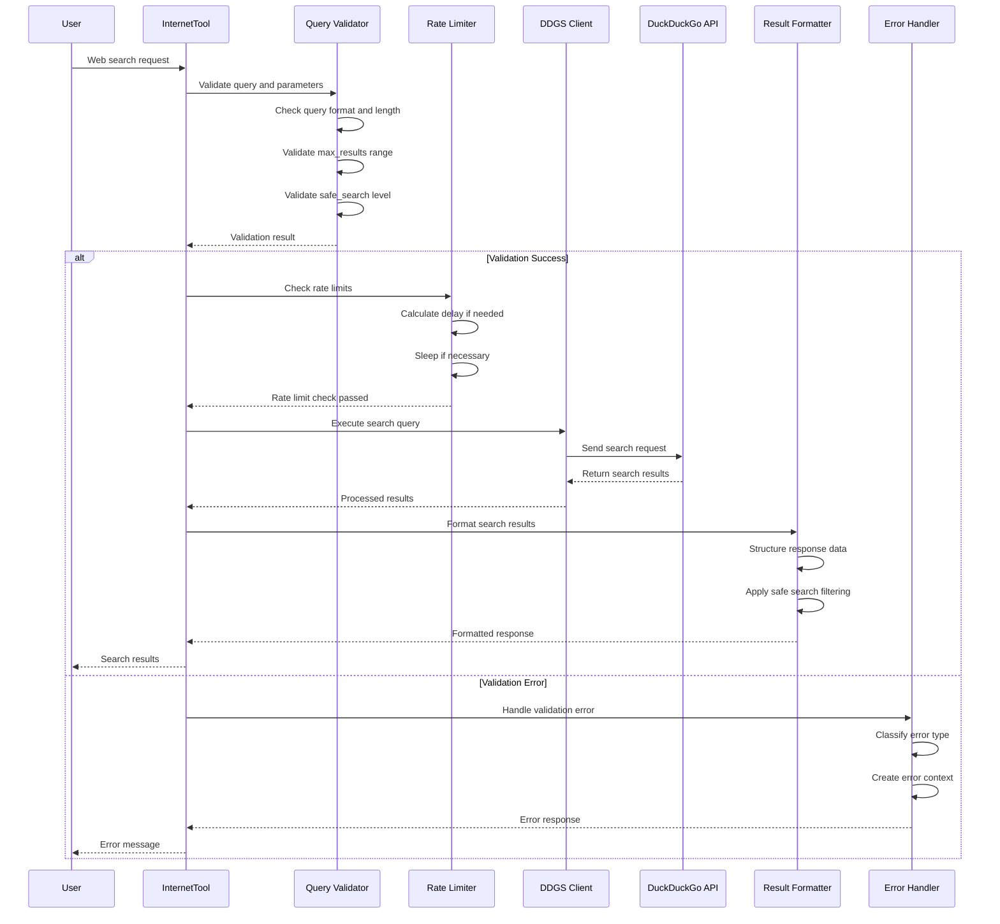
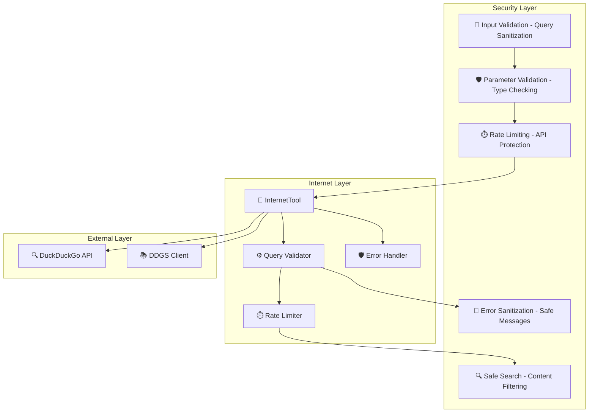

# Internet System Design Documentation

## Service Overview

The Internet System is a comprehensive web search and content processing platform within the Personal Assistant TDAH system. It provides web search capabilities using DuckDuckGo, along with content validation, rate limiting, and error handling for internet-based operations.

### Purpose and Primary Responsibilities

- **Web Search**: DuckDuckGo-powered web search with advanced filtering
- **Content Processing**: Validation and formatting of search results
- **Rate Limiting**: Intelligent rate limiting to prevent API abuse
- **Error Handling**: Comprehensive error handling with internet-specific context
- **Parameter Validation**: Robust validation of search parameters
- **Result Formatting**: User-friendly formatting of search results

### Key Business Logic and Workflows

1. **Web Search Flow**: Query validation → Rate limit check → DuckDuckGo API call → Result processing → Response formatting
2. **Parameter Validation Flow**: Input validation → Type checking → Range validation → Default value assignment
3. **Error Handling Flow**: Error classification → Context creation → Recovery hints → User-friendly response
4. **Rate Limiting Flow**: Request timing → Delay calculation → Sleep execution → Request continuation

### Integration Points and Dependencies

- **DuckDuckGo API**: Primary web search provider
- **DDGS Library**: Python library for DuckDuckGo search
- **Rate Limiting**: Built-in rate limiting mechanism
- **Error Handling**: Centralized error handling with internet-specific context
- **Validation System**: Comprehensive parameter validation

### Performance Characteristics

- **Rate Limiting**: 1-second minimum delay between requests
- **Result Limiting**: Configurable result limits (1-20 results)
- **Safe Search**: Multiple safety levels (strict, moderate, off)
- **Error Recovery**: Graceful error handling with user guidance

### Security Considerations

- **Input Validation**: Comprehensive query and parameter validation
- **Rate Limiting**: Protection against API abuse
- **Safe Search**: Content filtering for appropriate results
- **Error Sanitization**: Safe error message generation
- **Query Sanitization**: Protection against malicious queries

---

## A. Service Overview Diagram



---

## B. Detailed Component Breakdown



---

## C. Data Flow Diagram



---

## D. Security Architecture



---

## Component Details

### InternetTool Class

- **File Location**: `src/personal_assistant/tools/internet/internet_tool.py`
- **Key Methods**:
  - `web_search(query: str, max_results: int, safe_search: str, user_id: int) -> str`: Perform web search using DuckDuckGo
  - `__init__()`: Initialize DuckDuckGo client and rate limiting
  - `__iter__()`: Return iterable collection of available tools
- **Configuration**: Rate limiting settings, search parameters, error handling
- **Error Handling**: Comprehensive error handling with internet-specific context
- **Monitoring**: Search success rates, rate limiting effectiveness, error patterns

### Web Search Functionality

- **Purpose**: DuckDuckGo-powered web search with advanced filtering
- **Key Features**:
  - Query validation and sanitization
  - Configurable result limits (1-20 results)
  - Safe search levels (strict, moderate, off)
  - Rate limiting protection
  - Comprehensive error handling
- **API Integration**: DuckDuckGo API via DDGS library
- **Performance**: Rate limited to prevent API abuse

### Query Validation System

- **Purpose**: Robust validation of search parameters
- **Key Features**:
  - Query format validation
  - Parameter type checking
  - Range validation for numeric parameters
  - Default value assignment
  - Error message generation
- **Validation Rules**: Query length, result limits, safe search levels
- **Error Handling**: Detailed validation error messages

### Result Formatting System

- **Purpose**: User-friendly formatting of search results
- **Key Features**:
  - Structured result presentation
  - Safe search filtering
  - Content organization
  - Response generation
- **Formatting**: Clean, readable search result presentation
- **Filtering**: Safe search content filtering

### Rate Limiting System

- **Purpose**: Protection against API abuse and rate limiting
- **Key Features**:
  - Request timing control
  - Delay calculation and execution
  - Throttling management
  - Performance optimization
- **Rate Limits**: 1-second minimum delay between requests
- **Implementation**: Built-in rate limiting mechanism

### Error Handling System

- **Purpose**: Comprehensive error handling with internet-specific context
- **Key Features**:
  - Error classification and categorization
  - Context creation for debugging
  - Recovery hints for users
  - User-friendly error messages
- **Error Types**: Validation errors, API errors, network errors, rate limit errors
- **Recovery**: Actionable error messages and guidance

---

## Data Models

### Web Search Parameters Structure

```json
{
  "query": "string",
  "max_results": "integer",
  "safe_search": "string",
  "user_id": "integer"
}
```

### Search Result Structure

```json
{
  "title": "string",
  "url": "string",
  "snippet": "string",
  "rank": "integer"
}
```

### Error Response Structure

```json
{
  "error_type": "string",
  "error_message": "string",
  "context": "object",
  "recovery_hints": "array",
  "user_intent": "string"
}
```

### Rate Limiting Structure

```json
{
  "last_request_time": "float",
  "min_delay": "float",
  "current_time": "float",
  "sleep_time": "float"
}
```

### Validation Result Structure

```json
{
  "is_valid": "boolean",
  "error_message": "string",
  "validated_value": "any",
  "validation_type": "string"
}
```

---

## Integration Points

### External API Endpoints

- **DuckDuckGo API**: Web search service endpoint
- **DDGS Library**: Python library for DuckDuckGo integration
- **Rate Limiting**: Built-in rate limiting mechanism

### Library Dependencies

- **ddgs**: DuckDuckGo search library
- **logging**: Python logging system
- **time**: Python time utilities
- **typing**: Python type hints

### Error Handling Integration

- **Centralized Error Handling**: Integration with system-wide error handling
- **Internet-specific Context**: Specialized error context for internet operations
- **Recovery Hints**: User guidance for error resolution

### Validation Integration

- **Parameter Validation**: Comprehensive input validation
- **Type Checking**: Runtime type validation
- **Range Validation**: Numeric parameter range checking
- **Format Validation**: String format validation

---

## Quality Assurance Checklist

- [x] **Completeness**: All major components included
- [x] **Accuracy**: Service names match codebase exactly
- [x] **Consistency**: Follows established color/icon standards
- [x] **Clarity**: Data flow is clear and logical
- [x] **Security**: Security boundaries clearly defined
- [x] **Dependencies**: All service dependencies shown
- [x] **Documentation**: Comprehensive accompanying text
- [x] **Future-proofing**: Extensibility considerations included

---

## Success Criteria

A successful Internet System design diagram will:

- ✅ Clearly show internet architecture and relationships
- ✅ Include all required components and dependencies
- ✅ Follow established visual and documentation standards
- ✅ Provide comprehensive context for future development
- ✅ Enable easy onboarding for new team members
- ✅ Serve as definitive reference for internet understanding

---

## Future Enhancements

### Planned Improvements

- **News Search**: Integration with news APIs for current events
- **Wikipedia Search**: Direct Wikipedia content search
- **Image Search**: Web image search capabilities (currently disabled)
- **Advanced Filtering**: More sophisticated search filters
- **Caching**: Search result caching for performance
- **Analytics**: Search analytics and usage tracking

### Integration Roadmap

- **Additional Search Providers**: Support for multiple search engines
- **Content Processing**: Advanced content analysis and processing
- **Real-time Data**: Integration with real-time data sources
- **Social Media**: Social media search capabilities
- **Academic Sources**: Academic and research paper search
- **Local Search**: Location-based search capabilities

### Performance Optimizations

- **Result Caching**: Intelligent caching of search results
- **Parallel Processing**: Concurrent search requests
- **Response Compression**: Optimized response formatting
- **Connection Pooling**: Efficient API connection management
- **Batch Processing**: Batch search request processing
