# LTM System Design Documentation

## Service Overview

The LTM (Long-Term Memory) System is a comprehensive memory management platform within the Personal Assistant TDAH system. It provides intelligent storage, retrieval, and management of user insights, patterns, preferences, and learning moments, separate from calendar events and notes.

### Purpose and Primary Responsibilities

- **Memory Storage**: Dedicated storage for insights, patterns, and preferences
- **Memory Retrieval**: Intelligent search and retrieval of relevant memories
- **Memory Management**: CRUD operations for LTM entries
- **Context Optimization**: Smart context retrieval for conversations
- **Memory Analytics**: Statistics and insights about stored memories
- **Enhanced Features**: Advanced filtering and relationship mapping

### Key Business Logic and Workflows

1. **Memory Creation Flow**: Content validation → Tag processing → Importance scoring → Database storage → Response formatting
2. **Memory Retrieval Flow**: Query processing → Relevance scoring → Context filtering → Result formatting → Response generation
3. **Memory Search Flow**: Search query → Database query → Result ranking → Context enhancement → Response formatting
4. **Memory Management Flow**: Memory operations → Validation → Database updates → Statistics updates → Response generation

### Integration Points and Dependencies

- **Database**: Dedicated LTM memory storage with PostgreSQL
- **LTM Optimization**: Smart context optimization and retrieval
- **Tag System**: Comprehensive tagging system for memory categorization
- **Context Management**: Enhanced context structures for memory relationships
- **Analytics**: Memory statistics and usage analytics

### Performance Characteristics

- **Smart Retrieval**: Intelligent relevance scoring and context optimization
- **Efficient Storage**: Optimized database operations with proper indexing
- **Context Enhancement**: Advanced context structures for better memory relationships
- **Tag-based Filtering**: Fast tag-based memory filtering and search

### Security Considerations

- **User Isolation**: User-specific memory storage and retrieval
- **Data Validation**: Comprehensive input validation and sanitization
- **Access Control**: Secure memory access with user authentication
- **Privacy Protection**: Secure handling of personal insights and preferences
- **Data Integrity**: Robust data validation and error handling

---

## A. Service Overview Diagram

```mermaid
graph TB
    subgraph "LTM System - Overview"
        LTM_TOOL["🚀 LTMTool - Main Orchestrator"]
        LTM_STORAGE["💾 LTM Storage - Memory Operations"]
        LTM_MANAGER["⚙️ LTM Manager - Context Management"]
        LTM_OPTIMIZATION["🧠 LTM Optimization - Smart Retrieval"]
        DATABASE[("🗄️ Database - LTM Memory Storage")]
        TAG_SYSTEM["🏷️ Tag System - Memory Categorization"]
    end

    LTM_TOOL --> LTM_STORAGE
    LTM_TOOL --> LTM_MANAGER
    LTM_TOOL --> LTM_OPTIMIZATION
    LTM_STORAGE --> DATABASE
    LTM_MANAGER --> TAG_SYSTEM
    LTM_OPTIMIZATION --> DATABASE
```



---

## B. Detailed Component Breakdown


---

## C. Data Flow Diagram


---

## D. Security Architecture

```mermaid
graph TB
    subgraph "Security Layer"
        USER_ISOLATION["👤 User Isolation - User-specific Data"]
        INPUT_VALIDATION["🔐 Input Validation - Content Sanitization"]
        ACCESS_CONTROL["🛡️ Access Control - Memory Access"]
        DATA_INTEGRITY["🔒 Data Integrity - Validation & Consistency"]
        PRIVACY_PROTECTION["🔐 Privacy Protection - Personal Data"]
    end

    subgraph "LTM Layer"
        LTM_TOOL["🚀 LTMTool"]
        MEMORY_PROCESSOR["⚙️ Memory Processor"]
        CONTEXT_OPTIMIZER["🧠 Context Optimizer"]
        LTM_STORAGE["💾 LTM Storage"]
    end

    subgraph "External Layer"
        DATABASE["🗄️ Database"]
        LTM_OPTIMIZATION["🧠 LTM Optimization"]
        CONTEXT_SERVICE["📝 Context Service"]
    end

    USER_ISOLATION --> INPUT_VALIDATION
    INPUT_VALIDATION --> ACCESS_CONTROL
    ACCESS_CONTROL --> LTM_TOOL
    LTM_TOOL --> MEMORY_PROCESSOR
    MEMORY_PROCESSOR --> CONTEXT_OPTIMIZER
    LTM_TOOL --> DATABASE
    LTM_TOOL --> LTM_OPTIMIZATION
    LTM_TOOL --> CONTEXT_SERVICE
    CONTEXT_OPTIMIZER --> DATA_INTEGRITY
    MEMORY_PROCESSOR --> PRIVACY_PROTECTION
    LTM_TOOL --> LTM_STORAGE
```



---

## Component Details

### LTMTool Class

- **File Location**: `src/personal_assistant/tools/ltm/ltm_tool.py`
- **Key Methods**:
  - `add_memory(content: str, tags: str, importance_score: int, context: str, memory_type: str, category: str, confidence_score: float, source_type: str, source_id: str, created_by: str, metadata: dict) -> str`: Add new LTM memory
  - `search_memories(query: str, limit: int, min_importance: int) -> str`: Search LTM memories by content
  - `get_relevant_memories(context: str, limit: int) -> str`: Get memories relevant to conversation context
  - `delete_memory(memory_id: int) -> str`: Delete LTM memory entry
  - `get_stats() -> str`: Get LTM memory statistics
  - `get_enhanced_memories(query: str, memory_type: str, category: str, min_importance: int, limit: int, include_context: bool) -> str`: Get enhanced LTM memories
  - `get_memory_relationships(memory_id: int, relationship_type: str, limit: int) -> str`: Get memory relationships
- **Configuration**: Memory types, categories, importance scoring, tag validation
- **Error Handling**: Comprehensive error handling with LTM-specific context
- **Monitoring**: Memory creation rates, retrieval performance, user engagement

### Memory Storage System

- **Purpose**: Dedicated storage for LTM memories with enhanced features
- **Key Features**:
  - Content validation and sanitization
  - Tag normalization and validation
  - Importance scoring and ranking
  - Enhanced context structures
  - Memory type categorization
  - Confidence scoring
  - Source tracking
  - Metadata support
- **Database Operations**: Optimized CRUD operations with proper indexing
- **Performance**: Efficient storage and retrieval with smart caching

### Context Optimization System

- **Purpose**: Smart context retrieval and optimization for conversations
- **Key Features**:
  - Intelligent relevance scoring
  - Context enhancement and filtering
  - Tag-based memory filtering
  - Smart retrieval algorithms
  - Context relationship mapping
- **AI Integration**: Advanced context optimization using LTM optimization service
- **Performance**: Fast context retrieval with relevance ranking

### Memory Management System

- **Purpose**: Comprehensive memory management and analytics
- **Key Features**:
  - Memory statistics and analytics
  - Usage pattern analysis
  - Category-based insights
  - Performance metrics
  - Memory relationship mapping
- **Analytics**: Detailed memory usage statistics and insights
- **Reporting**: Comprehensive memory analytics and reporting

### Enhanced Memory Features

- **Purpose**: Advanced memory filtering and relationship mapping
- **Key Features**:
  - Memory type filtering (preference, insight, pattern, fact, goal, habit, routine, relationship, skill, knowledge)
  - Category filtering (work, personal, health, finance, travel, education, entertainment, general)
  - Importance-based filtering
  - Context inclusion options
  - Memory relationship mapping
- **Filtering**: Advanced filtering capabilities for precise memory retrieval
- **Relationships**: Memory relationship mapping and network analysis

---

## Data Models

### LTM Memory Structure

```json
{
  "id": "integer",
  "user_id": "integer",
  "content": "string",
  "tags": "array",
  "importance_score": "integer",
  "context": "string",
  "memory_type": "string",
  "category": "string",
  "confidence_score": "float",
  "source_type": "string",
  "source_id": "string",
  "created_by": "string",
  "metadata": "object",
  "created_at": "datetime",
  "updated_at": "datetime"
}
```

### Memory Search Parameters Structure

```json
{
  "query": "string",
  "limit": "integer",
  "min_importance": "integer",
  "memory_type": "string",
  "category": "string",
  "include_context": "boolean"
}
```

### Enhanced Memory Response Structure

```json
{
  "memories": "array",
  "total_count": "integer",
  "filtered_count": "integer",
  "context_info": "object",
  "relationship_data": "object"
}
```

### Memory Statistics Structure

```json
{
  "total_memories": "integer",
  "memory_types": "object",
  "categories": "object",
  "importance_distribution": "object",
  "recent_activity": "object",
  "usage_patterns": "object"
}
```

### Memory Relationship Structure

```json
{
  "memory_id": "integer",
  "related_memories": "array",
  "relationship_types": "array",
  "connection_strength": "float",
  "context_overlap": "object"
}
```

---

## Integration Points

### External API Endpoints

- **Database**: LTM memory storage and retrieval
- **LTM Optimization Service**: Smart context retrieval and optimization
- **Context Service**: Enhanced context management
- **Tag System**: Memory categorization and filtering

### Database Connections

- **PostgreSQL**: LTM memory data, statistics, relationships
- **Redis**: Context cache, search cache, temporary data
- **Session Storage**: User context, search history

### Cache Layer Interactions

- **Memory Cache**: Frequently accessed memories, recent searches
- **Context Cache**: Enhanced context data, relationship mappings
- **Statistics Cache**: Memory analytics, usage patterns

### Background Job Processing

- **Memory Optimization**: Background memory optimization and cleanup
- **Statistics Updates**: Automated statistics calculation and updates
- **Relationship Mapping**: Background relationship analysis and mapping

### Webhook Endpoints

- **Memory Updates**: New memory creation notifications
- **Context Changes**: Context optimization updates
- **Statistics Updates**: Memory statistics updates

---

## Quality Assurance Checklist

- [x] **Completeness**: All major components included
- [x] **Accuracy**: Service names match codebase exactly
- [x] **Consistency**: Follows established color/icon standards
- [x] **Clarity**: Data flow is clear and logical
- [x] **Security**: Security boundaries clearly defined
- [x] **Dependencies**: All service dependencies shown
- [x] **Documentation**: Comprehensive accompanying text
- [x] **Future-proofing**: Extensibility considerations included

---

## Success Criteria

A successful LTM System design diagram will:

- ✅ Clearly show LTM architecture and relationships
- ✅ Include all required components and dependencies
- ✅ Follow established visual and documentation standards
- ✅ Provide comprehensive context for future development
- ✅ Enable easy onboarding for new team members
- ✅ Serve as definitive reference for LTM understanding

---

## Future Enhancements

### Planned Improvements

- **AI-Powered Insights**: Machine learning-based memory insights and patterns
- **Memory Clustering**: Automatic memory clustering and grouping
- **Predictive Retrieval**: Predictive memory retrieval based on context
- **Memory Synthesis**: Automatic memory synthesis and summarization
- **Advanced Analytics**: Deep learning-based memory analytics
- **Memory Visualization**: Interactive memory relationship visualization

### Integration Roadmap

- **Additional Memory Types**: Support for more memory types and categories
- **Cross-Platform Sync**: Memory synchronization across devices
- **External Integrations**: Integration with external memory systems
- **Social Features**: Memory sharing and collaboration features
- **Advanced Search**: Semantic search and natural language querying
- **Memory Automation**: Automated memory creation and management

### Performance Optimizations

- **Memory Compression**: Intelligent memory compression and storage
- **Parallel Processing**: Concurrent memory operations
- **Advanced Caching**: Multi-level caching for memory retrieval
- **Database Optimization**: Advanced database indexing and optimization
- **Real-time Updates**: Real-time memory updates and notifications
