# Metadata System Design Documentation

## Service Overview

The Metadata System is a comprehensive tool metadata management platform within the Personal Assistant TDAH system. It provides enhanced metadata for tools to improve AI understanding, tool selection capabilities, parameter suggestions, and intelligent workflow guidance.

### Purpose and Primary Responsibilities

- **Tool Metadata Management**: Comprehensive metadata storage and management for all tools
- **AI Enhancement**: AI-specific enhancements and guidance for better tool understanding
- **Tool Selection**: Intelligent tool selection based on metadata and context
- **Parameter Guidance**: Smart parameter suggestions and validation
- **Use Case Documentation**: Detailed use cases and examples for each tool
- **Workflow Optimization**: Intelligent workflow suggestions and tool relationships

### Key Business Logic and Workflows

1. **Metadata Creation Flow**: Tool analysis → Metadata generation → AI enhancement → Validation → Storage
2. **Tool Selection Flow**: User intent analysis → Metadata query → Tool matching → Selection ranking → Recommendation
3. **Parameter Guidance Flow**: Tool selection → Parameter analysis → Suggestion generation → Validation → Guidance
4. **AI Enhancement Flow**: Tool metadata → AI analysis → Enhancement generation → Integration → Optimization

### Integration Points and Dependencies

- **Tool Registry**: Integration with all system tools for metadata collection
- **AI Assistant**: Enhanced AI understanding through metadata and enhancements
- **Parameter Validation**: Integration with tool parameter validation systems
- **Workflow Engine**: Tool relationship and workflow optimization
- **Analytics**: Metadata usage analytics and optimization

### Performance Characteristics

- **Fast Retrieval**: Optimized metadata storage and retrieval with indexing
- **Intelligent Caching**: Smart caching for frequently accessed metadata
- **Efficient Search**: Fast tool search and filtering capabilities
- **Real-time Updates**: Dynamic metadata updates and synchronization

### Security Considerations

- **Data Validation**: Comprehensive metadata validation and sanitization
- **Access Control**: Secure metadata access with proper permissions
- **Version Control**: Metadata versioning and change tracking
- **Integrity Protection**: Data integrity validation and consistency checks
- **Privacy Protection**: Secure handling of tool usage patterns and analytics

---

## A. Service Overview Diagram

```mermaid
graph TB
    subgraph "Metadata System - Overview"
        METADATA_MANAGER["🚀 ToolMetadataManager - Main Orchestrator"]
        AI_ENHANCEMENT_MANAGER["🧠 AIEnhancementManager - AI Optimization"]
        TOOL_METADATA["📋 ToolMetadata - Metadata Storage"]
        AI_ENHANCEMENTS["⚡ AIEnhancements - AI Guidance"]
        TOOL_REGISTRY["🔧 Tool Registry - Tool Integration"]
        ANALYTICS["📊 Analytics - Usage Tracking"]
    end

    METADATA_MANAGER --> TOOL_METADATA
    METADATA_MANAGER --> AI_ENHANCEMENT_MANAGER
    AI_ENHANCEMENT_MANAGER --> AI_ENHANCEMENTS
    METADATA_MANAGER --> TOOL_REGISTRY
    METADATA_MANAGER --> ANALYTICS
    TOOL_REGISTRY --> TOOL_METADATA
```



---

## B. Detailed Component Breakdown


---

## C. Data Flow Diagram


---

## D. Security Architecture

```mermaid
graph TB
    subgraph "Security Layer"
        DATA_VALIDATION["🔐 Data Validation - Metadata Sanitization"]
        ACCESS_CONTROL["🛡️ Access Control - Metadata Access"]
        VERSION_CONTROL["📝 Version Control - Change Tracking"]
        INTEGRITY_PROTECTION["🔒 Integrity Protection - Data Consistency"]
        PRIVACY_PROTECTION["🔐 Privacy Protection - Usage Analytics"]
    end

    subgraph "Metadata Layer"
        METADATA_MANAGER["🚀 MetadataManager"]
        METADATA_PROCESSOR["⚙️ Metadata Processor"]
        ENHANCEMENT_PROCESSOR["🧠 Enhancement Processor"]
        SEARCH_ENGINE["🔍 Search Engine"]
    end

    subgraph "External Layer"
        TOOL_REGISTRY["🔧 Tool Registry"]
        AI_ASSISTANT["🧠 AI Assistant"]
        ANALYTICS["📊 Analytics"]
    end

    DATA_VALIDATION --> ACCESS_CONTROL
    ACCESS_CONTROL --> VERSION_CONTROL
    VERSION_CONTROL --> METADATA_MANAGER
    METADATA_MANAGER --> METADATA_PROCESSOR
    METADATA_PROCESSOR --> ENHANCEMENT_PROCESSOR
    METADATA_MANAGER --> TOOL_REGISTRY
    METADATA_MANAGER --> AI_ASSISTANT
    METADATA_MANAGER --> ANALYTICS
    ENHANCEMENT_PROCESSOR --> INTEGRITY_PROTECTION
    SEARCH_ENGINE --> PRIVACY_PROTECTION
```



---

## Component Details

### ToolMetadataManager Class

- **File Location**: `src/personal_assistant/tools/metadata/tool_metadata.py`
- **Key Methods**:
  - `register_tool_metadata(metadata: ToolMetadata)`: Register metadata for a tool
  - `get_tool_metadata(tool_name: str) -> Optional[ToolMetadata]`: Get metadata for a specific tool
  - `get_tools_by_category(category: ToolCategory) -> List[ToolMetadata]`: Get all tools in a specific category
  - `get_tools_by_complexity(complexity: ToolComplexity) -> List[ToolMetadata]`: Get tools by complexity level
  - `search_tools(query: str) -> List[ToolMetadata]`: Search tools by query
- **Configuration**: Metadata store, category indexing, search capabilities
- **Error Handling**: Comprehensive error handling with metadata-specific context
- **Monitoring**: Metadata usage patterns, search performance, tool selection accuracy

### ToolMetadata Class

- **Purpose**: Enhanced metadata for tools to improve AI understanding
- **Key Features**:
  - Tool information (name, version, description, category, complexity)
  - Use cases with examples and expected outcomes
  - Tool relationships (related, complementary, conflicting tools)
  - Performance metrics (execution time, success rate, rate limits)
  - AI guidance (instructions, parameter guidance, best practices)
  - Metadata management (creation, updates, versioning)
- **Data Structures**: Use cases, examples, prerequisites, relationships
- **AI Integration**: AI-specific guidance and enhancement support

### AIEnhancementManager Class

- **Purpose**: AI-specific enhancements and guidance management
- **Key Features**:
  - Enhancement creation and management
  - Priority-based enhancement processing
  - AI guidance generation
  - Enhancement optimization
  - Integration with tool metadata
- **Enhancement Types**: Parameter suggestions, intent recognition, tool selection, workflow suggestions
- **Priority Levels**: Low, medium, high, critical
- **AI Integration**: Advanced AI understanding and optimization

### Tool-Specific Metadata Components

- **Note Metadata**: Note tool metadata with note-specific use cases and examples
- **Email Metadata**: Email tool metadata with email-specific use cases and examples
- **Todo Metadata**: Todo tool metadata with todo-specific use cases and examples
- **Grocery Metadata**: Grocery tool metadata with grocery-specific use cases and examples
- **AI Task Metadata**: AI task tool metadata with AI task-specific use cases and examples
- **Internet Metadata**: Internet tool metadata with internet-specific use cases and examples

### AI Enhancement Types

- **Parameter Suggestions**: Smart parameter hints, validation rules, type suggestions, range recommendations
- **Intent Recognition**: User intent analysis, tool matching, context understanding, intent classification
- **Tool Selection**: Intelligent tool matching, context-based selection, tool ranking, selection optimization
- **Workflow Suggestions**: Workflow optimization, tool relationships, sequential guidance, process improvement
- **Error Prevention**: Error prevention strategies, validation rules, error handling guidance
- **Conversational Guidance**: Conversational AI guidance, context-aware suggestions, user interaction optimization

---

## Data Models

### ToolMetadata Structure

```json
{
  "tool_name": "string",
  "tool_version": "string",
  "description": "string",
  "category": "string",
  "complexity": "string",
  "use_cases": "array",
  "examples": "array",
  "prerequisites": "array",
  "related_tools": "array",
  "complementary_tools": "array",
  "conflicting_tools": "array",
  "execution_time": "string",
  "success_rate": "float",
  "rate_limits": "string",
  "retry_strategy": "string",
  "ai_instructions": "string",
  "parameter_guidance": "object",
  "common_mistakes": "array",
  "best_practices": "array",
  "created_at": "datetime",
  "updated_at": "datetime",
  "metadata_version": "string"
}
```

### ToolUseCase Structure

```json
{
  "name": "string",
  "description": "string",
  "example_request": "string",
  "example_parameters": "object",
  "expected_outcome": "string",
  "success_indicators": "array",
  "failure_modes": "array",
  "prerequisites": "array"
}
```

### ToolExample Structure

```json
{
  "description": "string",
  "user_request": "string",
  "parameters": "object",
  "expected_result": "string",
  "notes": "string"
}
```

### AIEnhancement Structure

```json
{
  "enhancement_id": "string",
  "tool_name": "string",
  "enhancement_type": "string",
  "priority": "string",
  "enhancement_content": "object",
  "conditions": "array",
  "triggers": "array",
  "expected_impact": "string",
  "created_at": "datetime",
  "updated_at": "datetime"
}
```

### ToolCategory Structure

```json
{
  "category": "string",
  "description": "string",
  "tools": "array",
  "complexity_levels": "array",
  "common_use_cases": "array"
}
```

---

## Integration Points

### External API Endpoints

- **Tool Registry**: Integration with all system tools for metadata collection
- **AI Assistant**: Enhanced AI understanding through metadata and enhancements
- **Parameter Validation**: Integration with tool parameter validation systems
- **Workflow Engine**: Tool relationship and workflow optimization

### Database Connections

- **Metadata Store**: Tool metadata storage and retrieval
- **Enhancement Store**: AI enhancement storage and management
- **Category Index**: Tool categorization and indexing
- **Usage Analytics**: Metadata usage tracking and analytics

### Cache Layer Interactions

- **Metadata Cache**: Frequently accessed metadata, tool information
- **Enhancement Cache**: AI enhancements, guidance data
- **Search Cache**: Tool search results, category filters
- **Analytics Cache**: Usage patterns, performance metrics

### Background Job Processing

- **Metadata Updates**: Automated metadata updates and synchronization
- **Enhancement Optimization**: Background enhancement optimization
- **Analytics Processing**: Usage analytics calculation and reporting
- **Index Maintenance**: Category index maintenance and optimization

### Webhook Endpoints

- **Tool Registration**: New tool registration notifications
- **Metadata Updates**: Metadata change notifications
- **Enhancement Updates**: AI enhancement updates
- **Analytics Updates**: Usage analytics updates

---

## Quality Assurance Checklist

- [x] **Completeness**: All major components included
- [x] **Accuracy**: Service names match codebase exactly
- [x] **Consistency**: Follows established color/icon standards
- [x] **Clarity**: Data flow is clear and logical
- [x] **Security**: Security boundaries clearly defined
- [x] **Dependencies**: All service dependencies shown
- [x] **Documentation**: Comprehensive accompanying text
- [x] **Future-proofing**: Extensibility considerations included

---

## Success Criteria

A successful Metadata System design diagram will:

- ✅ Clearly show metadata architecture and relationships
- ✅ Include all required components and dependencies
- ✅ Follow established visual and documentation standards
- ✅ Provide comprehensive context for future development
- ✅ Enable easy onboarding for new team members
- ✅ Serve as definitive reference for metadata understanding

---

## Future Enhancements

### Planned Improvements

- **Machine Learning Integration**: ML-based tool selection and parameter optimization
- **Advanced Analytics**: Deep learning-based usage analytics and insights
- **Dynamic Metadata**: Real-time metadata updates based on usage patterns
- **Predictive Enhancement**: Predictive AI enhancement generation
- **Cross-Tool Optimization**: Advanced cross-tool relationship optimization
- **Intelligent Caching**: AI-powered metadata caching and optimization

### Integration Roadmap

- **Additional Tools**: Support for more tool types and categories
- **External Integrations**: Integration with external tool metadata systems
- **API Standardization**: Standardized metadata API for external tools
- **Advanced Search**: Semantic search and natural language querying
- **Real-time Updates**: Real-time metadata synchronization
- **Performance Optimization**: Advanced performance optimization and caching

### Performance Optimizations

- **Metadata Compression**: Intelligent metadata compression and storage
- **Parallel Processing**: Concurrent metadata operations
- **Advanced Indexing**: Multi-dimensional indexing for fast retrieval
- **Smart Caching**: Intelligent caching strategies for metadata
- **Query Optimization**: Advanced query optimization and execution
- **Real-time Analytics**: Real-time usage analytics and reporting
