# Reminders System Design Documentation

## Service Overview

The Reminders System is an AI-driven task management platform within the Personal Assistant TDAH system. It provides comprehensive functionality for creating, managing, and scheduling AI tasks and reminders with multiple notification channels and scheduling options.

### Purpose and Primary Responsibilities

- **Reminder Creation**: Create AI-driven reminders and tasks with flexible scheduling
- **Task Management**: Comprehensive CRUD operations for reminders and tasks
- **Scheduling**: Multiple scheduling types (once, daily, weekly, monthly, custom)
- **Notification Channels**: Multi-channel notifications (SMS, email, push)
- **Time Parsing**: Intelligent parsing of various time formats
- **Task Types**: Support for reminders, automated tasks, and periodic tasks

### Key Business Logic and Workflows

1. **Reminder Creation Flow**: Input validation → Time parsing → Schedule configuration → Task creation → Response formatting
2. **Task Management Flow**: Task operations → Validation → Database updates → Response formatting
3. **Time Parsing Flow**: Time string analysis → Format detection → DateTime conversion → Validation
4. **Scheduling Flow**: Schedule type analysis → Configuration creation → Next run calculation → Task scheduling

### Integration Points and Dependencies

- **AI Scheduler**: Integration with AITaskManager for task scheduling and execution
- **Database**: Task storage and retrieval through AITaskManager
- **Notification System**: Multi-channel notification delivery
- **Time Processing**: Intelligent time parsing and scheduling
- **Task Validation**: Comprehensive input validation and error handling

### Performance Characteristics

- **Flexible Scheduling**: Multiple scheduling types with intelligent configuration
- **Time Parsing**: Support for various time formats (ISO, relative, natural language)
- **Task Management**: Efficient CRUD operations with proper validation
- **Notification Delivery**: Multi-channel notification support

### Security Considerations

- **Input Validation**: Comprehensive validation of reminder inputs and parameters
- **User Isolation**: User-specific reminder storage and management
- **Time Validation**: Secure time parsing and validation
- **Error Handling**: Safe error message generation and logging
- **Data Protection**: Secure handling of reminder data and user information

---

## A. Service Overview Diagram

```mermaid
graph TB
    subgraph "Reminders System - Overview"
        REMINDER_TOOL["🚀 ReminderTool - Main Orchestrator"]
        AI_TASK_MANAGER["⚙️ AITaskManager - Task Management"]
        REMINDER_INTERNAL["🔧 ReminderInternal - Helper Functions"]
        NOTIFICATION_SYSTEM["📱 Notification System - Multi-channel"]
        TIME_PARSER["⏰ Time Parser - Time Processing"]
        DATABASE[("💾 Database - Task Storage")]
    end

    REMINDER_TOOL --> AI_TASK_MANAGER
    REMINDER_TOOL --> REMINDER_INTERNAL
    AI_TASK_MANAGER --> DATABASE
    AI_TASK_MANAGER --> NOTIFICATION_SYSTEM
    REMINDER_INTERNAL --> TIME_PARSER
```



---

## B. Detailed Component Breakdown


---

## C. Data Flow Diagram


---

## D. Security Architecture

```mermaid
graph TB
    subgraph "Security Layer"
        INPUT_VALIDATION["🔐 Input Validation - Parameter Sanitization"]
        USER_ISOLATION["👤 User Isolation - User-specific Data"]
        TIME_VALIDATION["⏰ Time Validation - Secure Time Parsing"]
        ERROR_SANITIZATION["📝 Error Sanitization - Safe Messages"]
        DATA_PROTECTION["🔒 Data Protection - Secure Data Access"]
    end

    subgraph "Reminders Layer"
        REMINDER_TOOL["🚀 ReminderTool"]
        TIME_PARSER["⚙️ Time Parser"]
        VALIDATOR["🔍 Validator"]
        RESPONSE_FORMATTER["📋 Response Formatter"]
    end

    subgraph "External Layer"
        AI_TASK_MANAGER["⚙️ AITaskManager"]
        DATABASE["💾 Database"]
        NOTIFICATION_SERVICE["📱 Notification Service"]
    end

    INPUT_VALIDATION --> USER_ISOLATION
    USER_ISOLATION --> TIME_VALIDATION
    TIME_VALIDATION --> REMINDER_TOOL
    REMINDER_TOOL --> TIME_PARSER
    TIME_PARSER --> VALIDATOR
    REMINDER_TOOL --> AI_TASK_MANAGER
    REMINDER_TOOL --> DATABASE
    REMINDER_TOOL --> NOTIFICATION_SERVICE
    VALIDATOR --> ERROR_SANITIZATION
    RESPONSE_FORMATTER --> DATA_PROTECTION
```



---

## Component Details

### ReminderTool Class

- **File Location**: `src/personal_assistant/tools/reminders/reminder_tool.py`
- **Key Methods**:
  - `create_reminder(text: str, time: str, channel: str, task_type: str, schedule_type: str, user_id: int) -> str`: Create new reminder or task
  - `list_reminders(status: str, user_id: int) -> str`: List user reminders with status filtering
  - `delete_reminder(reminder_id: int, user_id: int) -> str`: Delete reminder or task
  - `update_reminder(reminder_id: int, text: str, time: str, channel: str, task_type: str, schedule_type: str, user_id: int) -> str`: Update existing reminder
- **Configuration**: Task manager integration, validation settings, response formatting
- **Error Handling**: Comprehensive error handling with user-friendly messages
- **Monitoring**: Reminder creation rates, task management performance, user engagement

### Reminder Operations

- **Purpose**: Comprehensive reminder and task management
- **Key Features**:
  - Flexible reminder creation with multiple scheduling options
  - Status-based filtering and task listing
  - Complete CRUD operations for reminders
  - Multi-channel notification support
  - Intelligent time parsing and validation
- **Task Types**: Reminder, automated task, periodic task
- **Scheduling**: Once, daily, weekly, monthly, custom

### Time Parsing System

- **Purpose**: Intelligent parsing of various time formats
- **Key Features**:
  - ISO format parsing (YYYY-MM-DDTHH:MM:SS)
  - Relative time parsing ("in 1 hour", "tomorrow at 9am")
  - Natural language time parsing
  - DateTime conversion and validation
- **Format Support**: Multiple time formats with intelligent detection
- **Validation**: Comprehensive time validation and error handling

### Schedule Configuration System

- **Purpose**: Flexible scheduling configuration for different task types
- **Key Features**:
  - Schedule type analysis and configuration
  - Next run time calculation
  - Recurring schedule management
  - Custom schedule support
- **Schedule Types**: Once, daily, weekly, monthly, custom
- **Configuration**: Intelligent configuration based on schedule type

### Task Types

- **One-time Reminder**: Single execution with time-based scheduling
- **Periodic Task**: Recurring execution with schedule-based timing
- **Automated Task**: AI-driven execution with automated processing
- **Task Management**: Complete lifecycle management for all task types

### Notification Channels

- **SMS**: Text message notifications
- **Email**: Email notifications
- **Push**: Push notification support
- **Multi-channel**: Support for multiple notification channels

---

## Data Models

### Reminder Creation Structure

```json
{
  "text": "string",
  "time": "string",
  "channel": "string",
  "task_type": "string",
  "schedule_type": "string",
  "user_id": "integer"
}
```

### Task Structure

```json
{
  "id": "integer",
  "user_id": "integer",
  "title": "string",
  "description": "string",
  "task_type": "string",
  "schedule_type": "string",
  "schedule_config": "object",
  "next_run_at": "datetime",
  "status": "string",
  "notification_channels": "array",
  "created_at": "datetime",
  "updated_at": "datetime"
}
```

### Schedule Configuration Structure

```json
{
  "schedule_type": "string",
  "run_at": "datetime",
  "hour": "integer",
  "minute": "integer",
  "weekdays": "array",
  "day": "integer",
  "interval_minutes": "integer"
}
```

### Time Parsing Structure

```json
{
  "time_string": "string",
  "parsed_time": "datetime",
  "format_type": "string",
  "is_valid": "boolean",
  "error_message": "string"
}
```

### Reminder List Structure

```json
{
  "status": "string",
  "tasks": "array",
  "total_count": "integer",
  "formatted_response": "string"
}
```

---

## Integration Points

### External API Endpoints

- **AI Scheduler**: Task scheduling and execution through AITaskManager
- **Database**: Task storage and retrieval
- **Notification Service**: Multi-channel notification delivery

### Database Connections

- **Task Storage**: AI tasks and reminders storage
- **Schedule Data**: Scheduling configurations and metadata
- **User Data**: User-specific task data and preferences

### Cache Layer Interactions

- **Task Cache**: Frequently accessed tasks, recent reminders
- **Schedule Cache**: Schedule configurations, next run times
- **User Cache**: User preferences, notification settings

### Background Job Processing

- **Task Execution**: Automated task execution and processing
- **Notification Delivery**: Scheduled notification delivery
- **Schedule Updates**: Schedule configuration updates and maintenance

### Webhook Endpoints

- **Task Updates**: Task status change notifications
- **Schedule Changes**: Schedule modification notifications
- **Notification Delivery**: Notification delivery status updates

---

## Quality Assurance Checklist

- [x] **Completeness**: All major components included
- [x] **Accuracy**: Service names match codebase exactly
- [x] **Consistency**: Follows established color/icon standards
- [x] **Clarity**: Data flow is clear and logical
- [x] **Security**: Security boundaries clearly defined
- [x] **Dependencies**: All service dependencies shown
- [x] **Documentation**: Comprehensive accompanying text
- [x] **Future-proofing**: Extensibility considerations included

---

## Success Criteria

A successful Reminders System design diagram will:

- ✅ Clearly show reminders architecture and relationships
- ✅ Include all required components and dependencies
- ✅ Follow established visual and documentation standards
- ✅ Provide comprehensive context for future development
- ✅ Enable easy onboarding for new team members
- ✅ Serve as definitive reference for reminders understanding

---

## Future Enhancements

### Planned Improvements

- **Smart Scheduling**: AI-powered optimal scheduling suggestions
- **Advanced Notifications**: Rich notifications with actions and responses
- **Task Dependencies**: Task dependency management and workflow support
- **Location-based Reminders**: Location-triggered reminders and tasks
- **Voice Reminders**: Voice-based reminder creation and management
- **Collaborative Reminders**: Shared reminders and team task management

### Integration Roadmap

- **Calendar Integration**: Integration with calendar systems for scheduling
- **External Task Managers**: Integration with external task management systems
- **IoT Integration**: Integration with IoT devices for smart reminders
- **Mobile Apps**: Mobile app integration for enhanced reminder management
- **API Standardization**: Standardized APIs for external reminder integration
- **Real-time Updates**: Real-time reminder updates and synchronization

### Performance Optimizations

- **Intelligent Caching**: Smart caching for frequently accessed reminders
- **Batch Processing**: Batch reminder processing and optimization
- **Advanced Scheduling**: Optimized scheduling algorithms and processing
- **Notification Optimization**: Efficient notification delivery and management
- **Database Optimization**: Advanced database indexing and query optimization
- **Real-time Processing**: Real-time reminder processing and updates
