# Todos System Design Documentation

## Service Overview

The Todos System is a comprehensive task management platform within the Personal Assistant TDAH system. It provides enhanced todo management with advanced features including missed task counting, automatic task segmentation using LLM, behavioral analytics, and ADHD-specific productivity features.

### Purpose and Primary Responsibilities

- **Task Management**: Comprehensive CRUD operations for todos and subtasks
- **Missed Task Tracking**: Automatic tracking of missed tasks and threshold detection
- **Intelligent Segmentation**: LLM-powered task breakdown for complex tasks
- **Behavioral Analytics**: Analysis of user patterns and productivity insights
- **ADHD Support**: Specialized features for ADHD-specific productivity needs
- **Overdue Detection**: Automatic detection and management of overdue tasks

### Key Business Logic and Workflows

1. **Task Creation Flow**: Input validation → Task creation → Database storage → Response formatting
2. **Missed Task Flow**: Overdue detection → Missed counter increment → Threshold check → Segmentation trigger
3. **Segmentation Flow**: Task analysis → LLM processing → Subtask creation → Parent task update
4. **Analytics Flow**: Data collection → Pattern analysis → Insight generation → Report formatting

### Integration Points and Dependencies

- **Database**: Todo storage and retrieval through PostgreSQL
- **LLM Service**: AI-powered task segmentation and analysis
- **Analytics Engine**: Behavioral pattern analysis and insights
- **Missed Counter**: Threshold detection and segmentation triggers
- **Segmentation Engine**: Intelligent task breakdown system

### Performance Characteristics

- **Intelligent Segmentation**: LLM-powered task breakdown for better completion rates
- **Behavioral Analytics**: Real-time analysis of user patterns and productivity
- **Missed Task Management**: Automatic tracking and intervention for missed tasks
- **ADHD Optimization**: Specialized features for ADHD-specific productivity needs

### Security Considerations

- **User Isolation**: User-specific todo storage and management
- **Input Validation**: Comprehensive validation of todo inputs and parameters
- **Data Protection**: Secure handling of personal task data
- **Error Handling**: Safe error message generation and logging
- **Access Control**: Secure todo access with proper user authentication

---

## A. Service Overview Diagram

```mermaid
graph TB
    subgraph "Todos System - Overview"
        TODO_TOOL["🚀 TodoTool - Main Orchestrator"]
        MISSED_COUNTER["📊 MissedCounterManager - Threshold Detection"]
        SEGMENTATION_ENGINE["🧠 SegmentationEngine - LLM Task Breakdown"]
        BEHAVIORAL_ANALYTICS["📈 BehavioralAnalytics - Pattern Analysis"]
        DATABASE[("💾 Database - Todo Storage")]
        LLM_SERVICE["🤖 LLM Service - AI Processing"]
    end

    TODO_TOOL --> MISSED_COUNTER
    TODO_TOOL --> SEGMENTATION_ENGINE
    TODO_TOOL --> BEHAVIORAL_ANALYTICS
    TODO_TOOL --> DATABASE
    MISSED_COUNTER --> SEGMENTATION_ENGINE
    SEGMENTATION_ENGINE --> LLM_SERVICE
    BEHAVIORAL_ANALYTICS --> DATABASE
```



---

## B. Detailed Component Breakdown


---

## C. Data Flow Diagram


---

## D. Security Architecture

```mermaid
graph TB
    subgraph "Security Layer"
        USER_ISOLATION["👤 User Isolation - User-specific Data"]
        INPUT_VALIDATION["🔐 Input Validation - Parameter Sanitization"]
        DATA_PROTECTION["🔒 Data Protection - Secure Data Access"]
        ERROR_SANITIZATION["📝 Error Sanitization - Safe Messages"]
        ACCESS_CONTROL["🛡️ Access Control - Task Access"]
    end

    subgraph "Todos Layer"
        TODO_TOOL["🚀 TodoTool"]
        MISSED_COUNTER["📊 MissedCounter"]
        SEGMENTATION_ENGINE["🧠 SegmentationEngine"]
        BEHAVIORAL_ANALYTICS["📈 BehavioralAnalytics"]
    end

    subgraph "External Layer"
        DATABASE["💾 Database"]
        LLM_SERVICE["🤖 LLM Service"]
        ANALYTICS_SERVICE["📊 Analytics Service"]
    end

    USER_ISOLATION --> INPUT_VALIDATION
    INPUT_VALIDATION --> DATA_PROTECTION
    DATA_PROTECTION --> TODO_TOOL
    TODO_TOOL --> MISSED_COUNTER
    MISSED_COUNTER --> SEGMENTATION_ENGINE
    TODO_TOOL --> DATABASE
    TODO_TOOL --> LLM_SERVICE
    TODO_TOOL --> ANALYTICS_SERVICE
    SEGMENTATION_ENGINE --> ERROR_SANITIZATION
    BEHAVIORAL_ANALYTICS --> ACCESS_CONTROL
```



---

## Component Details

### TodoTool Class

- **File Location**: `src/personal_assistant/tools/todos/todo_tool.py`
- **Key Methods**:
  - `create_todo(user_id: int, title: str, description: str, due_date: str, priority: str, category: str) -> Dict[str, Any]`: Create new todo
  - `get_todos(user_id: int, status: str, category: str, priority: str, include_subtasks: bool) -> Dict[str, Any]`: Get todos with filtering
  - `update_todo(todo_id: int, user_id: int, title: str, description: str, due_date: datetime, priority: str, category: str, status: str) -> Dict[str, Any]`: Update existing todo
  - `delete_todo(todo_id: int, user_id: int) -> Dict[str, Any]`: Delete todo
  - `complete_todo(todo_id: int, user_id: int) -> Dict[str, Any]`: Mark todo as completed
  - `get_overdue_todos(user_id: int) -> Dict[str, Any]`: Get overdue todos
  - `get_todo_stats(user_id: int) -> Dict[str, Any]`: Get todo statistics
  - `get_analytics(user_id: int) -> Dict[str, Any]`: Get behavioral analytics
- **Configuration**: Database integration, validation settings, response formatting
- **Error Handling**: Comprehensive error handling with user-friendly messages
- **Monitoring**: Todo creation rates, completion rates, user engagement

### MissedCounterManager Class

- **Purpose**: Track missed tasks and trigger segmentation when thresholds are reached
- **Key Features**:
  - Overdue task detection and tracking
  - Missed counter increment and management
  - Threshold detection and segmentation triggers
  - Automatic intervention for repeatedly missed tasks
- **Threshold Management**: Configurable thresholds for segmentation triggers
- **Integration**: Seamless integration with segmentation engine

### SegmentationEngine Class

- **Purpose**: Intelligent task segmentation using LLM to break down complex tasks
- **Key Features**:
  - LLM-powered task analysis and breakdown
  - Subtask creation and relationship management
  - Parent task status updates
  - Intelligent segmentation based on task complexity
- **LLM Integration**: Advanced LLM analysis for optimal task breakdown
- **Relationship Management**: Parent-child task relationship handling

### BehavioralAnalytics Class

- **Purpose**: Analyze user behavior patterns and generate productivity insights
- **Key Features**:
  - Completion pattern analysis
  - Missed task pattern recognition
  - Optimal timing identification
  - Category performance analysis
  - Segmentation effectiveness analysis
  - Productivity trend analysis
- **Analytics**: Comprehensive behavioral analysis and insights
- **Reporting**: Detailed analytics reports and recommendations

### Todo Operations

- **Create Todo**: Input validation, date parsing, database storage, response formatting
- **Get Todos**: Filtering options, status filtering, category filtering, priority filtering
- **Update Todo**: Task validation, parameter updates, database updates, response formatting
- **Delete Todo**: Task validation, database removal, response confirmation, error handling
- **Complete Todo**: Status update, completion tracking, analytics update, response formatting

### Advanced Features

- **Overdue Detection**: Automatic detection of overdue tasks with missed counter management
- **Task Segmentation**: LLM-powered task breakdown for better completion rates
- **Behavioral Analysis**: Real-time analysis of user patterns and productivity insights
- **Analytics Reporting**: Comprehensive analytics and reporting for productivity improvement

---

## Data Models

### Todo Structure

```json
{
  "id": "integer",
  "user_id": "integer",
  "title": "string",
  "description": "string",
  "due_date": "datetime",
  "priority": "string",
  "category": "string",
  "status": "string",
  "missed_count": "integer",
  "parent_task_id": "integer",
  "created_at": "datetime",
  "updated_at": "datetime"
}
```

### Todo Creation Structure

```json
{
  "user_id": "integer",
  "title": "string",
  "description": "string",
  "due_date": "string",
  "priority": "string",
  "category": "string"
}
```

### Analytics Structure

```json
{
  "completion_rate": "float",
  "missed_patterns": "object",
  "optimal_timing": "object",
  "category_performance": "object",
  "segmentation_effectiveness": "object",
  "productivity_trends": "object",
  "total_todos": "integer",
  "analysis_date": "datetime"
}
```

### Segmentation Structure

```json
{
  "parent_task_id": "integer",
  "subtasks": "array",
  "segmentation_reason": "string",
  "threshold_reached": "boolean",
  "created_at": "datetime"
}
```

### Missed Counter Structure

```json
{
  "todo_id": "integer",
  "missed_count": "integer",
  "threshold": "integer",
  "last_missed": "datetime",
  "segmentation_triggered": "boolean"
}
```

---

## Integration Points

### External API Endpoints

- **Database**: Todo storage and retrieval through PostgreSQL
- **LLM Service**: AI-powered task segmentation and analysis
- **Analytics Service**: Behavioral pattern analysis and insights

### Database Connections

- **Todo Storage**: Tasks, subtasks, and relationships
- **Analytics Data**: Behavioral patterns and performance metrics
- **Missed Counters**: Threshold tracking and segmentation triggers
- **Segmentation Data**: Task breakdowns and relationships

### Cache Layer Interactions

- **Todo Cache**: Frequently accessed todos, recent tasks
- **Analytics Cache**: Behavioral patterns, performance metrics
- **Segmentation Cache**: Task breakdowns, relationship data
- **Counter Cache**: Missed counters, threshold data

### Background Job Processing

- **Overdue Detection**: Automated overdue task detection and processing
- **Segmentation Processing**: Background task segmentation and analysis
- **Analytics Processing**: Behavioral analysis and insight generation
- **Counter Updates**: Missed counter updates and threshold checking

### Webhook Endpoints

- **Todo Updates**: Task status change notifications
- **Segmentation Events**: Task segmentation notifications
- **Analytics Updates**: Behavioral analytics updates
- **Threshold Alerts**: Missed counter threshold alerts

---

## Quality Assurance Checklist

- [x] **Completeness**: All major components included
- [x] **Accuracy**: Service names match codebase exactly
- [x] **Consistency**: Follows established color/icon standards
- [x] **Clarity**: Data flow is clear and logical
- [x] **Security**: Security boundaries clearly defined
- [x] **Dependencies**: All service dependencies shown
- [x] **Documentation**: Comprehensive accompanying text
- [x] **Future-proofing**: Extensibility considerations included

---

## Success Criteria

A successful Todos System design diagram will:

- ✅ Clearly show todos architecture and relationships
- ✅ Include all required components and dependencies
- ✅ Follow established visual and documentation standards
- ✅ Provide comprehensive context for future development
- ✅ Enable easy onboarding for new team members
- ✅ Serve as definitive reference for todos understanding

---

## Future Enhancements

### Planned Improvements

- **Smart Prioritization**: AI-powered task prioritization based on user patterns
- **Predictive Analytics**: Predictive analysis of task completion likelihood
- **Advanced Segmentation**: More sophisticated task breakdown algorithms
- **Collaborative Features**: Shared todos and team task management
- **Mobile Integration**: Mobile-optimized todo management interfaces
- **Voice Integration**: Voice-based todo creation and management

### Integration Roadmap

- **Calendar Integration**: Integration with calendar systems for scheduling
- **External Task Managers**: Integration with external task management systems
- **AI Optimization**: Advanced AI-powered task optimization and suggestions
- **Real-time Collaboration**: Real-time collaborative todo management
- **Advanced Analytics**: Machine learning-based behavioral analysis
- **IoT Integration**: Integration with IoT devices for smart reminders

### Performance Optimizations

- **Intelligent Caching**: Smart caching for frequently accessed todos
- **Batch Processing**: Batch todo operations and analytics processing
- **Advanced Segmentation**: Optimized segmentation algorithms and processing
- **Analytics Optimization**: Efficient analytics processing and reporting
- **Database Optimization**: Advanced database indexing and query optimization
- **Real-time Updates**: Real-time todo updates and synchronization
