# Tools System Design Documentation

## Service Overview

The Tools System is the core orchestration layer for all agent capabilities in the Personal Assistant TDAH system. It provides a unified interface for tool registration, execution, and management while maintaining security, error handling, and performance standards.

### Purpose and Primary Responsibilities

- **Tool Registration**: Centralized registry for all available tools
- **Tool Execution**: Safe execution with validation and error handling
- **Schema Management**: JSON schema generation for LLM function calling
- **Category Organization**: Logical grouping of tools by functionality
- **Error Recovery**: Enhanced error handling with LLM guidance
- **Performance Monitoring**: Execution tracking and optimization

### Key Business Logic and Workflows

1. **Tool Registration Flow**: Tools register with categories and schemas
2. **Execution Pipeline**: Validation → Execution → Error Handling → Response
3. **Schema Generation**: Dynamic schema creation for LLM integration
4. **Error Recovery**: Context-aware error handling with recovery guidance

### Integration Points and Dependencies

- **AgentCore**: Main orchestrator that uses tools
- **LLM Planner**: Bidirectional communication for tool planning
- **Database**: Tool execution logging and state management
- **External APIs**: Third-party service integrations
- **Authentication**: User context and permission validation

### Performance Characteristics

- **Async Execution**: Non-blocking tool execution
- **Schema Caching**: Optimized schema generation
- **Error Recovery**: Fast error detection and recovery
- **Category Filtering**: Efficient tool discovery by category

### Security Considerations

- **Input Validation**: JSON schema validation for all parameters
- **User Context**: User-specific tool execution
- **Error Sanitization**: Safe error message generation
- **Permission Checking**: Role-based tool access control

---

## A. Service Overview Diagram

```mermaid
graph TB
    subgraph "Tools System - Overview"
        REGISTRY["🚀 ToolRegistry - Central Orchestrator"]
        BASE["⚙️ Tool Base Class - Core Framework"]
        ERROR["🛡️ Error Handler - Recovery System"]
        EXTERNAL["🔗 External APIs - Third-party Services"]
        DATABASE[("💾 Database - Execution Logs")]
    end

    REGISTRY --> BASE
    REGISTRY --> ERROR
    BASE --> EXTERNAL
    REGISTRY --> DATABASE
    ERROR --> DATABASE
```



---

## B. Detailed Component Breakdown

```mermaid
graph TB
    subgraph "Tools System - Component Details"
        subgraph "Core Components"
            REGISTRY["ToolRegistry<br/>- Tool registration<br/>- Schema generation<br/>- Execution orchestration"]
            TOOL["Tool Base Class<br/>- Parameter validation<br/>- Async execution<br/>- Error handling"]
            ERROR_HANDLER["Error Handler<br/>- Context creation<br/>- Recovery guidance<br/>- LLM instructions"]
        end

        subgraph "Tool Categories"
            NOTES["📝 Notes Tools<br/>- Enhanced Notes<br/>- Notion Integration<br/>- AI Enhancement"]
            CALENDAR["📅 Calendar Tools<br/>- Microsoft Graph API<br/>- Event Management<br/>- Outlook Integration"]
            EMAIL["📧 Email Tools<br/>- Microsoft Graph API<br/>- Outlook Integration<br/>- Message Processing"]
            INTERNET["🌐 Internet Tools<br/>- Web Search<br/>- Content Retrieval<br/>- Data Processing"]
            TODOS["✅ Todo Tools<br/>- Task Management<br/>- Priority Handling<br/>- Status Tracking"]
            LTM["🧠 LTM Tools<br/>- Long-term Memory<br/>- Knowledge Storage<br/>- Context Retrieval"]
            REMINDERS["⏰ Reminder Tools<br/>- Time-based Alerts<br/>- Notification System<br/>- Scheduling"]
            AI_SCHEDULER["🤖 AI Scheduler<br/>- Task Automation<br/>- Intelligent Planning<br/>- Background Processing"]
            PLANNER["📋 Planner Tools<br/>- LLM Planning<br/>- Tool Selection<br/>- Strategy Development"]
            YOUTUBE["🎥 YouTube Tools<br/>- Channel Management<br/>- Content Operations<br/>- Video Processing"]
            GROCERY["🛒 Grocery Tools<br/>- Deal Tracking<br/>- Price Monitoring<br/>- Shopping Lists"]
        end

        subgraph "Data Layer"
            SCHEMA[("Schema Storage<br/>JSON Schemas")]
            LOGS[("Execution Logs<br/>Performance Data")]
            CACHE[("Tool Cache<br/>Schema Cache")]
        end

        subgraph "External Services"
            NOTION["Notion API<br/>Page Management"]
            MICROSOFT["Microsoft Graph API<br/>Outlook, Calendar"]
            GOOGLE["Google APIs<br/>Calendar, Gmail, YouTube"]
            TWILIO["Twilio API<br/>SMS Services"]
            WEB["Web APIs<br/>Internet, Grocery Data"]
        end
    end

    REGISTRY --> TOOL
    TOOL --> ERROR_HANDLER
    REGISTRY --> NOTES
    REGISTRY --> CALENDAR
    REGISTRY --> EMAIL
    REGISTRY --> INTERNET
    REGISTRY --> TODOS
    REGISTRY --> LTM
    REGISTRY --> REMINDERS
    REGISTRY --> AI_SCHEDULER
    REGISTRY --> PLANNER
    REGISTRY --> YOUTUBE
    REGISTRY --> GROCERY

    TOOL --> SCHEMA
    REGISTRY --> LOGS
    REGISTRY --> CACHE

    NOTES --> NOTION
    CALENDAR --> MICROSOFT
    EMAIL --> MICROSOFT
    CALENDAR --> GOOGLE
    EMAIL --> GOOGLE
    YOUTUBE --> GOOGLE
    INTERNET --> WEB
    GROCERY --> WEB
    TODOS --> SCHEMA
    LTM --> SCHEMA
    REMINDERS --> SCHEMA
    AI_SCHEDULER --> SCHEMA
    PLANNER --> SCHEMA
```



---

## C. Data Flow Diagram


---

## D. Security Architecture

```mermaid
graph TB
    subgraph "Security Layer"
        AUTH["🛡️ Authentication - User Context"]
        VALIDATION["🔐 Input Validation - JSON Schema"]
        PERMISSIONS["📋 RBAC - Tool Access Control"]
        AUDIT["📝 Audit Logging - Execution Tracking"]
    end

    subgraph "Tools Layer"
        REGISTRY["🚀 ToolRegistry"]
        TOOLS["⚙️ Tool Execution"]
    end

    subgraph "External Layer"
        APIS["🔗 External APIs"]
        SERVICES["🌐 Third-party Services"]
    end

    AUTH --> VALIDATION
    VALIDATION --> PERMISSIONS
    PERMISSIONS --> REGISTRY
    REGISTRY --> TOOLS
    TOOLS --> APIS
    TOOLS --> SERVICES
    TOOLS --> AUDIT
```



---

## Component Details

### ToolRegistry Class

- **File Location**: `src/personal_assistant/tools/base.py`
- **Key Methods**:
  - `register(tool: Tool)`: Register new tool
  - `get_schema() -> dict`: Generate JSON schemas
  - `run_tool(name: str, **kwargs) -> Any`: Execute tool
  - `get_tools_by_category(category: str) -> Dict[str, Tool]`: Get tools by category
- **Configuration**: Tool categories, schema generation, execution tracking
- **Error Handling**: Tool not found, execution failures, schema validation
- **Monitoring**: Execution metrics, performance tracking, error rates

### Tool Base Class

- **File Location**: `src/personal_assistant/tools/base.py`
- **Key Methods**:
  - `validate_args(kwargs: Dict[str, Any])`: Parameter validation
  - `execute(**kwargs)`: Async tool execution
  - `set_category(category: str)`: Set tool category
  - `set_user_intent(user_intent: str)`: Set user context
- **Configuration**: Parameter schemas, error handling, user context
- **Error Handling**: Validation errors, execution failures, timeout handling
- **Monitoring**: Execution time, success rates, error patterns

### Error Handler

- **File Location**: `src/personal_assistant/tools/error_handling.py`
- **Key Methods**:
  - `create_error_context(error, tool_name, args, user_intent)`: Create error context
  - `classify_error(error: Exception)`: Error classification
  - `get_recovery_hints(error_type, tool_name)`: Recovery guidance
  - `format_tool_error_response(error_context)`: Format error response
- **Configuration**: Error types, recovery strategies, LLM instructions
- **Error Handling**: Error classification, context creation, recovery guidance
- **Monitoring**: Error rates, recovery success, LLM guidance effectiveness

---

## Data Models

### Tool Schema Structure

```json
{
  "tool_name": {
    "name": "string",
    "description": "string",
    "category": "string",
    "parameters": {
      "type": "object",
      "properties": {
        "param_name": {
          "type": "string|integer|number|boolean",
          "description": "Parameter description"
        }
      },
      "required": ["param_name"]
    }
  }
}
```

### Execution Log Structure

```json
{
  "execution_id": "uuid",
  "tool_name": "string",
  "user_id": "integer",
  "parameters": "object",
  "result": "object",
  "execution_time": "float",
  "success": "boolean",
  "error_message": "string",
  "timestamp": "datetime"
}
```

### Error Context Structure

```json
{
  "error_type": "string",
  "tool_name": "string",
  "args": "object",
  "error_message": "string",
  "timestamp": "datetime",
  "user_intent": "string",
  "recovery_hints": "array",
  "suggested_actions": "array"
}
```

---

## Integration Points

### External API Endpoints

- **Notion API**: Page creation, updates, retrieval
- **Microsoft Graph API**: Outlook email, calendar events, OAuth integration
- **Google Calendar API**: Event management, calendar access
- **Gmail API**: Email operations, thread management
- **YouTube API**: Channel management, content operations
- **Twilio API**: SMS sending, webhook handling
- **Web APIs**: Internet search, content retrieval, grocery data scraping

### Database Connections

- **PostgreSQL**: Tool execution logs, user preferences
- **Redis**: Schema cache, execution state
- **Session Storage**: User context, tool state

### Cache Layer Interactions

- **Schema Cache**: Tool parameter schemas
- **Execution Cache**: Recent tool results
- **User Context Cache**: User-specific tool state

### Background Job Processing

- **Tool Execution**: Async tool operations
- **Error Recovery**: Background error processing
- **Performance Monitoring**: Execution metrics collection

### Webhook Endpoints

- **Tool Completion**: Tool execution completion notifications
- **Error Notifications**: Error occurrence alerts
- **Performance Alerts**: Performance threshold breaches

---

## Quality Assurance Checklist

- [x] **Completeness**: All major components included
- [x] **Accuracy**: Service names match codebase exactly
- [x] **Consistency**: Follows established color/icon standards
- [x] **Clarity**: Data flow is clear and logical
- [x] **Security**: Security boundaries clearly defined
- [x] **Dependencies**: All service dependencies shown
- [x] **Documentation**: Comprehensive accompanying text
- [x] **Future-proofing**: Extensibility considerations included

---

## Success Criteria

A successful Tools System design diagram will:

- ✅ Clearly show tool architecture and relationships
- ✅ Include all required components and dependencies
- ✅ Follow established visual and documentation standards
- ✅ Provide comprehensive context for future development
- ✅ Enable easy onboarding for new team members
- ✅ Serve as definitive reference for tool understanding

---

## Future Enhancements

### Planned Improvements

- **Tool Versioning**: Version management for tool updates
- **Dynamic Loading**: Runtime tool loading and unloading
- **Performance Optimization**: Advanced caching strategies
- **Enhanced Monitoring**: Real-time performance dashboards
- **Tool Marketplace**: Community tool sharing platform

### Integration Roadmap

- **Additional Providers**: More OAuth provider integrations
- **Advanced Analytics**: Tool usage analytics and insights
- **Machine Learning**: AI-powered tool recommendations
- **Mobile Integration**: Mobile-specific tool adaptations
- **Enterprise Features**: Advanced security and compliance tools
