# YouTube System Design Documentation

## Service Overview

The YouTube System is a comprehensive video information and content analysis platform within the Personal Assistant TDAH system. It provides video metadata extraction, transcript retrieval, channel information, content analysis, and video search capabilities using the YouTube Data API v3 and YouTube Transcript API.

### Purpose and Primary Responsibilities

- **Video Information**: Detailed video metadata extraction and analysis
- **Transcript Processing**: Video transcript retrieval and processing in multiple formats
- **Channel Management**: Channel information and statistics retrieval
- **Content Analysis**: Video content categorization and analysis
- **Video Search**: Advanced video search and discovery capabilities
- **Playlist Management**: Playlist information and video collection management

### Key Business Logic and Workflows

1. **Video Info Flow**: Video ID extraction → API validation → Metadata retrieval → Response formatting
2. **Transcript Flow**: Video ID validation → Transcript API call → Format processing → Response delivery
3. **Search Flow**: Query validation → Search parameters → API search → Result formatting
4. **Channel Flow**: Channel ID extraction → Channel data retrieval → Statistics processing → Response formatting

### Integration Points and Dependencies

- **YouTube Data API v3**: Video metadata, channel information, search functionality
- **YouTube Transcript API**: Video transcript retrieval and processing
- **Google API Client**: YouTube API integration and authentication
- **Error Handling**: Comprehensive error handling and user guidance
- **Rate Limiting**: Quota management and rate limiting

### Performance Characteristics

- **API Quota Management**: Intelligent quota tracking and limit enforcement
- **Caching**: Efficient caching of frequently accessed video data
- **Rate Limiting**: Proper rate limiting to avoid API quota exhaustion
- **Error Recovery**: Robust error handling and recovery mechanisms

### Security Considerations

- **API Key Management**: Secure YouTube API key handling and validation
- **Input Validation**: Comprehensive validation of video IDs, URLs, and parameters
- **Error Sanitization**: Safe error message generation and logging
- **Data Protection**: Secure handling of video metadata and transcript data
- **Access Control**: Proper access control for YouTube API operations

---

## A. Service Overview Diagram

```mermaid
graph TB
    subgraph "YouTube System - Overview"
        YOUTUBE_TOOL["🚀 YouTubeTool - Main Orchestrator"]
        YOUTUBE_API["🔗 YouTube Data API v3 - Video Metadata"]
        TRANSCRIPT_API["📝 YouTube Transcript API - Transcript Processing"]
        ERROR_HANDLER["🛡️ YouTubeErrorHandler - Error Management"]
        INTERNAL_UTILS["⚙️ YouTubeInternal - Helper Functions"]
        DATABASE[("💾 Database - Cache Storage")]
    end

    YOUTUBE_TOOL --> YOUTUBE_API
    YOUTUBE_TOOL --> TRANSCRIPT_API
    YOUTUBE_TOOL --> ERROR_HANDLER
    YOUTUBE_TOOL --> INTERNAL_UTILS
    YOUTUBE_TOOL --> DATABASE
```



---

## B. Detailed Component Breakdown


---

## C. Data Flow Diagram


---

## D. Security Architecture

```mermaid
graph TB
    subgraph "Security Layer"
        API_KEY_MANAGEMENT["🔐 API Key Management - Secure Key Handling"]
        INPUT_VALIDATION["🔍 Input Validation - Parameter Sanitization"]
        ERROR_SANITIZATION["📝 Error Sanitization - Safe Messages"]
        DATA_PROTECTION["🔒 Data Protection - Secure Data Access"]
        QUOTA_SECURITY["📊 Quota Security - Usage Protection"]
    end

    subgraph "YouTube Layer"
        YOUTUBE_TOOL["🚀 YouTubeTool"]
        ERROR_HANDLER["🛡️ ErrorHandler"]
        INTERNAL_UTILS["⚙️ InternalUtils"]
        QUOTA_MANAGER["📊 QuotaManager"]
    end

    subgraph "External Layer"
        YOUTUBE_API["🔗 YouTube Data API"]
        TRANSCRIPT_API["📝 Transcript API"]
        GOOGLE_CLIENT["🔗 Google API Client"]
    end

    API_KEY_MANAGEMENT --> INPUT_VALIDATION
    INPUT_VALIDATION --> ERROR_SANITIZATION
    ERROR_SANITIZATION --> YOUTUBE_TOOL
    YOUTUBE_TOOL --> ERROR_HANDLER
    YOUTUBE_TOOL --> INTERNAL_UTILS
    YOUTUBE_TOOL --> QUOTA_MANAGER
    YOUTUBE_TOOL --> YOUTUBE_API
    YOUTUBE_TOOL --> TRANSCRIPT_API
    YOUTUBE_TOOL --> GOOGLE_CLIENT
    ERROR_HANDLER --> DATA_PROTECTION
    QUOTA_MANAGER --> QUOTA_SECURITY
```



---

## Component Details

### YouTubeTool Class

- **File Location**: `src/personal_assistant/tools/youtube/youtube_tool.py`
- **Key Methods**:
  - `get_video_info(video_id: str, video_url: str, include_transcript: bool, include_statistics: bool) -> Dict[str, Any]`: Get detailed video information
  - `get_video_transcript(video_id: str, video_url: str, language: str, format: str) -> Dict[str, Any]`: Extract video transcript
  - `search_videos(query: str, max_results: int, video_duration: str, upload_date: str) -> Dict[str, Any]`: Search for videos
  - `get_channel_info(channel_id: str, include_statistics: bool, include_recent_videos: bool) -> Dict[str, Any]`: Get channel information
  - `get_playlist_info(playlist_id: str, include_videos: bool, max_results: int) -> Dict[str, Any]`: Get playlist information
- **Configuration**: YouTube API key management, quota tracking, rate limiting
- **Error Handling**: Comprehensive error handling with YouTube-specific context
- **Monitoring**: API usage tracking, quota monitoring, error logging

### YouTube Operations

- **Get Video Info**: Video ID extraction, metadata retrieval, statistics processing, response formatting
- **Get Transcript**: Video validation, transcript retrieval, format processing, language handling
- **Search Videos**: Query validation, search parameters, result processing, response formatting
- **Get Channel Info**: Channel ID extraction, channel data retrieval, statistics processing, response formatting
- **Get Playlist Info**: Playlist ID extraction, playlist data retrieval, video collection processing, response formatting

### Data Processing

- **ID Extractor**: Video ID extraction, channel ID extraction, playlist ID extraction, URL parsing
- **Parameter Validator**: Input validation, parameter checking, format validation, error generation
- **Response Formatter**: Video formatting, transcript formatting, search result formatting, error formatting
- **Quota Manager**: Quota tracking, limit enforcement, rate limiting, usage monitoring

### API Integration

- **YouTube Data API**: Video metadata, channel information, search functionality, statistics data
- **Transcript API**: Transcript retrieval, language detection, format conversion, error handling
- **Google API Client**: Authentication, request handling, response processing, error management

### Content Types

- **Video Metadata**: Title and description, duration and views, upload date, channel information
- **Transcript Data**: Text content, timestamps, language information, format options
- **Channel Data**: Channel information, statistics, recent videos, subscriber count
- **Playlist Data**: Playlist information, video collection, statistics, metadata

---

## Data Models

### Video Information Structure

```json
{
  "video_id": "string",
  "title": "string",
  "description": "string",
  "duration": "string",
  "view_count": "integer",
  "like_count": "integer",
  "upload_date": "datetime",
  "channel_id": "string",
  "channel_title": "string",
  "thumbnail_url": "string",
  "tags": "array",
  "category_id": "string"
}
```

### Transcript Structure

```json
{
  "video_id": "string",
  "transcript": "string",
  "language": "string",
  "format": "string",
  "duration": "integer",
  "segments": "array",
  "timestamp": "datetime"
}
```

### Search Result Structure

```json
{
  "query": "string",
  "total_results": "integer",
  "videos": "array",
  "next_page_token": "string",
  "search_parameters": "object"
}
```

### Channel Information Structure

```json
{
  "channel_id": "string",
  "title": "string",
  "description": "string",
  "subscriber_count": "integer",
  "video_count": "integer",
  "view_count": "integer",
  "created_date": "datetime",
  "country": "string",
  "statistics": "object"
}
```

### Playlist Information Structure

```json
{
  "playlist_id": "string",
  "title": "string",
  "description": "string",
  "video_count": "integer",
  "channel_id": "string",
  "channel_title": "string",
  "created_date": "datetime",
  "videos": "array"
}
```

---

## Integration Points

### External API Endpoints

- **YouTube Data API v3**: Video metadata, channel information, search functionality
- **YouTube Transcript API**: Video transcript retrieval and processing
- **Google API Client**: Authentication and request handling

### Database Connections

- **Cache Storage**: Frequently accessed video and channel data
- **Quota Data**: API usage tracking and quota management
- **Error Logs**: Error tracking and debugging information

### Cache Layer Interactions

- **Video Cache**: Frequently accessed video metadata
- **Channel Cache**: Channel information and statistics
- **Transcript Cache**: Processed transcript data
- **Search Cache**: Search results and query data

### Background Job Processing

- **Quota Monitoring**: Background quota tracking and limit enforcement
- **Cache Management**: Background cache updates and cleanup
- **Error Processing**: Background error analysis and reporting
- **Usage Analytics**: Background usage analytics and reporting

### Webhook Endpoints

- **API Updates**: YouTube API changes and updates
- **Quota Alerts**: Quota limit warnings and notifications
- **Error Notifications**: Error alerts and debugging information
- **Usage Reports**: Usage analytics and reporting

---

## Quality Assurance Checklist

- [x] **Completeness**: All major components included
- [x] **Accuracy**: Service names match codebase exactly
- [x] **Consistency**: Follows established color/icon standards
- [x] **Clarity**: Data flow is clear and logical
- [x] **Security**: Security boundaries clearly defined
- [x] **Dependencies**: All service dependencies shown
- [x] **Documentation**: Comprehensive accompanying text
- [x] **Future-proofing**: Extensibility considerations included

---

## Success Criteria

A successful YouTube System design diagram will:

- ✅ Clearly show YouTube architecture and relationships
- ✅ Include all required components and dependencies
- ✅ Follow established visual and documentation standards
- ✅ Provide comprehensive context for future development
- ✅ Enable easy onboarding for new team members
- ✅ Serve as definitive reference for YouTube understanding

---

## Future Enhancements

### Planned Improvements

- **Advanced Analytics**: Video performance analytics and insights
- **Content Categorization**: AI-powered content categorization and tagging
- **Trend Analysis**: Video trend analysis and prediction
- **Playlist Optimization**: Intelligent playlist creation and management
- **Transcript Analysis**: Advanced transcript analysis and summarization
- **Channel Analytics**: Comprehensive channel performance analytics

### Integration Roadmap

- **YouTube Analytics API**: Integration with YouTube Analytics for detailed metrics
- **YouTube Live API**: Integration with YouTube Live streaming capabilities
- **YouTube Music API**: Integration with YouTube Music for audio content
- **Advanced Search**: Enhanced search capabilities with filters and sorting
- **Real-time Updates**: Real-time video and channel updates
- **Batch Operations**: Batch processing for multiple video operations

### Performance Optimizations

- **Intelligent Caching**: Smart caching for frequently accessed content
- **Batch Processing**: Batch API requests for improved efficiency
- **Advanced Rate Limiting**: Sophisticated rate limiting and quota management
- **Content Optimization**: Optimized content retrieval and processing
- **Database Optimization**: Advanced database indexing and query optimization
- **Real-time Processing**: Real-time content processing and updates
